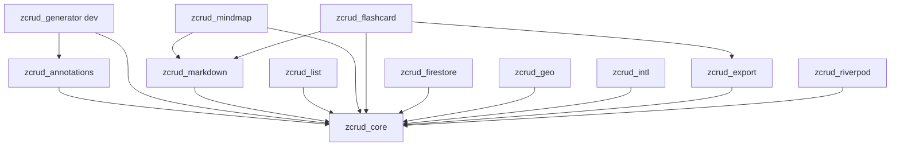
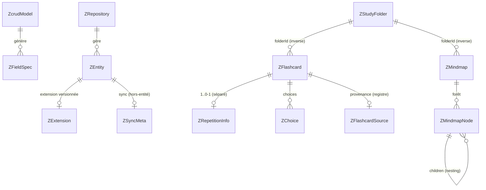
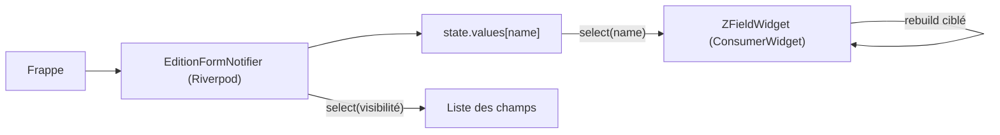

# Architecture Spine — zcrud

## Design Paradigm

**Monorepo melos** de packages **hexagonaux** (ports & adapters), chacun structuré en couches **domain / data / presentation**.

- Le **cœur** (`zcrud_core`) est le **domaine pur + moteur UI + ports** : il ne connaît aucun backend, aucun conteneur d'injection, aucune dépendance lourde. Il expose des **contrats abstraits** (ports) et un **moteur** (édition/liste).
- Les **satellites** sont des **adapters** qui implémentent les ports du cœur (`zcrud_firestore`, `zcrud_list`, `zcrud_geo`, `zcrud_export`) ou ajoutent des **features** portant leurs propres modèles canoniques (`zcrud_markdown`, `zcrud_mindmap`, `zcrud_flashcard`).
- La **réactivité** est fournie par **Riverpod** (substrat d'état), mais branchée via des **seams** : le cœur n'en dépend pas directement, `zcrud_riverpod` (optionnel) relie les seams à Riverpod.

Mapping paradigme → répertoires : `packages/<pkg>/lib/src/{domain,data,presentation}/` ; l'API publique est `packages/<pkg>/lib/<pkg>.dart` (barrel), l'implémentation reste sous `src/`.

## Invariants & Rules

Direction de dépendance (règle, pas illustration) — **le cœur ne dépend de rien ; tout pointe vers le cœur ; graphe acyclique** :



### AD-1 — Monorepo melos à direction de dépendance acyclique
- **Binds:** all, FR-24
- **Prevents:** cycles de dépendances ; contamination du cœur par des dépendances lourdes ; import forcé de features non désirées.
- **Rule:** `zcrud_core` ne déclare **aucune** dépendance vers un autre package zcrud ni vers Firebase/Syncfusion/Quill/Maps. Tout package satellite dépend de `zcrud_core` (et éventuellement d'un autre satellite déjà en amont) ; jamais l'inverse. Toute nouvelle arête doit préserver l'acyclicité.

### AD-2 — Rebuilds réactifs granulaires (objectif produit n°1) [ADOPTED]
- **Binds:** FR-1, FR-3, SM-1
- **Prevents:** le bug historique de reconstruction globale du formulaire à chaque frappe (jank, perte de focus, saut de curseur).
- **Rule:** un champ = un `ConsumerWidget` top-level qui n'observe que sa tranche d'état (`ref.watch(editionForm(formId).select(...))`). Interdits : `setState` à l'échelle du formulaire ; construction des champs dans une closure locale de `build()` ; recréation de `TextEditingController` au rebuild ; ré-injection de la valeur dans le controller. Obligatoires : controller stable (cycle initState/dispose), `ValueKey(field.name)`, validateurs mémoïsés, `AutovalidateMode.onUserInteraction` par champ, place stable pour les champs conditionnels.

### AD-3 — Modèle = source unique de vérité par codegen ; reflectable banni, freezed non imposé [ADOPTED]
- **Binds:** FR-9, FR-10, FR-11, SM-6
- **Prevents:** double maintenance modèle/schéma ; bugs de correspondance `name`↔propriété ; dépendance à la réflexion runtime ; imposition d'une techno de sérialisation aux consommateurs.
- **Rule:** `zcrud_generator` (build_runner) génère depuis `@ZcrudModel`/`@ZcrudField` : `toMap/fromMap/copyWith`, le `ZFieldSpec[]` et l'enregistrement au `ZcrudRegistry`. **Aucun** usage de `reflectable`. `freezed` n'est **pas** imposé : zcrud partage structure + invariants via contrats abstraits, pas la mécanique de (dé)sérialisation. Un type non enregistré échoue explicitement (throw), jamais par cast null silencieux.

### AD-4 — Mécanisme d'extension : composition + ZExtension + registre + enums ouverts [ADOPTED]
- **Binds:** FR-10, FR-16, FR-19
- **Prevents:** le fork du package pour ajouter un type/variant ; les échecs de parsing sur champ inconnu ; le couplage du cœur au domaine douane.
- **Rule:** chaque entité canonique expose (1) un slot `ZExtension?` typé additif **versionné** (`formatVersion`, `fromJsonSafe → null`, `@JsonKey(defaultValue)`) ; (2) un `Map<String,dynamic> extra` (défaut `{}`) ; (3) l'extension de provenance/type ouvert via `ZTypeRegistry`/`ZSourceRegistry.register(kind, fromJson, toJson)`. **Rejetés** : héritage de classes sérialisées, `sealed` pour l'extension inter-package, generics comme mécanisme de sérialisation. Tout enum public porte `@JsonKey(unknownEnumValue:)` (+ valeur `custom`/`customLabel` si pertinent).

### AD-5 — Domaine backend-agnostique (ports & adapters)
- **Binds:** FR-12, FR-13
- **Prevents:** la fuite de `cloud_firestore`/Hive (`Timestamp`, `Filter`, `FirebaseException`) dans le domaine ; l'enfermement Firestore-first.
- **Rule:** les ports `ZRepository<T>`, `ZLocalStore`, `ZRemoteStore`, `ZQuery`/`DataRequest`, `ZDataState` vivent dans `zcrud_core` sans type backend. Les adapters concrets (Firestore, Hive) vivent dans `zcrud_firestore`. Le contrat reste exprimable hors Firestore (Supabase déféré, cf. Deferred).

### AD-6 — Injection framework-neutre par seams [ADOPTED]
- **Binds:** FR-22, FR-23
- **Prevents:** l'imposition de Riverpod à DODLP ; le couplage du package à un conteneur ; les accès d'état non réactifs.
- **Rule:** les dépendances (resolver, permissions, toast, config, l10n, codecs) sont des **seams** qui `throw` par défaut, surchargés soit dans `ProviderScope` (Riverpod), soit via `ZcrudScope` (InheritedWidget, mode locator pour DODLP). `zcrud_core` ne dépend d'aucun conteneur ; `zcrud_riverpod` est optionnel. Interdit : `ProviderScope.containerOf(context).read(...)` dans le code du package (toujours `WidgetRef`).

### AD-7 — Rich-text : codec pluggable ZCodec [ADOPTED]
- **Binds:** FR-14, FR-15
- **Prevents:** le verrouillage d'un format unique ; la perte sur les embeds ; l'incohérence actuelle (champ `markdown` persistant du Delta JSON).
- **Rule:** l'éditeur travaille en **Delta** en interne (Quill) ; la (dé)sérialisation du format persisté passe par un `ZCodec` pluggable (Delta / Markdown / HTML), choisi par l'app. Le round-trip est testé (listes imbriquées, formules, tables, entités HTML). Le champ rich-text a son propre controller isolé (conforme AD-2).

### AD-8 — Liste : Syncfusion par défaut, isolé derrière ZListRenderer [ADOPTED]
- **Binds:** FR-6, FR-24
- **Prevents:** la contamination du cœur par Syncfusion (licence commerciale + poids) tout en offrant le DataGrid riche par défaut.
- **Rule:** `zcrud_core` n'expose que l'**abstraction** `ZListRenderer` + les modèles de liste (Material-free). Le rendu **Syncfusion `SfDataGrid` par défaut** vit dans `zcrud_list`. Un consommateur qui n'importe pas `zcrud_list` (ex. `zcrud_markdown` seul) ne tire pas Syncfusion. Un backend Material `DataTable` reste implémentable sur le même port.

### AD-9 — Offline-first standardisé ; état SRS séparé, voie d'écriture unique
- **Binds:** FR-13, FR-16, FR-17, FR-18
- **Prevents:** la perte d'historique SRS au partage/duplication ; les avancements SRS incohérents ; la confusion données-utilisateur / contenu-publié.
- **Rule:** patron offline-first = store local source de vérité + distant fire-and-forget, merge **Last-Write-Wins sur `updatedAt`**, soft-delete `is_deleted` (hors-entité standardisé `ZSyncMeta`), cascade bornée. `ZSyncOrchestrator` sépare le *quand* du *comment*. L'état SRS (`ZRepetitionInfo`) est **séparé** de `ZFlashcard` ; seule voie d'écriture = `reviewCard() → ZSrsScheduler.apply` (aucun setter brut). Le modèle « contenu publié » (cache-first + checksum) reste **distinct** du modèle données-utilisateur.

### AD-10 — Évolution de schéma additive & désérialisation défensive
- **Binds:** FR-10, FR-11, tous les modèles
- **Prevents:** les migrations cassantes ; l'échec de parsing d'un document historique.
- **Rule:** entre versions mineures, **ajout seulement** (champs nullable ou `@JsonKey(defaultValue)`), jamais renommage/suppression sans montée majeure. Désérialisation défensive systématique (`unknownEnumValue`, `defaultValue`, `fromJsonSafe → null`) : un champ absent/corrompu ne fait jamais échouer le parent. Chaque `ZExtension` porte son `formatVersion` indépendant.

### AD-11 — Erreurs : Either sur les contrats, Stream nu, hiérarchie ZFailure
- **Binds:** FR-12, FR-13
- **Prevents:** la propagation d'exceptions non typées ; l'enveloppement d'un flux dans un résultat.
- **Rule:** tout contrat repository retourne `Either<ZFailure,T>` (`dartz`), `Unit` pour void ; les flux sont des `Stream<List<T>>` **nus**. Hiérarchie `ZFailure` maison (`DomainFailure`, `CacheFailure`, `NotFoundFailure`, `ServerFailure`, …) avec `==`/`hashCode`. Les providers déplient l'Either et re-throw une exception typée pour alimenter `AsyncValue.error`.

### AD-12 — Zéro secret dans les packages
- **Binds:** FR-20, sécurité
- **Prevents:** la fuite de clés (la clé Google Maps est aujourd'hui commitée en clair dans DODLP/DLCFTI) ; les contournements TLS dangereux.
- **Rule:** aucune clé API ni secret n'entre dans un package zcrud ; les clés (Maps, endpoints) sont fournies par la config plateforme de l'app. Interdits : `badCertificateCallback => true`, endpoints en dur non surchargeables.

### AD-13 — RTL, a11y et l10n injectable sur toute surface UI
- **Binds:** FR-23
- **Prevents:** la casse RTL, l'inaccessibilité, le couplage à la l10n/routing de l'app.
- **Rule:** widgets `EdgeInsetsDirectional`/`AlignmentDirectional`/`TextAlign.start`/`PositionedDirectional` ; `Semantics` explicites, cibles ≥ 48 dp ; la vue liste sémantique est la surface a11y de référence. l10n via delegate générique + registre de libellés (pas de singleton statique mutable) ; **zéro dépendance** de zcrud à `lex_localizations`/`go_router`.

### AD-14 — Pureté des couches ; invariants métier au repository
- **Binds:** all
- **Prevents:** l'infiltration de Flutter/Firebase/Hive dans le domaine ; la logique métier dispersée dans les entités.
- **Rule:** le `domain/` de `zcrud_core` est du **Dart pur** (aucune dépendance Flutter/Firebase/Hive). Les invariants métier (matérialisation de l'éphémère, hiérarchie 2 niveaux, avancement SRS) sont portés par le **repository**, jamais par l'entité (entités = données + copyWith).

## Consistency Conventions

| Concern | Convention |
| --- | --- |
| Nommage | Types publics préfixés `Z` (`ZFieldSpec`, `ZFlashcard`, `ZRepository`) ; packages `zcrud_<domaine>` ; fichiers snake_case ; barrel `lib/<pkg>.dart`, impl sous `lib/src/` ; enum canonique des champs = `EditionFieldType`. Corriger les typos d'API héritées (`searchInpuCtrl`, `childreen`, `crudActionsButtionsBuilder`) — rupture assumée, pas d'alias legacy. |
| Données & formats | `id` = `String` opaque (nullable pour l'éphémère, non-null pour le persisté) ; dates ISO-8601 ; **persistance snake_case** (`fieldRename: snake`), **valeurs d'enum camelCase** (`jsonValue = name`) ; erreurs = `ZFailure` ; métadonnées de sync hors-entité `ZSyncMeta` (`updated_at`/`is_deleted`) ; double-wire via `ZCodec` nommés (persistance vs chat). |
| État & transverse | Riverpod codegen (`@riverpod` / `@Riverpod(keepAlive:true)` pour repos & controllers-dispatchers) ; mutation via méthodes de Notifier, jamais `setState` de formulaire ; `WidgetRef` uniquement (jamais `containerOf`) ; config/permissions/toast/l10n via `ZcrudScope`/seams ; logging via port `ZLogger` (pas de `print`). |

## Stack

*SEED — versions alignées sur le workspace lex_douane (le plus récent), reality-check contre les projets réels au 2026-07-09.*

| Name | Version |
| --- | --- |
| Dart SDK | ^3.12.2 |
| melos | ^7.0.0 |
| flutter_riverpod / riverpod_annotation | ^3.1.0 / ^4.0.0 |
| riverpod_generator | ^4.0.0 |
| json_serializable / json_annotation | ^6.11.2 / ^4.9.0 |
| build_runner / source_gen | ^2.4.x / (via build) |
| dartz | ^0.10.1 |
| flutter_quill | ^11.5.x |
| flutter_math_fork (LaTeX) | (rendu formules) |
| markdown / markdown_quill | ^7.x / ^4.3.0 |
| graphite (mindmap) | ^1.2.1 |
| syncfusion_flutter_datagrid / _pdf / _xlsio (zcrud_list, zcrud_export) | ^32.1.x |
| cloud_firestore / firebase_core (zcrud_firestore) | firestore ^6 / core ^4 |
| hive (ZLocalStore par défaut) | ^2.x |
| flutter_form_builder / form_builder_validators | (moteur édition) |

> Note : `flutter_tex`, `html_editor_enhanced`, `google_maps_flutter`, `flutter_osm_plugin` sont des dépendances **optionnelles** confinées à leurs packages (`zcrud_markdown` optionnel, `zcrud_geo`).

## Structural Seed

Arborescence du workspace melos :

```text
zcrud/
  melos.yaml
  pubspec.yaml                # workspace (resolution: workspace)
  packages/
    zcrud_core/               # domaine pur + moteur édition + ports + ZFieldSpec + l10n + ZcrudScope/seams
    zcrud_annotations/        # @ZcrudModel / @ZcrudField / @ZcrudId
    zcrud_generator/          # builder build_runner (dev_dependency)
    zcrud_markdown/           # Quill + ZCodec + embeds LaTeX/tables (deps lourdes optionnelles)
    zcrud_list/               # DynamicList Syncfusion (ZListRenderer par défaut)
    zcrud_mindmap/            # ZMindmap + ZMindmapTreeOps + ZMindmapView
    zcrud_flashcard/          # ZFlashcard + ZRepetitionInfo + ZSrsScheduler + sessions
    zcrud_firestore/          # adapters Firestore + Hive (offline-first)
    zcrud_geo/                # champs géo (adapters Google/OSM optionnels)
    zcrud_intl/               # téléphone/pays/devise (constantes en assets)
    zcrud_export/             # PDF/Excel (Syncfusion)
    zcrud_riverpod/           # liaison seams <-> Riverpod (optionnel)
  example/                    # app de démonstration + banc d'intégration
```

Entités canoniques (noms + relations ; les attributs-invariants sont des AD, pas ce diagramme) :



Cycle réactif du formulaire (AD-2) :



## Capability → Architecture Map

| Capability / FR | Lives in | Governed by |
| --- | --- | --- |
| Édition granulaire (FR-1..FR-5) | `zcrud_core/presentation` | AD-2, AD-6, AD-13 |
| Catalogue de champs (FR-2) | `zcrud_core` (+ registre) | AD-3, AD-4 |
| Liste/tableau (FR-6..FR-8) | `zcrud_list` (port dans core) | AD-8, AD-11 |
| Modèle + codegen + extension (FR-9..FR-11) | `zcrud_annotations`, `zcrud_generator` | AD-3, AD-4, AD-10 |
| Data layer & offline-first (FR-12, FR-13) | `zcrud_core` (ports) / `zcrud_firestore` | AD-5, AD-9, AD-11 |
| Markdown + embeds (FR-14, FR-15) | `zcrud_markdown` | AD-7, AD-2 |
| Flashcards + SRS (FR-16..FR-18) | `zcrud_flashcard` | AD-4, AD-9, AD-10 |
| Mindmaps (FR-19) | `zcrud_mindmap` | AD-4, AD-13 |
| Champs géo/intl (FR-20, FR-21) | `zcrud_geo`, `zcrud_intl` | AD-1, AD-12 |
| Injection & l10n (FR-22, FR-23) | `zcrud_core` (seams) / `zcrud_riverpod` | AD-6, AD-13 |
| Packaging & compat (FR-24, FR-25) | workspace melos | AD-1 |

## Deferred

- **Backend Supabase réel** — v2+ ; seul le contrat `ZRepository` reste exprimable (AD-5). Raison : Firestore-first suffit aux consommateurs actuels.
- **Génération LLM de flashcards** (`ZFlashcardGeneration` + adapters wire/quota) — v2 ou laissé à l'app ; wire/quota sont douane-spécifiques.
- **Mode flowchart des mindmaps** (`flutter_flow_chart`) — décision `zcrud_flowchart` séparé vs abandon ; désérialisation fragile.
- **Migration IFFD & DLCFTI** — après stabilisation DODLP + lex_douane.
- **`ZLocalStore` alternatifs** (Isar/Drift/SQLite) — port prévu (AD-5), impl différée ; Hive-JSON par défaut.
- **copyWith avec sentinelle reset-null** & **uniformisation de casse** (OQ-12, mindmap camelCase vs education snake) — détail de génération, tranché à l'implémentation du generator.
- **Pagination par curseur** — port dans `DataRequest` (AD-5) ; impl d'abord dans `zcrud_firestore`.
- **Interface SRS FSRS/Leitner** — `ZSrsScheduler` déjà prévu (AD-9) ; seul SM-2 porté en MVP.
