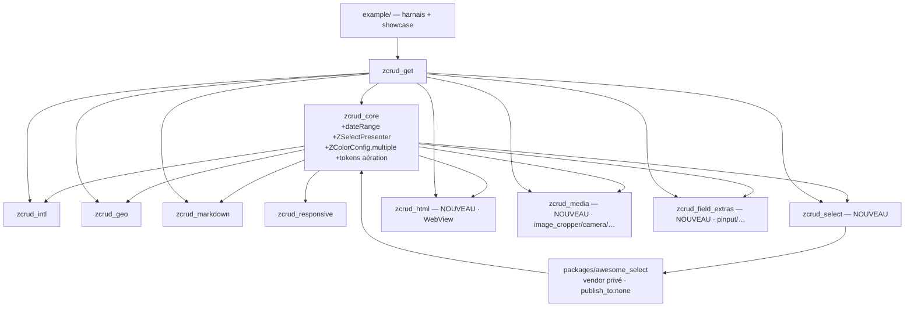

# Architecture Spine — E-FORM-PARITY

## Design Paradigm

Hexagonal inchangé : domaine pur → ports → adaptateurs. La nature de cette itération est
**présentationnelle et d'assemblage**, pas une réécriture : l'étude a prouvé sur disque que le gros
des familles de champ est **déjà réimplémenté nativement** dans `zcrud_core`, en meilleure
conformité a11y/RTL/thème que DODLP, et que le bug historique du `setState()` d'écran est corrigé par
conception (`ZFormController` + rebuild granulaire par tranche).

Le contrat d'intégration est **acquis et prouvé en production** (recon §2-§6) : un champ de parité qui
n'a pas de widget natif se branche par un **seam injecté**, jamais par une modification du cœur — soit
`ZWidgetRegistry.register(kind, builder)` (le builder ne reçoit que `ctx.value`/`ctx.onChanged`,
**jamais** le `ZFormController`), soit un **seam présentateur** de `ZcrudScope` pour enrichir un widget
de famille de base. Tout adaptateur de package tiers vit dans un **satellite** (ou un vendor privé de
satellite) ; le **binding** (`zcrud_get`) est le point de **composition** qui câble le tout. Le cœur
n'accueille que ce qui n'a **aucune** dépendance lourde : un type de valeur, une variante d'enum, un
widget natif adossé à une primitive Material, un token de thème, ou l'**abstraction** d'un seam.

Correspondance couches → répertoires (inchangée) : `lib/src/domain` (pur-Dart), `lib/src/data`
(codecs/adaptateurs de sérialisation), `lib/src/presentation` (widgets, registres, seams) ; API
publique par barrel `lib/<pkg>.dart`.

## Inherited Invariants

Liants, par leurs identifiants d'origine — jamais renumérotés, jamais re-dérivés. Une décision locale
qui en contredirait un est un **conflit à remonter**, pas un override.

| Hérité | Parent | Ce qu'il contraint ici |
|---|---|---|
| AD-1 | fondateur | Graphe acyclique, **CORE OUT=0** ; tout adaptateur de package tiers confiné à son satellite |
| AD-2 / AD-15 | fondateur | Réactivité Flutter-native ; aucun état de formulaire global ; le seam ne livre que la tranche |
| AD-3 / AD-10 | fondateur | Codegen source-unique ; désérialisation défensive ; évolution **additive** seulement |
| AD-4 | fondateur | Registres **instanciables et injectés** (jamais un singleton statique) ; enrôlement explicite |
| AD-6 | fondateur | Injection & cycle de vie par **bindings** ; seams résolus via `ZcrudScope` |
| AD-7 | fondateur | Rich-text à **controller isolé**, codec `ZCodec` pluggable |
| AD-8 | fondateur | Dépendance lourde isolée derrière une **abstraction cœur** (patron `ZListRenderer`) |
| AD-12 | fondateur | Zéro secret dans un package (clé Maps, endpoints) |
| AD-13 | fondateur | RTL (variantes directionnelles), a11y (`Semantics`, ≥ 48 dp, `ListView.builder`), thème/l10n injectés |
| AD-14 | fondateur | Pureté du `domain/` (pur-Dart) ; invariants métier hors entité |
| AD-40 | study-ui | Adaptateur riche **chez le consommateur**, jamais un cycle ; pas de type Quill/math en signature publique |
| AD-42 | study-ui | Patron du **satellite optionnel dédié** à une dépendance lourde (`zcrud_export_ui`/`printing`) |
| enums > booléens | study-ui | Toute variante multi-app est portée par un enum, jamais un booléen ni un style codé en dur |

## Invariants & Rules

### AD-47 — `dateRange` natif au cœur

- **Binds:** FR-5.
- **Prevents:** un satellite superflu pour une capacité **sans dépendance lourde** ; deux
  emplacements pour le type ; une plage `start > end` persistée.
- **Rule:** `EditionFieldType.dateRange` (camelCase, près de `dateTime`/`time`) et sa valeur
  `ZDateRange{start, end}` (domaine pur, ISO-8601) vivent dans **`zcrud_core`**. Invariant
  `end >= start` validé ; `fromJsonSafe → null`, `null` toléré si le champ est optionnel (AD-10).
  Widget natif `ZDateRangeFieldWidget` monté sous `ZFieldListenableBuilder`, adossé à la primitive
  Material **`showDateRangePicker`** — **aucune** dépendance `table_calendar`/`date_time_picker`, donc
  **CORE OUT=0 préservé** (précédent `dateTime`, natif). `zcrud_generator` émet le `ZFieldSpec` ;
  `*.g.dart` régénérés/commités ; test de rétro-compat de sérialisation vert. Story cœur **sérialisée**.

### AD-48 — Parité de sélection riche par seam présentateur injecté, jamais le widget registry

- **Binds:** FR-6, FR-7, FR-8, FR-9.
- **Prevents:** un adaptateur qui tenterait de servir `select`/`radio`/`checkbox`/`relation` par
  `ZWidgetRegistry` alors que `familyOf` **pré-route** ces familles de base vers leur widget natif
  **avant** d'atteindre `registryOrFallback` (recon §6) — le builder ne serait jamais appelé ; deux
  propriétaires du rendu modal.
- **Rule:** `zcrud_core` déclare une **abstraction Material-free `ZSelectPresenter`** (patron AD-8 /
  `ZListRenderer` / `ZcrudScope.colorPicker`), résolue via `ZcrudScope` ; **défaut = le modal natif
  zcrud actuel**. Les familles natives (`ZSelectFieldWidget`, `ZRelationFieldWidget`) **délèguent** au
  présentateur injecté quand il est présent. Le satellite **`zcrud_select`** fournit le présentateur
  adossé au fork `awesome_select` (`SmartSelect` : modal S2 responsive + recherche + CRUD inline),
  la source et le CRUD inline câblés au runtime via `ZRelationSourceRegistry`/`ZRelationCrudRegistry`
  (jamais dans l'annotation `const`). Le cœur ne porte que l'**abstraction** : **CORE OUT=0**.

### AD-49 — `awesome_select` vendorisé en membre de workspace privé (pas fork git épinglé)

- **Binds:** FR-6, FR-7, FR-8, FR-9 ; NFR-2, NFR-9. **[ADOPTED]** (owner : « fork maintenu par nous »).
- **Prevents:** une **dépendance-de-dépendance git** vers un hôte tiers à un `ref` étranger/flottant
  chez un consommateur en dépendance git (exactement la fragilité `ref: master` que le owner supprime) ;
  du code échappant aux gates du monorepo.
- **Rule:** le source du fork entre comme **membre de workspace melos privé** (`publish_to: none`) sous
  `packages/awesome_select/`, résolu **offline** sous notre tag, versionné avec nos releases, soumis
  aux **mêmes gates repo** (analyze, CORE OUT=0, secrets, `codegen-distribution`). Dépendu **uniquement**
  par `zcrud_select` ; les types `awesome_select` ne fuient **jamais** dans une signature publique
  (AD-40). Licence **MIT** conservée (fichier `LICENSE` + attribution). *Rejeté :* `git:` à commit
  figé — reste partiellement hors gates et fait dépendre le build d'un consommateur d'un hôte tiers.
  Motif retenu = **conservateur** (contrôle, résolution offline, gates uniformes).

### AD-50 — WYSIWYG HTML isolé dans `zcrud_html` ; la WebView est un controller isolé

- **Binds:** FR-22, FR-23 ; NFR-1, NFR-2. **[ADOPTED]** (owner : parité totale, WYSIWYG inclus).
- **Prevents:** la **2ᵉ voie d'état** (WebView) cassant SM-1/AD-2 ; une collision de registration avec
  la voie Delta déjà livrée par `zcrud_markdown` (`registerZHtmlFields`, HTML↔Delta via `ZHtmlCodec`).
- **Rule:** un **nouveau satellite `zcrud_html`** enregistre `html`/`inlineHtml` sur `ZWidgetRegistry`.
  L'adaptateur est un `State` possédant le `HtmlEditorController`/WebView **créé une seule fois** en
  `initState` (jamais recréé au rebuild de tranche), `key: ValueKey('z-html-<field.name>')` — patron
  du controller isolé AD-7 (la WebView est à HTML ce que Quill est au Delta). Il lit `ctx.value` (HTML
  `String`) comme **contenu initial**, pousse `ctx.onChanged` **uniquement** sur `onChange`/blur
  **débouncé** (jamais synchrone à chaque frappe), et ne **re-synchronise depuis `ctx.value` que hors
  focus** (garde recon §5) — SM-1 tenu : le champ n'écoute que sa tranche, son `State` survit aux
  rebuilds voisins, aucun rebuild global. **Format persisté = HTML `String`** (la raison d'être vs la
  voie markdown : le WYSIWYG **ne force pas** de Delta) ; `flutter_html` rend en **lecture** ; pertes
  de round-trip **bornées et documentées** (code inline, CSS exotiques) ; AD-10 défensif (HTML
  corrompu → éditeur vide, jamais un throw). **`zcrud_html` et `zcrud_markdown` enregistrent
  `html`/`inlineHtml` de façon mutuellement exclusive** (collision `register` = `throw`) : l'app
  choisit **une seule** voie au bootstrap. Le paquet concret (`html_editor_enhanced` `^2.7.1`, ou le
  fork maintenu `html_editor_plus`) est **abstrait par le satellite** pour rester substituable.

### AD-51 — Adaptateurs média dans un satellite dédié `zcrud_media`

- **Binds:** FR-15, FR-16, FR-17, FR-18 ; NFR-2, NFR-9.
- **Prevents:** des pickers média couplés à GetX (non réutilisables pour Riverpod/lex_douane) ; une
  dépendance de plateforme fuyant dans `zcrud_core`.
- **Rule:** un **nouveau satellite `zcrud_media`** (patron AD-8/`zcrud_export_ui`) câble le **contrat
  cœur existant** `ZFilePicker`/`ZFileSource`/`ZAppFileField` : bottom-sheet multi-sources, caméra,
  recadrage (`image_cropper` `12.2.1`), scan → PDF, vignette vidéo (`video_thumbnail`), zone de dépôt
  (`dotted_border`), ouverture (`open_file`). Son API publique reste en types neutres (`Uint8List`,
  chemins) — **aucun type de plateforme public**. Il dépend **seulement** de `zcrud_core` ; le binding
  `zcrud_get` le **compose** (injecte l'implémentation dans le seam). Réutilisable par tout binding.

### AD-52 — Nouvelles formes de valeur cœur : additives, sérialisées, défensives

- **Binds:** FR-13, FR-20 ; NFR-5, NFR-6.
- **Prevents:** la divergence de (dé)sérialisation ; deux écritures cœur concurrentes ; un parent qui
  échoue sur une valeur corrompue.
- **Rule:** `color` multiple = **variante native `ZColorConfig.multiple`** (OQ-2 défaut ; **pas** de
  fork `color_picker_field` peu maintenu), valeur `List<int>` ARGB à **parse défensif** (entrée
  corrompue ignorée, jamais un throw) ; `subItems.itemsAreTags` = `ZSubListDisplayMode.tags` natif,
  **zéro dépendance**. Toute nouvelle valeur d'`EditionFieldType` est **additive** (camelCase,
  `@JsonKey(unknownEnumValue:)`) ; le générateur émet le `ZFieldSpec` ; `*.g.dart` régénérés/commités ;
  test rétro-compat vert ; **une story cœur à la fois** (séquencement verrouillé). La **roue HSV**
  (`flex_color_picker` `^3.7.1`) reste **côté binding** via le seam `ZcrudScope.colorPicker`, jamais
  dans le cœur.

### AD-53 — Champs de Finitions net-new regroupés dans `zcrud_field_extras`, servis par le registry

- **Binds:** FR-34, FR-35, FR-36, FR-37.
- **Prevents:** quatre satellites d'un champ chacun (surface de maintenance NFR-9) ; des kinds de
  Finitions bricolés en `custom`.
- **Rule:** PIN (`pinput` `6.0.2`), autocomplétion, table éditable (pure-Flutter **virtualisée**,
  `ListView.builder`), et `icon` picker (registre d'icônes) vivent dans **un** satellite
  **`zcrud_field_extras`**, servis par `ZWidgetRegistry` sous leur `kind`. `icon` est déjà un
  `EditionFieldType` ; `pin`/`autocomplete`/`editableTable` ajoutent leur valeur d'enum au cœur de
  façon **additive et sérialisée** (AD-52) au moment où ils sont planifiés. Valeurs neutres
  (PIN/autocomplete = `String`, table = `List<Map>` défensif). Deps légères confinées au satellite
  (CORE OUT=0). Phase **Finitions** ; FR-13/FR-37 sans call-site actif prouvé restent en repli
  `ZUnsupportedFieldWidget` **étiqueté ABSENT** tant que non planifiés (OQ-6).

### AD-54 — Tokens d'aération au cœur + les 3 écarts d'aération tranchés

- **Binds:** FR-38 ; NFR-3, NFR-4.
- **Prevents:** des constantes d'aération éparpillées recopiées par chaque binding (le pattern même
  que zcrud élimine) ; une couleur codée en dur.
- **Rule:** les **mesures** d'aération DODLP sont des **tokens dp directionnels** de `zcrud_core`
  (`ZcrudTheme` `ThemeExtension`), les **couleurs toujours dérivées du `ColorScheme`** (FR-26). Les
  **3 écarts** sont tranchés **explicitement** : (1) *gouttière asymétrique 16H/8V* → ajout additif
  `ZResponsiveGrid.runGutter` distinct de `gutter` (replié sur `gutter` si `null`) ; (2) *spacer
  inter-champ* → conserver la projection zcrud (`zFieldGapAfter` espace les **blocs**), le binding pose
  `interFieldGap: 12` ; la divergence d'ordre en séquence mixte compact↔bloc est **assumée** (parité
  **fonctionnelle**, pas pixel) ; (3) *padding d'écran* → token `ZcrudTheme.formPadding` (défaut
  `EdgeInsetsDirectional.all(12)`) consommé par `DynamicEdition` quand `padding == null`. L'en-tête
  « boîte grise » `MyStickyHeader` de DODLP **n'est pas reproduit** (header sobre thémé, FR-26) —
  parité fonctionnelle ; la parité visuelle stricte des sections est **OQ-1 (owner)**. Le binding pose
  les valeurs DODLP ; le cœur ne fournit que les tokens.

### AD-55 — Le binding est le point de composition unique de l'enregistrement

- **Binds:** FR-24, FR-25, FR-26, FR-27 (câblage intl/geo) ; FR-6..FR-23 (composition).
- **Prevents:** deux registrations du même `kind` (`ZWidgetRegistry.register` **throw**) ; deux
  propriétaires de la composition ; un auto-enregistrement par side-effect d'import.
- **Rule:** l'app hôte, via le binding `zcrud_get`, **construit et détient LE** `ZWidgetRegistry` et
  appelle **une seule fois** chaque `registerZ<Pkg>Fields` (intl `phoneNumber`/`country`/`address`,
  geo `location`/`geoArea`, markdown, **html OU markdown-html — exclusifs**, présentateur `select`,
  `field_extras`), injecte le `ZFilePicker` (média), le seam `colorPicker` (`flex_color_picker`), le
  `ZSelectPresenter`, et les **valeurs** de tokens d'aération. Registre **injecté** via `ZcrudScope`,
  jamais un singleton statique (AD-4). Le câblage intl/geo est une composition de **valeurs**, sans
  dépendance lourde nouvelle dans le binding au-delà de celles des satellites qu'il compose.

### AD-56 — Harnais de parité & showcase dans `example/`, jamais un package

- **Binds:** FR-39, FR-40 ; NFR-7 ; SM-1, SM-2, SM-3, SM-4.
- **Prevents:** du code de démonstration/fixtures polluant un package distribué ; un secret DODLP
  embarqué ; un gap masqué.
- **Rule:** les **≥ 6 formulaires DODLP répliqués** (6 axes de risque : dense+SM-1 ; sélections ;
  média ; rich-text md/LaTeX/html ; intl/géo ; spécialisés/imbriqués) et la **page showcase
  exhaustive** (40 types × variantes × états read-only/désactivé/erreur/RTL/thème) vivent dans l'app
  **`example/`** — **données fictives, zéro secret, aucune dépendance backend DODLP**. Un formulaire de
  frappe intensive est le **banc SM-1** (100 caractères → seul le champ courant se reconstruit, zéro
  perte de focus, **y compris** le champ WYSIWYG isolé d'AD-50). Les gaps résiduels sont **étiquetés
  ABSENT / à combler**, jamais masqués. `example/` n'est pas un membre distribué : ses dépendances
  lourdes (satellites média/html/select) n'alourdissent aucun consommateur.

### Direction de dépendance (règle, pas illustration)

Toute arête va **vers `zcrud_core`** (ou vers un satellite déjà en amont) ; jamais l'inverse. Le
binding `zcrud_get` et l'app `example/` sont des **puits** (rien ne dépend d'eux). Le vendor
`awesome_select` est une **feuille** privée, dépendue du seul `zcrud_select`. Graphe **acyclique**,
**CORE OUT=0** (le cœur n'ajoute qu'enum + valeur + widgets Material + tokens + abstractions de seam).

## Consistency Conventions

| Concern | Convention |
|---|---|
| Nommage types | Préfixe `Z` ; satellites `zcrud_<domaine>` ; fonction d'enrôlement `registerZ<Pkg>Fields(ZWidgetRegistry, options)` |
| `kind` de registre | Le **nom de l'`EditionFieldType`** (`field.type.name`), jamais un identifiant libre ; une registration par `kind` (collision = `throw`) |
| Valeurs nouvelles | `ZDateRange{start,end}` ISO-8601 ; `color` multiple `List<int>` ARGB ; PIN/autocomplete `String` ; table `List<Map>` — persistance snake_case, enums **camelCase**, `@JsonKey(unknownEnumValue:)`, désérialisation défensive (`fromJsonSafe → null`) |
| Place stable d'adaptateur | `key: ValueKey('z-<pkg>-<field.name>')` **posée par l'adaptateur** (interpolant `ctx.field.name`) ; controller lourd créé 1× dans un `State`, jamais recréé ; sync externe **hors focus** uniquement |
| Seam vs registry | Famille de base à enrichir (`select`/`radio`/`relation`) → **présentateur injecté** (`ZcrudScope`) ; type sans widget natif → **`ZWidgetRegistry`** ; jamais `fieldBuilder` de `DynamicEdition` (portée formulaire, viole AD-2 si mal utilisé) |
| Thème & aération | Mesures = tokens dp **directionnels** (`EdgeInsetsDirectional`, `AlignmentDirectional`, `TextAlign.start/end`) ; couleurs **dérivées du `ColorScheme`** ; jamais une `Color(0xFF…)` littérale portée de DODLP |
| Composition | Enrôlement **explicite** au bootstrap par le binding, jamais un side-effect d'import ; registre **instanciable et injecté**, jamais un singleton statique |
| Distribution | Tout nouveau package (satellites + vendor) est membre du workspace melos, versionné/contraint comme ses pairs, soumis aux gates repo (analyze/verify **repo-wide**, CORE OUT=0, secrets, `codegen-distribution`, rétro-compat) |

## Stack

Seed — versions vérifiées sur pub.dev au 2026-07-18 ; le code du satellite en devient propriétaire.
Confinées **chacune à son satellite** (jamais `zcrud_core`).

| Nom | Version | Confiné dans |
|---|---|---|
| `awesome_select` (fork vendorisé, MIT) | 6.0.x (base ; suivi par nous) | `packages/awesome_select` → `zcrud_select` |
| `html_editor_enhanced` (ou `html_editor_plus`) | `^2.7.1` (0.0.7) | `zcrud_html` |
| `flutter_html` | `^3.0.0` | `zcrud_html` |
| `image_cropper` | `^12.2.1` | `zcrud_media` |
| `video_thumbnail` / `camera` / `image_picker` / `file_picker` / `open_file` / `dotted_border` | pins délégués à l'impl `zcrud_media` | `zcrud_media` |
| `pinput` | `^6.0.2` | `zcrud_field_extras` |
| `flex_color_picker` | `^3.7.1` | binding (`zcrud_get`), seam `colorPicker` |
| `showDateRangePicker` (Material) | Flutter SDK (aucune dep) | `zcrud_core` (natif) |

## Capability → Architecture Map

| FR | Capacité | Vit dans | Gouverné par |
|---|---|---|---|
| FR-1..4 | text/multiline/password, number/integer/float, boolean, dateTime/time | `zcrud_core` (natif) | AD-2, AD-13, NFR-4 |
| FR-5 | **dateRange** | `zcrud_core` (natif net-new) | **AD-47** |
| FR-6,7,8,9 | select / radio modal / checkbox-multiselect / relation+CRUD inline | `zcrud_select` + seam présentateur cœur + vendor | **AD-48, AD-49** |
| FR-10,11,12,14 | rowChips / tags / subItems+réordo / dynamicItem | `zcrud_core` (natif) | AD-2, AD-13 |
| FR-13 | subItems.itemsAreTags | `zcrud_core` (natif, additif) | **AD-52** |
| FR-15,16,17,18 | file / image+recadrage / document scan / vignette vidéo | `zcrud_media` (contrat cœur `ZFilePicker`) | **AD-51** |
| FR-19 | color simple (+ roue via seam) | `zcrud_core` natif + seam binding | AD-52, AD-8 |
| FR-20 | color multiple | `zcrud_core` (natif `ZColorConfig.multiple`) | **AD-52** |
| FR-21 | markdown/inlineMarkdown/richText | `zcrud_markdown` (câblage) | AD-7, AD-55 |
| FR-22,23 | html WYSIWYG + rendu HTML | `zcrud_html` (WebView isolée) | **AD-50** |
| FR-24,25,26,27 | phoneNumber / country / address / location | `zcrud_intl`, `zcrud_geo` (câblage) | AD-55, AD-13 |
| FR-28 | geoArea style-picker fill/stroke | `zcrud_geo` (réutilise seam `ZColorPicker`) | AD-8, AD-52 |
| FR-29,30,31,32,33 | rating / slider / signature / stepper / hidden-widget-custom | `zcrud_core` (natif + seams) | AD-2, AD-4, AD-13 |
| FR-34,35,36,37 | PIN / autocomplete / table éditable / icon | `zcrud_field_extras` | **AD-53** |
| FR-38 | tokens d'aération + 3 écarts | `zcrud_core` (`ZcrudTheme`) + valeurs binding | **AD-54** |
| FR-39,40 | harnais 6 formulaires + showcase | `example/` | **AD-56** |

## Écarts assumés vis-à-vis du PRD

Aucune décision de ce spine ne contredit un AD hérité. Trois choix **tranchent** une OQ du PRD dans le
sens conservateur (option native / isolation) ; le PRD les référence déjà comme défauts retenus :

| Point | PRD | Décision du spine | Motif |
|---|---|---|---|
| `color` multiple | OQ-2 (native vs satellite) | **Native `ZColorConfig.multiple`** (AD-52) | Aucune dep lourde ; ne pas forker `color_picker_field` ; précédent `color` natif |
| Voie HTML | Deux voies possibles (Delta vs WYSIWYG) | **Exclusivité** `zcrud_markdown` (Delta) **xor** `zcrud_html` (WYSIWYG) sur `html`/`inlineHtml` (AD-50) | La registration `throw` en collision ; l'app choisit une voie au bootstrap |
| Section « boîte grise » | Parité visuelle possible (OQ-1) | **Header sobre thémé** par défaut (AD-54) | FR-26 refuse le gris codé en dur ; parité fonctionnelle ; strict = OQ-1 owner |

### AD-57 — Paquets tiers ADMIS dans les satellites, derrière une abstraction et un défaut zéro-dépendance

- **Binds:** AD-1, AD-7, AD-8 ; FR-24.
- **Prevents:** la sur-lecture d'AD-1 comme un bannissement général des paquets tiers ; la
  réimplémentation maison de capacités déjà résolues par l'écosystème ; et, à l'inverse, l'imposition
  d'une dépendance lourde à tout consommateur d'un paquet léger.
- **Contexte (incident fondateur)** — AD-1 ne contraint que **`zcrud_core`**. Un commentaire de code a
  pourtant énoncé qu'un paquet tiers était « refusé par AD-1 », l'affirmation a été reprise dans deux
  handoffs, puis a servi à justifier un **drag-and-drop bidimensionnel écrit à la main** — alors que
  **15 satellites** dépendaient déjà de paquets pub.dev (`graphite`, `pinput`, `html_editor_enhanced`,
  `image_cropper`, `confetti`…). La règle est écrite ici pour que cette lecture ne se reforme pas.
- **Rule:** un paquet **satellite** PEUT dépendre d'un paquet tiers pub.dev, sous **trois** conditions
  cumulatives :
  1. **Jamais dans `zcrud_core`** — AD-1 reste intact et non négociable.
  2. **Derrière une abstraction** portée par le paquet léger (patron AD-7 `ZCodec` / AD-8
     `ZListRenderer`) : le tiers est une **implémentation** du port, jamais le type public que
     l'hôte manipule. Aucun type du paquet tiers ne fuit dans une signature publique du socle.
  3. **Défaut zéro-dépendance obligatoire** : le port a toujours une implémentation de repli
     n'exigeant que le SDK Flutter. Un consommateur qui ne prend pas le satellite garde une
     capacité fonctionnelle — dégradée, jamais absente.
- **Corollaire — quand créer un satellite « extras »** : lorsque la capacité est **déterminante**
  (elle change ce que l'application peut faire, pas seulement son apparence) ET que l'écosystème la
  résout mieux qu'une implémentation de passage. Le socle mutualise alors l'**intégration** une fois
  pour toutes, au lieu de la laisser à chaque hôte.
- **Contrainte de build à peser explicitement** : un tiers imposant une chaîne de compilation
  (code natif, Rust, binaires précompilés) s'impose au build de **toutes** les applications
  consommatrices — la distribution se fait en dépendance git, sans étape de publication qui
  l'absorberait. Ce coût doit être énoncé dans la décision, jamais découvert par l'hôte.
- **Ce qui reste interdit** : un paquet tiers en dépendance de `zcrud_core` ; un type tiers dans une
  API publique du socle ; un satellite sans repli qui rendrait une capacité indisponible.

## Deferred

- **OQ-1 (owner)** — parité visuelle **stricte** des sections (boîte grise) : déclencherait des tokens
  de section cœur additionnels. Défaut = header sobre (AD-54). *Revisiter si le owner exige le pixel.*
- **OQ-3 / OQ-4 (owner)** — sélecteur pays téléphone inline vs dialog ; validateur Togo `length:8` vs
  `length:11`. Arbitrages de **câblage `zcrud_intl`**, sans impact structurel sur le spine.
- **OQ-6 (owner)** — combler FR-13 (`subItems.itemsAreTags`) et FR-37 (`icon`) sans call-site actif, ou
  reporter jusqu'à motivation IFFD/DLCFTI. Le placement est déjà tranché (AD-52 / AD-53) ; seul le
  **déclenchement** est reporté.
- **OQ-7 (PM)** — figer la shortlist des 6 formulaires du harnais sur « couverture max types × axes »,
  à l'ouverture de l'epic harnais (AD-56).
- **Pins exacts des paquets média secondaires** (`camera`/`video_thumbnail`/`image_picker`/`file_picker`/
  `open_file`/`dotted_border`) — délégués à l'implémentation de `zcrud_media` ; le spine ne fixe que le
  confinement (AD-51).
- **NFR-8 — migrations ETL app-side** (`signature` PNG→strokes **non réversible** ; `phoneNumber`
  String→E.164) : **hors packages zcrud**, à planifier côté app DODLP. Bloquant pour la migration, mais
  ne relève d'aucun epic zcrud.
- **Non-goal assumé** — LaTeX fallback SVG `flutter_tex` (matrice #33) : banni par le test d'isolation
  → **placeholder thémé**, jamais un crash (cohérent AD-42).
