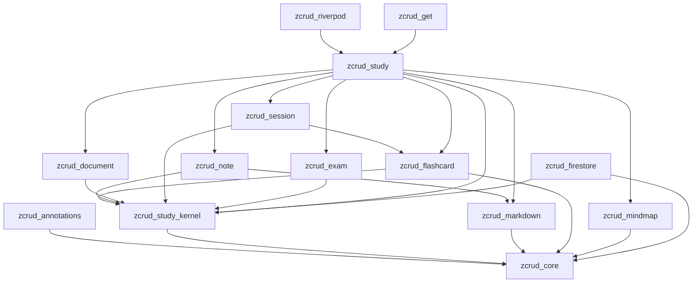
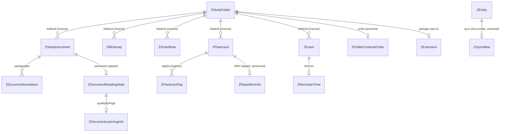
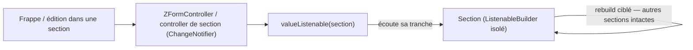

# Architecture Spine — zcrud_study (extension éducative)

Spine d'**extension** au niveau epic. Il **hérite** de l'architecture produit (16 décisions `AD-1..AD-16`, read-only, NON-NÉGOCIABLES) et n'ajoute que les invariants ouverts par cette phase — le squelette study étagé, la réconciliation des deux implémentations (IFFD / lex_douane), et les seams éducatifs. Une décision qui contredirait un `AD` hérité serait un **conflit à remonter**, pas un override local. Les `AD` hérités ne sont jamais renumérotés ; les nouveaux continuent la série à partir de `AD-17`.

## Design Paradigm

**Famille de packages étagée sur un kernel study, hexagonale (ports & adapters), couches `domain / data / presentation`** — extension directe du paradigme produit.

- **Nouveau socle bas `zcrud_study_kernel`** : squelette organisationnel pur-Dart (`ZStudyFolder` + hiérarchie, `ZFolderContentsOrder`, `ZStudySessionConfig`, `ZStudyRepository<T>`, registre de cascade). Ne dépend que de `zcrud_core`. C'est le seul point de convergence du domaine study — la contrainte AD-1 y est la plus tendue.
- **Satellites spécialisés** (`zcrud_note`, `zcrud_document`, `zcrud_session`, `zcrud_exam`) : chacun porte un pan du domaine + ses widgets, tous bâtis sur le kernel, importables **isolément**.
- **`zcrud_study`** : package d'**orchestration** — `ZStudyToolsPage` (apparence IFFD), agrégation quotidienne, composition des seams communauté/IA/podcasts.
- **Réutilisation, pas reconstruction** : `zcrud_flashcard` (E9), `zcrud_mindmap` (E10), `zcrud_markdown` (E6) sont consommés tels quels ; les écarts se comblent **dans le package d'origine**, jamais dupliqués.
- **Adapters** dans `zcrud_firestore` (offline-first bi-topologie) ; **bindings** dans `zcrud_riverpod` (lex_douane) / `zcrud_get` (IFFD).

Mapping paradigme → répertoires : `packages/<pkg>/lib/src/{domain,data,presentation}/` ; API publique = barrel `packages/<pkg>/lib/<pkg>.dart`.

## Inherited Invariants

Les 16 `AD` du spine produit **s'appliquent intégralement** à chaque story de cette phase. Ceux qui gouvernent le plus directement l'extension :

| Hérité | Depuis (parent) | Contraint ici |
| --- | --- | --- |
| AD-1 — Direction de dépendance acyclique | architecture-zcrud-2026-07-09 | Toute nouvelle arête (kernel, satellites, study, adapters) préserve l'acyclicité ; gate `melos analyze`+`verify` **repo-wide** à chaque commit d'epic |
| AD-2 / AD-15 — Réactivité Flutter-native, multi-manager par bindings | idem | Aucun gestionnaire d'état dans `zcrud_study*` ; sections & runtimes = `ChangeNotifier`/`ValueListenable` purs |
| AD-3 — Codegen, `reflectable` banni, `freezed` non imposé | idem | Toutes les entités study `@ZcrudModel` ; résolution de collection **statique** (CRUD réflexif IFFD proscrit) |
| AD-4 — ZExtension + registre + enums ouverts | idem | Partage, provenance de flashcard, tâche quotidienne, audio de note = slots additifs / registres pluggables |
| AD-5 / AD-11 / AD-14 — Domaine backend-agnostique, Either/Stream nu, pureté des couches | idem | Zéro `Timestamp`/`Box`/`Color`/`IconData` dans `zcrud_study*` ; invariants métier au repository |
| AD-9 / AD-16 — Offline-first LWW, `ZSyncMeta` hors-entité, curseur | idem | `ZSyncMeta` étendu à toutes les entités study ; cascade ≤ 450 ; état SRS séparé, voie d'écriture unique |
| AD-7 — Rich-text ZCodec pluggable | idem | `ZSmartNote.content` typé Delta via `ZCodec` ; réutilise `zcrud_markdown` |
| AD-10 — Schéma additif, désérialisation défensive | idem | Corpus IFFD legacy (camelCase, sans meta) se lit sur défauts sûrs ; enums inconnus → défaut, jamais throw |
| AD-13 — RTL / a11y / thème & l10n injectés | idem | Toute surface study : directionnel, ≥ 48 dp, `Semantics`, couleur jamais seul canal, `ZcrudScope`/`ThemeExtension` |
| AD-12 — Zéro secret | idem | Aucune clé (IA, storage, partage) dans un package ; jamais `badCertificateCallback => true` |

## Invariants & Rules

Direction de dépendance de l'extension (règle, pas illustration) — **le kernel ne dépend que du cœur ; tout pointe vers le bas ; graphe acyclique** :



> `zcrud_mindmap` **ne dépend pas** de `zcrud_study_kernel` : il référence les dossiers par `folderId` (clé neutre `String`), pas par l'entité `ZStudyFolder` — ce qui évite le cycle. `zcrud_firestore` dépend du kernel (types de domaine) mais **jamais l'inverse**.

### AD-17 — Décomposition fine multi-packages sur un kernel study
- **Binds:** FR-S1, NFR-S2, NFR-S10, SM-S7, SM-SC1
- **Prevents:** la duplication historique du domaine éducatif (3 apps) ; l'import forcé de features non désirées (examens, communauté, Firebase) quand une app ne veut qu'un pan.
- **Rule:** créer `zcrud_study_kernel` (bas-niveau, dépend de `zcrud_core` seul), les satellites `zcrud_note`/`zcrud_document`/`zcrud_session`/`zcrud_exam` (dépendent du kernel), et `zcrud_study` (orchestration, dépend du kernel + satellites + flashcard/mindmap/markdown). `zcrud_flashcard` et `zcrud_mindmap` sont refactorés pour dépendre du kernel. Les adapters vivent dans `zcrud_firestore`, les bindings dans `zcrud_riverpod`/`zcrud_get`. **Toute nouvelle arête préserve l'acyclicité** (AD-1) ; la granularité doit être **justifiée par une réutilisation indépendante réelle** (contre SM-SC1), pas par principe. Importer `zcrud_note` (ou `zcrud_flashcard`) seul n'ajoute ni examens, ni communauté, ni Firebase au graphe (test de résolution).

### AD-18 — Remontée de `ZStudyFolder` (option A) + refactor non-régressif de `zcrud_flashcard`
- **Binds:** FR-S1, SM-S2
- **Prevents:** le cycle (rendre le dossier accessible à `zcrud_study`/`zcrud_document` sans tirer tout `zcrud_flashcard`) ; une régression de l'epic E9 déjà livré.
- **Rule:** `ZStudyFolder` + `validatePlacement` (hiérarchie 2 niveaux) + `ZFolderContentsOrder` + `ZStudySessionConfig`/`ZStudySessionSelector` **migrent de `zcrud_flashcard` vers `zcrud_study_kernel`**. `zcrud_flashcard` est refactoré pour en dépendre et **ne définit plus** `ZStudyFolder` (un réexport transitoire depuis son barrel est toléré pour ne pas casser les imports existants, mais le kernel est l'unique source). Le refactor est **non-régressif** : la suite de tests E9 passe (RC=0, nb de tests ≥ avant) et **aucun symbole public supprimé n'est référencé sans réexport/migration** (contrôle cross-package). Preuve d'acyclicité `melos analyze`+`verify` repo-wide avant `done` de la story de tête. C'est la **story de tête d'ES-1** (bloque le reste).

### AD-19 — `ZSyncMeta` hors-entité pour **toutes** les entités study (tranche OQ #3 / OQ-S2)
- **Binds:** FR-S3, FR-S8, FR-S16, NFR-S9, SM-S6
- **Prevents:** figer le canonique sur une convention de sync divergente (`ZMindmap` hors-entité vs `ZStudyFolder` in-entité) ; deux moteurs de merge incompatibles.
- **Rule:** toute **nouvelle** entité study (`ZStudyDocument`, `ZSmartNote`, `ZExam`, `ZDocumentAnnotation`, `ZFlashcardTag`, `ZStudyPodcast`, entités de partage…) porte `updated_at` + `is_deleted` **hors-entité** via `ZSyncMeta` (AD-9/AD-16), alignée sur `ZMindmap`. Le **merge LWW se fait toujours sur `ZSyncMeta.updated_at`** (jamais sur un `T.updatedAt` interne). `ZStudyFolder`, qui portait historiquement `updatedAt` dans l'entité, est **aligné** : le champ interne devient un **miroir de compatibilité déprécié** que l'adapter maintient (pour les lectures legacy), mais qui **n'est plus l'autorité de merge** ; la divergence résiduelle est documentée explicitement, jamais laissée implicite. `ZDocumentAnnotation.isDeleted` inline (source lex) est extrait hors-entité.

#### AD-19.1 — Règle normative (matérialisée en ES-1.3, OQ #3 / OQ-S2 **TRANCHÉE**)

> **Toute NOUVELLE entité study porte `updated_at` + `is_deleted` HORS-ENTITÉ via `ZSyncMeta` ; le merge LWW se fait TOUJOURS sur `ZSyncMeta.updated_at`, JAMAIS sur un `T.updatedAt` interne.**

**Entités ES-2 concernées (nommément)** : `ZStudyDocument`, `ZSmartNote`, `ZExam`, `ZFlashcardTag`, `ZDocumentAnnotation`, `ZStudyPodcast`, entités de partage (`ZStudyMembership`, `ZShareLink`, `ZPublicStudyFolder`, `ZStudyFolderReport`). Aucune ne déclare de champ `updatedAt`/`isDeleted`.

**Exemplaire de référence** : `ZRepetitionInfo` (`packages/zcrud_flashcard/lib/src/domain/z_repetition_info.dart`) — **zéro `updatedAt`/`isDeleted` interne**, clé LWW exclusivement hors-entité, `_reservedKeys ⊇ ZSyncMeta.reservedKeys`. C'est la forme cible de toute entité ES-2.

> ⚠️ **Correctif du code-review ES-1.3 (H1)** : à la rédaction initiale d'AD-19.1, cet « exemplaire » **n'était PAS conforme** — son `_reservedKeys` omettait `...ZSyncMeta.reservedKeys`, et n'ayant lui-même aucun champ `updatedAt`/`isDeleted`, il capturait **les deux** clés de sync dans `extra` et les **réémettait** via `toMap()`. Même défaut sur `ZStudySessionConfig` (noyau, H2). Les deux sont **corrigés** ; le statut d'exemplaire n'est valable **qu'avec** cette correction. Preuve : groupes « AD-19 — clés de sync hors-entité » dans `z_repetition_info_test.dart` et `z_study_session_config_test.dart` (kernel + miroir flashcard).

**Définition MACHINE de la convention** (source unique, plus aucun littéral à redéclarer) — `packages/zcrud_core/lib/src/domain/sync/z_sync_meta.dart` :

| Membre statique | Valeur / rôle |
|---|---|
| `ZSyncMeta.kUpdatedAt` | `'updated_at'` — clé LWW persistée |
| `ZSyncMeta.kIsDeleted` | `'is_deleted'` — clé de soft-delete persistée |
| `ZSyncMeta.reservedKeys` | `{updated_at, is_deleted}` — clés **réservées au store** : une entité ne les capture **jamais** dans `extra` (AD-4) et ne réémet **jamais** `is_deleted` |
| `ZSyncMeta.stripReserved(map)` | helper pur/défensif retirant les clés réservées (ne mute jamais l'entrée) |

**Obligation (toute entité annotée `@ZcrudModel` portant un `extra`)** :

```dart
static final Set<String> _reservedKeys = <String>{
  for (final spec in $XxxFieldSpecs) spec.name,
  'extension',
  ...ZSyncMeta.reservedKeys,   // ← NON NÉGOCIABLE (AD-19.1)
};
```

**Preuve exécutable** : `packages/zcrud_study_kernel/test/z_sync_meta_authority_test.dart` — miroir d'entité volontairement **mensonger** (contredisant la méta) ; si ce test tombe, quelqu'un a rebranché le merge sur un `T.updatedAt` ⇒ **AD-19 violé**.

##### AD-19.1.a — Clés persistées RÉSERVÉES : aucun champ métier ne peut les porter (M4)

> **Les clés persistées `updated_at` et `is_deleted` appartiennent au STORE. Aucun champ métier, sur aucune entité, ne peut être persisté sous l'une de ces clés.**

Un horodatage **métier** légitime (« dernière édition par l'utilisateur », « publié le », « révisé le »…) est un **besoin réel** d'ES-2 (`ZSmartNote`, `ZStudyDocument`, `ZExam`). Le geste naturel — déclarer un champ `updatedAt` → clé persistée `updated_at` — **détruit silencieusement la donnée** : les stores écrivent la méta **APRÈS** le corps (`hive_z_local_store.dart` `_encode` ; `firebase_z_repository_impl.dart` `_encode`/`_mergedMap`), donc l'estampille du store **écrase inconditionnellement** la valeur métier à **chaque `put`**, sans erreur ni test rouge. Pour `ZStudyFolder` ce n'est qu'un miroir sans enjeu ; pour un champ métier c'est une **perte de donnée**.

**Règle applicable sans ambiguïté par un dev d'ES-2 :**

| Besoin | Interdit | À faire |
|---|---|---|
| Horodatage métier (édition, publication, révision…) | champ persisté sous `updated_at` | clé **distincte et parlante** : `edited_at`, `published_at`, `reviewed_at`, `content_updated_at` |
| Drapeau métier de suppression/archivage | champ persisté sous `is_deleted` | clé **distincte** : `archived_at`, `is_archived`, `retired_at` — le **soft-delete de sync** reste `ZSyncMeta.isDeleted`, hors-entité (AD-16) |
| Clé d'autorité de merge LWW | déclarer un `updatedAt` d'entité | **rien à déclarer** : la méta hors-entité `ZSyncMeta` la porte déjà |

**Test de conformité mental** : `$XxxFieldSpecs.map((s) => s.name).toSet().intersection(ZSyncMeta.reservedKeys)` doit être **vide** pour toute nouvelle entité (les deux entités legacy `ZStudyFolder`/`ZFlashcard` sont les **seules** exceptions tolérées — miroirs de compat, cf. AD-19.2).

##### AD-19.1.b — Interdiction du hint `persistAs: timestamp` sur une clé réservée (M2)

Aucune clé de `ZSyncMeta.reservedKeys` ne peut entrer dans les `timestampFields` (gap B14). Convertir `updated_at` en `Timestamp` natif **neutraliserait** la clé LWW au décodage (`ZSyncMeta.fromJson` n'accepte qu'une String ISO ⇒ `updatedAt: null`) et **ferait dégénérer** `ZLwwResolver` en « le local gagne toujours » — perte d'écritures distantes, **silencieuse**. La règle est désormais **gardée par machine** (`FirebaseZRepositoryImpl` : `assert(timestampFields ∩ ZSyncMeta.reservedKeys == {})` + soustraction `difference(...)` effective en release), pas seulement écrite en commentaire.

##### AD-19.1.c — Application MACHINE de la règle : gate repo-wide (M5, livrable ES-1.4)

`ZSyncMeta.reservedKeys` est la définition machine de la convention, mais **rien ne casse** aujourd'hui si une entité oublie de la consommer : c'est **exactement** ce qui a laissé passer H1/H2 sous **1193 tests verts**. La vérif verte prouve l'autorité du **résolveur** ; **rien** ne prouve la propreté des **entités**. Le gate qui rend AD-19.1 **exécutoire** est un livrable **ES-1.4** (story des gates CI — c'est sa raison d'être). **Spécification FIGÉE ici ; ES-1.4 n'a plus qu'à l'implémenter.**

**`gate:reserved-keys` — spécification normative (livrable ES-1.4)**

*Objectif* : aucune entité du repo ne peut capturer/réémettre une clé de `ZSyncMeta.reservedKeys` — la CI casse si une entité d'ES-2 oublie `...ZSyncMeta.reservedKeys`.

*Deux volets complémentaires (les deux sont requis)* :

**(A) Volet COMPORTEMENTAL (autorité — ce qui décide du rouge/vert).** Test tagué `reserved-keys`, exécuté par `melos run verify`, indépendant de la syntaxe des entités :

1. Pour **chaque `kind` enregistré** dans un `ZcrudRegistry` peuplé de **tous** les `registerXxx(...)` du repo (le gate doit échouer si un `kind` connu n'est pas enregistré — sinon il devient un faux vert par omission).
2. Construire une map de sonde : `{...corpsMinimalValide(kind), 'updated_at': '2026-01-01T00:00:00.000Z', 'is_deleted': true, 'zz_cle_inconnue': 'gardee'}`.
3. `final e = décoder(kind, sonde);` puis asserter :
   - **(a)** si `e is ZExtensible` : `e.extra.keys.toSet().intersection(ZSyncMeta.reservedKeys)` est **vide** — les clés de sync ne polluent pas `extra` (AD-4) ;
   - **(b)** si `e is ZExtensible` : `e.extra['zz_cle_inconnue'] == 'gardee'` — le round-trip AD-4 des clés **vraiment** inconnues n'est **pas** régressé (empêche de « passer le gate » en vidant `extra`) ;
   - **(c)** `registry.encode(kind, e)` ne contient **pas** `is_deleted` (AD-16, soft-delete strictement hors-entité) — **aucune exception, aucun kind** ;
   - **(d)** `registry.encode(kind, e)` ne contient **pas** `updated_at`, **sauf** pour les `kind` de l'**allowlist legacy explicite** `{'study_folder', 'flashcard'}` (miroirs de compat d'AD-19.2 pts 1-3). Toute nouvelle entrée dans cette allowlist exige une décision d'architecture — elle n'est **pas** un échappatoire de confort ; un **test de verrou** (`expect(kLegacyUpdatedAtMirrors, equals({…}))`) rend toute croissance/réduction **ROUGE**, et une entrée **morte** (kind qui n'émet plus `updated_at`, ou disparu) l'est aussi (anti-inertie).
4. Les entités **non enregistrées** au registre mais portant un `extra` (aujourd'hui : `ZMindmap`, `ZMindmapNode` — `fromJson`/`toJson` manuels) sont couvertes par une **liste explicite de sondes** dans le même test (mêmes assertions (a)/(b)/(c)/(d), sans allowlist).

> **CORRECTIONS RATIFIÉES À L'IMPLÉMENTATION (ES-1.4) — deux failles de la spec figée, constatées sur disque.**
>
> 1. **`(e as ZExtensible)` throw sur `ZChoice`.** `ZChoice` (kind `flashcard_choice`) est **enregistrée** mais **n'est PAS `ZExtensible`** (`class ZChoice {` — aucun `extra`). Le cast aveugle prescrit ci-dessus lève une `CastError` et rend le gate inexploitable. **Correction** : (a)/(b) sont **conditionnées à `e is ZExtensible`** (un kind sans `extra` n'est pas concerné par la pollution d'`extra`) ; **(c)/(d) restent applicables à TOUS les kinds** (un `toMap` qui émettrait `is_deleted` est fautif même sans `extra`). La couverture n'est pas affaiblie : le contrôle d'omission (pt.1) garantit que tout kind du disque est sondé.
> 2. **`registry.decode(kind, …)` ne peuple PAS `extra`.** Les registrars **générés** câblent `fromMap: _$ZXxxFromMap` — la factory du **codegen**, qui ne connaît que les champs `@ZcrudField` et **ignore le canal hors-codegen `extra`** (peuplé, lui, par la factory de domaine `ZXxx.fromMap`). Décoder **uniquement** par le registre rendrait **(a) vacuellement verte** (`extra` toujours vide ⇒ le gate ne protégerait **rien**, pas même contre H1/H2) et **(b) structurellement rouge**. **Correction** : le volet (A) décode par la **voie de domaine** (`ZXxx.fromMap`, câblée explicitement par kind dans le harnais) — celle qui peuple `extra` et où vit `_reservedKeys` — puis **ré-encode via le registre** (`registry.encode`, qui exerce bien le `toMap` d'instance) pour (c)/(d). *Preuve empirique* : sous injection de régression, le test « décode par le registre » de `repetition_info` reste **VERT** tandis que le test « décode par le domaine » devient **ROUGE** — la lettre de la spec produisait un faux vert.
>    **Dette ouverte DW-ES14-1** (hors périmètre ES-1.4) : `FirebaseZRepositoryImpl.fromRegistry` décode via `registry.decode` ⇒ sur **ce chemin**, `extra` est **DÉTRUIT** (round-trip AD-4 non préservé côté store). **Latent** (zéro appelant), mais **destructif dès la première adoption**. Correctif de fond = `zcrud_generator` (émettre `fromMap: ZXxx.fromMap`). **Mitigation posée en ES-1.4** : avertissement dartdoc impossible à rater sur la fabrique. **Détail complet, critère de clôture et interdiction de câblage : cf. § Deferred › DETTES OUVERTES › DW-ES14-1.** **Signalé, non masqué** : le gate ne prétend pas couvrir ce chemin.
>
>    🔄 **CORRECTION N° 2 LEVÉE (story ES-2.0, 2026-07-13 — DW-ES14-1 SOLDÉE).** Le générateur émet désormais **`fromMap: ZXxx.fromMap`** (factory de DOMAINE, échec de build explicite si absente/incompatible) ⇒ **`registry.decode` EST la voie de domaine** : il peuple `extra`. Le volet (A) **décode donc par le REGISTRE** — comme le prescrivait la **lettre** d'AD-19.1.c — et la table manuelle `kDomainDecoders` du harnais est **SUPPRIMÉE** (contrat d'extension : **2 lignes/entité**). Une **5ᵉ assertion (e)** est ajoutée : *le round-trip `registry.decode → registry.encode` PRÉSERVE la clé inconnue* — c'est elle qui rend l'assertion (a) **non vacuelle** (avant : `extra` toujours vide ⇒ (a) triviale). ⚠️ **(e) est CONDITIONNÉE à `ZExtensible`** (même raison que la correction n° 1 : `ZChoice` n'a pas d'`extra` — une (e) « pour chaque kind » serait ROUGE À JAMAIS ; le saut est **DÉCLARÉ**, vérifié dans les deux sens). ⛔ **La voie registre reste néanmoins INCOMPLÈTE** : le slot `extension` y est toujours détruit **et** le `ZSourceRegistry` de l'app y est court-circuité (**DW-ES14-2**, § Deferred) — l'avertissement dartdoc de `fromRegistry` est **reformulé, pas supprimé**.
>
>    🔴 **REMÉDIATION (code-review ES-2.0 — H1) : le contrat devait gagner du POUVOIR, pas seulement de la prose.** Tel qu'il était livré, `_requireDomainFromMap` validait **l'EXISTENCE d'une signature**, jamais le **POUVOIR** de préserver `extra`… et son message d'erreur **PRESCRIVAIT LITTÉRALEMENT la forme impotente** (`factory Xxx.fromMap(map) => _$XxxFromMap(map);`). Sur une classe `ZExtensible`, **ce geste EST DW-ES14-1** : contrat satisfait, build vert, `extra` détruit. *Le gate qui interdit la dette enseignait la dette* — **septième occurrence** du motif de la rétro ES-1 (*« un artefact validé sur son EXISTENCE, jamais sur son POUVOIR OBSERVÉ »*). Aggravant : `zcrud_generator`/`zcrud_annotations` sont **PUBLIÉS** — un consommateur externe a le générateur mais **PAS** le harnais `reserved_keys_gate` : pour lui, la garantie centrale de la story n'était enforcée **par rien**, et le message le **guidait vers le défaut**. **Trois filets, tous par machine** : (1) le message **prescrit la forme QUI MARCHE** (`extra: _extraFrom(map)`), différenciée selon que la classe est `ZExtensible` ou non ; (2) **BUILD ROUGE** sur une **délégation nue** à `_$XxxFromMap` depuis une classe `ZExtensible` — détecté sur l'**AST du corps** du décodeur (`package:analyzer`, **zéro regex** — R5) ; (3) 🔴 **GARDE RUNTIME émis dans le `.g.dart`** de toute classe `ZExtensible` : `_$zRequireExtraPreserved` **décode une sonde et exige que la clé hors-schéma survive au ROUND-TRIP COMPLET** (`fromMap` **et** `toMap` — les **deux** jambes, car le `toMap()` **généré** n'étale PAS `extra`). Il **OBSERVE le pouvoir** au lieu de juger une forme, il **suit les packages publiés**, et il n'est **PAS sous `assert`** (un `assert` s'évapore en release — là précisément où la perte est définitive : **R6**). Fixtures permanentes **isolées par règle** (**R2**) : `ProbeKeeper` (témoin) / `ProbeDropper` (jambe **entrée**) / `ProbeEncodeDropper` (jambe **sortie**) dans `zcrud_generator/test/models/`.
>
>    🟡 **REMÉDIATION (M4) — le contrôle de couverture (règle 3) résout désormais `ZExtensible` TRANSITIVEMENT.** Il ne lisait que les super-types **directement cités** : une entité **écrite à la main** héritant `ZExtensible` par un super-type **intermédiaire** (`class ZSmartNote extends ZBaseStudyEntity`, la base portant le mixin) n'entrait **ni** dans `E_disk` (`extra` hérité ⇒ non « concret ») **ni** dans `R_disk` (aucun registrar) — elle **échappait intégralement** au gate, ni sondée ni signalée. Trou **pré-existant** (ES-1.4), mais **rendu porteur** par ES-2.0 (tout le filet DW-ES14-1 repose sur cette règle) alors qu'**ES-2 crée ~8 entités**, plusieurs à la main. `gate_reserved_keys.dart` construit maintenant un **index de types** depuis l'AST (arêtes `extends`/`with`/`implements`/**`on`**) et calcule la **fermeture transitive** (garde-fou de cycle). **2 fixtures permanentes isolées** dans `prove_gates.dart` (super-type indirect **cross-fichier** ; chaîne à 3 niveaux + `mixin M on ZExtensible`), chacune **verte au volet (B)** pour que seule la règle (3) puisse la faire rougir.
>
>    🔴 **REMÉDIATION (code-review ES-2.1 — H1) : LE CORPS DE SONDE EST ENFIN OBSERVÉ — assertions (f) + (g) + (h).** **HUITIÈME occurrence du motif.** Les 5 assertions (a)…(e) ne regardaient **que** `ZSyncMeta.reservedKeys` ((a)/(c)/(d)) et **l'unique** `zz_cle_inconnue` ((b)/(e)) : **AUCUNE ne regardait une clé du CORPS de sonde**. Le harnais **TRANSPORTAIT** donc les **canaux hors-codegen** (`ZFlashcard.source`, `ZDocumentReadingState.learning`) **sans que RIEN ne les OBSERVE**. **Mesuré** : retirer `kLearningKey` de `_reservedKeys` laissait le **gate VERT (RC=0)** — seuls rougissaient des tests **artisanaux, écrits à la main, par canal, dans deux packages différents**. ⇒ **le correctif H2 d'ES-2.0 (ajouter `source` à `kProbeBodies`) était lui-même INERTE**, et **R1 était violé** : rien n'aurait obligé le **prochain** canal (ES-2.2 `ZSmartNote.content` via `ZCodec`, ES-2.5…) à naître avec son observateur — **seule la discipline du dev**. **Trois règles, toutes GÉNÉRIQUES (zéro code par entité) :**
>    - **(f) — volet (A), comportementale** : `entity.extra.keys ∩ kProbeBodies[kind].keys == ∅`. Le corps de sonde ne contient, **par construction**, que des clés **CONNUES du domaine** (champs de schéma + canaux hors-codegen) ; `extra` ne contient que les clés **INCONNUES** (AD-4). Une clé du corps trouvée dans `extra` **PROUVE** un canal oublié dans `_reservedKeys`. Couvre `source`, `learning` **et tout canal futur**, sans une ligne par entité (même mécanique générique que le verrou DW-ES14-2, qui boucle déjà sur `kProbeBodies.keys`).
>    - **(g) — volet AST, définition MACHINE d'un canal** : un champ d'instance d'une classe `@ZcrudModel` **`ZExtensible`** qui n'est **NI** annoté `@ZcrudField`/`@ZcrudId`, **NI** l'un des deux slots AD-4 (`extra`/`extension`) **EST**, par construction, un **canal hors-codegen**. Le gate exige alors, pour sa clé persistée (**snake_case du nom de champ** — conséquence **normative** : c'est ce qui la rend dérivable par machine) : **(g1)** elle figure dans les clés **réservées** déclarées par la classe ; **(g2)** elle figure dans **`kProbeBodies[kind]`**. **(g2) donne ses DENTS à (f)** — sans elle, on désactiverait (f) en **vidant simplement la sonde**. ⇒ (g1) attrape le canal **jamais réservé** (le bug), (g2) le canal **jamais sondé** (le faux vert), (f) la **régression** d'un canal qui l'était.
>    - **(h) — politique `hide` des extensions générées, TENUE PAR UNE MACHINE.** Le `copyWith` **GÉNÉRÉ** (extension `XxxZcrud`) ignore `extra`/`extension`/canaux et les **remet aux défauts** ; le `copyWith` d'**instance** ne masque que l'appel **implicite** — l'appel **explicite d'extension** reste ouvert **dès que le barrel exporte l'extension**. La politique `hide` existait… **en commentaire de barrel, sans aucun gate**. Résultat trouvé **par la règle (h) elle-même, sur l'arbre réel** : **`ZFlashcardZcrud` était EXPORTÉE** — l'entité **phare**, `ZExtensible`, porteuse du canal `source` — **sous 1000+ tests verts** (ses 3 sœurs `ZExtensible` étaient, elles, bien `hide`). **Neuvième occurrence du motif, et exactement la même faute que H1 : une règle sans sa machine.** (h) : toute entité `@ZcrudModel` **`ZExtensible`** exportée par un point d'entrée public (`packages/<pkg>/lib/*.dart`) doit y voir son extension générée **`hide`** (ou non listée dans un `show`). Corollaire : si la surface publique a besoin de `toMap()`, le **promouvoir en méthode d'instance** (patron `ZDocumentViewerPrefs.toMap`).
>
>    **R2 — chaque règle naît avec sa fixture d'échec ISOLÉE** (`prove_gates.dart`, **37 → 41 OK / 0 FAIL**) : `canal-hors-codegen-1-non-reserve` (g1), `canal-hors-codegen-2-non-sonde` (g2), `hide-extension-generee-exportee` (h) + sa **contre-épreuve** `hide-extension-generee-masquee`. **Isolation prouvée par injection** : neutraliser (g1) ne fait rougir **que** la fixture de (g1) ; idem (g2) et (h). Contre-exemple permanent et isolé de (f) dans le harnais : `_ChannelLeakingEntity` (**verte sur (a)(b)(c)(d)(e)** — seule (f) peut la faire rougir). **R3 — le critère de succès est atteint** : l'injection `kLearningKey` retiré, qui laissait le gate **VERT**, le fait désormais passer **ROUGE (RC=1)**, par **(g1)** *et* **(f)**.
>
> 3. **Le volet (B) ne peut PAS être un scan TEXTUEL** (correction du **cinquième faux vert** de l'epic, code-review ES-1.4 / **H1**). La v1 reconnaissait les classes `ZExtensible` par une **regex ligne-à-ligne** (`[abstract] class X … with … ZExtensible` sur UNE ligne). **Trois formes légales et banales lui échappaient** — l'**en-tête enroulée** que `dart format` **produit lui-même** au-delà de 80 colonnes, les **modificateurs Dart 3** (`final`/`base`/`sealed`/`interface class`), et l'alias `class X = Y with ZExtensible;`. Une entité d'ES-2 **écrite à la main** (cas `ZMindmap`/`ZMindmapNode`) dans l'une de ces formes traversait le contrôle de couverture **VERTE, sans jamais être sondée** : *le filet censé attraper « une entité que personne ne sonde » était lui-même aveugle*. **Correction STRUCTURELLE** (une regex « plus grosse » aurait reconduit la même fragilité) : `scripts/ci/gate_reserved_keys.dart` **PARSE** désormais le Dart avec **`package:analyzer`** (AST syntaxique) — les classes sont reconnues par leurs `extendsClause`/`withClause`/`implementsClause` (**indifférentes aux modificateurs, aux retours à la ligne et aux commentaires**), la présence de `ZSyncMeta.reservedKeys` est cherchée dans le **flux de jetons** (les commentaires en sont absents par construction), et le câblage du harnais est lu comme une **VALEUR** (éléments du littéral `kRegistrars`, clés de `kProbeBodies`, arguments `className:` de `kManualProbes`) et non comme une **mention textuelle**. Un fichier Dart **non parsable** est un **ÉCHEC** du gate, jamais un skip. `analyzer` est une dépendance de **script** (root `dev_dependencies`) : **AD-1 intact** — aucun package `zcrud_*` ne la gagne (elle reste confinée à `zcrud_generator`). **Non-régression gardée par machine** : `prove_gates.dart` porte 5 fixtures de couverture **isolées** (une par forme de déclaration), chacune **verte au volet (B)** pour que seule la règle `E_disk \ E_covered` puisse la faire rougir.

*Implémentation (ES-1.4)* : le volet (A) vit dans le harnais **`tool/reserved_keys_gate/`** (patron `tool/binding_conformance`) — seul endroit qui puisse voir `zcrud_study_kernel` + `zcrud_flashcard` + `zcrud_mindmap` **sans créer d'arête entre satellites** (AD-1) : `graph_proof.py` n'itère que `packages/*`, et le harnais est un **puits** (zéro arête entrante). Étant dans `melos.ignore`, **`melos run test` ne l'exécute PAS** : `scripts/ci/gate_reserved_keys.dart` lance donc **explicitement** `flutter test --tags reserved-keys` et traite **`exit 79` (aucun test exécuté) comme FATAL** — sans quoi le gate serait un faux vert total, c'est-à-dire le défaut même qu'il combat.

**(B) Volet SYNTAXIQUE (filet anti-oubli — message d'erreur pédagogique).** Scan repo-wide de `packages/*/lib/**/*.dart` (hors `*.g.dart`) : **toute** classe déclarant un champ `extra` (ou mixant `ZExtensible`) **doit**, dans le même fichier, soit contenir le texte `ZSyncMeta.reservedKeys`, soit figurer dans une allowlist **justifiée par écrit**. Ce volet ne remplace pas (A) — il transforme un échec comportemental cryptique en un message actionnable (« ajoutez `...ZSyncMeta.reservedKeys` à `_reservedKeys` »).

*Inventaire de départ (6 classes, toutes conformes au moment d'écrire ES-1.4)* : `ZStudyFolder`, `ZStudySessionConfig` (kernel) ; `ZFlashcard`, `ZRepetitionInfo` (flashcard) ; `ZMindmap`, `ZMindmapNode` (mindmap). `ZSyncMeta.stripReserved` — sans appelant de production à ce jour (**L4**) — trouve naturellement son usage dans l'implémentation de ce gate.

*Justification du report (M5)* : implémenter ce gate en ES-1.3 dupliquerait l'infrastructure de gates (`melos run verify`, tags, scripts `scripts/dev/`) qu'**ES-1.4 a précisément pour mission de poser**, et sortirait du périmètre d'une story dont les ACs portent sur la convention elle-même. Le risque de report est **borné** : les 6 entités existantes sont **conformes et testées** (groupes « AD-19 — clés de sync hors-entité »), et **aucune entité ES-2 n'est écrite avant ES-1.4**.

#### AD-19.2 — Divergences résiduelles + failles corrigées (documentées, jamais implicites)

1. **Le miroir n'est PAS un champ distinct** : `ZStudyFolder.updatedAt` est **la même clé persistée `updated_at`** que la méta. Il est maintenu **par collision de clé** — l'adapter écrit la méta **après** le corps (`hive_z_local_store.dart` `_encode` : `map = Map.of(_toMap(value))` **puis** `map[_kUpdatedAt] = …`), donc il **écrase** inconditionnellement le miroir à chaque `put`. Le miroir est ainsi **toujours convergent** avec la méta.
2. **`ZStudyFolder.toMap()` émet `updated_at`** (valeur potentiellement périmée) — **sans effet** : la voie d'écriture du store l'écrase (point 1). Le miroir n'a **aucun pouvoir d'écriture** (prouvé, AC5-bis).
3. **`ZFlashcard.updatedAt`** est un **miroir de même nature, NON déprécié en ES-1.3** (surface E9 consommée par la migration DODLP en cours) : dartdoc de miroir uniquement. Dépréciation formelle à re-statuer en ES-2/ES-11 (**dette DW-ES13-2**).
4. **`ZRepetitionInfo`** ne porte **aucun** `updatedAt` : c'est l'exemplaire cible (cf. AD-19.1) — **après** le correctif H1 du code-review.
5. **Redéclarations en dur — DETTE DW-ES13-1 SOLDÉE (ES-1.3, remédiation)** : les 4 sites qui redéclaraient les littéraux `'updated_at'`/`'is_deleted'` (`zcrud_firestore` : `hive_z_local_store.dart`, `firebase_z_repository_impl.dart` ; `zcrud_mindmap` : `z_mindmap.dart`, `z_mindmap_node.dart`) **consomment désormais** `ZSyncMeta.kUpdatedAt`/`kIsDeleted`/`reservedKeys`. Plus **aucun** littéral de clé de sync dans le repo hors `z_sync_meta.dart` ⇒ plus de dérive silencieuse possible si la méta gagne une clé.
6. **FAILLE M3 (legacy DODLP `Timestamp`) — CORRIGÉE (ES-1.3, remédiation).** Elle ne figurait pas dans la version initiale d'AD-19.2, qui prétendait pourtant l'exhaustivité. **Symptôme** : un document **réellement écrit par DODLP** persiste ses dates en `Timestamp` Firestore **natif**, `updated_at` compris. `ZSyncMeta._parseIso` n'accepte qu'une `String` ⇒ `updatedAt: null` sur **toute** la donnée legacy ⇒ **la clé d'autorité du merge était perdue** et `ZLwwResolver` dégénérait en « le local gagne toujours » (`null` = jamais synchronisé = le plus ancien), **écrasant les écritures distantes sans aucun test rouge**. Le test STAR prouvait que la méta *prime* ; il ne prouvait pas qu'elle *survit au décodage*.
   **Correctif, conforme AD-5** : `zcrud_core` **ne connaît toujours pas** `Timestamp` (`_parseIso` inchangé, ISO-8601 pur). La **normalisation** vit dans l'**adapter** `zcrud_firestore` — `FirebaseZRepositoryImpl._inject` normalise **inconditionnellement** les `ZSyncMeta.reservedKeys` (`Timestamp` natif, `DateTime`, ou forme sérialisée `{_seconds,_nanoseconds}`) **en String ISO-8601 avant** tout `fromMap`/`ZSyncMeta.fromJson`. La méta **SURVIT** donc au décodage d'un document legacy (et le miroir de compat est peuplé du même coup). Preuve : groupe « AD-19 (M3) — la méta SURVIT au décodage d'un document LEGACY » (`packages/zcrud_firestore/test/timestamp_hint_test.dart`), dont un test rejoue le **merge complet** (distant legacy `Timestamp` 2026 vs local 2020 ⇒ `adoptRemoteIntoLocal` ; avant correctif : le local gagnait).
   **`HiveZLocalStore` est structurellement immun** : il persiste du **JSON** (`jsonEncode`/`jsonDecode`) — un `Timestamp` n'y est pas représentable — donc `updated_at` y est **toujours** une String ISO. Aucune normalisation n'y est nécessaire (documenté dans le fichier).
7. **FAILLE M2 (hint `persistAs: timestamp` sur une clé réservée) — CORRIGÉE** : la garde n'était qu'une phrase de dartdoc. Elle est désormais **machine** (assert + `difference`) — cf. AD-19.1.b.
8. **Dette M5 (application machine de la règle) — SOLDÉE (ES-1.4).** `gate:reserved-keys` (`scripts/ci/gate_reserved_keys.dart` + harnais `tool/reserved_keys_gate/`) est câblé dans `melos run verify` — donc en CI, puisque `.github/workflows/ci.yml` exécute désormais `verify` en **step unique** (plus de liste de gates dupliquée : la dérive « gate dans `verify`, absent de `ci.yml` » — avérée sur `gate:web` depuis ES-1.2 — est structurellement impossible). Prouvé **par injection de régression** sur `ZRepetitionInfo` **et** `ZStudySessionConfig` (ROUGE volets A+B, puis VERT après restauration). **L4 soldée** : `ZSyncMeta.stripReserved` a désormais un appelant — l'assertion (a) du gate (`tool/reserved_keys_gate/lib/src/assertions.dart`) en fait la **définition machine unique** du dépouillement des clés réservées (si `ZSyncMeta` gagne une clé, le gate la couvre sans édition).

### AD-20 — Dépôt d'étude générique + helper offline-first + résolveur de chemins bi-topologie
- **Binds:** FR-S12, FR-S13, FR-S15, NFR-S3, SM-S5
- **Prevents:** la ré-duplication du CRUD offline-first (~15× dans lex) ; la fuite de chemins de collection / `Timestamp` / `Box` / `WriteBatch` dans le domaine ; un `ZSyncOrchestrator` non générique entre IFFD et lex.
- **Rule:** le contrat `ZStudyRepository<T>` (flux `Stream<List<T>>` **nu**, `get`/`save`/`delete`/`sync` en `Either<ZFailure,_>`/`Unit`, **hook de validation métier par override**) vit dans `zcrud_study_kernel`. L'implémentation vit dans `zcrud_firestore` : `ZOfflineFirstBoxRepository<T>` factorise `_StoredEntry`/`is_deleted`, la boucle de merge LWW (paramétrée par comparateur + fromJson/toJson + **merge-key hors-entité**), le filtrage `hasPendingWrites` et l'upload de rattrapage. `ZFirestorePathResolver` **configurable** réconcilie « flat top-level by type » (IFFD) **et** « nested under folder » (lex) + collections globales (`study_share_links`) ; **aucun chemin de collection en dur dans le domaine**, et la résolution IFFD est **statique et explicite** (le CRUD quasi-réflexif `collection = nom de classe` est banni, esprit AD-3). `ZSyncOrchestrator` (E5) est **paramétré par une liste injectée** de dépôts synchronisables (jamais des imports en dur), best-effort (un échec de dépôt n'arrête pas les autres), débounce ~400 ms.

### AD-21 — Cascade de suppression déclarative bornée (tranche OQ-S6)
- **Binds:** FR-S14, NFR-S9
- **Prevents:** une cascade codée en dur non portable entre les deux topologies ; un lot d'écritures non borné (AD-9).
- **Rule:** le **registre déclaratif des relations parent/enfant** (`kind → enfants`, ex. dossier → sous-dossiers → cartes → répétitions → notes → mindmaps → documents → annotations) vit dans `zcrud_study_kernel` — neutre, partagé, sans chemin. **Ownership des arêtes (anti two-owners) :** chaque **arête entrante** vers le dossier est déclarée par le **package enfant qui la porte** (`zcrud_document` déclare `folder → document → annotation`, `zcrud_exam` déclare `folder → exam`, etc.) ; **aucun package ne déclare l'arête d'un autre**. La composition en un **registre unique** est faite **une seule fois par l'app/orchestrateur** (`zcrud_study`), jamais par deux satellites concurremment — une arête a donc toujours un propriétaire unique. La **résolution concrète** de chaque relation en collections/chemins vit dans l'adapter `zcrud_firestore` (via `ZFirestorePathResolver`), de sorte que la topologie IFFD (flat) puisse différer de lex (nested) sans toucher au domaine. Le batcher (`ZFirestoreCascadeBatcher`) borne à **≤ 450 écritures/lot** avec flush automatique.

### AD-22 — Convergence SM-2 : `ZSm2Scheduler` (E9) est la source unique (tranche OQ-S3)
- **Binds:** FR-S17, SM-S1
- **Prevents:** trois implémentations SM-2 divergentes (`Sm2` lex / `Sm` IFFD / `ZSm2Scheduler`) cassant la compatibilité de planification des utilisateurs existants.
- **Rule:** `ZSm2Scheduler` **existant** (E9) est canonique — vérifié sur le code : il unifie déjà lex `Sm2` (plafond EF 2.5) **et** la variante IFFD (clamp des **deux** bornes de l'ease factor), constantes lues depuis un `ZSrsConfig` injecté (aucune constante en dur), horloge injectée, paliers 1 j / 6 j, échelle qualité **clamp `0..5`** (absorbe l'échelle IFFD 1-5 sans throw). Il reste derrière le port `ZSrsScheduler` **pluggable** (jamais `sealed`) ; **voie d'écriture unique** `reviewCard() → ZSrsScheduler.apply`. Le **bonus overdue** de lex n'est **pas** porté dans le scheduler par défaut (SM-2 pur) : une app qui l'exige fournit une autre impl `ZSrsScheduler`. **Résolution de tête d'ES-4** : figer des tests de contrat de planification (mêmes entrées → mêmes intervalles) et **documenter par écrit** la divergence overdue + le gel de l'échelle qualité, avant tout merge.
- **✅ RÉSOLU par ES-4.1 (OQ-S3)** — verrou de contrat `z_sm2_contract_test.dart` (22 vecteurs gelés) + doc, **zéro changement de comportement** (`git diff` du scheduler = vide). Points mesurés sur disque :
  - **(i) Parité numérique** : au régime de défaut (`intervalModifier=1.0`, révisions à l'heure), `ZSm2Scheduler.apply` est **identique** à lex `Sm2.apply` (`lex_core/.../education/sm2.dart:103-268`) — constantes `1.3/2.5/2.5/1.0/0.5/3`, formule EF `EF' = EF + (0.1 − (5−q)·(0.08 + (5−q)·0.02))` et clamp `[1.3 ; 2.5]` identiques.
  - **(ii) Bonus overdue de lex NON porté** (SM-2 pur, D3) — `overdueBonusFactor` reste un point d'extension **inerte** de `ZSrsConfig`, jamais consommé par défaut.
  - **(iii) Divergence de portée du `intervalModifier`** (nouvellement mesurée, D4) : lex l'applique à **tous** les régimes (paliers 1/6 + lapse, par appel) ; `ZSm2Scheduler` seulement dans la branche multiplicative (`interval×EF×modifier`, via `config.defaultIntervalModifier`). **Identiques à `modifier=1.0`** ; divergence visible uniquement si une app injecte `modifier≠1.0`. Comportement zcrud conservé (pas de régression au défaut).
  - **(iv) Échelle qualité gelée `0..5`** (D6) : le clamp absorbe l'échelle IFFD 1-5 sans throw ; `0/1/2` = lapses, `3` première réussite, `4/5` réussites. Mapping UI → ES-4.5.
  - **(v) Correction de prémisse** (« trois implémentations ») : **dodlp n'a AUCUN module SRS** (`find *flashcard*/*sm2*/*repetition*` dans `dodlp-otr/lib` = 0 fichier) ; **IFFD n'a pas de classe algorithme domaine isolée** (SRS diffus dans la présentation — lex `Sm2` EST « la variante IFFD » unifiée). Il n'y a donc que **deux** sources SRS réelles (lex référence + IFFD diffuse), et rien à converger côté dodlp.

### AD-23 — Runtimes de session purs ; zéro écriture SM-2 **par construction**
- **Binds:** FR-S18, FR-S19, FR-S20, NFR-S5
- **Prevents:** le couplage des runtimes à un gestionnaire d'état ; l'altération accidentelle de la planification SRS pendant une session cramming/liste/examen.
- **Rule:** `ZStudySessionEngine` (cycle SRS, queue + réinsertion offset +2/+4 sur lapse), `ZLinearSessionState` (cramming/liste) et `ZWhiteExamSessionEngine` (setup→running→submitted) sont des **classes pures** (`ChangeNotifier`/reducer) dans `zcrud_session` — **aucun** import Riverpod/GetX. Les runtimes linéaire/examen **ne référencent pas** le `ZRepetitionStore` (ports séparés) : l'invariant « zéro écriture SM-2 » est **garanti par construction** et testé (aucun appel `apply` durant une session linéaire). La seule voie d'écriture SRS reste `reviewCard() → ZSrsScheduler.apply` (AD-9).

### AD-24 — `ZStudySessionConfig` : une forme domaine-pur unique ; égalité profonde au binding (tranche OQ-S4)
- **Binds:** FR-S33, NFR-S5
- **Prevents:** les deux formes concurrentes de lex (config persistée simple vs value-object riche pour clé Riverpod) qui rentreraient toutes deux dans le cœur.
- **Rule:** **une seule** forme `ZStudySessionConfig` (`@ZcrudModel`, persistable, round-trip) vit dans `zcrud_study_kernel`. L'**égalité profonde** requise par une family Riverpod (clé de provider) vit **dans le binding `zcrud_riverpod`**, jamais dans le kernel/cœur — le domaine ne connaît pas Riverpod.

### AD-25 — Apparence IFFD sectionnée à scoping isolé + `ZFeatureAvailability` injectable
- **Binds:** FR-S22, FR-S23, FR-S24, NFR-S1, SM-S1, SM-S3
- **Prevents:** la régression du bug de rebuild global (`multi_flashcard_editor_page.dart`, `setState` ×18 — objectif produit n°1) ; une roadmap d'éditeurs figée dans le package partagé.
- **Rule:** `ZStudyToolsPage` reproduit le layout `folder_study_tools_page.dart` comme **liste de sections paramétriques** (`title`/`itemBuilder`/`emptyState`/`addAction`) : rail horizontal flashcards + grilles réordonnables docs/notes/mindmaps. **Chaque section = un scoping `ValueListenable`/`ListenableBuilder` isolé** — une frappe/édition dans une section ne reconstruit **aucune** autre (SM-1) ; aucun `setState` à l'échelle page/section. L'ordre persiste via `ZFolderContentsOrder` (`applyOrder<T>`, tri stable pur). `ZFeatureAvailability` est une **interface injectable** (jamais une classe `const` compilée) : deux apps aux roadmaps différentes fournissent leurs disponibilités sans modifier `zcrud_study`. `ZItemActionsMenu`/`ZContentHubSheet` sont paramétrés (**callback `null` = action absente**, AD-4). Couleurs/labels/l10n injectés, directionnel / ≥ 48 dp / `Semantics` / `ListView.builder` (AD-13).

### AD-26 — Communauté / partage = extension optionnelle activable ; l'état personnel n'est jamais partagé
- **Binds:** FR-S32, NFR-S11, SM-SC2
- **Prevents:** que le partage devienne un invariant du domaine (coût imposé aux apps qui n'en veulent pas) ; la fuite de l'état personnel dans le sous-arbre partagé ; l'héritage **silencieux** de la dette de sécurité lex.
- **Rule:** le partage est une **extension optionnelle activable** — `ZExtension?` sur `ZStudyFolder` + entités `ZStudyMembership`/`ZShareLink`/`ZPublicStudyFolder`/`ZStudyFolderReport` + ports `ZStudySharingPort`/`ZStudyModerationPort`. Une app qui **n'active pas** le partage n'en tire ni entités ni backend. L'état **personnel** (`ZRepetitionInfo`, `ZFolderContentsOrder`, `ZDocumentReadingState`/`ZDocumentLearningInfo`) est **séparé** du sous-arbre partageable et **jamais emporté** par le partage (AD-9). `ZShareLink` est **révocable** ; `study_share_links` est résolu en collection globale (AD-20). La **dette de sécurité héritée de lex** (contributeur pouvant modifier des champs de contrôle ; limite LWW / révocation à la prochaine sync) est **corrigée ou documentée explicitement** au portage — jamais héritée en silence.

### AD-27 — Migration IFFD flat→canonique + mapping de casse côté adapter uniquement + `ZSyncMeta` additif
- **Binds:** FR-S16, FR-S34, NFR-S4, SM-S6
- **Prevents:** la perte de données à la bascule IFFD ; la fuite du mapping camelCase↔snake_case dans le domaine ; une migration cassante (AD-10).
- **Rule:** le **mapping bidirectionnel** snake_case (canonique) ↔ camelCase (clés historiques IFFD) se fait **uniquement dans le codec `zcrud_firestore`**, jamais dans le domaine. L'ajout de `ZSyncMeta` (`updated_at` + `is_deleted`) est **additif rétro-compatible** : un document IFFD legacy qui ne les porte pas se lit sur des défauts sûrs. L'asymétrie d'horloge (soft-delete `DateTime.now()` local vs `serverTimestamp()` distant) est **normalisée dans l'adapter**. `FlashcardSource.fromJson` **diverge volontairement** de la source lex (qui lève `FormatException`) vers un variant « unknown »/défaut sûr (AD-10). La restructuration flat→canonique (nested ou flat via `ZFirestorePathResolver`) est un **chantier explicite** (pas un renommage), prouvé **sans perte** sur corpus réel ; **gate CI** de désérialisation défensive sur un corpus IFFD legacy (camelCase, sans `ZSyncMeta`).

### AD-28 — Contenus rich-text typés (tranche OQ-S5)
- **Binds:** FR-S5, FR-S25, FR-S26
- **Prevents:** l'ambiguïté markdown/Delta résolue par heuristiques regex dispersées dans l'UI ; la divergence produit du `content` de nœud mindmap si IFFD migre.
- **Rule:** `ZSmartNote.content` est **typé via `ZCodec`** (Delta JSON) — jamais `String?` ambiguë ; l'édition/lecture réutilise `zcrud_markdown` **tel quel** (`ZMarkdownField`/`ZMarkdownReader`, aucun nouveau codec, controller isolé conforme AD-2/AD-7). Le `content` d'un **nœud mindmap reste texte brut** dans `zcrud_mindmap` ; le rich-text éventuel est un **slot `ZExtension`/`ZCodec` câblé côté app** (opt-in), **pas** un champ du modèle nœud — de sorte qu'IFFD puisse migrer avec rich-text sans forcer les autres apps ni modifier `zcrud_mindmap`. Les écarts de `zcrud_mindmap`/`zcrud_markdown` (édition outline interactive, migration des tables) se comblent **dans le package d'origine**, jamais dupliqués.
- ✅ **OQ-S5 RÉSOLU ET IMPLÉMENTÉ (story ES-7.2, 2026-07-15).** Le `content` d'un `ZMindmapNode` **reste `String` texte brut** (modèle domaine INCHANGÉ — vérifié absent du diff). Le rich-text est un **slot AD-4 opt-in** rendu par le `nodeContentBuilder` **`ZMindmapMarkdownContent`** (`zcrud_mindmap`) — adaptateur **MINCE** composant `ZMarkdownReader` + `ZDeltaCodec` **identité** de `zcrud_markdown` : **aucun nouveau codec, aucune heuristique markdown/Delta**, repli plain-text défensif (AD-10) si le slot est absent/malformé. Le builder **par défaut = texte brut** (aucune app forcée ; IFFD peut opter pour le rich-text sans imposer aux autres). **Aucune nouvelle arête de graphe** (`zcrud_mindmap → zcrud_markdown` préexistante). Preuve en machine : round-trip **sans perte ancré sur le codec RÉELLEMENT composé par l'adaptateur** (`reader.codec`) + repli défensif, pouvoir discriminant confirmé (code-review ES-7.2 + remédiation orchestrateur). Cohérent avec la leçon ES-6.1 (réutilisation maximale, aucun nouveau codec).

## Consistency Conventions

*Compléments spécifiques à l'extension — les conventions produit (préfixe `Z`, snake_case + enums camelCase, `id` opaque, ISO-8601, `ZFailure`, `ZSyncMeta`, réactivité `ChangeNotifier`) restent en vigueur.*

| Concern | Convention |
| --- | --- |
| Nommage & packages | Nouveaux packages `zcrud_study_kernel`, `zcrud_note`, `zcrud_document`, `zcrud_session`, `zcrud_exam`, `zcrud_study` ; barrel `lib/<pkg>.dart`, impl `lib/src/{domain,data,presentation}`. Entités study préfixées `Z` (`ZStudyDocument`, `ZSmartNote`, `ZExam`, `ZFlashcardTag`, `ZDocumentAnnotation`…). Value-objects horaires : `ZReminderTime` (JsonConverter `HH:mm`). |
| Sync & données | `ZSyncMeta` hors-entité **universel** (AD-19) ; merge LWW sur `ZSyncMeta.updated_at` ; bornes normalisées `[0,1]` pour `ZAnnotationBounds` ; podcasts content-addressed `id = {sourceId}_{mode}` invalidés par `sourceHash`. Palette de couleurs = `colorKey` bornée + remap déterministe SHA-256, **couleurs injectées** (jamais codées en dur, AD-13). |
| État personnel vs partageable | État **personnel** (`ZRepetitionInfo`, `ZFolderContentsOrder`, `ZDocumentReadingState`/`ZDocumentLearningInfo`) toujours **séparé** du contenu partageable (`ZDocumentAnnotation`, dossier public) ; jamais colocalisé dans un même sous-arbre synchronisé (AD-9/AD-26). |
| Horloge & déterminisme | Méthodes temporelles (`daysUntil`/`isPast`/`isApproaching`, `ZSrsScheduler.apply/simulate`) prennent l'horloge **injectée** (`now`), jamais `DateTime.now()` en dur → tests déterministes. |
| Seams & registres | app-specific derrière un **port neutre** `Either<ZFailure,T>` (IA, podcast, partage, modération, upload, scoring) ; provenance de flashcard et variant de tâche quotidienne = **registre pluggable** (`ZSourceRegistry`/`ZTypeRegistry`), pas un `switch` exhaustif (AD-4) ; quota IA `fail-open` (indisponible ⇒ ne bloque pas). |

## Stack

*SEED — l'extension n'introduit **aucune** nouvelle dépendance lourde ; elle réutilise la stack produit (alignée workspace lex_douane). Rappel des versions load-bearing pour cette phase.*

| Name | Version |
| --- | --- |
| Dart SDK | ^3.12.2 |
| melos | ^7.0.0 |
| json_serializable / json_annotation | ^6.11.2 / ^4.9.0 |
| dartz | ^0.10.1 |
| flutter_quill (via `zcrud_markdown`, réutilisé) | ^11.5.x |
| graphite (via `zcrud_mindmap`, réutilisé) | ^1.2.1 |
| cloud_firestore / firebase_core / hive (adapters `zcrud_firestore`) | firestore ^6 / core ^4 / hive ^2.x |
| flutter_riverpod (binding `zcrud_riverpod`, lex_douane) | ^3.1.0 |
| get (binding `zcrud_get`, IFFD/DODLP) | ^4.7.x |

> Interdits pour cette phase : `flutter_flow_chart`/`graphview` (mode flowchart legacy non porté — `graphite` reste standard), `syncfusion` pour les tables (table native de `zcrud_markdown`), `reflectable`, tout gestionnaire d'état dans `zcrud_study*`.

## Structural Seed

Arborescence des nouveaux packages (les existants ne sont pas re-listés) :

```text
packages/
  zcrud_study_kernel/   # squelette study : ZStudyFolder + validatePlacement, ZFolderContentsOrder,
                        #   ZStudySessionConfig, ZStudyRepository<T>, registre de cascade, utilitaires purs
                        #   (ZColorPalette, applyOrder<T>, normalizeTagTitle). Dépend de zcrud_core seul.
  zcrud_note/           # ZSmartNote (content via ZCodec) + UI notes sur zcrud_markdown
  zcrud_document/       # ZStudyDocument + ZDocumentReadingState/LearningInfo + ZDocumentAnnotation + UI
  zcrud_session/        # ZStudySessionEngine / ZLinearSessionState / ZWhiteExamSessionEngine (purs)
                        #   + ZStudySessionResult + widgets qualité/progression (thème injecté)
  zcrud_exam/           # ZExam + ZReminderTime + rappels + examen blanc
  zcrud_study/          # ZStudyToolsPage (apparence IFFD), aggregateDailyStudyTasks, seams IA/podcast/
                        #   communauté (ZSharingPort/ZModerationPort/ZFlashcardGenerationPort/...)
  zcrud_firestore/      # + adapters study : ZOfflineFirstBoxRepository<T>, ZFirestorePathResolver,
                        #   ZFirestoreCascadeBatcher, codec camelCase<->snake_case
  zcrud_riverpod/       # + providers study (lex_douane) — égalité ZStudySessionConfig ici
  zcrud_get/            # + injection/lifecycle study (IFFD)
```

Entités canoniques study (noms + relations ; les attributs-invariants sont des `AD`) :



Réactivité de la page study-tools (AD-25, dérivé d'AD-2) :



## Capability → Architecture Map

| Capability / FR | Lives in | Governed by |
| --- | --- | --- |
| Squelette study + utilitaires purs (FR-S1..FR-S3) | `zcrud_study_kernel` (+ refactor `zcrud_flashcard`) | AD-17, AD-18, AD-19 |
| Domaine canonique éducatif (FR-S4..FR-S11) | `zcrud_note`, `zcrud_document`, `zcrud_exam`, `zcrud_study_kernel` | AD-3, AD-4, AD-10, AD-19, AD-28 |
| Ports & data offline-first bi-topologie (FR-S12..FR-S16) | `zcrud_study_kernel` (ports) / `zcrud_firestore` (adapters) | AD-20, AD-21, AD-27, AD-5, AD-9 |
| SRS convergé + runtimes de session (FR-S17..FR-S21) | `zcrud_session` | AD-22, AD-23, AD-13 |
| Layout study-tools apparence IFFD (FR-S22..FR-S24) | `zcrud_study/presentation` | AD-25, AD-2, AD-13 |
| Notes & markdown (FR-S25) | `zcrud_note` (réutilise `zcrud_markdown`) | AD-28, AD-7 |
| Mindmap intégration (FR-S26) | `zcrud_study` (réutilise `zcrud_mindmap`) | AD-28, AD-4 |
| Tags & annotations UI (FR-S27, FR-S28) | `zcrud_document`, `zcrud_study` | AD-13, AD-19 |
| Seams IA / communauté / examens (FR-S29..FR-S32) | `zcrud_study` (ports) | AD-26, AD-4, AD-12 |
| Bindings & migration (FR-S33, FR-S34) | `zcrud_riverpod`, `zcrud_get` | AD-24, AD-27, AD-15 |

## Deferred

### DETTES OUVERTES (à solder par une story dédiée)

- ✅ **DW-ES14-1 — `registry.decode` DÉTRUIT `extra` — SOLDÉE (story ES-2.0, 2026-07-13).**
  - **Correctif livré** : `zcrud_generator` émet désormais `fromMap: ZXxx.fromMap` (factory de **DOMAINE**) dans le registrar généré ; l'absence de cette factory (ou une signature incompatible) est un **échec de build EXPLICITE** (`InvalidGenerationSourceError`) — **jamais** de repli silencieux sur `_$XxxFromMap` (R6). Détection par le **modèle d'éléments** `analyzer` (R5), pas par regex.
  - **Critère de clôture ATTEINT** : assertion **(e)** du volet (A) de `gate:reserved-keys` — round-trip `registry.decode → registry.encode` **préservant une clé inconnue**, pour chaque kind `ZExtensible` — avec **contre-exemple permanent isolé par règle** (`_ExtraDroppingEntity` : verte sur (a)(b)(c)(d), rouge sur (e) seule — R2) et **injection de régression rejouée** (R3).
  - **Déviation `kDomainDecoders` SUPPRIMÉE** : le volet (A) décode désormais **par le registre**, comme le prescrivait la lettre d'AD-19.1.c ⇒ la **correction ratifiée n° 2** ci-dessus (§ AD-19.1.c) est **levée**. Contrat d'extension du harnais : **2 lignes/entité** (`kRegistrars` + `kProbeBodies`).
  - ⚠️ **La voie registre n'est PAS pour autant intégralement sûre** : `extension` reste **détruit** et le `ZSourceRegistry` de l'app reste **court-circuité** (même cause racine : aucun slot d'injection dans `ZcrudRegistry`) ⇒ cf. **DW-ES14-2** ci-dessous.
  - *(Historique du défaut, conservé pour mémoire :)*
  - **Symptôme, PROUVÉ** (code-review ES-1.4, mesuré sur `ZStudyFolder`) : `registry.decode(kind, map)` rendait **toujours** une entité à `extra == {}` ⇒ un round-trip `decode → encode` **effaçait** les clés métier inconnues du cœur (`zz_cle_metier_app` → `null`).
  - **Cause racine** : `zcrud_generator` émet, dans le registrar généré (`*.g.dart`), `fromMap: _$ZXxxFromMap` — la factory du **codegen**, qui ne connaît que les champs `@ZcrudField` et **ignore le canal hors-codegen `extra`** (peuplé, lui, par la factory de **domaine** `ZXxx.fromMap`). Le `toMap` n'est **pas** affecté (le registrar câble `toMap: (value) => value.toMap()`, donc l'écriture délègue bien au domaine) : **seul le décodage est dégradé**.
  - **Impact** : `FirebaseZRepositoryImpl.fromRegistry` (`packages/zcrud_firestore/lib/src/data/firebase_z_repository_impl.dart`) est une fabrique **PUBLIQUE**, présentée comme « la voie stricte ». Elle est **destructive dès sa première adoption** : chaque cycle lecture→écriture Firestore effacerait **silencieusement** l'échappatoire d'extension garanti par **AD-4**, de façon **irréversible**.
  - **Aujourd'hui LATENT — et c'est la SEULE raison pour laquelle ce n'est pas une perte de données en production** : `fromRegistry` n'a **aucun appelant** dans le repo. Le constructeur nominal (auquel on passe `fromMap: ZXxx.fromMap`) **préserve** `extra`.
  - **Mitigation posée en ES-1.4** (coût nul, périmètre respecté) : avertissement dartdoc **impossible à rater** sur `fromRegistry` (« cette voie DÉTRUIT `extra` ; ne pas câbler un store dessus »), qui renvoie ici et donne le contournement (constructeur nominal + factory de domaine).
  - **CORRECTIF DE FOND (story dédiée, à ouvrir AVANT ES-3.x / l'intégration store)** : `zcrud_generator` doit émettre **`fromMap: ZXxx.fromMap`** (la factory de domaine, défensive AD-10 et qui peuple `extra`) **lorsque la classe annotée en définit une** — au lieu de `_$ZXxxFromMap`. Touche le générateur + ses tests + les 5 `*.g.dart` régénérés. **Critère de clôture** : un test de round-trip `registry.decode → registry.encode` préservant une clé inconnue, **pour chaque kind** — à câbler comme 5ᵉ assertion (e) du volet (A) de `gate:reserved-keys`, ce qui **supprimera du même coup la déviation `kDomainDecoders`** (le gate pourra alors décoder par le registre, comme le prescrivait la lettre d'AD-19.1.c).
- 🔴 **DW-ES14-2 — `ZcrudRegistry` N'OFFRE AUCUN SLOT D'INJECTION : la voie registre NE TYPE JAMAIS `extension` (et le DÉTRUISAIT) **ET** court-circuite le `ZSourceRegistry` de l'app (AD-4, les DEUX canaux hors-codegen restants). ⛔ À SOLDER AVANT ES-3.2/ES-3.5 (câblage du store).**
  - 🔴🔴 **ESCALADE (story ES-2.2, code-review MAJEUR-1 — 2026-07-13) : LA CLAUSE D'ÉCHAPPEMENT N°1 EST TOMBÉE.** L'avertissement de `fromRegistry` autorisait la voie registre *« si — et seulement si — **1. l'entité n'utilise pas le slot `extension`** (aucun `ZExtension` typé dans ses documents) … »*. **`ZNoteAudio` (ES-2.2) est le PREMIER `ZExtension` CONCRET du repo** (`grep -r "implements ZExtension" packages/*/lib` rendait **zéro** avant) : il **FALSIFIE** cette condition sur une entité **LIVRÉE** (`ZSmartNote`, kind `smart_note`). ⇒ La dette n'est plus **théorique** : elle est **BLOQUANTE pour toute story ES-3.x qui câble un store sur `smart_note`**, pas seulement « à solder avant ES-3.2/ES-3.5 ».
  - ✅ **Mitigation LIVRÉE en ES-2.2 (la DONNÉE est sauvée ; le TYPE ne l'est pas)** : `ZSmartNote` n'abandonne plus un payload `extension` qu'il ne sait pas typer — il l'enveloppe dans **`ZOpaqueNoteExtension`** (`zcrud_note`), qui le **RÉÉMET VERBATIM** (`toJson()` = identité). Avant : `extension == null` ⇒ `toMap()` **omettait la clé** ⇒ **le slot était EFFACÉ DU STORE au premier `put`** (`'extension'` étant **réservée**, il ne tombait pas non plus dans `extra`) — **MESURÉ**. ⚠️ **Cela NE SOLDE PAS la dette** : sur la voie registre le slot reste **NON TYPÉ** (`extension is! ZNoteAudio`) ⇒ **l'app ne peut pas lire l'audio**. Le correctif de fond écrit **`zcrud_core`** ⇒ hors périmètre ES-2 (**D9**).
  - 🔴 **RECOMMANDATION TRANCHÉE (ES-2.2b, D8) — STORY DÉDIÉE, NE PAS FUSIONNER.** La question « ES-2.2b ouvre `zcrud_core` de toute façon, faut-il absorber DW-ES14-2 ? » a été **tranchée : NON**, sur preuve de disque. (1) **Ce n'est pas le même `zcrud_core`** : ES-2.2b n'ajoute que des **helpers purs additifs** (`zJsonEquals`/`zJsonHash`/`zSanitizeExtra` — zéro impact sur une signature existante), là où DW-ES14-2 **réécrit la signature publique de `ZcrudRegistry`** (`register`/`decode`, pour y injecter `extensionParser` **et** `sourceRegistry`) ⇒ **zéro collision réelle** entre les deux diffs : l'argument « une seule ouverture du cœur » **ne tient pas**. (2) **Rayon d'explosion sans commune mesure** : `zcrud_core` → `zcrud_generator` → **les 9 `.g.dart`** → `zcrud_firestore` → **inversion de ~12 verrous** du harnais → `zcrud_note` ⇒ taille **L/XL**. (3) **Les jalons diffèrent** : ES-2.2b est **tête bloquante des 6 entités restantes d'ES-2** (livraison rapide requise) ; DW-ES14-2 bloque **ES-3.2/ES-3.5** (câblage du store) — la fusionner **retarderait ES-2 derrière une refonte du registre**. ⇒ **Ouvrir `ES-2.9`/`ES-3.0`, à ordonnancer AVANT ES-3.2/ES-3.5.**
  - ✅ **PIÈGE ACTIF NEUTRALISÉ (ES-2.2b, AC16.3)** : la **clause d'échappement n°1** de la dartdoc de `FirebaseZRepositoryImpl.fromRegistry` (*« si — et seulement si — l'entité **n'utilise pas** le slot `extension` »*) **AUTORISAIT ENCORE le câblage d'un store** alors qu'elle est **FALSIFIÉE depuis ES-2.2** (`ZNoteAudio` = 1ʳᵉ `ZExtension` concrète, portée par une entité **livrée**). La dartdoc est **corrigée** (`firebase_z_repository_impl.dart`) : la clause est **TOMBÉE** et n'autorise plus rien. **Dartdoc seule — aucun code de `zcrud_firestore` modifié.**
  - **ÉPINGLAGE renforcé (machine)** : le verrou du harnais est **bi-régime** (`kExtensionPayloadPreservers`, `registrars.dart`) — pour un kind **préservant**, il exige que le payload ressorte **BIT POUR BIT** (`extension.toJson() == payload`), ce qui **PROUVE** qu'**aucun parser typé ne l'a interprété** (la dette est **observée**, pas relâchée) ; pour tout autre kind, il fige la **destruction**. + verrou local `zcrud_note` (`z_smart_note_test.dart` › `DW-ES14-2`) : `registry.decode(...).extension` **n'est JAMAIS un `ZNoteAudio`**.
  - **Sévérité** : 🔴 **BLOQUANTE avant tout câblage du store** (même statut que DW-ES14-1) — **latente** aujourd'hui (`fromRegistry` a toujours **zéro appelant**), **destructive dès la première adoption** sur une entité qui **utilise** son slot `extension` — **et une telle entité EXISTE désormais** (`ZSmartNote`/`ZNoteAudio`).
  - **Découverte** : story ES-2.0 (D4), en confrontant la prescription au code réel — la correction de DW-ES14-1 ne suffisait pas à rendre la voie registre sûre. **Déclarer la voie « sûre » après n'avoir corrigé qu'`extra` aurait rejoué exactement le motif d'ES-1** (« un artefact déclaré valide sur la base de son existence, jamais de son pouvoir discriminant observé »).
  - **Cause racine (UNE seule, DEUX symptômes — élargissement H2, code-review ES-2.0)** : les entités décodent leurs canaux hors-codegen via des **collaborateurs INJECTABLES** (`ZXxx.fromMap(map, extensionParser: …, sourceRegistry: …)`). **`ZcrudRegistry.register` n'expose AUCUN SLOT pour les fournir** ⇒ le registre appelle `ZXxx.fromMap(map)` **tout court**. La dette n'est donc pas « `extension` est détruit » : c'est « **le registre ne sait rien injecter** » — et cela frappe **`extensionParser` ET `sourceRegistry`**.
    - **Symptôme 1 — `extension` DÉTRUIT** : `_decodeExtension(raw, null)` renvoie **`null`**. `'extension'` étant une clé **réservée** (`_reservedKeys`), le payload n'atterrit pas non plus dans `extra` : il est **purement perdu** (`toMap()` ne réémet `extension` que si non-`null`).
    - **Symptôme 2 — `source` : le codec de l'app est IGNORÉ** (non tracé jusqu'ici, et **présenté comme un ✅**). `ZFlashcardSource.fromJson(raw, registry: null)` ⇒ pour tout `kind` **custom enregistré dans le `ZSourceRegistry` de l'app** (AD-4 pt.3), `registry?.tryCodecFor(kind)` est `null` : on obtient un `ZCustomSource` au **payload BRUT**, jamais passé au codec — le contrat d'AD-4 pt.3 est rompu **en silence**. Le round-trip **strictement** registre→registre reste fidèle **en persistance** (`decode`/`encode` symétriquement sans registry), mais **MÉLANGER LES VOIES CORROMPT LES VALEURS** — **MESURÉ** (ES-2.0/H2) : lire par `fromRegistry` puis réécrire par la voie **nominale** applique `codec.toJson()` à un payload **jamais décodé**, qui écrit **`null`** à la place des valeurs (`{article_id: 'A-42'}` → `{article_id: null}`). **Perte de données réelle**, sur un chemin que la dartdoc **autorisait explicitement**.
  - **Canaux hors-codegen, état RÉEL de la voie registre après ES-2.0 — chaque ligne est OBSERVÉE PAR UNE MACHINE** (H2 : la v1 de ce tableau affirmait « `source` ✅ préservé » alors que **rien ne l'observait** — la sonde `flashcard` ne portait aucune clé `source` ; `extra` avait l'assertion (e), `extension` avait 4 verrous, `source` avait **une phrase**) :
    - `extra` ✅ **PRÉSERVÉ** — gardé par l'assertion **(e)** du volet (A) **+** le **garde runtime** émis dans le registrar généré (H1) ;
    - `source` ⚠️ **payload round-trippé BRUT, mais `ZSourceRegistry` NON APPLIQUÉ** — épinglé par 3 tests (groupe « H2 — canal `source` ») ;
    - `extension` ⛔ **DÉTRUIT** — épinglé par 4 verrous (un par kind `ZExtensible`).
  - **Pourquoi NON corrigée en ES-2.0** : le correctif exige d'écrire **`zcrud_core`** (slot d'injection de parser dans `ZcrudRegistry`) ou **`zcrud_study_kernel`** (sémantique des entités) — les **deux** packages qu'ES-2.0 s'interdit d'écrire (condition de sa parallélisation avec ES-2.1/2.2/2.6).
  - **ÉPINGLÉE PAR MACHINE, sur les DEUX symptômes** (verrous d'honnêteté, R1) — `tool/reserved_keys_gate/test/reserved_keys_test.dart` :
    - groupe `DW-ES14-2` : fige `extension` absente du ré-encodage **et** rougirait si la perte s'étendait à `extra`. **Préconditions ajoutées (L2)** : `extension` doit rester une clé **réservée** (sinon elle fuirait dans `extra` et serait réémise via `...extra` ⇒ le verrou rougirait en annonçant **à tort** la clôture — *faux signal de succès*) et le slot typé doit rester `null`.
    - groupe « H2 — canal `source` » : fige (1) la fidélité du payload brut registre→registre, (2) le **bypass** du `ZSourceRegistry`, (3) la **corruption en `null`** au mélange des voies.
    La dette ne peut ni empirer en silence, ni être oubliée. **Avertissement dartdoc maintenu** sur `FirebaseZRepositoryImpl.fromRegistry`, **corrigé pour dire la vérité MESURÉE** (`source` n'est plus un ✅).
  - **Critère de clôture — il couvre désormais les DEUX canaux** (un seul slot d'injection dans `ZcrudRegistry` les porte tous les deux) :
    1. `ZcrudRegistry` accepte l'injection des collaborateurs de décodage ⇒ le round-trip `decode → encode` **réémet `extension` à l'identique** pour chaque kind `ZExtensible` ⇒ les verrous `DW-ES14-2` sont **INVERSÉS** (`isTrue` + égalité du payload), jamais supprimés ;
    2. **ET** `registry.decode` applique le **`ZSourceRegistry` de l'app** ⇒ le test « le `ZSourceRegistry` de l'app est IGNORÉ » rougit ⇒ **INVERSÉ** lui aussi (le codec est appliqué, le payload est normalisé), et le test de corruption au mélange des voies devient sans objet.
    ⛔ Une clôture qui ne traiterait **qu'`extension`** laisserait `source` cassé **en silence** — c'est exactement la façon dont ce second symptôme a échappé à ES-2.0.
- ✅ **DW-ES22-1 — SOLDÉE (story ES-6.1, 2026-07-15) : RÉCONCILIÉE PAR CONSTRUCTION, prouvée en machine (AC5).** `normalizeNoteContentOps` (`zcrud_note`) et `DeltaNeutralOps.asDeltaOps` (`zcrud_markdown`) DIVERGENT, EN SENS OPPOSÉ SUR LA DONNÉE (préservation vs destruction).
  - **Risque RÉÉVALUÉ (code-review ES-2.2)** : la dette était écrite comme une **duplication** (« ~20 lignes »). C'est en réalité une **divergence sémantique sur la PRÉSERVATION** :

    | Entrée | `asDeltaOps` (zcrud_markdown) | `normalizeNoteContentOps` (zcrud_note) |
    |---|---|---|
    | `String` markdown (`'# T'`) | `null` ⇒ **`[]`** ⛔ **DÉTRUIT** | `[{insert: '# T\n'}]` ✅ **PRÉSERVE** |
    | `List` partiellement valide | `[]` ⛔ **DÉTRUIT** | ops valides **CONSERVÉES** ✅ *(corrigé HIGH-1)* |
  - **Conséquence** : en **ES-6.1**, `note.content` traversera l'éditeur (`ZMarkdownField` → `decodeDefensiveOps` → `asDeltaOps`) ⇒ **un aller-retour domaine → éditeur → domaine peut EFFACER ce que le domaine avait sauvé** (corpus markdown legacy lex/IFFD).
  - **ÉPINGLÉE EN MACHINE** — `packages/zcrud_note/test/source_policy_test.dart` › groupe `DW-ES22-1` : exécute le côté `zcrud_note` **pour de vrai**, et fige le côté `zcrud_markdown` **par sa SOURCE**. ⚠️ **Un verrou exécutant les DEUX est IMPOSSIBLE** (vérifié sur disque) : `DeltaNeutralOps` est **privé** (`lib/src/data/`, **non exporté**) **et** `zcrud_markdown` est un package **FLUTTER** (l'importer ferait basculer `zcrud_note` de `dart test` à `flutter test` et casserait `gate:web`). Le verrou rougit dès que la contrepartie destructrice bouge.
  - **Correctif de fond envisagé (v1)** : hisser la primitive **préservante** dans `zcrud_core` (pur-Dart) et faire consommer `zcrud_markdown`. **NON RETENU** : réécrit `zcrud_core` + `zcrud_markdown` (L/XL) pour un risque qu'ES-6.1 **neutralise par construction** à moindre coût.
  - ✅ **CLÔTURE RÉELLE (ES-6.1) — LA DIVERGENCE N'EST JAMAIS FRANCHIE, PAR CONSTRUCTION.** `ZSmartNoteEditor`/`ZSmartNoteReader` seedent/remontent **TOUJOURS** `note.content` — des ops `List<Map>` **déjà canoniques** (le domaine a exécuté `normalizeNoteContentOps` en amont) ⇒ la branche destructrice `asDeltaOps(String) → null → []` est **INATTEIGNABLE** (aucune `String` brute n'entre dans `ZMarkdownField`). Le codec est `ZDeltaCodec` (identité). **Critère de clôture atteint sans unifier les deux primitives** : un round-trip domaine → éditeur → domaine d'un corps né d'un markdown legacy (`'# Titre markdown legacy'`) **PRÉSERVE** le corps.
  - **PREUVE EN MACHINE** : `packages/zcrud_note/test/z_smart_note_editor_test.dart` › **AC5** (round-trip legacy sans perte) rougit franchement (`Actual: '\n'`, corps effacé) quand on force le chemin destructeur (seed d'une `String` brute) — confirmé par le code-review ES-6.1 **et** par un spot-check orchestrateur (R18, seed neutralisé → AC5 RC=1, restauré → RC=0). Le **verrou-source** DW-ES22-1 (`source_policy_test.dart`) est **CONSERVÉ** (`DeltaNeutralOps` reste privé, `zcrud_markdown.dart` ne l'exporte pas), figeant la contrepartie destructrice.
- 🟡 **DW-ES-6.1-1 — la bascule Flutter de `zcrud_note` (ES-6.1, arête `→ zcrud_markdown`) le SORT de `gate:web`.** Le gate exclut les packages `sdk: flutter` ⇒ la couverture JS déterministe (`jsonDecode` sous VM JS) de la matrice de (dé)sérialisation `zcrud_note` n'est plus rejouée par `gate:web`. **Non-régression de tests** (les tests unitaires tournent sous `flutter test`), mais **perte d'un filet cross-runtime**. Consignée dans `packages/zcrud_note/pubspec.yaml` + `source_policy_test.dart`. **Correctif possible** : soit re-router la sérialisation de `zcrud_note` par un package pur-Dart couvert par `gate:web`, soit étendre `gate:web` aux packages Flutter via un runner web dédié. À arbitrer avant l'adoption store d'ES-3.x sur `smart_note`.
- 🟡 **DW-ES82-1 — la bascule Flutter de `zcrud_document` (ES-8.2, UI annotations) le SORT de `gate:web` (JUMEAU de DW-ES-6.1-1).** Pour rendre l'UI accessible (`ZAnnotationToolbar`/`ZAnnotationPanel`), `zcrud_document` passe `sdk: flutter` ⇒ ses matrices de coercition JSON déterministe du domaine (`ZAnnotationBounds` clampé [0,1], `sanitizePage`, `sanitizeExtra`) ne sont plus rejouées sous `dart test -p node` par `gate_web_determinism.dart` (qui exclut `sdk: flutter`). **Aucune régression de test** (tout tourne sous VM via `flutter test`, 195 verts), mais **perte du filet cross-runtime JS** sur ce domaine. Consignée dans `packages/zcrud_document/pubspec.yaml` + `source_policy_test.dart`. **Même correctif que DW-ES-6.1-1** : re-router la (dé)sérialisation du domaine `zcrud_document` par un package pur-Dart couvert par `gate:web`, ou étendre `gate:web` aux packages Flutter via un runner web dédié. **Signal RÉCURRENT** : chaque satellite domaine (`zcrud_note`, `zcrud_document`, …) qui gagne une UI perd `gate:web` — arbitrer une solution GÉNÉRIQUE (runner web pour packages Flutter, ou séparation domaine-pur/présentation-Flutter) avant que le trou ne se multiplie.
- **DW-ES22-2 — mapping legacy IFFD** (camelCase, `Timestamp`, `audioText`, `subjectId`/`creatorId`, `audioTextHash: int`) : dû dans l'**adapter** (`zcrud_firestore`, ES-3.5/ES-11.2), **jamais** dans le domaine (AD-27).
  - ✅ **RAPPEL D'EXCLUSION CONFIRMÉ (ES-6.2, D10, 2026-07-15)** : le migrateur `zMigrateNoteTables`/`zUpgradeLegacyNoteContent` (`zcrud_note/lib/src/data/`) opère sur des **ops de CONTENU déjà neutralisées**, **jamais** sur la forme de PERSISTANCE (camelCase/`Timestamp`/`audioText`…). DW-ES22-2 reste **entièrement à l'adapter** et **hors** de tout code livré par ES-6 — non touchée, non aggravée.
- 🟡 **DW-ES72-5 — le « plein-écran » mindmap (ES-7.2, AC4) est une MAXIMISATION DANS LE CONTENEUR, pas un overlay qui échappe à l'arbre.** `ZMindmapView` en mode `fullscreen` enveloppe la surface dans un `SizedBox.expand` (keyé `zMindmapMaximizedSurface`) qui **remplit l'espace que l'hôte accorde** : plein sur une page mindmap dédiée (surface large/non bornée), mais **borné** au cadre d'une section study contrainte (ES-7.1, `viewportHeight` fixe) — il ne **couvre pas l'écran**. Un vrai plein-écran par **Overlay/route** (échappant à l'arbre, gérant back-button/focus-trap) est une **amélioration DÉFÉRÉE** (hors périmètre M d'ES-7.2). **Épinglé en machine** : le test AC4 assère la **présence/absence STRUCTURELLE** du wrapper keyé (pas seulement le libellé du bouton) — neutraliser le wrapper fait ROUGIR (pouvoir discriminant restauré, MEDIUM-1 code-review ES-7.2). AC4 requalifié « maximisation-dans-le-conteneur ». **À arbitrer** avant qu'une app n'expose le plein-écran depuis une section contrainte.
- ✅ **Volet « MIGRATION DES TABLES » de FR-S25 — SOLDÉ (story ES-6.2, 2026-07-15).** Les tables markdown GFM (pipe-tables) portées comme TEXTE dans un corps de note legacy sont **upgradées STRUCTURELLEMENT** (`{table:{rows,columns,cells}}`) **sans perte de prose ni d'ordre**, via une **couture NEUTRE pur-Dart** (`zTableEmbedOp`/`kTableEmbedType`, `zcrud_markdown`, réutilisant la structure E6-4 — **aucun contrat dupliqué**, SM-S4/AD-28). **Défensif AD-10** : une table malformée (séparateur incohérent, ligne jagged, entrées limites) est **PRÉSERVÉE comme texte**, jamais de throw, jamais d'embed jagged/paddé ; **idempotence profonde**. Prouvé en machine (`z_note_table_migration_test.dart` AC2/AC5/AC6, pouvoir discriminant confirmé code-review + spot-check orchestrateur R18 sur AC5). **Portée bornée** aux formats legacy nommés (pipe-tables + texte plat sticky-notes) ; généralisation de la couture aux embeds LaTeX/média **non retenue** (déjà couverts E6-3/DP-22, pas de sur-conception).
- ✅ **DW-ES22-3 — SOLDÉE (story ES-2.2b, 2026-07-14 — RE-SOLDÉE après code-review : le critère de clôture v1 était FALSIFIÉ EN MACHINE).** *« La voie d'écriture publique de `extra` ROUVRE le filtre des clés RÉSERVÉES ⇒ `toMap()` RÉÉMET `updated_at`/`is_deleted`. »*
  - **Découverte** : code-review ES-2.2 (**MAJEUR-3**) — jumelle du finding **H2** d'ES-2.1 (« `copyWith` contourne une garde que la dartdoc PROMET »), rejouée sur l'**autre** garde du même `fromMap` : le **dépouillement des clés réservées**.
  - 🔴 **PRESCRIPTION DU BRIEF INVALIDÉE PAR LA MESURE (ES-2.2b)** : la dette nommait « `copyWith(extra:)` ». **C'est INCOMPLET** — **3 entités sur 8 n'ont AUCUN `copyWith`** (`ZRepetitionInfo` : voie SRS unique ; `ZMindmap`/`ZMindmapNode` : *« mutation EXCLUSIVEMENT par TreeOps »*). Chez elles la voie fautive est le **CONSTRUCTEUR NOMINAL**. La dette portait en réalité sur **TOUTE voie d'écriture publique**. *(L'inventaire du brief omettait aussi `zcrud_mindmap` : 9 entités `ZExtensible`, pas 7.)*
  - **MESURÉ AVANT CORRECTIF (T0, 2026-07-14, sonde exécutée)** : **8 entités sur 9 CASSÉES** — `ZStudyFolder`, `ZStudySessionConfig`, `ZFlashcard`, `ZRepetitionInfo`, `ZStudyDocument`, `ZDocumentReadingState`, `ZMindmap`, `ZMindmapNode`. Seule `ZSmartNote` était saine (corrigée en ES-2.2 : c'est **le modèle de la parade**).
  - 🔴 **LE CRITÈRE DE CLÔTURE v1 ÉTAIT UN FAUX SIGNAL DE SUCCÈS — MESURÉ (code-review ES-2.2b, 4 injections)** :
    - la garde de **`toMap()`** — déclarée « ⛔ NON NÉGOCIABLE, la SEULE frontière que TOUTES les voies traversent » — **n'était exigée par AUCUNE machine sur 8 entités sur 9** : la table `kExtraWriters` ne câblait qu'**UNE** voie par entité, et **le harnais choisissait la plus SÛRE** (`copyWith`, qui filtre déjà) ⇒ l'entité encodée avait un `extra` **DÉJÀ PROPRE** ⇒ retirer la garde de `toMap()` laissait **81/81 VERTS** ;
    - le **CONSTRUCTEUR NOMINAL** (public, `const`) restait une voie d'écriture **NON FILTRÉE et NON SONDÉE** : **6 entités sur 9** — dont **`ZSmartNote`, « le modèle »** — portaient `updated_at`/`is_deleted` dans leur `extra` **EN MÉMOIRE** ⇒ `f != ZXxx.fromMap(f.toMap())`, `Set{f, relu}.length == 2` : **le dommage DW-ES22-4 EXACT, par une autre porte** ;
    - la liste d'exemption `kConstCtorOnlyWriters` était **auto-attribuable** (son anti-inertie exigeait *la présence du défaut lui-même*), et le témoin d'écriture n'attrapait **pas** le writer **auto-sanitisant** — la forme que `kExtraWriters` avait **déjà** en production.
  - ✅ **CORRECTIF v2 (remédiation) — LA GARDE EST À L'ACCESSEUR, ET LE HARNAIS NE CHOISIT PLUS LA VOIE.**
    - **Question de conception TRANCHÉE** : le ctor `const` **ne peut pas** filtrer (aucun appel de fonction dans un initializer `const`) et **AD-10 INTERDIT** d'y mettre un `assert`. ⇒ le slot stocké reste **BRUT** (`final Map<String, dynamic> _extra;`) et **l'ACCESSEUR NORMALISE À LA LECTURE** : `Map<String, dynamic> get extra => zNormalizeExtra(_extra, _reservedKeys);` (`zcrud_core`). **C'est le SEUL point que TOUTES les voies traversent** (ctor, `copyWith`, `fromMap`, `toMap`, `==`, `hashCode`, `zExtraRead`, toute UI) — **sans `assert`, sans `throw`, sans perdre `const`** (surface publique **INCHANGÉE** : `ZFlashcard` est consommée par DODLP). Les 2 entités à ctor **non-`const`** (`ZMindmap`/`ZMindmapNode`) gardent leur filtre dans l'**initializer** : même propriété (toutes leurs voies le traversent).
    - ⚠️ **La garde de `toMap()`/`toJson()` a été SUPPRIMÉE** — elle est désormais **structurellement DÉCORATIVE** (l'accesseur qu'elle re-filtre est déjà propre) : **R1 impose de la retirer, pas de la décorer**. `toMap()` étale l'**ACCESSEUR** (`...extra`) ; l'étaler depuis le champ brut (`..._extra`) fait **ROUGIR** (i.1a).
    - **`kConstCtorOnlyWriters` : SUPPRIMÉE** (et non « verrouillée ») — plus **aucune** exemption d'(i.1c) : l'accesseur rend la promesse vraie **sur toutes les entités, toutes les voies**.
  - 🔴 **CRITÈRE DE CLÔTURE v2 — CE QUE LA MACHINE EXIGE RÉELLEMENT** (tout est prouvé par **injection réellement exécutée**, chaque injection ne rougissant **qu'une** fixture — R2/R3) :
    1. **(i.1a)/(i.1b)** — PERSISTANCE : après écriture d'un `extra` pollué **PAR CHAQUE VOIE PUBLIQUE**, l'encodage ne réémet **NI `is_deleted`** (aucune exception) **NI `updated_at`** (hors allowlist ; **sous** allowlist, la valeur ne vient **jamais** de la pollution — discrimination **sur la VALEUR**) ;
    2. **(i.1c)** — ÉTAT EN MÉMOIRE, **SANS AUCUNE EXEMPTION** : `entity.extra` ne porte **jamais** une clé réservée, quelle que soit la voie ;
    3. **(i.3)** — **le témoin qui empêche (i.1) d'être verte pour une mauvaise raison** : `identical(e.extra, e.extra)` discrimine « slot **normalisé EAGER** » (`copyWith` / ctor non-`const` ⇒ lecture **zéro-copie**) de « slot **BRUT nettoyé par l'ACCESSEUR** » (ctor `const`). ⇒ (a) retirer `_sanitizeExtra` du `copyWith` **ROUGIT** (sinon cette garde serait décorative) ; (b) un **writer AUTO-SANITISANT** (« menteur POLI », **MAJEUR-2**) **ROUGIT** — il rendrait le slot propre là où la voie `const` en est incapable ;
    3-bis. **(i.3b)** — même mécanique sur la frontière d'**ENTRÉE** : après `registry.decode`, la lecture d'`extra` est **zéro-copie** ⇒ la garde de `fromMap` (`extra: _extraFrom(map)`) reste **EXIGÉE** (sans elle, elle serait devenue décorative depuis que l'accesseur filtre — R1 appliquée à **toutes** les gardes du diff, pas seulement à celles citées par la revue) ;
    4. **(j)** — **règle AST du gate** : les voies d'écriture sont **DÉRIVÉES DU DISQUE** (tout constructeur public et toute méthode publique portant un paramètre `extra`), **jamais choisies par le harnais** — voie non câblée ⇒ **ROUGE**, voie morte ⇒ **ROUGE** (**15 voies** sondées pour 9 entités) ;
    5. **(k)** — **règle AST du gate** : un writer transmet `extra` **VERBATIM** (une seule occurrence, en argument nommé `extra:`) — c'est le **seul** filet possible contre un writer auto-sanitisant sur une voie **filtrante** (sur une voie filtrante, l'entité produite est **identique** selon que le writer ou la voie a nettoyé : aucune assertion dynamique ne peut les distinguer — **démontré**) ;
    6. **couverture BIDIRECTIONNELLE** de `kExtraWriters` (kind sans writer ⇒ ROUGE ; writer orphelin ⇒ ROUGE) **+ voie `ctor` OBLIGATOIRE** pour chaque kind.
  - 🔴 **CRITÈRE DE CLÔTURE — LA MACHINE (R1), pas la discipline** : assertion **(i.1)** du volet (A) (`assertExtraWriteSanitized`) — après écriture d'un `extra` **pollué** par la **voie d'écriture publique**, l'encodage ne réémet **NI `is_deleted` (aucune exception) NI `updated_at`** (hors allowlist ; **sous** allowlist `kLegacyUpdatedAtMirrors`, la valeur ne vient **jamais** de la pollution — discrimination **sur la VALEUR**), **+ la table `kExtraWriters` à COUVERTURE BIDIRECTIONNELLE** (kind `ZExtensible` sans writer ⇒ **ROUGE** ; writer orphelin ⇒ **ROUGE**). ⇒ **une entité ES-2.3…ES-2.8 ne peut pas naître sans être couverte.** Le contrat d'extension du harnais passe à **3 lignes/entité**.
  - ⚠️ **Trois pièges MESURÉS, désamorcés dans l'assertion** : (0) **la voie sondée ne doit PAS être celle qui filtre** (sinon (i.1a)/(i.1b) sont vacuellement vertes — HIGH-1) ; (1) **`is_deleted` est le SEUL discriminant** sur `study_folder`/`flashcard` — `toMap()` étale `{...extra, ...généré}`, donc le **champ métier** `updatedAt` **ÉCRASE** la pollution (`val=null`) : une (i.1) qui ne regarderait qu'`updated_at` aurait été **VERTE sur deux entités CASSÉES** ; (2) **writer MENTEUR** (`(e, x) => e`) ⇒ **témoin d'écriture** obligatoire, asserté en premier.
  - **Contre-exemples PERMANENTS et ISOLÉS** (R2, `reserved_keys_test.dart`) : `_ExtraReopeningEntity` — **VERTE sur (a)(b)(c)(d)(e)(f)**, **SEULE (i.1)** la fait rougir ; **`_ConstCtorGuardedEntity`** (le patron de production : ctor `const` + accesseur gardé) — **témoin VERT** ; **`_ConstCtorRawEntity`** (même entité, **accesseur SANS garde**) — **VERTE sur (a)…(f)**, **SEULE la voie CTOR** la fait rougir (HIGH-1/HIGH-2) ; **writer auto-sanitisant** ⇒ **(i.3) ROUGE** (MAJEUR-2).
- ✅ **DW-ES22-4 — SOLDÉE (story ES-2.2b, 2026-07-14).** *« `_mapEquals`/`_mapHash` SUPERFICIELS ⇒ `fromMap(m) != fromMap(m)` dès qu'`extra` porte du JSON IMBRIQUÉ. »*
  - **Découverte** : code-review ES-2.2 (**MEDIUM-1**). L'argument écrit pour `noteContentEquals` (« sans profondeur, l'`==` entre une note en mémoire et la même relue du store **casse** ») s'applique **mot pour mot à `extra`**, dont la raison d'être (**AD-4 pt.2**) est de porter du **JSON arbitraire, donc IMBRIQUÉ**.
  - **MESURÉ AVANT CORRECTIF** : **6 kinds du registre** `a == b ⇒ false`, `Set{a,b}.length ⇒ 2` sur un `extra` imbriqué. ⚠️ **VERTS en SCALAIRE** — les sondes du repo n'utilisaient **que des scalaires** : le filet avait une **existence**, aucun **pouvoir discriminant**. **7 copies** du `_mapEquals` superficiel ont été supprimées (dont une **non recensée par le brief** : `ZCustomSource.payload`, `z_flashcard_source.dart`).
  - **CORRECTIF** : **`zJsonEquals`/`zJsonHash` HISSÉES dans `zcrud_core`** (implémentation **UNIQUE**, récursive `Map` **et** `List`). ⚠️ **Réutiliser `noteJsonEquals` depuis les 3 autres satellites aurait créé une ARÊTE ENTRE SATELLITES ⇒ VIOLATION AD-1** — d'où le hissage dans le puits du graphe. `noteJsonEquals`/`noteJsonHash` (**exportées**) sont **conservées en ALIAS DÉLÉGANTS** : aucune suppression de surface publique (leçon **`ZExportApi`**, E11a-3).
  - 🔴 **CRITÈRE DE CLÔTURE** : assertion **(i.2)** (`assertExtraDeepEquality`, **zéro code par entité**) — deux décodages **INDÉPENDANTS** du même payload à `extra` **IMBRIQUÉ** (`Map` **ET** `List`) sont `==`, de même `hashCode`, et `Set{a,b}.length == 1`.
  - ⚠️ **Deux pièges MESURÉS** : (1) **le deep-copy est OBLIGATOIRE** (`jsonDecode(jsonEncode(m))` ×2) — sans lui, `identical` sur la sous-`Map` partagée rend une égalité **superficielle VERTE** (*« vert pour une mauvaise raison »* : la première sonde de la story est tombée dedans ; un littéral `const` est pire — canonicalisé) ; (2) **anti-vacuité** — le témoin imbriqué doit être **présent dans `extra`**, sinon (i.2) serait verte sur une entité qui **JETTE** `extra`.
  - **Contre-exemple PERMANENT et ISOLÉ** (R2) : `_ShallowExtraEqualityEntity` — **VERTE sur (a)…(f) ET (i.1)**, **SEULE (i.2)** la fait rougir.
  - 🔴 **RE-SOLDÉE (remédiation ES-2.2b)** : le **MÊME dommage** (`f != fromMap(f.toMap())`, `Set{f, relu}.length == 2`) entrait par une **AUTRE PORTE** — le **constructeur nominal**, qui laissait les clés réservées dans l'`extra` **EN MÉMOIRE** de **6 entités sur 9** (l'`==` compare alors un `extra` pollué à un `extra` propre). Fermé par la **garde de l'ACCESSEUR** (cf. DW-ES22-3 v2) — **VÉRIFIÉ SUR DISQUE** : `const ZSmartNote(folderId: 'f', title: 't', extra: {'is_deleted': true})` ⇒ `extra == {}`, `n == ZSmartNote.fromMap(n.toMap())` ⇒ **true**, `zExtraRead(n.extra, 'is_deleted')` ⇒ **null**.
- 🟡 **DW-ES22-5 — `ZMindmap`/`ZMindmapNode` n'ont AUCUNE égalité de valeur (`operator ==` absent ⇒ égalité d'IDENTITÉ).** *(OUVERTE — ouverte par ES-2.2b.)*
  - **MESURÉ (ES-2.2b, T0)** : `ZMindmap.fromJson(m) != ZMindmap.fromJson(m)` — **même avec un `extra` SCALAIRE, même avec un `extra` VIDE**. `Set{a,b}.length == 2` ; `expect(relu, original)` est **cassé** ; toute déduplication l'est aussi.
  - ⚠️ **Ce n'est PAS DW-ES22-4** (« égalité *superficielle* sur `extra` ») : c'est l'**absence TOTALE d'égalité de valeur** — un défaut **préexistant et plus large**, hors du périmètre nommé par la dette.
  - **Pourquoi non corrigée en ES-2.2b** : un `==` profond exigerait une **égalité récursive sur l'arbre `children`** (`ZMindmapNode` est un arbre : O(n), garde-fou de cycle, changement sémantique pour un package à 110 tests). Hors périmètre.
  - ✅ **(i.1) leur EST appliquée** (leur voie constructeur était **cassée** — corrigée). ⏭️ **(i.2) est SAUTÉE — mais le skip est DÉCLARÉ ET CONTRÔLÉ** (**R6**) : liste `kNoValueEqualityProbes`, et l'assertion **vérifie que l'égalité est bien ABSENTE** ⇒ le jour où ces entités gagnent un `==` de valeur, **l'entrée devient MORTE et le test ROUGIT** en exigeant son retrait. **Jamais silencieux.**
  - **À statuer** : ES-10.x / rétro ES-2.
- **DW-ES13-2 — `ZFlashcard.updatedAt`** : miroir de compat `updated_at` non déprécié (surface E9 consommée par la migration DODLP). Dépréciation formelle à re-statuer en ES-2/ES-11 ⇒ sortie de `kLegacyUpdatedAtMirrors` (AD-19.2 pt.3).
- ✅ **L3 d'ES-1.3 (`*.g.dart` lisant un membre déprécié) — CLOSE : PRÉMISSE FALSIFIÉE PAR LA MESURE (ES-2.0, AC9).** La piste de la rétro (« faire émettre `// ignore_for_file: deprecated_member_use` par `zcrud_generator` ») **ne supprimerait RIEN** : exclusion `**/*.g.dart` levée, `dart analyze packages/zcrud_study_kernel/lib` remonte des issues **dont ZÉRO `deprecated_member_use`**. **Cause** : un `.g.dart` est un `part of` ⇒ **même bibliothèque** que l'entité qui déclare le membre déprécié ⇒ Dart n'émet **aucun** diagnostic de dépréciation **intra-bibliothèque**. **Aucun `ignore` n'est donc émis** : un `ignore` qu'on n'a jamais vu supprimer un diagnostic réel est un **faux filet décoratif** — exactement la faute que la rétro ES-1 condamne. *(Diagnostics réellement mesurés si l'exclusion saute : `unused_element` sur les helpers partagés `_$asInt`/`_$asDouble`/… et `unnecessary_nullable_for_final_variable_declarations` — sans rapport avec la dépréciation.)*

### AUTRES REPORTS

- **Comparaison numérique exacte lex `Sm2` ↔ `ZSm2Scheduler`** (overdue-bonus, arrondis d'intervalle) — **résolution de tête d'ES-4** : critère = tests de planification identiques (mêmes entrées → mêmes intervalles) figés avant merge, divergence overdue documentée par écrit (AD-22). Non rejouable ici sans le code lex.
- **Décomposabilité golden de `folder_study_tools_page.dart` (~1750 l.)** en sections paramétriques sans perte d'apparence — à valider par golden/design-review en ES-5 (AD-25).
- **Implémentations concrètes derrière les seams** (routeurs IA/prompts, TTS podcast, backend de partage, `ZDocumentUploadPipeline` storage, canal de notification OS) — fournies par les apps, hors package (AD-26, AD-12).
- **Migration de DLCFTI / DODLP sur `zcrud_study`** — après stabilisation IFFD + lex_douane.
- **Requête backend `getDue()` scalable** — la dette « filtrage en mémoire » (E9) est héritée telle quelle ; un port de requête SRS backend est déféré (pas de régression introduite, pas d'optimisation prématurée).
- **Entités métier douane** (`ComparativeStudy`), **seeds de flashcards par référentiel** (SH/tarif), **format wire chat** (`toChatJson`) — restent app-specific, jamais dans le domaine générique.
- **Backends non-Firestore réels** — seul le contrat `ZStudyRepository<T>` reste exprimable (AD-5/AD-20).
