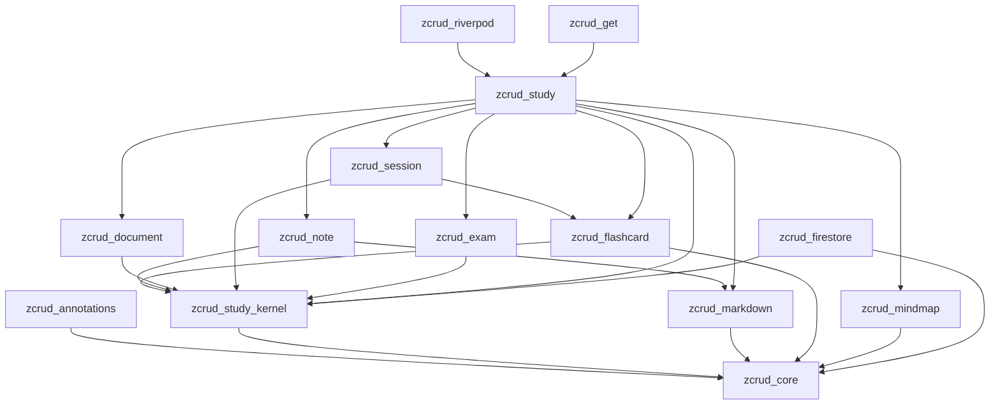
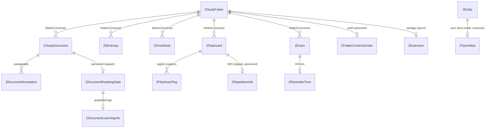
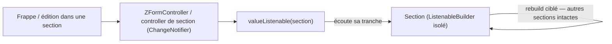

# Architecture Spine — zcrud_study (extension éducative)

Spine d'**extension** au niveau epic. Il **hérite** de l'architecture produit (16 décisions `AD-1..AD-16`, read-only, NON-NÉGOCIABLES) et n'ajoute que les invariants ouverts par cette phase — le squelette study étagé, la réconciliation des deux implémentations (IFFD / lex_douane), et les seams éducatifs. Une décision qui contredirait un `AD` hérité serait un **conflit à remonter**, pas un override local. Les `AD` hérités ne sont jamais renumérotés ; les nouveaux continuent la série à partir de `AD-17`.

## Design Paradigm

**Famille de packages étagée sur un kernel study, hexagonale (ports & adapters), couches `domain / data / presentation`** — extension directe du paradigme produit.

- **Nouveau socle bas `zcrud_study_kernel`** : squelette organisationnel pur-Dart (`ZStudyFolder` + hiérarchie, `ZFolderContentsOrder`, `ZStudySessionConfig`, `ZStudyRepository<T>`, registre de cascade). Ne dépend que de `zcrud_core`. C'est le seul point de convergence du domaine study — la contrainte AD-1 y est la plus tendue.
- **Satellites spécialisés** (`zcrud_note`, `zcrud_document`, `zcrud_session`, `zcrud_exam`) : chacun porte un pan du domaine + ses widgets, tous bâtis sur le kernel, importables **isolément**.
- **`zcrud_study`** : package d'**orchestration** — `ZStudyToolsPage` (apparence IFFD), agrégation quotidienne, composition des seams communauté/IA/podcasts.
- **Réutilisation, pas reconstruction** : `zcrud_flashcard` (E9), `zcrud_mindmap` (E10), `zcrud_markdown` (E6) sont consommés tels quels ; les écarts se comblent **dans le package d'origine**, jamais dupliqués.
- **Adapters** dans `zcrud_firestore` (offline-first bi-topologie) ; **bindings** dans `zcrud_riverpod` (lex_douane) / `zcrud_get` (IFFD).

Mapping paradigme → répertoires : `packages/<pkg>/lib/src/{domain,data,presentation}/` ; API publique = barrel `packages/<pkg>/lib/<pkg>.dart`.

## Inherited Invariants

Les 16 `AD` du spine produit **s'appliquent intégralement** à chaque story de cette phase. Ceux qui gouvernent le plus directement l'extension :

| Hérité | Depuis (parent) | Contraint ici |
| --- | --- | --- |
| AD-1 — Direction de dépendance acyclique | architecture-zcrud-2026-07-09 | Toute nouvelle arête (kernel, satellites, study, adapters) préserve l'acyclicité ; gate `melos analyze`+`verify` **repo-wide** à chaque commit d'epic |
| AD-2 / AD-15 — Réactivité Flutter-native, multi-manager par bindings | idem | Aucun gestionnaire d'état dans `zcrud_study*` ; sections & runtimes = `ChangeNotifier`/`ValueListenable` purs |
| AD-3 — Codegen, `reflectable` banni, `freezed` non imposé | idem | Toutes les entités study `@ZcrudModel` ; résolution de collection **statique** (CRUD réflexif IFFD proscrit) |
| AD-4 — ZExtension + registre + enums ouverts | idem | Partage, provenance de flashcard, tâche quotidienne, audio de note = slots additifs / registres pluggables |
| AD-5 / AD-11 / AD-14 — Domaine backend-agnostique, Either/Stream nu, pureté des couches | idem | Zéro `Timestamp`/`Box`/`Color`/`IconData` dans `zcrud_study*` ; invariants métier au repository |
| AD-9 / AD-16 — Offline-first LWW, `ZSyncMeta` hors-entité, curseur | idem | `ZSyncMeta` étendu à toutes les entités study ; cascade ≤ 450 ; état SRS séparé, voie d'écriture unique |
| AD-7 — Rich-text ZCodec pluggable | idem | `ZSmartNote.content` typé Delta via `ZCodec` ; réutilise `zcrud_markdown` |
| AD-10 — Schéma additif, désérialisation défensive | idem | Corpus IFFD legacy (camelCase, sans meta) se lit sur défauts sûrs ; enums inconnus → défaut, jamais throw |
| AD-13 — RTL / a11y / thème & l10n injectés | idem | Toute surface study : directionnel, ≥ 48 dp, `Semantics`, couleur jamais seul canal, `ZcrudScope`/`ThemeExtension` |
| AD-12 — Zéro secret | idem | Aucune clé (IA, storage, partage) dans un package ; jamais `badCertificateCallback => true` |

## Invariants & Rules

Direction de dépendance de l'extension (règle, pas illustration) — **le kernel ne dépend que du cœur ; tout pointe vers le bas ; graphe acyclique** :



> `zcrud_mindmap` **ne dépend pas** de `zcrud_study_kernel` : il référence les dossiers par `folderId` (clé neutre `String`), pas par l'entité `ZStudyFolder` — ce qui évite le cycle. `zcrud_firestore` dépend du kernel (types de domaine) mais **jamais l'inverse**.

### AD-17 — Décomposition fine multi-packages sur un kernel study
- **Binds:** FR-S1, NFR-S2, NFR-S10, SM-S7, SM-SC1
- **Prevents:** la duplication historique du domaine éducatif (3 apps) ; l'import forcé de features non désirées (examens, communauté, Firebase) quand une app ne veut qu'un pan.
- **Rule:** créer `zcrud_study_kernel` (bas-niveau, dépend de `zcrud_core` seul), les satellites `zcrud_note`/`zcrud_document`/`zcrud_session`/`zcrud_exam` (dépendent du kernel), et `zcrud_study` (orchestration, dépend du kernel + satellites + flashcard/mindmap/markdown). `zcrud_flashcard` et `zcrud_mindmap` sont refactorés pour dépendre du kernel. Les adapters vivent dans `zcrud_firestore`, les bindings dans `zcrud_riverpod`/`zcrud_get`. **Toute nouvelle arête préserve l'acyclicité** (AD-1) ; la granularité doit être **justifiée par une réutilisation indépendante réelle** (contre SM-SC1), pas par principe. Importer `zcrud_note` (ou `zcrud_flashcard`) seul n'ajoute ni examens, ni communauté, ni Firebase au graphe (test de résolution).

### AD-18 — Remontée de `ZStudyFolder` (option A) + refactor non-régressif de `zcrud_flashcard`
- **Binds:** FR-S1, SM-S2
- **Prevents:** le cycle (rendre le dossier accessible à `zcrud_study`/`zcrud_document` sans tirer tout `zcrud_flashcard`) ; une régression de l'epic E9 déjà livré.
- **Rule:** `ZStudyFolder` + `validatePlacement` (hiérarchie 2 niveaux) + `ZFolderContentsOrder` + `ZStudySessionConfig`/`ZStudySessionSelector` **migrent de `zcrud_flashcard` vers `zcrud_study_kernel`**. `zcrud_flashcard` est refactoré pour en dépendre et **ne définit plus** `ZStudyFolder` (un réexport transitoire depuis son barrel est toléré pour ne pas casser les imports existants, mais le kernel est l'unique source). Le refactor est **non-régressif** : la suite de tests E9 passe (RC=0, nb de tests ≥ avant) et **aucun symbole public supprimé n'est référencé sans réexport/migration** (contrôle cross-package). Preuve d'acyclicité `melos analyze`+`verify` repo-wide avant `done` de la story de tête. C'est la **story de tête d'ES-1** (bloque le reste).

### AD-19 — `ZSyncMeta` hors-entité pour **toutes** les entités study (tranche OQ #3 / OQ-S2)
- **Binds:** FR-S3, FR-S8, FR-S16, NFR-S9, SM-S6
- **Prevents:** figer le canonique sur une convention de sync divergente (`ZMindmap` hors-entité vs `ZStudyFolder` in-entité) ; deux moteurs de merge incompatibles.
- **Rule:** toute **nouvelle** entité study (`ZStudyDocument`, `ZSmartNote`, `ZExam`, `ZDocumentAnnotation`, `ZFlashcardTag`, `ZStudyPodcast`, entités de partage…) porte `updated_at` + `is_deleted` **hors-entité** via `ZSyncMeta` (AD-9/AD-16), alignée sur `ZMindmap`. Le **merge LWW se fait toujours sur `ZSyncMeta.updated_at`** (jamais sur un `T.updatedAt` interne). `ZStudyFolder`, qui portait historiquement `updatedAt` dans l'entité, est **aligné** : le champ interne devient un **miroir de compatibilité déprécié** que l'adapter maintient (pour les lectures legacy), mais qui **n'est plus l'autorité de merge** ; la divergence résiduelle est documentée explicitement, jamais laissée implicite. `ZDocumentAnnotation.isDeleted` inline (source lex) est extrait hors-entité.

### AD-20 — Dépôt d'étude générique + helper offline-first + résolveur de chemins bi-topologie
- **Binds:** FR-S12, FR-S13, FR-S15, NFR-S3, SM-S5
- **Prevents:** la ré-duplication du CRUD offline-first (~15× dans lex) ; la fuite de chemins de collection / `Timestamp` / `Box` / `WriteBatch` dans le domaine ; un `ZSyncOrchestrator` non générique entre IFFD et lex.
- **Rule:** le contrat `ZStudyRepository<T>` (flux `Stream<List<T>>` **nu**, `get`/`save`/`delete`/`sync` en `Either<ZFailure,_>`/`Unit`, **hook de validation métier par override**) vit dans `zcrud_study_kernel`. L'implémentation vit dans `zcrud_firestore` : `ZOfflineFirstBoxRepository<T>` factorise `_StoredEntry`/`is_deleted`, la boucle de merge LWW (paramétrée par comparateur + fromJson/toJson + **merge-key hors-entité**), le filtrage `hasPendingWrites` et l'upload de rattrapage. `ZFirestorePathResolver` **configurable** réconcilie « flat top-level by type » (IFFD) **et** « nested under folder » (lex) + collections globales (`study_share_links`) ; **aucun chemin de collection en dur dans le domaine**, et la résolution IFFD est **statique et explicite** (le CRUD quasi-réflexif `collection = nom de classe` est banni, esprit AD-3). `ZSyncOrchestrator` (E5) est **paramétré par une liste injectée** de dépôts synchronisables (jamais des imports en dur), best-effort (un échec de dépôt n'arrête pas les autres), débounce ~400 ms.

### AD-21 — Cascade de suppression déclarative bornée (tranche OQ-S6)
- **Binds:** FR-S14, NFR-S9
- **Prevents:** une cascade codée en dur non portable entre les deux topologies ; un lot d'écritures non borné (AD-9).
- **Rule:** le **registre déclaratif des relations parent/enfant** (`kind → enfants`, ex. dossier → sous-dossiers → cartes → répétitions → notes → mindmaps → documents → annotations) vit dans `zcrud_study_kernel` — neutre, partagé, sans chemin. **Ownership des arêtes (anti two-owners) :** chaque **arête entrante** vers le dossier est déclarée par le **package enfant qui la porte** (`zcrud_document` déclare `folder → document → annotation`, `zcrud_exam` déclare `folder → exam`, etc.) ; **aucun package ne déclare l'arête d'un autre**. La composition en un **registre unique** est faite **une seule fois par l'app/orchestrateur** (`zcrud_study`), jamais par deux satellites concurremment — une arête a donc toujours un propriétaire unique. La **résolution concrète** de chaque relation en collections/chemins vit dans l'adapter `zcrud_firestore` (via `ZFirestorePathResolver`), de sorte que la topologie IFFD (flat) puisse différer de lex (nested) sans toucher au domaine. Le batcher (`ZFirestoreCascadeBatcher`) borne à **≤ 450 écritures/lot** avec flush automatique.

### AD-22 — Convergence SM-2 : `ZSm2Scheduler` (E9) est la source unique (tranche OQ-S3)
- **Binds:** FR-S17, SM-S1
- **Prevents:** trois implémentations SM-2 divergentes (`Sm2` lex / `Sm` IFFD / `ZSm2Scheduler`) cassant la compatibilité de planification des utilisateurs existants.
- **Rule:** `ZSm2Scheduler` **existant** (E9) est canonique — vérifié sur le code : il unifie déjà lex `Sm2` (plafond EF 2.5) **et** la variante IFFD (clamp des **deux** bornes de l'ease factor), constantes lues depuis un `ZSrsConfig` injecté (aucune constante en dur), horloge injectée, paliers 1 j / 6 j, échelle qualité **clamp `0..5`** (absorbe l'échelle IFFD 1-5 sans throw). Il reste derrière le port `ZSrsScheduler` **pluggable** (jamais `sealed`) ; **voie d'écriture unique** `reviewCard() → ZSrsScheduler.apply`. Le **bonus overdue** de lex n'est **pas** porté dans le scheduler par défaut (SM-2 pur) : une app qui l'exige fournit une autre impl `ZSrsScheduler`. **Résolution de tête d'ES-4** : figer des tests de contrat de planification (mêmes entrées → mêmes intervalles) et **documenter par écrit** la divergence overdue + le gel de l'échelle qualité, avant tout merge.

### AD-23 — Runtimes de session purs ; zéro écriture SM-2 **par construction**
- **Binds:** FR-S18, FR-S19, FR-S20, NFR-S5
- **Prevents:** le couplage des runtimes à un gestionnaire d'état ; l'altération accidentelle de la planification SRS pendant une session cramming/liste/examen.
- **Rule:** `ZStudySessionEngine` (cycle SRS, queue + réinsertion offset +2/+4 sur lapse), `ZLinearSessionState` (cramming/liste) et `ZWhiteExamSessionEngine` (setup→running→submitted) sont des **classes pures** (`ChangeNotifier`/reducer) dans `zcrud_session` — **aucun** import Riverpod/GetX. Les runtimes linéaire/examen **ne référencent pas** le `ZRepetitionStore` (ports séparés) : l'invariant « zéro écriture SM-2 » est **garanti par construction** et testé (aucun appel `apply` durant une session linéaire). La seule voie d'écriture SRS reste `reviewCard() → ZSrsScheduler.apply` (AD-9).

### AD-24 — `ZStudySessionConfig` : une forme domaine-pur unique ; égalité profonde au binding (tranche OQ-S4)
- **Binds:** FR-S33, NFR-S5
- **Prevents:** les deux formes concurrentes de lex (config persistée simple vs value-object riche pour clé Riverpod) qui rentreraient toutes deux dans le cœur.
- **Rule:** **une seule** forme `ZStudySessionConfig` (`@ZcrudModel`, persistable, round-trip) vit dans `zcrud_study_kernel`. L'**égalité profonde** requise par une family Riverpod (clé de provider) vit **dans le binding `zcrud_riverpod`**, jamais dans le kernel/cœur — le domaine ne connaît pas Riverpod.

### AD-25 — Apparence IFFD sectionnée à scoping isolé + `ZFeatureAvailability` injectable
- **Binds:** FR-S22, FR-S23, FR-S24, NFR-S1, SM-S1, SM-S3
- **Prevents:** la régression du bug de rebuild global (`multi_flashcard_editor_page.dart`, `setState` ×18 — objectif produit n°1) ; une roadmap d'éditeurs figée dans le package partagé.
- **Rule:** `ZStudyToolsPage` reproduit le layout `folder_study_tools_page.dart` comme **liste de sections paramétriques** (`title`/`itemBuilder`/`emptyState`/`addAction`) : rail horizontal flashcards + grilles réordonnables docs/notes/mindmaps. **Chaque section = un scoping `ValueListenable`/`ListenableBuilder` isolé** — une frappe/édition dans une section ne reconstruit **aucune** autre (SM-1) ; aucun `setState` à l'échelle page/section. L'ordre persiste via `ZFolderContentsOrder` (`applyOrder<T>`, tri stable pur). `ZFeatureAvailability` est une **interface injectable** (jamais une classe `const` compilée) : deux apps aux roadmaps différentes fournissent leurs disponibilités sans modifier `zcrud_study`. `ZItemActionsMenu`/`ZContentHubSheet` sont paramétrés (**callback `null` = action absente**, AD-4). Couleurs/labels/l10n injectés, directionnel / ≥ 48 dp / `Semantics` / `ListView.builder` (AD-13).

### AD-26 — Communauté / partage = extension optionnelle activable ; l'état personnel n'est jamais partagé
- **Binds:** FR-S32, NFR-S11, SM-SC2
- **Prevents:** que le partage devienne un invariant du domaine (coût imposé aux apps qui n'en veulent pas) ; la fuite de l'état personnel dans le sous-arbre partagé ; l'héritage **silencieux** de la dette de sécurité lex.
- **Rule:** le partage est une **extension optionnelle activable** — `ZExtension?` sur `ZStudyFolder` + entités `ZStudyMembership`/`ZShareLink`/`ZPublicStudyFolder`/`ZStudyFolderReport` + ports `ZStudySharingPort`/`ZStudyModerationPort`. Une app qui **n'active pas** le partage n'en tire ni entités ni backend. L'état **personnel** (`ZRepetitionInfo`, `ZFolderContentsOrder`, `ZDocumentReadingState`/`ZDocumentLearningInfo`) est **séparé** du sous-arbre partageable et **jamais emporté** par le partage (AD-9). `ZShareLink` est **révocable** ; `study_share_links` est résolu en collection globale (AD-20). La **dette de sécurité héritée de lex** (contributeur pouvant modifier des champs de contrôle ; limite LWW / révocation à la prochaine sync) est **corrigée ou documentée explicitement** au portage — jamais héritée en silence.

### AD-27 — Migration IFFD flat→canonique + mapping de casse côté adapter uniquement + `ZSyncMeta` additif
- **Binds:** FR-S16, FR-S34, NFR-S4, SM-S6
- **Prevents:** la perte de données à la bascule IFFD ; la fuite du mapping camelCase↔snake_case dans le domaine ; une migration cassante (AD-10).
- **Rule:** le **mapping bidirectionnel** snake_case (canonique) ↔ camelCase (clés historiques IFFD) se fait **uniquement dans le codec `zcrud_firestore`**, jamais dans le domaine. L'ajout de `ZSyncMeta` (`updated_at` + `is_deleted`) est **additif rétro-compatible** : un document IFFD legacy qui ne les porte pas se lit sur des défauts sûrs. L'asymétrie d'horloge (soft-delete `DateTime.now()` local vs `serverTimestamp()` distant) est **normalisée dans l'adapter**. `FlashcardSource.fromJson` **diverge volontairement** de la source lex (qui lève `FormatException`) vers un variant « unknown »/défaut sûr (AD-10). La restructuration flat→canonique (nested ou flat via `ZFirestorePathResolver`) est un **chantier explicite** (pas un renommage), prouvé **sans perte** sur corpus réel ; **gate CI** de désérialisation défensive sur un corpus IFFD legacy (camelCase, sans `ZSyncMeta`).

### AD-28 — Contenus rich-text typés (tranche OQ-S5)
- **Binds:** FR-S5, FR-S25, FR-S26
- **Prevents:** l'ambiguïté markdown/Delta résolue par heuristiques regex dispersées dans l'UI ; la divergence produit du `content` de nœud mindmap si IFFD migre.
- **Rule:** `ZSmartNote.content` est **typé via `ZCodec`** (Delta JSON) — jamais `String?` ambiguë ; l'édition/lecture réutilise `zcrud_markdown` **tel quel** (`ZMarkdownField`/`ZMarkdownReader`, aucun nouveau codec, controller isolé conforme AD-2/AD-7). Le `content` d'un **nœud mindmap reste texte brut** dans `zcrud_mindmap` ; le rich-text éventuel est un **slot `ZExtension`/`ZCodec` câblé côté app** (opt-in), **pas** un champ du modèle nœud — de sorte qu'IFFD puisse migrer avec rich-text sans forcer les autres apps ni modifier `zcrud_mindmap`. Les écarts de `zcrud_mindmap`/`zcrud_markdown` (édition outline interactive, migration des tables) se comblent **dans le package d'origine**, jamais dupliqués.

## Consistency Conventions

*Compléments spécifiques à l'extension — les conventions produit (préfixe `Z`, snake_case + enums camelCase, `id` opaque, ISO-8601, `ZFailure`, `ZSyncMeta`, réactivité `ChangeNotifier`) restent en vigueur.*

| Concern | Convention |
| --- | --- |
| Nommage & packages | Nouveaux packages `zcrud_study_kernel`, `zcrud_note`, `zcrud_document`, `zcrud_session`, `zcrud_exam`, `zcrud_study` ; barrel `lib/<pkg>.dart`, impl `lib/src/{domain,data,presentation}`. Entités study préfixées `Z` (`ZStudyDocument`, `ZSmartNote`, `ZExam`, `ZFlashcardTag`, `ZDocumentAnnotation`…). Value-objects horaires : `ZReminderTime` (JsonConverter `HH:mm`). |
| Sync & données | `ZSyncMeta` hors-entité **universel** (AD-19) ; merge LWW sur `ZSyncMeta.updated_at` ; bornes normalisées `[0,1]` pour `ZAnnotationBounds` ; podcasts content-addressed `id = {sourceId}_{mode}` invalidés par `sourceHash`. Palette de couleurs = `colorKey` bornée + remap déterministe SHA-256, **couleurs injectées** (jamais codées en dur, AD-13). |
| État personnel vs partageable | État **personnel** (`ZRepetitionInfo`, `ZFolderContentsOrder`, `ZDocumentReadingState`/`ZDocumentLearningInfo`) toujours **séparé** du contenu partageable (`ZDocumentAnnotation`, dossier public) ; jamais colocalisé dans un même sous-arbre synchronisé (AD-9/AD-26). |
| Horloge & déterminisme | Méthodes temporelles (`daysUntil`/`isPast`/`isApproaching`, `ZSrsScheduler.apply/simulate`) prennent l'horloge **injectée** (`now`), jamais `DateTime.now()` en dur → tests déterministes. |
| Seams & registres | app-specific derrière un **port neutre** `Either<ZFailure,T>` (IA, podcast, partage, modération, upload, scoring) ; provenance de flashcard et variant de tâche quotidienne = **registre pluggable** (`ZSourceRegistry`/`ZTypeRegistry`), pas un `switch` exhaustif (AD-4) ; quota IA `fail-open` (indisponible ⇒ ne bloque pas). |

## Stack

*SEED — l'extension n'introduit **aucune** nouvelle dépendance lourde ; elle réutilise la stack produit (alignée workspace lex_douane). Rappel des versions load-bearing pour cette phase.*

| Name | Version |
| --- | --- |
| Dart SDK | ^3.12.2 |
| melos | ^7.0.0 |
| json_serializable / json_annotation | ^6.11.2 / ^4.9.0 |
| dartz | ^0.10.1 |
| flutter_quill (via `zcrud_markdown`, réutilisé) | ^11.5.x |
| graphite (via `zcrud_mindmap`, réutilisé) | ^1.2.1 |
| cloud_firestore / firebase_core / hive (adapters `zcrud_firestore`) | firestore ^6 / core ^4 / hive ^2.x |
| flutter_riverpod (binding `zcrud_riverpod`, lex_douane) | ^3.1.0 |
| get (binding `zcrud_get`, IFFD/DODLP) | ^4.7.x |

> Interdits pour cette phase : `flutter_flow_chart`/`graphview` (mode flowchart legacy non porté — `graphite` reste standard), `syncfusion` pour les tables (table native de `zcrud_markdown`), `reflectable`, tout gestionnaire d'état dans `zcrud_study*`.

## Structural Seed

Arborescence des nouveaux packages (les existants ne sont pas re-listés) :

```text
packages/
  zcrud_study_kernel/   # squelette study : ZStudyFolder + validatePlacement, ZFolderContentsOrder,
                        #   ZStudySessionConfig, ZStudyRepository<T>, registre de cascade, utilitaires purs
                        #   (ZColorPalette, applyOrder<T>, normalizeTagTitle). Dépend de zcrud_core seul.
  zcrud_note/           # ZSmartNote (content via ZCodec) + UI notes sur zcrud_markdown
  zcrud_document/       # ZStudyDocument + ZDocumentReadingState/LearningInfo + ZDocumentAnnotation + UI
  zcrud_session/        # ZStudySessionEngine / ZLinearSessionState / ZWhiteExamSessionEngine (purs)
                        #   + ZStudySessionResult + widgets qualité/progression (thème injecté)
  zcrud_exam/           # ZExam + ZReminderTime + rappels + examen blanc
  zcrud_study/          # ZStudyToolsPage (apparence IFFD), aggregateDailyStudyTasks, seams IA/podcast/
                        #   communauté (ZSharingPort/ZModerationPort/ZFlashcardGenerationPort/...)
  zcrud_firestore/      # + adapters study : ZOfflineFirstBoxRepository<T>, ZFirestorePathResolver,
                        #   ZFirestoreCascadeBatcher, codec camelCase<->snake_case
  zcrud_riverpod/       # + providers study (lex_douane) — égalité ZStudySessionConfig ici
  zcrud_get/            # + injection/lifecycle study (IFFD)
```

Entités canoniques study (noms + relations ; les attributs-invariants sont des `AD`) :



Réactivité de la page study-tools (AD-25, dérivé d'AD-2) :



## Capability → Architecture Map

| Capability / FR | Lives in | Governed by |
| --- | --- | --- |
| Squelette study + utilitaires purs (FR-S1..FR-S3) | `zcrud_study_kernel` (+ refactor `zcrud_flashcard`) | AD-17, AD-18, AD-19 |
| Domaine canonique éducatif (FR-S4..FR-S11) | `zcrud_note`, `zcrud_document`, `zcrud_exam`, `zcrud_study_kernel` | AD-3, AD-4, AD-10, AD-19, AD-28 |
| Ports & data offline-first bi-topologie (FR-S12..FR-S16) | `zcrud_study_kernel` (ports) / `zcrud_firestore` (adapters) | AD-20, AD-21, AD-27, AD-5, AD-9 |
| SRS convergé + runtimes de session (FR-S17..FR-S21) | `zcrud_session` | AD-22, AD-23, AD-13 |
| Layout study-tools apparence IFFD (FR-S22..FR-S24) | `zcrud_study/presentation` | AD-25, AD-2, AD-13 |
| Notes & markdown (FR-S25) | `zcrud_note` (réutilise `zcrud_markdown`) | AD-28, AD-7 |
| Mindmap intégration (FR-S26) | `zcrud_study` (réutilise `zcrud_mindmap`) | AD-28, AD-4 |
| Tags & annotations UI (FR-S27, FR-S28) | `zcrud_document`, `zcrud_study` | AD-13, AD-19 |
| Seams IA / communauté / examens (FR-S29..FR-S32) | `zcrud_study` (ports) | AD-26, AD-4, AD-12 |
| Bindings & migration (FR-S33, FR-S34) | `zcrud_riverpod`, `zcrud_get` | AD-24, AD-27, AD-15 |

## Deferred

- **Comparaison numérique exacte lex `Sm2` ↔ `ZSm2Scheduler`** (overdue-bonus, arrondis d'intervalle) — **résolution de tête d'ES-4** : critère = tests de planification identiques (mêmes entrées → mêmes intervalles) figés avant merge, divergence overdue documentée par écrit (AD-22). Non rejouable ici sans le code lex.
- **Décomposabilité golden de `folder_study_tools_page.dart` (~1750 l.)** en sections paramétriques sans perte d'apparence — à valider par golden/design-review en ES-5 (AD-25).
- **Implémentations concrètes derrière les seams** (routeurs IA/prompts, TTS podcast, backend de partage, `ZDocumentUploadPipeline` storage, canal de notification OS) — fournies par les apps, hors package (AD-26, AD-12).
- **Migration de DLCFTI / DODLP sur `zcrud_study`** — après stabilisation IFFD + lex_douane.
- **Requête backend `getDue()` scalable** — la dette « filtrage en mémoire » (E9) est héritée telle quelle ; un port de requête SRS backend est déféré (pas de régression introduite, pas d'optimisation prématurée).
- **Entités métier douane** (`ComparativeStudy`), **seeds de flashcards par référentiel** (SH/tarif), **format wire chat** (`toChatJson`) — restent app-specific, jamais dans le domaine générique.
- **Backends non-Firestore réels** — seul le contrat `ZStudyRepository<T>` reste exprimable (AD-5/AD-20).
