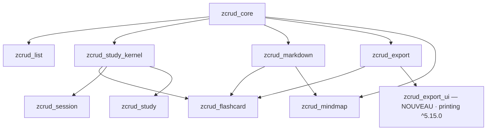

# Architecture Spine — E-STUDY-UI + E-MULTI-EDIT

## Paradigme

Hexagonal, inchangé : domaine pur → ports → adaptateurs. La nouveauté de ces epics est
**présentationnelle** : chaque widget d'étude est un **composant pur-Flutter à slots injectables**
(rendu, ports IA, callbacks), sans gestionnaire d'état ni dépendance lourde. Toute variante
multi-app est portée par un **enum**, jamais par un booléen ni par un style codé en dur.

## Invariants hérités

Liants, par leurs identifiants d'origine — jamais renumérotés, jamais re-dérivés.

| Hérité | Parent | Ce qu'il contraint ici |
|---|---|---|
| AD-1 | fondateur | Graphe acyclique, CORE OUT=0 ; toute dépendance tierce confinée à son satellite |
| AD-2 / AD-15 | fondateur | Réactivité Flutter-native ; aucun gestionnaire d'état hors bindings |
| AD-4 | fondateur | Extension par composition + slots `extension`/`extra` + registres ouverts |
| AD-6 | fondateur | Injection et cycle de vie par bindings |
| AD-10 | fondateur | Défensif : jamais d'exception, replis définis |
| AD-13 | fondateur | RTL, a11y (≥ 48 dp, `Semantics`), l10n et thème injectés |
| AD-9 / AD-19 | fondateur / study | État personnel hors entité partagée ; `ZSyncMeta` hors-entité |
| AD-21 | study | Cascade de suppression déclarative bornée |
| AD-22 / AD-23 | study | `ZSm2Scheduler` source unique ; runtimes de session purs, zéro écriture SM-2 |
| AD-24 | study | `ZStudySessionConfig` : forme domaine-pur unique |
| AD-28 | study | Contenus rich-text typés |
| AD-8 | fondateur | Dépendance lourde isolée derrière un satellite dédié (patron `zcrud_export_ui`) |
| AD-29 / AD-32 | UI | Packages UI purs étagés ; garde dirty, toast par port |
| enums > booléens | UI | Toute variante multi-app est un enum |

## Décisions

### AD-33 — Sélection amont, runtime aval, écriture SRS par seam unique
- **Binds** : FR-SU6, FR-SU7, FR-SU10, FR-SU12.
- **Prevents** : un runtime qui re-filtre la file, ou qui écrit le SRS en direct.
- **Rule** : une session se construit **sur une file déjà sélectionnée** (`List<ZSessionItem>`),
  produite en amont par `ZStudySessionConfig` → `ZStudySessionSelector`. Aucun moteur ne
  sélectionne. L'écriture SRS ne passe **que** par le seam `ZSessionReviewer` (signature de
  `reviewCard`) ; jamais `ZSrsScheduler.apply` en direct, jamais un store en champ.

### AD-34 — Un runtime par régime d'écriture ; les trois existent déjà, aucun n'est créé
- **Binds** : FR-SU7 (tous les modes), FR-SU13.
- **Prevents** : un quatrième runtime dupliquant un runtime livré ; un mode non-SRS auquel une
  story câblerait un chemin d'écriture.
- **État réel ratifié** : les trois runtimes couvrant les six modes **sont déjà livrés, exportés
  et testés**. Aucune story de ces epics n'en crée un nouveau ; elles **construisent au-dessus**.

  | Mode | Runtime (existant) | Écriture SRS |
  |---|---|---|
  | `spaced`, `learn` | `ZStudySessionEngine` (seul à recevoir un `ZSessionReviewer`) | oui, par le seam |
  | `list`, `cramming` | `ZLinearSessionState` (réducteurs `advanceLinear`/`requeueCramming`) | **impossible par construction** (aucun paramètre de review ; `assert` de mode ; `z_linear_no_srs_test`) |
  | `test`, `whiteExam` | `ZWhiteExamSessionEngine` (`ZExamScoringPort`) | **impossible par construction** |

- **Rule** : le régime d'écriture est une propriété **du type**, jamais du `mode` passé en
  paramètre. Le seul trou résiduel est **symétrique** et doit être fermé : `ZLinearSessionState`
  verrouille ses modes par `assert`, mais **`ZStudySessionEngine` accepte n'importe quel
  `ZReviewMode`** — `(mode: cramming, reviewer: réel)` reste constructible et écrirait le SRS. Il
  reçoit donc la **garde symétrique** : n'accepter que `spaced`/`learn`. Aucun `ZSessionReviewer`
  no-op n'est fourni (ce serait la porte dérobée). Invariant testé : aucun mode non-SRS n'atteint
  `reviewCard`.

### AD-35 — Évaluation IA advisory, jamais notante ; QCM/VF évalués localement
- **Binds** : FR-SU2, FR-SU3.
- **Prevents** : deux contrats d'évaluation ; une IA qui écrit le SRS ; une session bloquée hors ligne.
- **Rule** : entrée `{question, userAnswer, cardType, expectedAnswer?, explanation?, timeTaken?,
  hintsUsed?}` ; sortie **typée** `{feedback, suggestedQuality, isCorrect?, quota?}`, et
  `errorKind` typé en échec. **Advisory strict** : pré-sélectionne un bouton SRS, l'utilisateur
  valide ; le port n'écrit jamais (AD-33). **QCM/VF évalués localement** (déterministe, hors
  ligne), jamais par le port — écart assumé avec IFFD, qui les fait passer par l'IA et ne se
  rabat sur le local qu'en `catch`. Replis (AD-10) : QCM/VF exact → borne haute sinon borne
  basse ; rédigée → seuil de passage ; « Je ne sais pas » → borne basse, sans appel.

### AD-36 — Indices : stockés d'abord, port ensuite, plafond local unique
- **Binds** : FR-SU3.
- **Prevents** : un appel IA superflu ; deux règles de pénalité concurrentes.
- **Rule** : l'indice stocké est servi en premier ; le port n'est appelé qu'**après épuisement**,
  en recevant les indices déjà montrés (anti-répétition) ; les indices générés restent
  **éphémères** (jamais persistés sur la carte). **La pénalité a un propriétaire unique : la
  couche locale** — chaque indice abaisse d'un cran la qualité maximale attribuable, jusqu'à un
  plancher configurable qui ne descend jamais sous le cran immédiatement inférieur au seuil de
  passage (un apprenant aidé n'est jamais noté « échec total » du seul fait des indices).
  `hintsUsed` est transmis au port **à titre informatif** (le barème peut en tenir compte dans sa
  prose), mais **le plafond local s'applique en dernier, sur la valeur rendue** : jamais deux
  pénalités cumulées, jamais aucune.

### AD-37 — Génération IA : requête d'union, `modelId` opaque, résultat éphémère
- **Binds** : FR-SU15, FR-SU18.
- **Prevents** : un catalogue de modèles backend dans le domaine ; des cartes générées persistées
  sans revue ; des défauts de répartition divergents.
- **Rule** : requête canonique `{source (registre AD-4 : document+pages, sujets, texte libre,
  article, note, conversation…), count borné, typesDistribution, language, instructions?,
  modelId: String?}`. **`modelId` est opaque** : transporté sans jamais être interprété ;
  catalogue, libellés et cascade de repli restent app-side — aucun nom de modèle dans zcrud.
  Résultat = cartes **éphémères** (ni id ni source du backend) + tags suggérés, matérialisées côté
  client **après revue** (preview → commit). Défaut de `typesDistribution` : **répartition
  équitable pure** calculée depuis `count` × types, surchargeable — source unique.

### AD-38 — Ordre manuel : l'entité livrée est ratifiée ; `sectionKey` a un constructeur unique
- **Binds** : FR-SU14.
- **Prevents** : une **seconde** entité d'ordre ; un champ `position` inline ; deux formes de
  `sectionKey` qui divergeraient **silencieusement** (`applyOrder` étant total, une clé fautive
  est ignorée sans erreur ni test rouge).
- **Rule** : l'ordre manuel **réutilise l'existant** — `ZFolderContentsOrder{folderId,
  sectionOrders: Map<String, List<String>>}` + `applyOrder<T>` (`zcrud_study_kernel`,
  `@ZcrudModel`, clé persistée réservée) : **aucune nouvelle entité, aucun nouveau `kind`
  persisté**. `sectionKey` n'est **jamais** composée à la main : un **constructeur canonique
  unique** (fonction du kernel) la produit à partir du type de contenu et du sous-dossier
  optionnel, et il est **le seul** point de composition — côté lecture comme écriture. État
  personnel, hors entité partagée (AD-9/AD-19) ; ordre appliqué stable, nouveaux appendés,
  orphelins ignorés. Drag **et** boutons Monter/Descendre (a11y) empruntent **la même** voie
  d'écriture (`ZReorderIds` pour le déplacement, `copyWith(sectionOrders:)` pour la persistance).
  Jamais d'ordre porté par l'item.

### AD-39 — Suppression *persistée* : cascade AD-21 obligatoire, awaited, à rapport d'échecs
- **Binds** : FR-SU19, FR-SU20.
- **Prevents** : les orphelins SRS ; le fire-and-forget à erreurs avalées ; deux voies de
  suppression entre stories.
- **Rule** : toute suppression **franchissant la frontière de persistance** (AD-43) — unitaire
  comme par lot — passe par la cascade déclarative AD-21, **awaited**. Les suppressions **dans un
  brouillon** (AD-43) ne persistent rien et ne cascadent donc rien. **Granularité du rapport
  (arbitrage explicite)** : la borne AD-21 (≤ 450 écritures par lot) et le rapport par élément se
  concilient à **l'élément racine** — chaque élément sélectionné est une **unité de rapport**
  (réussi / échoué, avec sa cause), sa propre cascade restant atomique. Un lot n'est jamais
  silencieusement partiel : l'appelant reçoit toujours la liste des racines échouées.

### AD-40 — Rendu riche par slot injectable ; l'adaptateur vit chez le consommateur
- **Binds** : FR-SU1, FR-SU14, FR-SU17.
- **Prevents** : un rendu riche codé en dur dans un widget ; un type Quill/`flutter_math_fork` qui
  fuit ; **un cycle de dépendances** ; chaque app qui réécrit son adaptateur.
- **État réel ratifié** : `zcrud_flashcard → zcrud_markdown` et `zcrud_mindmap → zcrud_markdown`
  sont des **dépendances dures existantes** (pubspec + `ZMarkdownApi.version`), et
  `ZMindmapMarkdownContent` vit **dans `zcrud_mindmap`**, pas dans `zcrud_markdown`. Les arêtes
  ne sont pas remises en cause ; ce qui est réglé, c'est ce qui passe dessus.
- **Rule** : tout widget affichant du contenu de carte ou de nœud expose un **slot de rendu
  injectable** (patron du `nodeContentBuilder` existant) dont le **défaut est un texte brut
  thématisé, sans rendu riche** — un widget ne rend **jamais** le riche lui-même. L'**adaptateur
  prêt à injecter vit dans le package consommateur** (`zcrud_mindmap` pour l'outline et le graphe,
  `zcrud_flashcard` pour la carte de révision), au-dessus de sa dépendance existante à
  `zcrud_markdown` — patron `ZMindmapMarkdownContent.builder(slotKey:)`. **Jamais l'inverse** :
  `zcrud_markdown` ne connaît aucun consommateur (l'arête retour créerait un cycle, AD-1).
  L'outline editor gagne un **slot de champ d'édition** (ses `TextField` sont aujourd'hui en dur).
  **Aucun type Quill ou `flutter_math_fork` dans une signature publique** (AD-7) ; le payload riche
  transite par les slots AD-4 (`extra`), jamais par un type d'éditeur.

### AD-41 — Label riche borné à la cellule du graphe
- **Binds** : FR-SU17.
- **Prevents** : un chantier de mesure que `graphite` ne supporte pas ; un débordement de nœud.
- **Rule** : dans le graphe, le rendu riche s'affiche **dans la cellule de taille fixe**
  (`cellSize` configurable par l'app), **tronqué/clippé proprement** — jamais de mesure
  intrinsèque ni de re-layout. Le mode compact conserve le label brut. Le rendu riche **complet**
  est garanti dans l'outline editor et la liste a11y.

### AD-42 — `zcrud_export` reste pur ; LaTeX rasterisé par port ; destination en satellite
- **Binds** : FR-SU16.
- **Prevents** : une dépendance de plateforme imposée à qui ne veut que des octets ; un rendu
  LaTeX non testable.
- **Rule** : `zcrud_export` reste **bytes in / bytes out** (`{bytes, fileName, mimeType}`), sans
  dépendance de plateforme. Le LaTeX du PDF passe par un **port de rasterisation**
  (`flutter_math_fork` → capture hors écran → `PdfBitmap`/`drawImage`), isolé et testable
  (polices chargées, golden). **Deux maillons manquent, pas un** : la seule API publique
  d'assemblage est `buildFromImages` (**une image par page**) — le gabarit FR-SU16 exige en plus
  une **composition inline texte + bitmap** dans une page, à construire. La **preview/impression/partage** vit dans un **nouveau satellite
  optionnel `zcrud_export_ui`** (dépendance `printing`) — conséquence nulle pour qui ne l'importe
  pas (patron AD-8) : **`printing: ^5.15.0`** (vérifié — accepte des octets bruts, porte le
  correctif CVE-2024-4367, compatible avec le SDK du monorepo) ; `printing` et sa dépendance
  transitive `pdf` **ne franchissent jamais** ce satellite, dont l'API publique reste en
  `Uint8List` (le type `PdfPageFormat` est absorbé à l'intérieur). Plan B si le rendu LaTeX
  décroche : `flutter_tex` (Math2SVG).

### AD-43 — Frontière brouillon / persistance explicite
- **Binds** : FR-SU19, FR-SU20, FR-SU15.
- **Prevents** : AD-39 appliqué à un brouillon (cascade sur des cartes jamais persistées) ; deux
  interprétations de « supprimer » entre la story liste et la story multi-éditeur ; une
  génération IA persistée sans revue.
- **Rule** : une surface d'édition est soit **directe** (chaque action persiste immédiatement —
  liste FR-SU14, actions de lot FR-SU19), soit **brouillon** (toutes les actions mutent une
  **liste de travail en mémoire** ; **rien ne persiste** avant un **commit explicite** unique qui
  remet l'ensemble à l'appelant — multi-éditeur FR-SU20, génération IA FR-SU15). Le régime est
  une propriété **déclarée** de la surface, jamais implicite. Sortie sans commit → garde
  `ZDiscardChangesGuard` (AD-32). Une entité éphémère (sans id) ne franchit jamais la frontière
  autrement que par le commit.

### AD-44 — Multi-édition : sélection possédée par la liste, actions déclarées, lot dérivé du `ZFieldSpec`
- **Binds** : FR-SU14, FR-SU19, FR-SU20.
- **Prevents** : deux propriétaires de l'état de sélection (liste vs barre d'actions) ; deux
  contrats d'action de lot ; une édition groupée qui réinvente la validation du moteur.
- **Rule** : **un seul propriétaire** de l'état de sélection — un contrôleur de sélection pur
  (`Listenable`, AD-2) détenu par la surface de liste et **passé** aux barres/menus, jamais
  redéclaré par un widget d'action. Les actions de lot sont **déclarées en données** (patron
  `ZItemActionsMenu` : action absente si non fournie) : intégrées `delete`/`move` + slot
  d'actions personnalisées ; « Déplacer » réaffecte le **champ de rattachement déclaré par le
  modèle**, jamais un `folderId` codé en dur, la destination venant d'un sélecteur injecté.
  L'édition de champ commun est **dérivée du `ZFieldSpec`** (mêmes éditeurs et mêmes validateurs
  que le formulaire unitaire — jamais une seconde implémentation), appliquée **par élément** avec
  rapport d'échecs (AD-10).

### AD-45 — Lecture seule : duplication explicite, état personnel jamais copié
- **Binds** : FR-SU21, FR-SU14, FR-SU20.
- **Prevents** : deux sémantiques de « dupliquer » entre les stories liste et multi-éditeur ; une
  copie qui hérite du SRS ou de la protection de l'original.
- **Rule** : une entité `isReadOnly` s'ouvre en **aperçu** (rendu de révision ; actions d'édition
  et de suppression **absentes**, jamais désactivées-grisées). « Dupliquer pour modifier » produit
  une **entité éphémère** (sans id, `isReadOnly` **remis à faux**, **aucun état personnel copié** —
  ni SRS ni ordre, AD-9/AD-19/AD-38) qui rejoint le régime de la surface appelante (AD-43).
  L'original n'est jamais muté.

### AD-46 — Une seule échelle de qualité, possédée par le domaine
- **Binds** : FR-SU2, FR-SU8, FR-SU10, FR-SU12.
- **Prevents** : une carte qui redéclare l'échelle du swiper (elle est en amont et ne peut pas
  l'atteindre) ; une note sans seau de maîtrise, invisible des filtres.
- **État réel ratifié** : `ZQualityScale` (défaut **0..5**) vit dans la **présentation** de
  `zcrud_session`, en aval de `zcrud_flashcard` ; `ZSrsConfig` ne porte **que** `passThreshold`,
  aucune borne. L'échelle est donc aujourd'hui inatteignable depuis le domaine.
- **Rule** : l'échelle est un concept de **domaine** — **`ZSrsConfig` (zcrud_flashcard) en devient
  l'unique propriétaire** et porte ses bornes aux côtés de `passThreshold` ; `ZQualityScale`
  (présentation) en **dérive** au lieu de la redéclarer. Échelle canonique : **0..5** (SM-2
  complet, défaut actuel, usage lex). En conséquence, le seau « mauvais » de FR-SU12 couvre
  **q0-2** (bon = q3, maîtrisé = q4-5) : **aucune note n'est hors seau**. Toute valeur reçue hors
  bornes est **clampée** (AD-10). Écart PRD (qui dit 1-5) assumé et à amender.

## Placement des paquets

Arêtes réelles (toutes préexistantes sauf le satellite `zcrud_export_ui`) :

L'adaptateur de rendu riche vit **chez le consommateur** (`zcrud_flashcard`, `zcrud_mindmap`),
dans le sens des arêtes ci-dessus — jamais l'inverse (AD-40).

- **E-STUDY-UI** (additif) : `zcrud_flashcard`, `zcrud_session` (deps confinées
  `flutter_card_swiper`, `confetti`), `zcrud_study_kernel` (streak), `zcrud_study`,
  `zcrud_export` + `zcrud_export_ui`, `zcrud_mindmap`, `zcrud_markdown`.
- **E-MULTI-EDIT** : `zcrud_core` / `zcrud_list` (+ `zcrud_flashcard` pour le consommateur) —
  **seul** epic autorisé à écrire dans le cœur, une story à la fois.

Le nouveau satellite `zcrud_export_ui` entre dans l'**enveloppe de distribution existante** sans
exception : membre du workspace melos, versionné et contraint comme ses pairs, soumis aux mêmes
gates CI (graphe acyclique, CORE OUT=0, secrets, `codegen-distribution`, rétro-compatibilité de
sérialisation) — NFR-SU10. Aucun paquet de ces epics n'échappe à `melos run analyze` / `verify`
repo-wide.

## Écarts assumés vis-à-vis du PRD

Ces trois décisions **outrepassent** le PRD en connaissance de cause ; le PRD doit être amendé en
conséquence.

| Écart | PRD | Décision du spine | Motif |
|---|---|---|---|
| Échelle de qualité | FR-SU2 et FR-SU12 : « 1-5 », seaux mauvais = q1-2 | **0..5** possédée par `ZSrsConfig` ; seau « mauvais » élargi à **q0-2** (AD-46) | Échelle SM-2 complète, déjà le défaut du code et l'usage lex ; élargir le seau supprime le trou où q=0 n'était filtrable par personne |
| Streak | FR-SU11 : « remise à zéro » | **reset à 1** (la répétition du jour compte) | Fidélité au comportement réellement en production |
| Dépendance `printing` | Contre-métrique « pas de nouvelle dépendance au-delà des deux décidées » ; OA-6 | `printing` admise, **confinée au satellite optionnel `zcrud_export_ui`** (AD-42) | Conséquence nulle pour qui ne l'importe pas ; `zcrud_export` reste pur |

## Conventions

- Variantes par enum : `ZRevealTransition`, `ZTimerDisplay`, `ZCardAdvanceBehavior`,
  `ZReviewMode` (existant) — jamais un booléen. Défauts de `ZCardAdvanceBehavior` **par mode**
  (`auto` en test/examen blanc, `manual` ailleurs) : table unique, jamais redécidée par widget.
- **Généricité au juste besoin** : l'API vise deux consommateurs réels (IFFD, lex_douane). Un
  point d'extension ne s'ajoute que lorsqu'ils divergent réellement — pas par anticipation.
- Streak : reset **à 1** (la répétition du jour compte), **jour civil local**, idempotent par jour,
  **horloge et fuseau paramétrés** (calcul pur testable), exclu en mode consultation.
- Seams réutilisés, jamais redéclarés : `ZcrudLabels`, `ZToaster`/`ZToasterScope`,
  `ZDiscardChangesGuard`, `ZAdaptiveGrid`, `ZItemActionsMenu`, `ZTagChips`/`ZTagEditor`,
  `ZSrsConfig`, `ZSrsQualityButtons`, `ZStudySessionSelector`.
- Reduce Motion : révélation → fondu/instantané, confetti supprimé, animations de célébration
  neutralisées.
- Dépendances dormantes assumées (`confetti`, `flutter_math_fork`, `graphite`) : confinées à leur
  satellite pour rester remplaçables.

## Deferred

- Rendu LaTeX **vectoriel** dans le PDF (v1 = raster) ; poids du PDF à forte densité de formules.
- Retard de `syncfusion_flutter_*` : le monorepo est sur `^32.1.19`, la dernière publiée est
  `34.1.31` (deux majeures). Aucun FR de ces epics n'exige le bump — chantier propre, hors
  périmètre.
- Mesure intrinsèque des cellules de graphe (bloqué par `graphite`).
- Édition de champ commun **au-delà** des types scalaires du `ZFieldSpec` (champs conditionnels,
  validations croisées) — à cadrer si une story le demande.
- Normalisation des réponses IA mal formées : détail d'adaptateur app-side.
- Frontière UTC du streak (multi-device) — revisiter si un usage multi-appareil réel le justifie.
