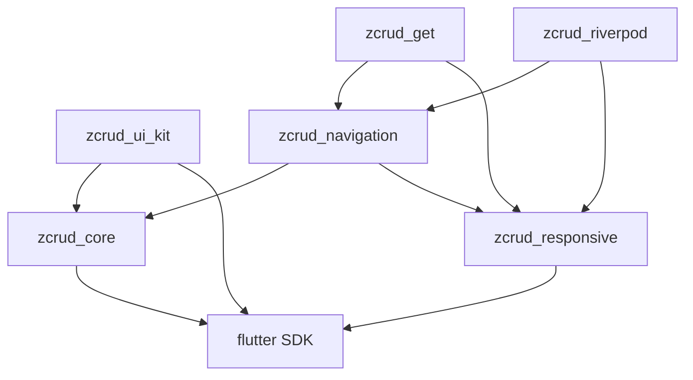
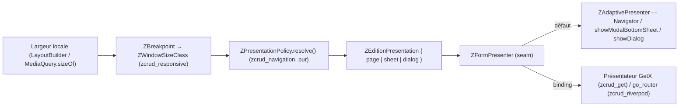
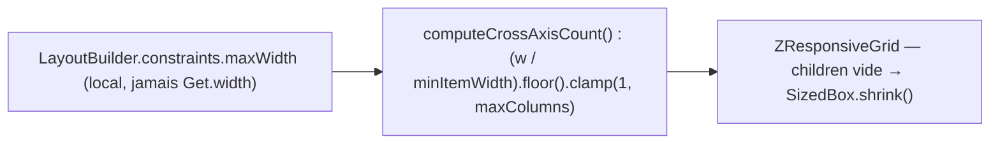

# Architecture Spine — zcrud EX-UI (infrastructure UI transverse)

Spine d'**extension** au niveau epic. Il **hérite** de l'architecture produit (16 décisions `AD-1..AD-16`, read-only, NON-NÉGOCIABLES) **et** du spine study (`AD-17..AD-28`) ; il n'ajoute que les invariants ouverts par cette phase — l'externalisation des trois capacités UI (responsivité, grille dynamique, présentation CRUD adaptative) et le **câblage** responsivité↔présentation qui n'existe dans aucune app. Une décision qui contredirait un `AD` hérité serait un **conflit à remonter**, pas un override local. Les `AD` hérités ne sont jamais renumérotés ; les nouveaux continuent la série à partir de `AD-29`.

## Contexte & objectif

Les quatre apps (dodlp-otr, iffd, lex_douane, dlcfti-otr) redupliquent trois capacités UI, chacune sans jamais les câbler entre elles :

1. **Présentation adaptative CRUD** (page / bottom-sheet / dialog) — `showPushedDialog<T>` répliqué **dodlp (29 sites) + iffd (~50 sites)**, **fortement couplé GetX** (`Get.to`/`Get.bottomSheet`/`Get.dialog`), le mode choisi **à la main** au call-site (`dialog: AppPlatform.isWebOrDesktop`). **Absent** de lex_douane et non abstrait (gap). Aucun enum de mode.
2. **Breakpoints responsive** — **4 implémentations concurrentes** avec seuils incohérents (600 / 800 / 840 / 900), moitié couplées `Get.width`. Le plus propre : lex `breakpoints.dart` + le pattern Material 3 d'`AdaptiveShell` (iffd). Le plus riche : dodlp `responsive_utils.dart` (`BreakpointValue<T>`, grille 12 colonnes de formulaire).
3. **Grille dynamique** (colonnes selon largeur d'item) — dupliquée **~24+ fois** (15 iffd + 9 dodlp), factorisée seulement dans lex_ui `ResponsiveGrid` (best-of-breed). iffd porte un **bug latent** : `crossAxisCount = W ~/ minW` **sans clamp** → 0 colonne sur écran étroit.

**Constat central** : les deux briques *responsivité* et *présentation* existent séparément mais ne sont **jamais reliées**. L'objectif d'EX-UI n'est pas que d'extraire — c'est de **poser la politique manquante** : le mode de présentation **dérivé automatiquement du breakpoint**. Décision utilisateur actée : **trois packages** (`zcrud_responsive`, `zcrud_navigation`, `zcrud_ui_kit`).

## Design Paradigm

**Trois packages UI purs étagés sur `zcrud_core`, hexagonaux (ports & adapters), présentateurs manager-spécifiques confinés aux bindings** — extension directe du paradigme produit (AD-1/AD-2/AD-6/AD-15).

- **`zcrud_responsive`** (feuille basse, **flutter seul**) : primitives de mesure/layout **pures** — breakpoints, valeur-par-breakpoint, layout adaptatif, grille dynamique, grille 12 colonnes de formulaire. Aucune arête `zcrud_*` entrante depuis le cœur ; aucun gestionnaire d'état.
- **`zcrud_navigation`** (`→ zcrud_core + zcrud_responsive`) : la **politique** pure de présentation (dérive le mode du breakpoint) **plus** un présentateur **par défaut pur-Flutter** (`Navigator`/`showModalBottomSheet`/`showDialog`), form-agnostique. Les présentateurs **manager** (GetX, go_router) vivent dans les bindings, jamais ici (AD-15).
- **`zcrud_ui_kit`** (`→ zcrud_core + flutter`) : patterns génériques récurrents (états vides/chargement/erreur, confirmation, garde anti-perte de saisie liée au dirty du `ZFormController`, index alphabétique, transitions RTL-aware, port de toast).

Mapping paradigme → répertoires : `packages/<pkg>/lib/src/{domain,data,presentation}/` ; API publique = barrel `packages/<pkg>/lib/<pkg>.dart`. Ces packages sont majoritairement `presentation/` (widgets) + un peu de `domain/` pur (politique, calcul de colonnes). **`publish_to: none`** comme tout le workspace.

## Inherited Invariants

Les 16 `AD` produit **et** les 12 `AD` study **s'appliquent intégralement**. Ceux qui gouvernent le plus directement ce delta :

| Hérité | Depuis | Contraint ici |
| --- | --- | --- |
| AD-1 — Dépendance acyclique, CORE OUT=0 | architecture-zcrud-2026-07-09 | `zcrud_core` ne dépend d'**aucun** des 3 nouveaux packages ; toute nouvelle arête préserve l'acyclicité ; gate `melos analyze`+`verify` **repo-wide** au commit d'epic |
| AD-2 / AD-15 — Réactivité Flutter-native, multi-manager par bindings | idem | **Aucun** gestionnaire d'état dans les 3 packages ; le code GetX/go_router ne vit que dans `zcrud_get`/`zcrud_riverpod` |
| AD-6 — Injection & cycle de vie pluggables par seams | idem | Présentateur manager, toast, thème résolus via `ZcrudScope`/binding ; jamais `Get.find`/`WidgetRef`/`Provider.of` dans ces packages |
| AD-13 — RTL / a11y / thème & l10n injectés | idem | `EdgeInsetsDirectional`, `AlignmentDirectional`, `TextAlign.start/end`, `PositionedDirectional`, `Semantics`, cibles ≥ 48 dp, `ListView.builder`, couleur jamais seul canal, thème injecté (`ZcrudScope`/`ThemeExtension`) sur **toute** surface |
| AD-12 — Zéro secret | idem | Aucune clé/endpoint ; jamais `badCertificateCallback => true` |
| AD-5 / AD-14 — Domaine backend-agnostique, pureté des couches | idem | La politique de présentation et le calcul de colonnes sont **purs** (testables sans `BuildContext` pour la partie domaine) ; aucune fuite backend |
| AD-25 — Réactivité de section à scoping isolé (study) | architecture-zcrud-study-2026-07-12 | Une grille/section réordonnable rendue par `zcrud_responsive` respecte le scoping `ValueListenable`/`ListenableBuilder` isolé ; aucun `setState` à l'échelle page (objectif produit n°1, SM-1) |
| AD-10 — Désérialisation défensive / défauts sûrs | idem | La politique dérive un mode **toujours** valide (jamais de throw sur une largeur aberrante) ; grille vide → `SizedBox.shrink()` |

## Invariants & Rules

Direction de dépendance de l'extension (règle, pas illustration) — **le cœur ne dépend d'aucun des trois ; tout pointe vers le bas ; graphe acyclique ; CORE OUT=0 préservé** :



> `zcrud_core` **n'a aucune arête sortante** vers `zcrud_responsive`/`zcrud_navigation`/`zcrud_ui_kit` — `CORE OUT=0` est intact (vérifié : `zcrud_core/pubspec.yaml` ne déclare que `flutter`). `zcrud_responsive` est une **feuille basse** (flutter seul), donc importable isolément par n'importe quel satellite sans tirer le cœur. Les présentateurs manager sont des **puits** (bindings, zéro arête entrante depuis un package non-binding). Aucun cycle : `responsive` → ∅(zcrud) ; `ui_kit`/`navigation` → `core` (+ `responsive` pour navigation) ; bindings → `navigation`/`responsive`. `graph_proof.py` ne compte que les arêtes `zcrud_*`.

> ### ⚠️ Amendement de réconciliation E3-4 (2026-07-16, décision utilisateur — fait autorité sur tout ce qui suit)
> **Découverte en `create-story` EX-UI.1** : `zcrud_core` **possède déjà** un système responsive introduit en **E3-4** (`packages/zcrud_core/lib/src/presentation/edition/z_responsive_grid.dart`, exporté par le barrel) : `enum ZBreakpoint { xs,sm,md,lg,xl }` (**5 paliers Bootstrap** 576/768/992/1200) + `ZResponsiveBreakpoints.of(width)`, `ZResponsiveSpan` (valeur-par-breakpoint 1..12, cascade mobile-first) et **`ZResponsiveGrid`** (grille **12 colonnes de formulaire**, `LayoutBuilder` + `Wrap` directionnel + place stable). Le spine EX-UI initial avait **manqué** ce recouvrement.
> **DÉCISION (Option A — réutiliser core)** : `zcrud_responsive` **DÉPEND de `zcrud_core`** et **réutilise** `ZBreakpoint`/`ZResponsiveBreakpoints`/`ZResponsiveSpan`/`ZResponsiveGrid` **sans les redéclarer** (aucune collision de nom). Il n'ajoute que le **strictement nouveau** : `enum ZWindowSizeClass { compact, medium, expanded }` (**M3 3 classes**, seuils 600/840 — distinct du `ZBreakpoint` 5-paliers de core), `ZBreakpointValue<T>` **générique** (généralisation multi-paliers de `ZResponsiveSpan`, bâtie sur `ZBreakpoint`), la **grille d'items générique** `ZAdaptiveGrid` + `computeCrossAxisCount` (capacité iffd/lex — par largeur-min, **distincte** de la grille 12-col de formulaire), et `ZResponsiveLayout` (3 builders). **Conséquences :** (1) `zcrud_responsive` n'est **plus une feuille flutter-seul** — arête `zcrud_responsive → zcrud_core` (acyclique, **CORE OUT=0 préservé** : arête ENTRANTE au cœur) ; (2) **EX-UI.4 (`ZResponsiveFormRow/Col`) est SUPPRIMÉE** — la grille 12-col de formulaire **existe déjà** dans core (`ZResponsiveGrid`+`ZResponsiveSpan`) ; (3) la grille d'items d'**EX-UI.3 est nommée `ZAdaptiveGrid`** (jamais `ZResponsiveGrid`, réservé au cœur) ; (4) **aucune écriture dans `zcrud_core`** (réutilisation seule). Les mentions ci-dessous de « feuille flutter-seul », « `ZResponsiveGrid` (EX-UI) » et « seuils M3 centralisés dans `ZBreakpoint` » sont **corrigées** en ce sens.

### AD-29 — Trois packages UI purs étagés sur le cœur (dédup transverse)
- **Binds:** capacités EX-UI 1/2/3 ; SM-1 (non-régression du rebuild global)
- **Prevents:** la re-duplication mesurée (grille **24+** sites, présentation **~79** call-sites couplés GetX, breakpoints **4** impls concurrentes) ; l'import forcé du cœur pour une simple grille ; le retour du couplage manager dans du code de layout.
- **Rule:** créer **`zcrud_responsive`** (pur Flutter, **dépend de `zcrud_core`** — réutilise les primitives responsive E3-4, cf. Amendement de réconciliation ci-dessus ; **pas** une feuille flutter-seul), **`zcrud_navigation`** (dépend de `zcrud_core` + `zcrud_responsive`) et **`zcrud_ui_kit`** (dépend de `zcrud_core` + flutter). **Aucun gestionnaire d'état** (AD-2/AD-15) ; **aucun secret** (AD-12) ; RTL/a11y/thème injectés (AD-13) sur toute surface. Toute nouvelle arête préserve l'acyclicité et `CORE OUT=0` (AD-1). La granularité en trois packages est **justifiée par une réutilisation indépendante réelle** : une app peut tirer `zcrud_responsive` seul (grille/breakpoints) sans navigation ni ui-kit ; elle n'est pas un découpage de principe. **A priori aucun `@ZcrudModel`/codegen** dans ces packages (widgets + politique/valeurs pures) → pas de `*.g.dart` à suivre, gate `codegen-distribution` non concerné (à **confirmer** à l'implémentation — cf. Deferred). Chaque package : barrel `lib/<pkg>.dart`, impl `lib/src/{domain,presentation}`, `publish_to: none`.

### AD-30 — Politique de présentation DÉRIVÉE du breakpoint ; présentateur par défaut pur-Flutter, présentateurs manager dans les bindings
- **Binds:** capacité EX-UI 1 ; AD-6, AD-15
- **Prevents:** le maillon manquant (aucune app ne dérive le mode du breakpoint — chacune fige `dialog: isWebOrDesktop` au call-site) ; le retour du couplage GetX dans un package pur ; un présentateur unique qui imposerait un routeur (`go_router`) ou un conteneur (`Get`) à toutes les apps.
- **Rule:** la **politique** vit dans `zcrud_navigation` en **pur domaine** : `enum ZEditionPresentation { page, sheet, dialog }` + `ZPresentationPolicy` qui **dérive** le mode d'un `ZWindowSizeClass` (breakpoint fourni par `zcrud_responsive`) — jamais d'un flag `isWebOrDesktop` en dur. La politique est **injectable/surchargeable** (défaut : `compact → sheet`, `medium → dialog`, `expanded → dialog|page` selon le poids du formulaire), **jamais** une constante figée. Un **présentateur par défaut pur-Flutter** (`ZAdaptivePresenter`) exécute le mode via **`Navigator.push(MaterialPageRoute(fullscreenDialog:))` / `showModalBottomSheet` / `showDialog`** — **Flutter vanilla, aucun gestionnaire d'état**, form-agnostique (prend un `WidgetBuilder`, largeurs/hauteurs max en paramètres explicites, pas de détection interne). Les **présentateurs manager-spécifiques** — GetX (`Get.to`/`Get.bottomSheet`/`Get.dialog`) et go_router — implémentent le **même port** `ZFormPresenter` mais vivent **exclusivement** dans `zcrud_get` / `zcrud_riverpod` (AD-15) ; `zcrud_navigation` **n'importe ni `get` ni `go_router`**. Le port est **pluggable, jamais `sealed`** (AD-4). La résolution du présentateur effectif passe par un **seam** (`ZcrudScope`/binding), défaut = présentateur pur-Flutter (AD-6).

### AD-31 — Grille responsive : clamp minimum 1, largeur locale via LayoutBuilder (jamais largeur globale)
- **Binds:** capacité EX-UI 3 ; AD-10, AD-14
- **Prevents:** le bug iffd (`W ~/ minW` **sans clamp** → 0 colonne, division par zéro / `GridView` vide sur écran étroit ou panneau réduit) ; le couplage `Get.width` qui **casse en dialog / split-view / panneau partiel** (largeur ≠ largeur écran).
- **Rule:** le calcul de colonnes est une **fonction pure** `int computeCrossAxisCount({required double availableWidth, required double minItemWidth, int minColumns = 1, int maxColumns})` = `(availableWidth / minItemWidth).floor().clamp(minColumns, maxColumns)` avec **`minColumns ≥ 1` garanti** (jamais 0). La largeur disponible provient **TOUJOURS d'un `LayoutBuilder` local** (`constraints.maxWidth`) ou, à défaut, de `MediaQuery.sizeOf(context).width` — **jamais** d'une largeur globale de type `Get.width`/`MediaQueryData` figée au démarrage. **`ZAdaptiveGrid`** (port best-of-breed de lex_ui `ResponsiveGrid` ; nommé `ZAdaptiveGrid` et **jamais** `ZResponsiveGrid` — ce dernier est la grille 12-col de formulaire déjà présente dans `zcrud_core`, cf. Amendement de réconciliation) : garde **`children.isEmpty → SizedBox.shrink()`**, `spacing`/`itemHeight`/`aspectRatio` paramétrables, `childAspectRatio` recalculé sur la largeur d'item déduite (`availableWidth − spacing·(n−1)`). Aucun couplage manager (le `ConsumerWidget` mort de lex est **retiré**). Les seuils Material 3 (`compact < 600 ≤ medium < 840 ≤ expanded`) sont **centralisés** dans **`ZWindowSizeClass`** (nouveau, `zcrud_responsive`) — distinct du `ZBreakpoint` 5-paliers Bootstrap de core ; plus aucun seuil (600/800/840/900) redéclaré ad hoc.

### AD-32 — Patterns génériques UI : garde de saisie liée au dirty du cœur, toast par port
- **Binds:** capacité EX-UI (patterns transverses) ; AD-2, AD-6, AD-13
- **Prevents:** la re-duplication des états Empty/Loading/Error et du dialog de confirmation (dodlp + iffd) ; un `DiscardChangesGuard` re-couplé à un manager (comme le `ConsumerWidget` mort de lex) ; un service de toast couplé GetX/toastification dans un package pur.
- **Rule:** `zcrud_ui_kit` fournit `ZEmptyState`/`ZLoadingState`/`ZErrorState`, `ZConfirmDialog` (dark-mode/thème injecté), `ZAlphabetIndexBar`, et des transitions de route **RTL-aware** (le sens du slide s'inverse selon `Directionality.of(context)`, AD-13). `ZDiscardChangesGuard` (`PopScope`) **consomme l'état dirty du `ZFormController`** de `zcrud_core` via son `Listenable`/un seam — **jamais** un manager (AD-2) ; c'est le seul point de contact fonctionnel avec le cœur, et il passe par l'API publique du controller, pas par un import de gestionnaire d'état. Le **toast est un port** (`ZToaster`) défini dans `zcrud_ui_kit` ; les implémentations concrètes (GetX snackbar, `toastification`, `ScaffoldMessenger`) vivent dans les **bindings** ou sont fournies par l'app via seam (AD-6/AD-15). Tous ces widgets : thème/couleurs/l10n injectés, directionnels, ≥ 48 dp, `Semantics`, `ListView.builder` (AD-13).

## Consistency Conventions

*Compléments spécifiques à ce delta — les conventions produit (préfixe `Z`, snake_case + enums camelCase, `id` opaque, ISO-8601, `ZFailure`, réactivité `ChangeNotifier`) restent en vigueur.*

| Concern | Convention |
| --- | --- |
| Nommage & packages | Nouveaux packages `zcrud_responsive`, `zcrud_navigation`, `zcrud_ui_kit` ; barrel `lib/<pkg>.dart`, impl `lib/src/{domain,presentation}`. Types préfixés `Z` : `ZBreakpoint`, `ZBreakpointValue<T>`, `ZWindowSizeClass`, `ZResponsiveLayout`, `ZResponsiveGrid`, `ZResponsiveFormRow`/`ZResponsiveFormCol`, `ZEditionPresentation`, `ZPresentationPolicy`, `ZFormPresenter`, `ZAdaptivePresenter`, `ZEmptyState`/`ZLoadingState`/`ZErrorState`, `ZConfirmDialog`, `ZToaster`, `ZDiscardChangesGuard`, `ZAlphabetIndexBar`. |
| Breakpoints | Seuils **Material 3** centralisés : `compact < 600 ≤ medium < 840 ≤ expanded`. `ZWindowSizeClass { compact, medium, expanded }` en sortie ; `ZBreakpointValue<T>` conserve une échelle multi-paliers (repli en cascade vers le palier inférieur) pour la grille 12-col portée de dodlp. **Aucun** seuil numérique en dur hors `ZBreakpoint`. Mesure **locale** (`LayoutBuilder`/`MediaQuery.sizeOf`), jamais `Get.width`. |
| Présentation | `enum ZEditionPresentation { page, sheet, dialog }` (valeurs camelCase) ; mode **dérivé** de `ZWindowSizeClass` par `ZPresentationPolicy` injectable ; présentateur = **port** `ZFormPresenter` (jamais `sealed`), défaut pur-Flutter, variantes manager dans les bindings. |
| **Enums > booléens (consigne user, transverse EX-UI)** | Tout choix **multi-état** est modélisé par un **`enum` typé** (valeurs camelCase, `@JsonKey(unknownEnumValue:)` si sérialisé — AD-10), **jamais** par un ou plusieurs drapeaux `bool` ad hoc ni un `bool` positionnel. S'applique notamment à : présentation (`ZEditionPresentation`, remplace les 2 bools `fullscreenDialog`/`dialog` des apps), classe d'écran (`ZWindowSizeClass` plutôt que `isMobile/isTablet/isDesktop`), état de contenu (`enum ZContentState { idle, loading, empty, error, success }` plutôt que combinaisons de bools), **sévérité de toast** (`enum ZToastSeverity { info, success, warning, error }`), et tout futur mode d'affichage. Un `bool` ne subsiste que pour un prédicat **strictement** binaire et sans extension prévisible (ex. `isDirty`). |
| Pureté & seams | Domaine pur (`ZPresentationPolicy`, `computeCrossAxisCount`) testable **sans** `BuildContext` ; toast/présentateur manager/thème résolus par seam (`ZcrudScope`/binding), jamais d'import de gestionnaire d'état. Garde de saisie liée au **dirty du `ZFormController`** (`zcrud_core`), consommée via `Listenable`. |
| RTL / a11y | `EdgeInsetsDirectional`/`AlignmentDirectional`/`TextAlign.start,end`/`PositionedDirectional` ; transitions dont le sens dépend de `Directionality.of(context)` ; `Semantics` + cibles ≥ 48 dp ; `ListView.builder` ; couleur jamais seul canal (AD-13). |

## Stack

*SEED — EX-UI n'introduit **aucune** nouvelle dépendance lourde. `zcrud_responsive` = **flutter seul**. `zcrud_navigation`/`zcrud_ui_kit` = flutter + `zcrud_core`. Les bindings réutilisent leur dépendance manager déjà déclarée.*

| Name | Version | Où |
| --- | --- | --- |
| Dart SDK | ^3.12.2 | tous |
| Flutter SDK | (workspace) | `zcrud_responsive`, `zcrud_navigation`, `zcrud_ui_kit` |
| get (binding) | ^4.7.x | `zcrud_get` (présentateur GetX + toast GetX) — **déjà** dépendance du binding |
| flutter_riverpod / go_router (binding) | ^3.1.0 / (à confirmer) | `zcrud_riverpod` (présentateur go_router) — hors des 3 packages purs |

> Interdits pour cette phase : **tout gestionnaire d'état** (`get`/`flutter_riverpod`/`provider`) et **tout routeur** (`go_router`) dans `zcrud_responsive`/`zcrud_navigation`/`zcrud_ui_kit` ; le package tiers `responsive_builder` (dépendance ad hoc d'un écran iffd — non tiré) ; `Get.width`/`Get.height` comme substitut de mesure ; `EdgeInsets.only(left:/right:)`, `Alignment.centerLeft/Right`, `TextAlign.left/right` (AD-13). A priori **pas de `build_runner`/codegen** (aucun `@ZcrudModel`).

## Structural Seed

Arborescence des nouveaux packages (les existants ne sont pas re-listés) :

```text
packages/
  zcrud_responsive/     # PUR FLUTTER (flutter seul, feuille basse). Capacités 2+3.
                        #   domain/ : ZBreakpoint (seuils M3 600/840), ZWindowSizeClass,
                        #     ZBreakpointValue<T> (repli cascade), computeCrossAxisCount() pur (clamp>=1)
                        #   presentation/ : ZResponsiveLayout (builder mobile/tablette/desktop),
                        #     ZResponsiveGrid (LayoutBuilder + garde vide), ZResponsiveFormRow/Col (12-col)
  zcrud_navigation/     # -> zcrud_core + zcrud_responsive. Capacité 1.
                        #   domain/ : ZEditionPresentation, ZPresentationPolicy (breakpoint->mode),
                        #     port ZFormPresenter
                        #   presentation/ : ZAdaptivePresenter (Navigator/showModalBottomSheet/showDialog,
                        #     Flutter vanilla, form-agnostique)
  zcrud_ui_kit/         # -> zcrud_core + flutter. Patterns génériques.
                        #   presentation/ : ZEmptyState/ZLoadingState/ZErrorState, ZConfirmDialog,
                        #     ZAlphabetIndexBar, transitions RTL-aware
                        #   domain/ : port ZToaster ; ZDiscardChangesGuard (lié au dirty ZFormController)
  zcrud_get/            # + présentateur GetX (Get.to/bottomSheet/dialog) impl. ZFormPresenter ; toast GetX
  zcrud_riverpod/       # + présentateur go_router impl. ZFormPresenter ; toast ScaffoldMessenger
```

Câblage responsivité → présentation (AD-30, le maillon manquant) :



Grille dynamique (AD-31, largeur locale + clamp ≥ 1) :



## Capability → Architecture Map

| Capability / source best-of-breed | Lives in | Governed by |
| --- | --- | --- |
| Breakpoints M3 + valeur-par-breakpoint (lex `breakpoints.dart` + dodlp `responsive_utils` `BreakpointValue<T>`) | `zcrud_responsive/domain` | AD-29, AD-31 |
| Layout adaptatif 3 builders (lex `ResponsiveLayout`) | `zcrud_responsive/presentation` | AD-29, AD-13 |
| Grille dynamique + calcul colonnes (lex_ui `ResponsiveGrid`) | `zcrud_responsive` | AD-31, AD-14, AD-10 |
| Grille 12-col de formulaire (dodlp `ResponsiveFormRow/Col`) | `zcrud_responsive/presentation` | AD-29, AD-2 |
| Politique de présentation dérivée du breakpoint (gap — à concevoir) | `zcrud_navigation/domain` | AD-30, AD-6 |
| Présentateur par défaut pur-Flutter (réécriture GetX→Flutter de `showPushedDialog` dodlp/iffd) | `zcrud_navigation/presentation` | AD-30, AD-2, AD-13 |
| Présentateurs manager (GetX, go_router) | `zcrud_get`, `zcrud_riverpod` | AD-30, AD-15 |
| États Empty/Loading/Error, ConfirmDialog (dodlp `state_widgets`, `buildConfirmDialog`) | `zcrud_ui_kit/presentation` | AD-32, AD-13 |
| Garde anti-perte de saisie (lex `DiscardChangesGuard`) | `zcrud_ui_kit` (+ `ZFormController` du cœur) | AD-32, AD-2 |
| Index alphabétique, transitions RTL-aware (lex `AlphabetIndexBar`, `transitions.dart`) | `zcrud_ui_kit/presentation` | AD-32, AD-13 |
| Abstraction toast (dodlp `ToastService`) | port `ZToaster` (`zcrud_ui_kit`) / impls bindings | AD-32, AD-6, AD-15 |

## Notes de migration / extraction (best-of-breed → neutralisation)

Extraction **lecture seule** depuis les apps ; le portage réel *dans* les apps est déféré (cf. Deferred).

- **Breakpoints (Capacité 2)** — base : lex `packages/lex_ui/lib/core/utils/breakpoints.dart` (27 LOC, zéro-dép, `MediaQuery.sizeOf`) + le pattern M3 d'`AdaptiveShell` (iffd) + `BreakpointValue<T>` de dodlp `responsive_utils.dart`. **À neutraliser** : retirer le `ConsumerWidget` mort de lex `ResponsiveLayout` ; **remplacer `Get.width`/`Get.height`** (iffd/dodlp `AppPlatform`) par `MediaQuery.sizeOf`/`LayoutBuilder` ; **unifier les seuils** épars (600/800/840/900) sur M3 (600/840) — décision produit tranchée ici, pas un copier-coller. Ne **pas** tirer le package tiers `responsive_builder`.
- **Grille (Capacité 3)** — base : lex_ui `responsive_grid.dart` (74 LOC, le plus mûr : `floor()+clamp` + garde vide). **À neutraliser** : `ConsumerWidget → StatelessWidget` (ref mort) ; **ajouter le clamp `≥ 1`** (corrige le bug iffd `~/` sans clamp) ; **largeur locale** via `LayoutBuilder` (remplace les `Get.width` iffd/dodlp qui cassent en dialog/split) ; standardiser `minItemWidth` (300/350) en **paramètre nommé** au lieu d'un ternaire dupliqué. Tests lex `responsive_grid_test.dart` portables quasi tels quels.
- **Présentation (Capacité 1)** — base : le *cœur* de `showPushedDialog` (dodlp `forms_utils.dart` ~331-394 ; iffd `forms_utils.dart:631-739`) — 3 branches + tailles max en fraction d'écran. **À neutraliser intégralement** : remplacer **`Get.to`/`Get.dialog`/`Get.bottomSheet`** par `Navigator.push(MaterialPageRoute(fullscreenDialog:))`/`showDialog`/`showModalBottomSheet` **natifs** (iffd contient déjà un essai commenté vers `showModalBottomSheet` natif) ; remplacer `Get.height`/`Get.width` par `MediaQuery.sizeOf` ; **introduire l'enum** `ZEditionPresentation` (les apps n'ont que 2 bools ad hoc) ; **poser la politique manquante** `ZPresentationPolicy` (aucune app ne dérive le mode du breakpoint). Les variantes GetX/go_router deviennent des **impls de port dans les bindings**.
- **ui-kit** — bases : dodlp `state_widgets.dart`/`buildConfirmDialog` (couplage ~nul, `Theme.of` uniquement) ; lex `DiscardChangesGuard` (`ConsumerWidget` mort → à lier au `ZFormController`), `AlphabetIndexBar` (zéro-dép), `transitions.dart` (RTL-aware, à découpler de `go_router`) ; dodlp `ToastService` (GetX → port + impl binding).

## Deferred

### App-side — câblage réel dans les apps (sessions dédiées ultérieures)

- 🟡 **DW-EXUI-1 — Adoption dans dodlp/iffd/lex_douane = SESSIONS DÉDIÉES, hors de cette planification.** Conformément à la consigne utilisateur (aucune modification d'app depuis le monorepo), le **remplacement in-place** — réécrire les ~24 grilles dupliquées via `ZResponsiveGrid`, remplacer les ~79 call-sites `showPushedDialog` par `ZFormPresenter` + `ZPresentationPolicy`, consolider les 4 impls de breakpoints — se fera **app par app dans sa session dédiée** (imports à réécrire dans ~15 fichiers pour la seule grille lex_ui). EX-UI ne livre que les **packages génériques** ; aucun fichier `dodlp-otr`/`iffd`/`lex_douane`/`dlcfti-otr` n'est touché depuis le monorepo.
- 🟡 **DW-EXUI-2 — Présentateurs manager dans les bindings.** L'impl GetX (`zcrud_get`) et go_router (`zcrud_riverpod`) du port `ZFormPresenter` (AD-30) est un livrable **des packages de binding**, planifiable dans EX-UI ou différé à l'intégration app selon le séquencement retenu ; la version go_router de `zcrud_riverpod` requiert de **confirmer/pinner `go_router`** (non encore dépendance du binding).

### Assumptions à confirmer à l'implémentation

- 🟢 **Pas de codegen dans les 3 packages** : widgets + politique/valeurs pures, **aucun `@ZcrudModel`** → pas de `*.g.dart` suivis, gate `codegen-distribution` non concerné, anti-`reflectable` sans objet. **À confirmer** au premier `melos run generate` (doit être un no-op pour ces packages).
- 🟢 **Seuils M3 600/840** comme convention unique (résout l'incohérence 600/800/840/900 des apps).

### Open questions (revisit conditionnée)

- ❓ **Réconciliation de l'échelle de breakpoints** : `ZResponsiveFormRow/Col` porte l'échelle **5-paliers** Bootstrap de dodlp (`xs/sm/md/lg/xl`), alors que la politique de présentation et le layout adaptatif raisonnent en **3 window-size-classes** M3 (`compact/medium/expanded`). Proposition retenue : **`ZBreakpointValue<T>` reste générique multi-paliers** (repli en cascade) pour la grille de formulaire, **découplé** de l'enum `ZWindowSizeClass` (3 paliers) qui pilote présentation et layout — les deux coexistent sans fusion forcée. À trancher définitivement en `create-story` de la story `zcrud_responsive`.
- ❓ **Emplacement de la grille 12-col de formulaire** : placée dans `zcrud_responsive` (et non `zcrud_core`) pour ne pas alourdir le cœur ni lui imposer une dépendance de layout ; le moteur d'édition (`zcrud_core`) reste agnostique et l'app câble `ZResponsiveFormRow` autour des champs. À valider vs le besoin réel du moteur d'édition (E3).
