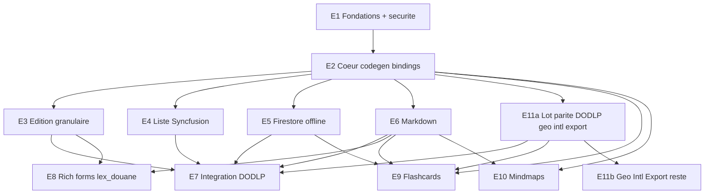

# Épics & Stories — zcrud

Backlog séquencé transformant les 25 FR du PRD et les 16 AD de l'architecture en unités implémentables. Chaque story porte des critères d'acceptation testables et référence FR/AD/SM. Détails exhaustifs : voir grounding. *(Révisé après le contrôle de complétude 2026-07-09 : lot parité E11a avancé, bindings multi-gestionnaire, sécurité clé Maps, gate CI, découpage des stories surdimensionnées, AC a11y/erreur.)*

## Séquencement & dépendances

**Phases :** **MVP** = E1→E8 (incl. **E11a**). **v1.x** = E9, E10, **E11b**. Toute dépendance de phase est déclarée (E7 et E9 dépendent de E11a ; plus d'inversion MVP↔post-MVP).

---

## E1 — Fondations du monorepo, outillage & sécurité
**Objectif :** workspace melos opérationnel, gates CI, et traitement immédiat du secret fuité. **Packages :** tous. **Couvre :** FR-24, FR-25 · AD-1, AD-12 · SM-6. **Dépend de :** — · **Phase :** MVP.

- **Story E1-1. Workspace melos + resolution workspace.** AC : `melos.yaml` + `pubspec.yaml` racine (`resolution: workspace`) listant les 14 packages ; `melos bootstrap` résout sans conflit ; Dart `^3.12.2`.
- **Story E1-2. Squelettes de packages avec API/barrel.** AC : chaque package compile ; impl sous `src/` ; graphe déclaré acyclique (AD-1) ; `zcrud_core` sans dépendance Firebase/Syncfusion/Maps ni gestionnaire d'état.
- **Story E1-3. Lint, analyse, build_runner & gates CI (SM-6).** En tant que mainteneur, la qualité et l'hygiène sont vérifiées à chaque push. AC : `analysis_options` partagé ; scripts melos (`analyze`/`test`/`build_runner`) ; CI GitHub Actions ; **gate anti-`reflectable`** dans le moteur (lint custom) ; **scan de secrets** (échoue si clé/token committé) ; **contrôle codegen** (pas de modèle annoté sans `.g.dart`).
- **Story E1-4. Gate de compatibilité de dépendances (FR-25).** AC : dry-run de résolution (flutter_quill + awesome_select + analyzer) contre le workspace lex_douane réussit ; versions documentées (Stack de l'architecture).
- **Story E1-5. 🔴 Révocation de la clé Google Maps fuitée (immédiat, AD-12).** En tant que responsable sécurité, la clé commitée en clair dans DODLP/DLCFTI est neutralisée **avant tout autre travail**. AC : la clé exposée est **révoquée/restreinte** (vérifié : ancienne clé invalide) ; procédure d'injection par config plateforme documentée ; découplé du package `zcrud_geo` (post-MVP). *Owner : Zakarius. Échéance : sprint 1.*

## E2 — Cœur : contrats, modèle canonique, codegen & bindings d'état
**Objectif :** `zcrud_core` (contrats + `ZFormController` + seams) + `zcrud_annotations`/`zcrud_generator` + les bindings multi-gestionnaire. **Couvre :** FR-9, FR-10, FR-11, FR-12, FR-22 · AD-3, AD-4, AD-5, AD-6, AD-10, AD-11, AD-14, AD-15, AD-16. **Dépend de :** E1 · **Phase :** MVP.
> *Ordre intra-épic pour débloquer E3 au plus tôt : E2-1 → E2-2 → E2-7 → E2-9 (réactivité/injection) avant E2-4/E2-5 (codegen complet).*

- **Story E2-1. Contrats de base (ZEntity/ZNode/ZSyncable/ZFailure/ZSyncMeta).** AC : Dart pur, aucun import Flutter/Firebase ; `ZFailure` avec `==`/`hashCode` ; `Either<ZFailure,T>` (dartz) (AD-11).
- **Story E2-2. Ports données (`ZRepository<T>`, `DataRequest`/`ZQuery` incl. curseur, `ZDataState`, `ZAcl`).** AC : contrats neutres backend-agnostiques ; aucun type `cloud_firestore` (AD-5) ; `Stream<List<T>>` nus ; **pagination curseur** et **port `ZAcl`** exprimés dans le contrat neutre (AD-16).
- **Story E2-3. Registre & extensibilité (`ZcrudRegistry`/`ZTypeRegistry`/`ZSourceRegistry`).** AC : `register(kind, fromJson, toJson)` ; type non enregistré → throw ; slot `ZExtension` (formatVersion, `fromJsonSafe→null`) + `extra: Map` (AD-4).
- **Story E2-4. Annotations (`@ZcrudModel`/`@ZcrudField`/`@ZcrudId`).** AC : couvrent label/type/validators/config/choices/condition/`searchable` ; aucune dépendance runtime.
- **Story E2-5. Générateur build_runner.** AC : génère `toMap/fromMap/copyWith` + `ZFieldSpec[]` + enregistrement ; **zéro reflectable** ; enums `unknownEnumValue` ; snake_case/camelCase ; **copyWith avec sentinelle** (reset-null possible) ; round-trip testé (AD-3, AD-10) ; échec explicite si type non enregistré.
- **Story E2-6. Adaptateurs de schéma existant (`ZCodec`/`ReflectableCodec`/`JsonSerializableAdapter`).** AC : expose une entité `@JsonSerializable` (lex_douane) ou reflectable (DODLP) comme `ZcrudModel` sans réécrire ; freezed non requis (FR-11).
- **Story E2-7. Réactivité Flutter-native (`ZFormController`) + seams d'injection.** AC : `ZFormController` (`ChangeNotifier`) expose une `ValueListenable` par champ ; **aucun gestionnaire d'état importé** ; seams `throw` par défaut, résolus via `ZcrudScope` (InheritedWidget, défaut) ; cœur ne référence jamais `WidgetRef`/`Get.find`/`Provider.of` (AD-2, AD-6, AD-15).
- **Story E2-8. l10n, thème & RTL injectables.** AC : delegate générique sans ressources métier ; registre de libellés ; pas de singleton statique mutable ; zéro dépendance à `lex_localizations`/`go_router` (AD-13, FR-23) ; **thème injectable** `ZcrudTheme`/`ThemeExtension` via `ZcrudScope`, **aucun** style codé en dur, repli sur `Theme.of(context)` (FR-26).
- **Story E2-9. Bindings multi-gestionnaire (`zcrud_riverpod`, `zcrud_get`, `zcrud_provider`).** En tant qu'intégrateur, je branche l'injection/cycle de vie sur mon manager. AC : chaque binding fournit création/scoping/dispose du `ZFormController` et résolution des seams selon son idiome ; **un même controller + un test de rebuild granulaire identique** passe sous les 3 bindings **et** sous `ZcrudScope` seul (AD-15). Le cœur reste inchangé pour ajouter un manager.
- **Story E2-10. Gate de test rétro-compatibilité de sérialisation (AD-10).** AC : suite CI de désérialisation défensive sur documents **historiques/tronqués/champs inconnus** — le parent ne casse jamais ; fait partie du gate de merge (rattaché à E1-3).

## E3 — Moteur DynamicEdition à rebuilds granulaires
**Objectif :** moteur d'édition qui **corrige le bug de rebuild** (objectif produit n°1). **Couvre :** FR-1..FR-5 · AD-2 · SM-1. **Dépend de :** E2 · **Phase :** MVP.

- **Story E3-1. Rendu d'un champ = widget écoutant sa tranche (`ValueListenableBuilder`).** AC : `EditionFormNotifier`/`ZFormController` immuable ; **aucun** `setState` global ; test widget : taper 100 caractères ne reconstruit que le champ courant (SM-1) ; **edge case UJ-2** : perte de connexion pendant la saisie → l'état du `ZFormController` n'est pas reconstruit/perdu.
- **Story E3-2. Controllers & keys stables, validation ciblée.** AC : `TextEditingController` créé une fois (create/dispose), jamais recréé ni ré-injecté ; `ValueKey(field.name)` ; `AutovalidateMode.onUserInteraction` ; validateurs mémoïsés ; focus/curseur préservés (FR-1).
- **Story E3-3a. Dispatcher de champs + familles de base.** AC : `ZFieldWidget` par type pour les familles **texte/nombre/date/booléen/select/relation** ; aucun type de ces familles ne tombe dans un `default` ; **AC a11y/RTL par-widget** : `Semantics`, cibles ≥ 48 dp, `EdgeInsetsDirectional`/`TextAlign.start` (AD-13, FR-23).
- **Story E3-3b. Familles avancées & sous-listes.** AC : widgets pour **sous-liste/`subItems`, `dynamicItem`, tags, rowChips, rating/slider/signature/couleur, stepper, widget libre** ; types dont le widget vit ailleurs (markdown→E6, géo/tél→E11a) servis via `ZTypeRegistry` ; même exigence a11y/RTL qu'E3-3a ; **test a11y de référence sur le catalogue**.
- **Story E3-4. Sections repliables, champs conditionnels, mode lecture, grille responsive.** AC : `displayCondition` via place stable ; visibilité dérivée par sélecteur ; `readOnly`+`showIfNull` ; grille 12 colonnes xs..xl ; **AC a11y/RTL** sur la grille (insets directionnels) (FR-3, AD-13).
- **Story E3-5. Stepper multi-étapes (même `ZFormController`).** AC : les étapes sectionnent le même controller (pas de `FormBuilder` global — AD-2) ; validation par étape via `form_builder_validators` ; état préservé entre étapes ; **aucun rebuild global** re-vérifié (SM-1).
- **Story E3-6. Soumission create/update + détection dirty + états UI.** AC : validation puis hook `onSubmit` app ; callbacks/Widgets non sérialisés ; empreinte dirty + confirmation d'abandon ; **états accessibles** : `submit-in-progress`, échec de soumission (message via AsyncValue.error, AD-11).

## E4 — Moteur DynamicList (zcrud_list, Syncfusion par défaut)
**Objectif :** liste/tableau dérivés du `ZFieldSpec[]`, Syncfusion isolé. **Couvre :** FR-6..FR-8 · AD-8, AD-11, AD-16. **Dépend de :** E2 · **Phase :** MVP.

- **Story E4-1. `ZListRenderer` (port) + backend SfDataGrid par défaut.** AC : `zcrud_core` n'expose que l'abstraction ; rendu Syncfusion dans `zcrud_list` ; sans `zcrud_list` → pas de Syncfusion (AD-8, SM-5).
- **Story E4-2. Colonnes dérivées du schéma + vues (liste/DataGrid/custom) + états UI.** AC : colonnes issues du `ZFieldSpec[]` ; `itemBuilder`/`customView` ; **états accessibles** : `loading`, `empty`, `no-results-après-filtre`, `error`.
- **Story E4-3. Recherche, filtres, tri, pagination curseur.** AC : recherche sans accents sur champs `searchable` ; filtres/tri via `DataRequest` ; pagination curseur (AD-16) ; **cas d'erreur** : curseur invalide ou backend sans curseur → repli in-memory documenté, pas de crash.
- **Story E4-4. Actions ligne + `ZAcl`, sélection multiple, corbeille.** AC : actions filtrées par `ZAcl` (AD-16) ; sélection multiple fonctionnelle (bug corrigé) ; corbeille soft-delete.
- **Story E4-5. Sous-listes/relations & onglets (étend FR-6).** AC : `ZSubListScreen` mini-CRUD imbriqué ; onglets de catégorisation. *(Capacité de §4.2 du PRD, rattachée à FR-6.)*

## E5 — Backend Firestore & offline-first (zcrud_firestore)
**Objectif :** adaptateur Firestore débogué + patron offline-first. **Couvre :** FR-12, FR-13 · AD-5, AD-9, AD-11. **Dépend de :** E2 · **Phase :** MVP.

- **Story E5-1. `FirebaseZRepositoryImpl<T>` + traduction `DataRequest→Filter`.** AC : withConverter, streams, count, softDelete/restore ; **bugs corrigés** : réassignation `limit`, batch/transaction cohérents, pas de `catch(_){}`, `null ≠ erreur` ; curseur `startAfter` implémenté (AD-16).
- **Story E5-2. `ZLocalStore` (Hive) + `ZRemoteStore`.** AC : store local source de vérité (JSON) ; abstraction permettant Isar/Drift ultérieur (déféré) (AD-5).
- **Story E5-3. Patron offline-first LWW + soft-delete + `ZSyncMeta`.** AC : merge LWW sur `updatedAt` ; `is_deleted` hors-entité standardisé ; cascade bornée (AD-9).
- **Story E5-4. `ZSyncOrchestrator`.** AC : déclenche `sync()` des dépôts enregistrés (login/reconnexion débouncée), best-effort ; sépare quand/comment ; `Right(unit)` si déconnecté ; **cas d'erreur** : échec partiel (un dépôt échoue) → les autres continuent, erreur tracée, pas d'arrêt global (AD-9).

## E6 — Markdown & rich text (zcrud_markdown)
**Objectif :** éditeur/lecteur riches + embeds, codec pluggable. **Couvre :** FR-14, FR-15 · AD-7, AD-2. **Dépend de :** E2 · **Phase :** MVP.

- **Story E6-1. Éditeur Quill + champ rich-text à controller isolé.** AC : `ZMarkdownField` avec controller propre remontant par callback (conforme AD-2) ; toolbar presets.
- **Story E6-2. `ZCodec` pluggable (Delta/Markdown/HTML).** AC : Delta interne ; format persisté par défaut documenté, surchargeable par codec (AD-7) ; round-trip testé : listes imbriquées, formules, tables, entités HTML (SM-4).
- **Story E6-3. Embed LaTeX.** AC : insertion/édition/rendu (`flutter_math_fork`, repli optionnel) ; sérialisé dans le format canonique ; **cas d'erreur** : formule malformée → repli sûr (placeholder), pas de crash (AD-10).
- **Story E6-4. Embed tableau.** AC : insertion/édition/rendu de tableaux ; sérialisé ; `flutter_tex`/`html_editor_enhanced` optionnels derrière drapeau ; **cas d'erreur** : embed table corrompu → repli sûr (AD-10).

## E11a — Lot parité DODLP (sous-ensemble MVP de geo/intl/export)
**Objectif :** fournir, **avant E7**, les champs et l'export requis par la parité DODLP (SM-2). **Couvre :** FR-20 (partiel), FR-21 (partiel), FR-8-export (partiel) · AD-12, AD-8. **Dépend de :** E2 · **Phase :** MVP.

- **Story E11a-1. `zcrud_geo` (sous-ensemble) : `ZGeoShape` + champ géo/carte.** AC : modèle agnostique SDK ; **aucune clé API dans le package** (config plateforme, dépend de E1-5) ; adaptateur Google **ou** OSM suffisant pour la parité DODLP (AD-12, FR-20).
- **Story E11a-2. `zcrud_intl` (sous-ensemble) : téléphone/pays/adresse.** AC : champs téléphone international + pays + adresse à parité DODLP ; constantes en assets JSON paresseux (FR-21).
- **Story E11a-3. `zcrud_export` (sous-ensemble) : export DataGrid Excel/PDF.** AC : export tabulaire Syncfusion pour la liste ; retrait de tout `badCertificateCallback=>true` (AD-12).
> *Alternative documentée (au cas par cas, cf. PRD SM-2) : si un type reste servi par le widget DODLP existant via `ZTypeRegistry`, la story correspondante est marquée « parité par enregistrement » et sortie du lot.*

## E7 — Intégration DODLP (banc d'essai prioritaire)
**Objectif :** DODLP importe zcrud sans casser GetX/reflectable/Firebase, **sans ajouter Riverpod**. **Couvre :** UJ-1, UJ-2 · SM-2. **Dépend de :** E3, E4, E5, E6, **E11a** · **Phase :** MVP.

- **Story E7-1. Binding `zcrud_get` + `ZcrudScope` pour DODLP.** AC : injection via `zcrud_get` (GetX/`get_it`) ; resolver délègue à `getIt<DodlpController>()` ; permissions/toast/config/l10n branchés ; **flutter_riverpod non ajouté** (AD-15, AD-6).
- **Story E7-2. `ReflectableCodec` + `ZcrudRegistry` au bootstrap.** AC : DODLP conserve sa réflexion sans lister ses modèles ; registre injecté après `registerServices()` ; init 2 apps Firebase préservée (FR-11).
- **Story E7-3. Migration des écrans génériques + imports (par lots).** AC : re-pointage des imports **par lots** ; après chaque lot, **l'app compile et les tests passent** ; code dupliqué de `src/` supprimé au fur et à mesure. *(Découpée : chaque lot est une unité de sprint, pas les 180 fichiers d'un coup.)*
- **Story E7-4. Vérification de parité (SM-2).** AC : **checklist type-par-type** du catalogue figé (inventaire §3) à parité — géo/tél/pays servis par E11a ou via `ZTypeRegistry` ; édition d'un formulaire long **sans perte de focus** (UJ-2) ; sélection liste fonctionnelle ; export préservé (E11a-3).

## E8 — Intégration formulaires riches lex_douane_admin
**Objectif :** remplacer des écrans hand-rolled par le moteur zcrud. **Couvre :** UJ-3 · SM-3. **Dépend de :** E3, E6 · **Phase :** MVP.

- **Story E8-1. Binding `zcrud_riverpod` + adaptateur d'entités lex_douane.** AC : injection via `zcrud_riverpod` (`ProviderScope`) ; entités `@JsonSerializable` exposées via `ZCodec`, sans second modèle ; `Either<Failure,T>` respecté (AD-15).
- **Story E8-2. Migration de ≥3 écrans admin (article/code/tec).** AC : `DynamicEditionScreen` piloté par `ZFieldSpec` ; champ Markdown avec table + formule ; RTL/a11y (≥48 dp, `Semantics`) ; `*.g.dart` générés ; `ConsumerWidget` uniquement.
- **Story E8-3. Non-régression de résolution & contraintes lex.** AC : gate de compat OK (FR-25) ; zéro dépendance zcrud à `lex_localizations`/`go_router` ; reflectable exclu (SM-3).

## E9 — Flashcards (zcrud_flashcard) — v1.x
**Objectif :** modèles canoniques SRS, additifs pour lex_douane. **Couvre :** FR-16..FR-18 · AD-4, AD-9, AD-10. **Dépend de :** E2, E5, E6, **E11a** (export flashcard PDF, optionnel) · **Phase :** v1.x.

- **Story E9-1. `ZFlashcard` + `ZChoice` + `ZFlashcardType` + provenance registre.** AC : 6 types ; état SRS **hors** carte ; éphémère matérialisé par le dépôt ; variant « article » via `ZSourceRegistry` ; **porte les slots d'extension `extra` + `ZExtension?`** (AD-4).
- **Story E9-2. SRS pluggable (`ZSrsScheduler`, SuperMemo-2 par défaut).** AC : `ZRepetitionInfo` séparé ; seule voie d'écriture `reviewCard()→apply` ; `ZSrsConfig` ; interface remplaçable (FR-17).
- **Story E9-3. Dossiers & sessions d'étude.** AC : `ZStudyFolder` rattachement inverse (2 niveaux validés au repo) ; `ZStudySession` filtres mode/tags/types/count (FR-18) ; `ZStudyFolder` **porte `extra` + `ZExtension?`** (AD-4).
- **Story E9-4. Dépôt offline-first `ZFlashcard` + invariant SRS.** AC : offline-first (E5) ; **invariant** : le SRS (`ZRepetitionInfo`) est persisté en collection **top-level**, jamais dans le sous-arbre partageable de la carte (canonique §2.7, §7) ; **cas d'erreur** : carte éphémère sauvegardée sans dossier → `Left(DomainFailure)`.
- **Story E9-5. Édition & widgets additifs pour lex_douane.** AC : widgets paramétrés par l'entité de l'app ; **ne remplace pas** le module « Étude » (UJ-4).

## E10 — Cartes mentales (zcrud_mindmap) — v1.x
**Objectif :** modèle/tree-ops/vue, additifs pour lex_douane. **Couvre :** FR-19 · AD-4, AD-13. **Dépend de :** E2, E6 · **Phase :** v1.x.

- **Story E10-1. `ZMindmapNode`/`ZMindmap` + `ZMindmapTreeOps`.** AC : arbre par nesting + `level` ; add/update/delete/find **+ move/indent/outdent** (ajoutés) avec recalcul de `level` (FR-19, OQ-5, OQ-10) ; `ZMindmapNode` **porte `data`/`ZExtension?`** d'extension (AD-4).
- **Story E10-2. `ZMindmapView` (graphite auto-layout + vue liste a11y).** AC : `graphite` auto-layout zoom/pan ; vue liste sémantique indentée = surface a11y ; `nodeContentBuilder` injectable (AD-13).
- **Story E10-3. Éditeur outline corrigé.** AC : sauvegarde applique réellement les modifications (bug lex corrigé).

## E11b — Reste géo / intl / export — v1.x/v2
**Objectif :** compléter au-delà du lot parité MVP. **Couvre :** FR-20, FR-21, FR-8-export (reste) · AD-12. **Dépend de :** E11a · **Phase :** v1.x/v2.

- **Story E11b-1. `zcrud_geo` complet : polygone/cercle + 2ᵉ adaptateur (Google **et** OSM), `GeoFieldConfig`.** AC : édition point/polygone/cercle ; les deux adaptateurs ; aucun défaut national codé en dur non surchargeable.
- **Story E11b-2. `zcrud_intl` complet : devise + états + surcharges.** AC : devise, états/provinces ; défauts nationaux surchargeables.
- **Story E11b-3. `zcrud_export` complet : PDF documents + `FileSaveHelper` web.** AC : `PdfCreationService` unique dédupliqué ; version web `FileSaveHelper` implémentée (AD-12).

---

## Notes de séquencement

- **Chemin critique MVP :** E1 → E2 → (E3 ∥ E4 ∥ E5 ∥ E6 ∥ E11a) → E7 → E8.
- **E3 (rebuild) et E7 (DODLP)** portent la valeur la plus visible (SM-1, SM-2). Ordre intra-E2 (E2-1/2/7/9 avant E2-4/5) pour débloquer E3 tôt.
- **E11a est dans le MVP** (parité DODLP) ; E11b, E9, E10 en v1.x. Toutes les dépendances de phase sont déclarées (plus d'inversion).
- **Valeur des épics d'habilitation :** E1/E2 sont techniques mais **livrent une valeur d'intégrateur explicite** (un package importable, un modèle qui génère tout) — légitime pour un produit-développeur.
- **Gate d'implémentation :** relancer `bmad-check-implementation-readiness` après remédiation, puis créer les stories détaillées par `bmad-create-story` au fil du sprint.
