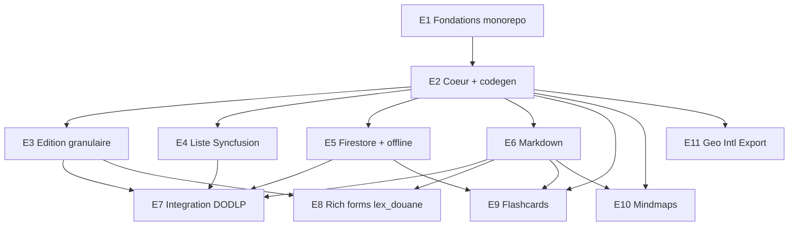

# Épics & Stories — zcrud

Backlog séquencé transformant les 25 FR du PRD et les 14 AD de l'architecture en unités implémentables. Chaque story porte des critères d'acceptation testables et référence FR/AD/SM. Détails exhaustifs : voir grounding.

## Séquencement & dépendances

**Phases :** **MVP** = E1→E8 (cœur + moteurs + backend + markdown + intégration DODLP + rich forms lex_douane). **v1.x** = E9, E10 (flashcards/mindmaps, additifs lex_douane). **v1.x/v2** = E11.

---

## E1 — Fondations du monorepo & outillage
**Objectif :** workspace melos opérationnel avec squelettes de packages, lint, codegen, CI. **Packages :** tous. **Couvre :** FR-24, FR-25 · AD-1. **Dépend de :** — · **Phase :** MVP.

- **Story E1-1. Workspace melos + resolution workspace.** En tant que mainteneur, je peux bootstrapper tous les packages d'un coup.
  - AC : `melos.yaml` + `pubspec.yaml` racine (`resolution: workspace`) listant les 12 packages ; `melos bootstrap` résout sans conflit ; Dart `^3.12.2`.
- **Story E1-2. Squelettes de packages avec API/barrel.** En tant que dev, chaque package a `lib/<pkg>.dart` + `lib/src/{domain,data,presentation}`.
  - AC : chaque package compile vide ; l'implémentation est sous `src/` ; le graphe de dépendances déclaré respecte AD-1 (acyclique, `zcrud_core` sans dépendance zcrud/lourde).
- **Story E1-3. Lint, analyse, build_runner, CI.** En tant que mainteneur, la qualité est vérifiée à chaque push.
  - AC : `analysis_options` partagé ; `dart analyze` propre ; scripts melos (`analyze`, `test`, `build_runner`) ; CI GitHub Actions exécute analyze+test sur le workspace.
- **Story E1-4. Gate de compatibilité de dépendances (FR-25).** En tant qu'intégrateur, je vérifie la résolution avant intégration.
  - AC : un dry-run de résolution (flutter_quill + awesome_select + analyzer) contre le workspace lex_douane réussit ; versions documentées (Stack de l'architecture).

## E2 — Cœur : contrats, modèle canonique & codegen
**Objectif :** `zcrud_core` (contrats + seams) + `zcrud_annotations` + `zcrud_generator` avec extensibilité. **Couvre :** FR-9, FR-10, FR-11, FR-12, FR-22, FR-23 · AD-3, AD-4, AD-5, AD-6, AD-10, AD-11, AD-14. **Dépend de :** E1 · **Phase :** MVP.

- **Story E2-1. Contrats de base (ZEntity/ZNode/ZSyncable/ZFailure/ZSyncMeta).** AC : Dart pur, aucun import Flutter/Firebase ; `ZFailure` hiérarchie avec `==`/`hashCode` ; `Either<ZFailure,T>` (dartz) adopté (AD-11).
- **Story E2-2. Port `ZRepository<T>` + `DataRequest`/`ZQuery` + `ZDataState`.** AC : contrats neutres backend-agnostiques ; aucun type `cloud_firestore` (AD-5) ; `Stream<List<T>>` nus ; pagination curseur exprimable (FR-7).
- **Story E2-3. Registre & extensibilité (`ZcrudRegistry`/`ZTypeRegistry`/`ZSourceRegistry`).** AC : `register(kind, fromJson, toJson)` ; type non enregistré → throw explicite ; slot `ZExtension` (formatVersion, `fromJsonSafe→null`) + `extra: Map` sur les entités (AD-4).
- **Story E2-4. Annotations (`@ZcrudModel`/`@ZcrudField`/`@ZcrudId`).** AC : couvrent label/type/validators/config/choices/condition ; aucune dépendance runtime.
- **Story E2-5. Générateur build_runner.** En tant que dev, j'annote une entité et j'obtiens la (dé)sérialisation, le `ZFieldSpec[]` et l'enregistrement.
  - AC : génère `toMap/fromMap/copyWith` + `ZFieldSpec[]` + appel registre ; **zéro reflectable** ; enums avec `unknownEnumValue` ; snake_case persistance / enums camelCase ; round-trip testé (AD-3, AD-10) ; échec explicite si type non enregistré.
- **Story E2-6. Adaptateurs de schéma existant (`ZCodec`/`ReflectableCodec`).** En tant qu'intégrateur, je branche une entité `@JsonSerializable` (lex_douane) ou reflectable (DODLP) sans réécrire.
  - AC : un `ZCodec` expose une entité existante comme `ZcrudModel` ; `ReflectableCodec` sert DODLP ; freezed non requis (FR-11).
- **Story E2-7. Injection framework-neutre (`ZcrudScope` + seams).** AC : seams `throw` par défaut, surchargeables via `ProviderScope` **ou** `ZcrudScope` ; `zcrud_core` sans conteneur ; jamais `containerOf` (AD-6).
- **Story E2-8. l10n générique injectable + RTL.** AC : delegate générique sans ressources métier ; registre de libellés ; pas de singleton statique mutable ; zéro dépendance à `lex_localizations`/`go_router` (AD-13, FR-23).

## E3 — Moteur DynamicEdition à rebuilds granulaires
**Objectif :** le moteur d'édition qui **corrige le bug de rebuild** (objectif produit n°1). **Couvre :** FR-1..FR-5 · AD-2 · SM-1. **Dépend de :** E2 · **Phase :** MVP.

- **Story E3-1. Notifier de formulaire + champ = ConsumerWidget ciblé.** AC : `EditionFormNotifier` (état immuable) ; un champ observe `select(name)` ; **aucun** `setState` global ; test widget : taper 100 caractères ne reconstruit que le champ courant (SM-1).
- **Story E3-2. Controllers & keys stables, validation ciblée.** AC : `TextEditingController` créé une fois (initState/dispose), jamais recréé ni ré-injecté ; `ValueKey(field.name)` ; `AutovalidateMode.onUserInteraction` ; validateurs mémoïsés ; focus/curseur préservés (FR-1).
- **Story E3-3. Dispatcher de champs + widgets par type (catalogue ~37).** En tant que dev, tout `EditionFieldType` a un widget dédié.
  - AC : chaque type du catalogue DODLP rendu par un `ZFieldWidget` const-constructible ; aucun type ne tombe dans un `default` silencieux ; type inconnu servi via registre (FR-2).
- **Story E3-4. Sections repliables, champs conditionnels, mode lecture, grille responsive.** AC : `displayCondition` masque via place stable (pas de retrait d'Element) ; visibilité dérivée par sélecteur ; `readOnly`+`showIfNull` ; grille 12 colonnes xs..xl (FR-3).
- **Story E3-5. Stepper multi-étapes enveloppé.** AC : arbre stepper dans un unique conteneur de formulaire (bug de validation corrigé) ; état préservé entre étapes (FR-4, OQ-4).
- **Story E3-6. Soumission create/update + détection dirty.** AC : validation globale puis hook `onSubmit` app ; callbacks/Widgets non sérialisés ; empreinte dirty ; confirmation d'abandon (FR-5).

## E4 — Moteur DynamicList (zcrud_list, Syncfusion par défaut)
**Objectif :** liste/tableau dérivés du `ZFieldSpec[]`, Syncfusion isolé. **Couvre :** FR-6..FR-8 · AD-8, AD-11. **Dépend de :** E2 · **Phase :** MVP.

- **Story E4-1. `ZListRenderer` (port) + backend SfDataGrid par défaut.** AC : `zcrud_core` n'expose que l'abstraction ; le rendu Syncfusion vit dans `zcrud_list` ; un consommateur sans `zcrud_list` ne tire pas Syncfusion (AD-8, SM-5).
- **Story E4-2. Colonnes dérivées du schéma + vues (liste/DataGrid/custom).** AC : colonnes issues du `ZFieldSpec[]` (une définition, OQ-8) ; `itemBuilder`/`customView`.
- **Story E4-3. Recherche, filtres, tri, pagination curseur.** AC : recherche sans accents ; filtres/tri via `DataRequest` ; pagination curseur (repli in-memory documenté) (FR-7, FR-9-curseur).
- **Story E4-4. Actions ligne + ACL, sélection multiple, corbeille.** AC : actions filtrées par `ZAcl` ; sélection multiple fonctionnelle (bug corrigé) ; corbeille soft-delete (FR-8).
- **Story E4-5. Sous-listes/relations & onglets.** AC : `ZSubListScreen` mini-CRUD imbriqué ; onglets de catégorisation.

## E5 — Backend Firestore & offline-first (zcrud_firestore)
**Objectif :** adaptateur Firestore débogué + patron offline-first. **Couvre :** FR-12, FR-13 · AD-5, AD-9, AD-11. **Dépend de :** E2 · **Phase :** MVP.

- **Story E5-1. `FirebaseZRepositoryImpl<T>` + traduction `DataRequest→Filter`.** AC : withConverter, streams, count, softDelete/restore ; **bugs corrigés** : réassignation `limit`, batch/transaction cohérents, pas de `catch(_){}`, `null ≠ erreur`.
- **Story E5-2. `ZLocalStore` (Hive) + `ZRemoteStore`.** AC : store local source de vérité (JSON) ; abstraction permettant Isar/Drift ultérieur (déféré) (AD-5).
- **Story E5-3. Patron offline-first LWW + soft-delete + `ZSyncMeta`.** AC : merge Last-Write-Wins sur `updatedAt` ; `is_deleted` hors-entité standardisé ; cascade bornée (AD-9).
- **Story E5-4. `ZSyncOrchestrator`.** AC : déclenche `sync()` des dépôts enregistrés (login/reconnexion débouncée), best-effort ; sépare quand/comment ; `Right(unit)` si déconnecté.

## E6 — Markdown & rich text (zcrud_markdown)
**Objectif :** éditeur/lecteur riches + embeds, codec pluggable. **Couvre :** FR-14, FR-15 · AD-7, AD-2. **Dépend de :** E2 · **Phase :** MVP.

- **Story E6-1. Éditeur Quill + champ rich-text à controller isolé.** AC : `ZMarkdownField` avec controller propre remontant par callback (conforme AD-2) ; toolbar presets (full/minimal/markdown).
- **Story E6-2. `ZCodec` pluggable (Delta/Markdown/HTML).** AC : édition en Delta interne ; (dé)sérialisation via codec choisi par l'app ; round-trip testé : listes imbriquées, formules, tables, entités HTML (AD-7, SM-4).
- **Story E6-3. Embed LaTeX.** AC : insertion/édition/rendu (`flutter_math_fork`, repli optionnel) ; sérialisé dans le format canonique (FR-15).
- **Story E6-4. Embed tableau.** AC : insertion/édition/rendu de tableaux ; sérialisé ; `flutter_tex`/`html_editor_enhanced` optionnels derrière drapeau (OQ-6).

## E7 — Intégration DODLP (banc d'essai prioritaire)
**Objectif :** DODLP importe zcrud sans casser reflectable/GetX/Firebase. **Couvre :** UJ-1, UJ-2 · SM-2. **Dépend de :** E3, E4, E5, E6 · **Phase :** MVP.

- **Story E7-1. `ZcrudScope` mode locator pour DODLP.** AC : resolver délègue à `getIt<DodlpController>()` ; permissions/toast/config/l10n branchés ; sans Riverpod (AD-6).
- **Story E7-2. `ReflectableCodec` + `ZcrudRegistry` au bootstrap.** AC : DODLP conserve sa réflexion sans lister ses modèles ; registre injecté après `registerServices()` ; init 2 apps Firebase préservée (FR-11).
- **Story E7-3. Migration des écrans génériques + 180 imports.** AC : imports re-pointés par lots vers `package:zcrud_*` ; code dupliqué de `src/` supprimé ; l'app compile à chaque étape.
- **Story E7-4. Vérification de parité (SM-2).** AC : ~37 types de champs à parité ; édition d'un formulaire long **sans perte de focus** (UJ-2) ; sélection liste fonctionnelle ; export préservé.

## E8 — Intégration formulaires riches lex_douane_admin
**Objectif :** remplacer des écrans hand-rolled par le moteur zcrud. **Couvre :** UJ-3 · SM-3. **Dépend de :** E3, E6 · **Phase :** MVP.

- **Story E8-1. Adaptateur d'entités lex_douane (`@JsonSerializable`) vers `ZcrudModel`.** AC : via `ZCodec`, sans imposer de second modèle ; `Either<Failure,T>` respecté.
- **Story E8-2. Migration de ≥3 écrans admin (article/code/tec).** AC : `DynamicEditionScreen` piloté par `ZFieldSpec` ; champ Markdown avec table + formule ; RTL/a11y ; `*.g.dart` générés ; `ConsumerWidget` uniquement.
- **Story E8-3. Non-régression de résolution & contraintes lex.** AC : gate de compat OK (FR-25) ; zéro dépendance zcrud à `lex_localizations`/`go_router` ; reflectable exclu (SM-3).

## E9 — Flashcards (zcrud_flashcard) — v1.x
**Objectif :** modèles canoniques SRS, additifs pour lex_douane. **Couvre :** FR-16..FR-18 · AD-4, AD-9, AD-10. **Dépend de :** E2, E5, E6 · **Phase :** v1.x.

- **Story E9-1. `ZFlashcard` + `ZChoice` + `ZFlashcardType` + provenance registre.** AC : 6 types ; état SRS **hors** carte ; éphémère matérialisé par le dépôt ; variant « article » via `ZSourceRegistry` (non codé dans le package) (AD-4).
- **Story E9-2. SRS pluggable (`ZSrsScheduler`, SM-2 par défaut).** AC : `ZRepetitionInfo` séparé ; seule voie d'écriture `reviewCard()→apply` ; `ZSrsConfig` ; interface remplaçable (FSRS/Leitner) (FR-17).
- **Story E9-3. Dossiers & sessions d'étude.** AC : `ZStudyFolder` rattachement inverse (2 niveaux validés au repo) ; `ZStudySession` filtres mode/tags/types/count (FR-18).
- **Story E9-4. Édition & widgets additifs pour lex_douane.** AC : widgets paramétrés par l'entité de l'app ; offline-first ; **ne remplace pas** le module « Étude » (UJ-4).

## E10 — Cartes mentales (zcrud_mindmap) — v1.x
**Objectif :** modèle/tree-ops/vue, additifs pour lex_douane. **Couvre :** FR-19 · AD-4, AD-13. **Dépend de :** E2, E6 · **Phase :** v1.x.

- **Story E10-1. `ZMindmapNode`/`ZMindmap` + `ZMindmapTreeOps`.** AC : arbre par nesting + `level` ; add/update/delete/find **+ move/indent/outdent** (ajoutés) avec recalcul de `level` (FR-19, OQ-5, OQ-10).
- **Story E10-2. `ZMindmapView` (auto-layout + vue liste a11y).** AC : graphite auto-layout zoom/pan ; vue liste sémantique indentée = surface a11y ; `nodeContentBuilder` injectable (AD-13).
- **Story E10-3. Éditeur outline corrigé.** AC : sauvegarde applique réellement les modifications (bug lex corrigé).

## E11 — Champs spécialisés & export (zcrud_geo, zcrud_intl, zcrud_export) — v1.x/v2
**Objectif :** champs à dépendances lourdes isolés, sans secret. **Couvre :** FR-20, FR-21, FR-8-export · AD-12. **Dépend de :** E2 · **Phase :** v1.x/v2.

- **Story E11-1. `zcrud_geo` : `ZGeoShape` + adaptateurs Google/OSM.** AC : modèle agnostique SDK ; **aucune clé API dans le package** (config plateforme) ; adaptateurs optionnels (AD-12, FR-20).
- **Story E11-2. `zcrud_intl` : téléphone/pays/devise en assets.** AC : constantes en assets JSON paresseux (pas de const 2 Mo) ; défauts nationaux surchargeables (FR-21).
- **Story E11-3. `zcrud_export` : PDF/Excel dédupliqué.** AC : `PdfCreationService` unique ; export DataGrid ; suppression du `badCertificateCallback=>true` ; version web `FileSaveHelper` implémentée (FR-8-export, AD-12).

---

## Notes de séquencement

- **Chemin critique MVP :** E1 → E2 → (E3 ∥ E4 ∥ E5 ∥ E6) → E7 → E8.
- **E3 (rebuild) et E7 (DODLP)** portent la valeur la plus visible (SM-1, SM-2) : prioriser E2 juste ce qu'il faut pour débloquer E3.
- **E9/E10** ne bloquent pas le MVP mais sont des besoins explicites (flashcards/mindmaps lex_douane) — ne pas oublier.
- **Gate d'implémentation :** lancer `bmad-check-implementation-readiness` avant E3, puis créer les stories détaillées par `bmad-create-story` au fil du sprint.
