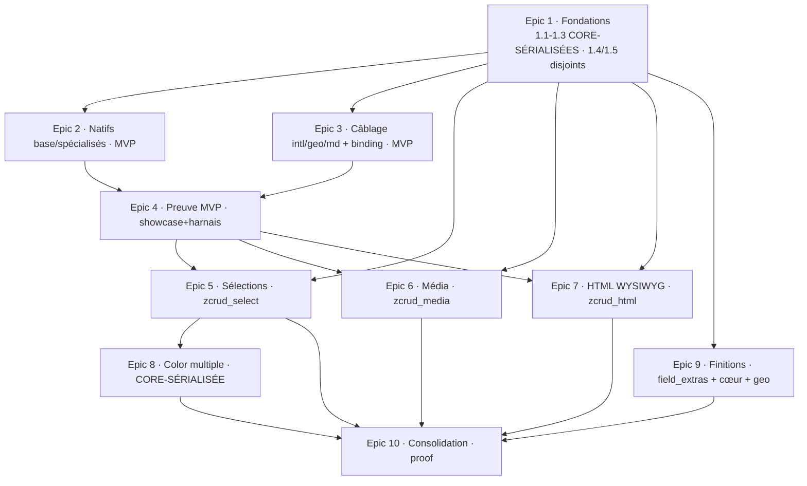

# zcrud — « Formulaire : parité DODLP totale » — Epic Breakdown

## Overview

Ce document décompose le PRD `prd-zcrud-form-parity-2026-07-18` (40 FR, 9 NFR) et le spine
`ARCHITECTURE-SPINE.md` (AD-47..56 + hérités AD-1..46) en **10 epics** et **41 stories**, organisés
**par phase** (`[MVP]` → `[Média-rich]` → `[Finitions]`) puis **par package/capacité**, conformément
au phasage PRD §6 et à la carte capacité→architecture du spine.

**Nature de l'itération** : présentationnelle et d'assemblage, pas une réécriture. L'étude a prouvé que
le gros des familles de champ est **déjà natif** dans `zcrud_core` ; le travail restant est
**confirmation + câblage + une poignée de vrais gaps + preuve** (harnais + showcase + banc SM-1).

**Règle de séquencement structurante (verrouillée, PRD §Constraints + AD-47/52/53)** : toute story
qui **écrit `zcrud_core`** de façon structurelle (nouvelle valeur d'enum, nouveau type de valeur,
seam, tokens) est **sérialisée** — une seule à la fois touche le cœur. Ces stories sont marquées
**`CORE-SÉRIALISÉE`**. Les satellites disjoints (`zcrud_select`, `zcrud_html`, `zcrud_media`,
`zcrud_field_extras`, `zcrud_geo`) sont **parallélisables** entre eux (fichiers disjoints, ≤ 3 en vol).

## Requirements Inventory

### Functional Requirements

- **FR-1** `[MVP]` — text / multiline / password (natif, polir). *[Matrice #1,#2,#37]*
- **FR-2** `[MVP]` — number (mode %) / integer / float (devise) (natif, polir). *[#3,#4,#5]*
- **FR-3** `[MVP]` — boolean (switch/toggle accessible). *[#6]*
- **FR-4** `[MVP]` — dateTime / time (pickers Material natifs, ISO-8601). *[#7,#8]*
- **FR-5** `[MVP]` — **`dateRange`** net-new (`ZDateRange{start,end}`, `showDateRangePicker`). *[§2 P1]*
- **FR-6** `[Média-rich]` — select (modal S2 responsive + recherche). *[#9]*
- **FR-7** `[Média-rich]` — radio en modal (`radioAsModal`). *[#10]*
- **FR-8** `[Média-rich]` — checkbox / multiselect. *[#11]*
- **FR-9** `[Média-rich]` — relation + CRUD inline (`crudDataSelect`). *[#12]*
- **FR-10** `[MVP]` — rowChips (ChoiceChip mono-choix). *[#13]*
- **FR-11** `[MVP]` — tags (saisie libre, bouton `+` ≥ 48 dp). *[#14]*
- **FR-12** `[MVP]` — subItems mini-CRUD + **réordonnancement** (supérieur DODLP). *[#15]*
- **FR-13** `[Finitions]` — subItems variante `itemsAreTags` (`ZSubListDisplayMode.tags`). *[#15b]*
- **FR-14** `[MVP]` — dynamicItem (sous-formulaire `DeepAttribute`). *[#16]*
- **FR-15** `[Média-rich]` — file (bottom-sheet multi-sources + zone de dépôt + open). *[#17]*
- **FR-16** `[Média-rich]` — image (galerie / caméra + recadrage). *[#18]*
- **FR-17** `[Média-rich]` — document (scan → PDF). *[#19]*
- **FR-18** `[Média-rich]` — vignette vidéo. *[§média]*
- **FR-19** `[MVP]` — color simple (+ roue HSV/opacité via seam binding). *[#28]*
- **FR-20** `[Média-rich]` — color multiple (`ZColorConfig.multiple`, `List<int>` ARGB). *[#28b]*
- **FR-21** `[MVP]` — markdown / inlineMarkdown / richText (câblage `zcrud_markdown`). *[#30,#31,#35]*
- **FR-22** `[Média-rich]` — html / inlineHtml WYSIWYG (édition, `zcrud_html`). *[#32,#34]*
- **FR-23** `[Média-rich]` — rendu HTML natif en lecture (`flutter_html`). *[#32b]*
- **FR-24** `[MVP]` — phoneNumber (câblage `zcrud_intl`). *[#22]*
- **FR-25** `[MVP]` — country (câblage `zcrud_intl`). *[#23]*
- **FR-26** `[MVP]` — address (câblage `zcrud_intl`, présent). *[#24]*
- **FR-27** `[MVP]` — location (`zcrud_geo`). *[#20]*
- **FR-28** `[Finitions]` — geoArea + UI style-picker fill/stroke. *[#21]*
- **FR-29** `[MVP]` — rating (étoiles, max configurable, toggle-clear). *[#25]*
- **FR-30** `[MVP]` — slider (min/max/divisions). *[#26]*
- **FR-31** `[MVP]` — signature (strokes vectoriels, 0 dép). *[#27]*
- **FR-32** `[MVP]` — stepper / sections (`ZStepperConfig`). *[#36]*
- **FR-33** `[MVP]` — seams hidden / widget / custom (`ZWidgetRegistry`/`ZTypeRegistry`). *[#38,#39,#40]*
- **FR-34** `[Finitions]` — PIN (`pinput`). *[§hors-enum]*
- **FR-35** `[Finitions]` — autocomplétion. *[§hors-enum]*
- **FR-36** `[Finitions]` — table éditable virtualisée. *[§hors-enum]*
- **FR-37** `[Finitions]` — icon picker (registre d'icônes). *[#29]*
- **FR-38** `[MVP]` — tokens d'aération `ZcrudTheme` + 3 écarts tranchés. *[§aération]*
- **FR-39** `[MVP]`(incrémental) — harnais ≥ 6 formulaires DODLP dans `example/`. *[§5.2]*
- **FR-40** `[MVP]`(incrémental) — showcase exhaustive tous types × variantes × états. *[§5.1]*

### NonFunctional Requirements

- **NFR-1** — SM-1 / AD-2 / AD-15 : rebuild granulaire par tranche ; seam ne livre que
  `ctx.value`/`ctx.onChanged` ; WebView WYSIWYG isolée sans casser les voisins ; jamais de `setState`
  d'écran ni de `TextEditingController` recréé.
- **NFR-2** — AD-1 : **CORE OUT=0** ; tout adaptateur tiers hors `zcrud_core` (satellite/binding),
  vérifié par grep sur `zcrud_core/pubspec.yaml`.
- **NFR-3** — AD-13 : RTL directionnel, `Semantics`, ≥ 48 dp, `ListView.builder`, Reduce Motion.
- **NFR-4** — FR-26 : thème/l10n injectés ; aucune couleur/libellé codé en dur ; aération = tokens dp.
- **NFR-5** — AD-10 : désérialisation défensive de tout nouveau type de valeur ; schéma additif seulement.
- **NFR-6** — AD-3 : codegen source-unique ; `*.g.dart` de `packages/*/lib/` régénérés/commités ;
  test rétro-compat de sérialisation vert (gate `codegen-distribution`).
- **NFR-7** — non-régression visuelle prouvée par le harnais ; 3 écarts d'aération tranchés.
- **NFR-8** — migrations ETL app-side (`signature` PNG→strokes non réversible ; `phoneNumber`
  String→E.164) : **hors packages zcrud**, à planifier côté app (pas d'epic zcrud).
- **NFR-9** — poids des deps confiné en satellite ; chaque satellite neuf justifié en architecture.

### Additional Requirements *(dérivées du spine AD-47..56)*

- **AR-1 (AD-49)** — vendoring `awesome_select` comme **membre de workspace melos privé**
  (`packages/awesome_select/`, `publish_to: none`), résolu offline, sous nos gates, MIT conservée.
- **AR-2 (AD-48)** — abstraction Material-free **`ZSelectPresenter`** dans `zcrud_core`, résolue via
  `ZcrudScope` ; défaut = modal natif ; familles natives délèguent au présentateur injecté.
- **AR-3 (AD-51/50/53)** — **squelettes** des nouveaux satellites `zcrud_select`, `zcrud_html`,
  `zcrud_media`, `zcrud_field_extras` (membres workspace, barrels `lib/<pkg>.dart`, pubspecs, gates).
- **AR-4 (AD-55)** — le **binding `zcrud_get`** est le point de composition unique : détient LE
  `ZWidgetRegistry`, appelle une seule fois chaque `registerZ<Pkg>Fields`, injecte les seams (registre
  injecté via `ZcrudScope`, jamais un singleton statique).
- **AR-5 (AD-50)** — `zcrud_html` et `zcrud_markdown` enregistrent `html`/`inlineHtml` de façon
  **mutuellement exclusive** (collision `register` = `throw`) ; l'app choisit une voie au bootstrap.
- **AR-6 (AD-56)** — harnais + showcase dans `example/` uniquement, données fictives, zéro secret,
  aucune dépendance backend DODLP ; `example/` est un puits (rien ne dépend de lui).
- **AR-7 (AD-52)** — la roue HSV (`flex_color_picker`) reste **côté binding** via `ZcrudScope.colorPicker`.

### UX Design Requirements

Aucun contrat UX bmad-ux (`DESIGN.md`/`EXPERIENCE.md`) dans `{planning_artifacts}` pour cette
itération. Les exigences visuelles/UX pertinentes sont portées par le PRD (FR-38 aération, 3 écarts ;
états transverses read-only/désactivé/erreur/RTL/thème du showcase FR-40) et par les invariants a11y/RTL
(NFR-3). Pas de section UX-DR distincte requise.

### FR Coverage Map

| FR | Epic.Story | FR | Epic.Story |
|---|---|---|---|
| FR-1 | 2.1 | FR-21 | 3.1 |
| FR-2 | 2.1 | FR-22 | 7.1 |
| FR-3 | 2.1 | FR-23 | 7.2 |
| FR-4 | 2.1 | FR-24 | 3.2 |
| FR-5 | 1.1 | FR-25 | 3.2 |
| FR-6 | 5.1 | FR-26 | 3.2 |
| FR-7 | 5.2 | FR-27 | 3.3 |
| FR-8 | 5.2 | FR-28 | 9.7 |
| FR-9 | 5.3 | FR-29 | 2.3 |
| FR-10 | 2.2 | FR-30 | 2.3 |
| FR-11 | 2.2 | FR-31 | 2.3 |
| FR-12 | 2.2 | FR-32 | 2.3 |
| FR-13 | 9.6 | FR-33 | 2.4 |
| FR-14 | 2.2 | FR-34 | 9.2 |
| FR-15 | 6.1 | FR-35 | 9.3 |
| FR-16 | 6.2 | FR-36 | 9.4 |
| FR-17 | 6.3 | FR-37 | 9.5 |
| FR-18 | 6.4 | FR-38 | 1.2 |
| FR-19 | 2.4 | FR-39 | 4.2 · 5.4 · 6.5 · 7.3 · 10.2 |
| FR-20 | 8.1 | FR-40 | 4.1 · 5.4 · 6.5 · 7.3 · 8.1 · 9.8 · 10.1 |

**Couverture : 40/40 FR.** Aucun FR non couvert. Seul non-goal assumé : LaTeX fallback SVG
`flutter_tex` (Matrice #33), hors périmètre par conception (placeholder thémé, cf. PRD §5).

## Epic List

### Epic 1: Fondations transverses (cœur + squelettes + vendoring) `[MVP-substrate]`
Pose le substrat dont dépendent tous les adaptateurs : le type `dateRange` natif, les tokens
d'aération, le seam `ZSelectPresenter`, les squelettes des 4 satellites neufs, et le vendoring
`awesome_select`. **Enables** tous les epics suivants.
**FRs covered:** FR-5, FR-38 (+ AR-1, AR-2, AR-3).

### Epic 2: Champs natifs de base & spécialisés `[MVP]`
Confirme, polit et câble les familles déjà natives de `zcrud_core` (texte/numérique/booléen/date,
chips/tags/subItems/dynamicItem, rating/slider/signature/stepper, color simple, seams). Aucune
dépendance tierce ajoutée.
**FRs covered:** FR-1, FR-2, FR-3, FR-4, FR-10, FR-11, FR-12, FR-14, FR-19, FR-29, FR-30, FR-31,
FR-32, FR-33.

### Epic 3: Câblage des satellites existants & point de composition binding `[MVP]`
Établit le binding `zcrud_get` comme point de composition unique et y câble markdown + intl + geo
(satellites déjà présents ; l'essentiel est `registry.register(kind, …)`).
**FRs covered:** FR-21, FR-24, FR-25, FR-26, FR-27 (+ AR-4).

### Epic 4: Preuve MVP — showcase & harnais (tranche native/câblée) `[MVP]`
Livre le socle de preuve : page showcase (champs MVP + états transverses + banc SM-1) et harnais des
axes MVP (dense+SM-1, intl/géo, spécialisés/imbriqués). Incrémental : les axes lourds arrivent avec
leurs epics.
**FRs covered:** FR-40 (socle), FR-39 (axes 1/5/6).

### Epic 5: Sélections riches (`zcrud_select` + fork `awesome_select`) `[Média-rich]`
Fournit le présentateur `ZSelectPresenter` adossé au fork vendorisé (`SmartSelect` : modal S2 +
recherche + CRUD inline) et câble les familles select/radio/checkbox/relation.
**FRs covered:** FR-6, FR-7, FR-8, FR-9 (+ contribue FR-39 axe 2, FR-40).

### Epic 6: Média & fichiers (`zcrud_media`) `[Média-rich]`
Nouveau satellite média implémentant le contrat cœur `ZFilePicker`/`ZFileSource` : multi-sources,
caméra, recadrage, scan→PDF, vignette vidéo.
**FRs covered:** FR-15, FR-16, FR-17, FR-18 (+ contribue FR-39 axe 3, FR-40).

### Epic 7: Rich-text HTML WYSIWYG (`zcrud_html`) `[Média-rich]`
Nouveau satellite isolant la WebView WYSIWYG (controller isolé, SM-1 tenu) et le rendu HTML en lecture,
en exclusivité mutuelle avec la voie markdown.
**FRs covered:** FR-22, FR-23 (+ contribue FR-39 axe 4, FR-40).

### Epic 8: Couleur multiple (cœur additif) `[Média-rich]`
Ajoute la variante native `ZColorConfig.multiple` au cœur (additive, sérialisée, défensive).
**FRs covered:** FR-20 (+ contribue FR-40).

### Epic 9: Champs de Finitions (`zcrud_field_extras` + cœur additif + geo) `[Finitions]`
Comble les gaps de finition net-new : PIN, autocomplétion, table éditable, icon (satellite
`zcrud_field_extras`), plus `subItems.itemsAreTags` (cœur) et le style-picker `geoArea` (`zcrud_geo`).
**FRs covered:** FR-13, FR-28, FR-34, FR-35, FR-36, FR-37 (+ contribue FR-40).

### Epic 10: Parité totale — consolidation showcase & harnais `[Finitions/proof]`
Assemble et valide la preuve complète : showcase des 40 types × variantes × états (gaps étiquetés
ABSENT), harnais des 6 axes, benchs SM-1/SM-2/SM-3/SM-4 verts.
**FRs covered:** FR-39 (complet), FR-40 (complet).

---

## Epic 1: Fondations transverses (cœur + squelettes + vendoring)

Pose le substrat commun. Les 3 premières stories **écrivent `zcrud_core`** et sont **sérialisées**
(une seule à la fois). Les stories 1.4/1.5 sont sur des packages neufs disjoints, parallélisables
entre elles et avec Epic 2 une fois le cœur au repos.

### Story 1.1: `dateRange` natif au cœur

As a développeur consommateur de zcrud,
I want déclarer un champ `dateRange` produisant une valeur `ZDateRange{start, end}`,
So that je peux saisir une plage de dates de validité sans adopter `table_calendar`.

**Marquage :** `[MVP]` · **CORE-SÉRIALISÉE** · Binds **AD-47**, NFR-2/5/6, AD-13.

**Acceptance Criteria:**

**Given** l'enum `EditionFieldType` du cœur
**When** on ajoute la valeur `dateRange` (camelCase, près de `dateTime`/`time`)
**Then** `zcrud_generator` émet le `ZFieldSpec` correspondant, les `*.g.dart` de `packages/*/lib/` sont
régénérés et commités, et le test de rétro-compat de sérialisation est vert.

**Given** une valeur `ZDateRange{start, end}` (domaine pur, ISO-8601)
**When** elle est (dé)sérialisée
**Then** l'invariant `end >= start` est validé, `fromJsonSafe → null` sur entrée corrompue (AD-10),
`null` toléré si le champ est optionnel, et un parent ne throw jamais sur une plage absente/corrompue.

**Given** un champ `dateRange` monté dans un formulaire
**When** l'utilisateur ouvre le picker
**Then** `ZDateRangeFieldWidget` (sous `ZFieldListenableBuilder`) utilise `showDateRangePicker` natif
(aucune dep `table_calendar`/`date_time_picker`), est directionnel (AD-13), et **CORE OUT=0** reste
vérifié par grep sur `zcrud_core/pubspec.yaml`.

### Story 1.2: Tokens d'aération `ZcrudTheme` + 3 écarts tranchés

As a développeur consommateur,
I want appliquer les mesures d'aération DODLP via des tokens `ThemeExtension` injectés,
So that je reproduis l'aération sans recopier des constantes ni coder une couleur en dur.

**Marquage :** `[MVP]` · **CORE-SÉRIALISÉE** · Binds **AD-54**, NFR-3/4.

**Acceptance Criteria:**

**Given** le `ThemeExtension` `ZcrudTheme` du cœur
**When** un binding pose les valeurs d'aération
**Then** les mesures sont des **tokens dp directionnels** (`EdgeInsetsDirectional`), les couleurs
dérivent toujours du `ColorScheme` (aucune `Color(0xFF…)` littérale portée de DODLP).

**Given** les 3 écarts d'aération connus
**When** ils sont tranchés dans le cœur
**Then** (1) `ZResponsiveGrid.runGutter` est ajouté (additif, replié sur `gutter` si `null`) ;
(2) le spacer inter-champ reste la projection zcrud (`zFieldGapAfter`), le binding pose
`interFieldGap: 12` ; (3) `ZcrudTheme.formPadding` (défaut `EdgeInsetsDirectional.all(12)`) est
consommé par `DynamicEdition` quand `padding == null`.

**Given** l'en-tête « boîte grise » `MyStickyHeader` de DODLP
**When** on rend une section
**Then** un header sobre thémé est utilisé par défaut (parité fonctionnelle) ; la parité visuelle
stricte reste OQ-1 (owner), non implémentée par défaut.

### Story 1.3: Seam `ZSelectPresenter` au cœur + délégation des familles natives

As a mainteneur zcrud,
I want une abstraction Material-free `ZSelectPresenter` résolue via `ZcrudScope`,
So that un satellite peut fournir un modal riche pour select/radio/relation sans modifier le cœur.

**Marquage :** `[Média-rich-prep]` · **CORE-SÉRIALISÉE** · Binds **AD-48**, NFR-1/2.

**Acceptance Criteria:**

**Given** `zcrud_core` sans dépendance lourde
**When** on déclare `ZSelectPresenter` (patron `ZListRenderer`/`ZcrudScope.colorPicker`)
**Then** l'abstraction vit dans le cœur, le défaut est le **modal natif zcrud actuel**, et **CORE
OUT=0** reste vérifié.

**Given** les familles natives `ZSelectFieldWidget`/`ZRelationFieldWidget` pré-routées par `familyOf`
**When** un présentateur est injecté via `ZcrudScope`
**Then** ces familles **délèguent** au présentateur injecté ; sinon elles conservent le rendu natif ;
le `ZWidgetRegistry` n'est jamais détourné pour ces familles de base (évite le double propriétaire).

### Story 1.4: Squelettes des 4 satellites neufs

As a mainteneur zcrud,
I want les squelettes de `zcrud_select`, `zcrud_html`, `zcrud_media`, `zcrud_field_extras`,
So that les adaptateurs de parité ont un emplacement conforme avant d'être écrits.

**Marquage :** `[MVP-substrate]` · parallélisable (packages disjoints) · Binds AD-50/51/53, NFR-2.

**Acceptance Criteria:**

**Given** le workspace melos
**When** on crée les 4 packages
**Then** chacun est membre du workspace, expose un barrel `lib/<pkg>.dart`, un `pubspec.yaml`
dépendant **uniquement** de `zcrud_core` (aucune dep lourde encore, ou confinée à l'impl), et passe
`melos analyze`/`verify` repo-wide, secrets, `codegen-distribution`.

**Given** la direction de dépendance
**When** on inspecte le graphe
**Then** chaque arête va vers `zcrud_core` ; le graphe reste acyclique ; **CORE OUT=0** inchangé.

### Story 1.5: Vendoring `packages/awesome_select` (membre workspace privé)

As a mainteneur zcrud,
I want vendoriser le fork `awesome_select` comme membre de workspace privé,
So that je supprime la dépendance git à `ref: master` flottant et soumets ce code à nos gates.

**Marquage :** `[Média-rich-prep]` · parallélisable (feuille privée) · Binds **AD-49**, NFR-2/9.

**Acceptance Criteria:**

**Given** le source du fork
**When** il entre sous `packages/awesome_select/` avec `publish_to: none`
**Then** il résout **offline** sous notre tag, est versionné avec nos releases, passe les mêmes gates
repo (analyze, CORE OUT=0, secrets, `codegen-distribution`), et conserve la licence **MIT** (fichier
`LICENSE` + attribution).

**Given** la surface publique
**When** on inspecte les dépendants
**Then** le vendor est dépendu **uniquement** par `zcrud_select` (à venir), et aucun type
`awesome_select` ne fuit dans une signature publique (AD-40).

---

## Epic 2: Champs natifs de base & spécialisés

Confirmation + polissage cosmétique par thème + câblage des familles déjà natives. Ces stories
touchent la **présentation de `zcrud_core`** (pas d'ajout structurel d'enum) ; elles sont séquencées
après les stories cœur d'Epic 1 et entre elles (un seul workstream sur la présentation cœur à la fois).

### Story 2.1: Champs texte, numériques, booléen, date (confirmés & polis)

As a développeur consommateur,
I want les champs text/multiline/password, number(%)/integer/float(devise), boolean, dateTime/time,
So that mes formulaires de base rendent à parité DODLP sans jank ni perte de focus.

**Marquage :** `[MVP]` · Binds FR-1, FR-2, FR-3, FR-4 ; NFR-1/3/4.

**Acceptance Criteria:**

**Given** un champ à saisie (text/multiline/password/number/integer/float)
**When** l'utilisateur tape 100 caractères
**Then** seul le champ courant se reconstruit (banc SM-1), zéro perte de focus, le
`TextEditingController` n'est pas recréé au rebuild, et les validateurs `form_builder_validators`
s'appliquent en `AutovalidateMode.onUserInteraction` par champ.

**Given** `number` en mode pourcentage / `float` en affichage devise
**When** il est rendu
**Then** le suffixe `%` / la devise dérivent de la locale/thème injecté (jamais codés), sans altérer la
valeur persistée.

**Given** `boolean` et `dateTime`/`time`
**When** ils sont rendus
**Then** le switch a une cible ≥ 48 dp et un `Semantics` d'état on/off ; les dates utilisent les
pickers Material natifs en ISO-8601 (aucune dep `date_time_picker`/`table_calendar`) ; le delta
cosmétique vs le pill switch DODLP est absorbé par `SwitchThemeData`.

### Story 2.2: Puces, tags, listes imbriquées & sous-formulaire

As a développeur consommateur,
I want rowChips, tags, subItems (avec réordonnancement) et dynamicItem,
So that je rends les collections et sous-formulaires DODLP, avec un réordo supérieur à DODLP.

**Marquage :** `[MVP]` · Binds FR-10, FR-11, FR-12, FR-14 ; NFR-3/4.

**Acceptance Criteria:**

**Given** `rowChips` et `tags`
**When** ils sont rendus
**Then** `rowChips` est mono-choix (`ChoiceChip`) ; `tags` offre un bouton `+` explicite ≥ 48 dp ;
aucune dépendance `flutter_tags` ; l'écart de style est ajustable via `ZcrudTheme`.

**Given** `subItems`
**When** l'utilisateur réordonne un item
**Then** le réordonnancement monter/descendre (`_move()`) fonctionne (écart **supérieur** à DODLP),
sans dépendance `drag_and_drop_lists`, en carte + dialog.

**Given** `dynamicItem`
**When** il est rendu
**Then** le sous-formulaire dynamique (`DeepAttribute`) s'édite dans la granularité de rebuild du
parent (AD-2).

### Story 2.3: rating, slider, signature, stepper

As a développeur consommateur,
I want rating, slider, signature et stepper/sections,
So that je couvre les champs spécialisés « 0 dépendance » et le layout en étapes de DODLP.

**Marquage :** `[MVP]` · Binds FR-29, FR-30, FR-31, FR-32 ; NFR-3.

**Acceptance Criteria:**

**Given** `rating` et `slider`
**When** ils sont rendus
**Then** `rating` a un max configurable, un toggle-clear et un `Semantics` (supérieur à l'ad-hoc
DODLP) ; `slider` respecte min/max/divisions ; aucune couleur codée en dur.

**Given** `signature`
**When** l'utilisateur signe
**Then** la capture est en **strokes vectoriels** (0 dépendance, pas de `package:signature`) ;
*(note : la migration PNG DODLP → strokes est un ETL app-side non réversible, NFR-8, hors story)*.

**Given** `stepper`/sections
**When** un formulaire les regroupe
**Then** `ZStepperConfig` (paramètre de `DynamicEdition`) répare le bug DODLP `indicatorSize` et rend
les sections directionnellement.

### Story 2.4: color simple + seams hidden/widget/custom

As a développeur consommateur,
I want color simple (avec seam roue HSV optionnel) et les seams hidden/widget/custom,
So that je couvre la couleur mono et les points d'extension du moteur.

**Marquage :** `[MVP]` · Binds FR-19, FR-33 ; NFR-1/2, AD-4.

**Acceptance Criteria:**

**Given** `color` simple
**When** il est rendu
**Then** le picker natif `ZColorFieldWidget` (sliders HSV + hex + récents) fonctionne, et la roue
HSV/opacité de référence (`flex_color_picker`) reste accessible **via le seam
`ZcrudScope.colorPicker` côté binding**, jamais dans le cœur (NFR-2).

**Given** `hidden`, `widget`, `custom`
**When** ils sont déclarés
**Then** `hidden` n'est pas rendu, `widget` monte un builder libre, `custom` est résolu via
`ZWidgetRegistry`/`ZTypeRegistry` ; le builder ne reçoit que `ctx.value`/`ctx.onChanged`, jamais le
`ZFormController` (AD-2).

---

## Epic 3: Câblage des satellites existants & point de composition binding

Établit `zcrud_get` comme **point de composition unique** (AD-55) et y câble markdown/intl/geo. Ces
satellites existent ; le travail est le `register(kind, …)`. Stories parallélisables entre elles
(satellites disjoints) une fois 3.1 posé le registre du binding.

### Story 3.1: Point de composition binding + câblage markdown

As a intégrateur d'app (DODLP/GetX),
I want que le binding détienne LE `ZWidgetRegistry` et y enregistre markdown,
So that j'ai un point unique d'enrôlement et le rich-text Delta câblé.

**Marquage :** `[MVP]` · Binds FR-21 ; AR-4 (AD-55), AD-7.

**Acceptance Criteria:**

**Given** le binding `zcrud_get`
**When** l'app bootstrap
**Then** le binding **construit et détient** le `ZWidgetRegistry`, l'injecte via `ZcrudScope` (jamais
un singleton statique, AD-4), et appelle **une seule fois** chaque `registerZ<Pkg>Fields` ; une double
registration d'un même `kind` **throw**.

**Given** `zcrud_markdown`
**When** `registerZMarkdownFields` est appelé
**Then** `markdown`/`inlineMarkdown`/`richText` sont rendus (toolbar, LaTeX, table, dialog plein
écran), chaque éditeur rich-text a un **controller isolé** (AD-7/AD-2), et une formule LaTeX hors
sous-ensemble `flutter_math_fork` rend un **placeholder thémé** (pas de crash, pas de `flutter_tex`).

### Story 3.2: Câblage intl — phoneNumber, country, address

As a intégrateur d'app,
I want phoneNumber/country/address câblés depuis `zcrud_intl`,
So that mes formulaires intl DODLP rendent sans réécriture de widget.

**Marquage :** `[MVP]` · Binds FR-24, FR-25, FR-26 ; NFR-3/4, OQ-3/OQ-4 (défauts).

**Acceptance Criteria:**

**Given** `zcrud_intl` (widgets présents)
**When** le binding appelle le câblage
**Then** `registry.register('phoneNumber', …)` (manquant aujourd'hui) est ajouté ; le sélecteur pays
est un **panneau inline par défaut** (OQ-3), le validateur national Togo **chiffres nus `length:8`**
par défaut (OQ-4) ; *(migration String→`ZPhoneNumber` E.164 = ETL app-side, NFR-8, hors story)*.

**Given** `country` et `address`
**When** ils sont rendus
**Then** `country` (`ZCountryFieldWidget`, zéro dep tierce) a sa couverture l10n JSON vérifiée (aucune
dep `country_picker`) ; `address` (`ZAddressFieldWidget`, auto-enregistré `'address'`/`'addressSearch'`)
est confirmé présent (pas un gap).

### Story 3.3: Câblage geo — location

As a intégrateur d'app,
I want `location` câblé depuis `zcrud_geo`,
So that je rends un point géographique dans mes formulaires.

**Marquage :** `[MVP]` · Binds FR-27 ; NFR-2/3.

**Acceptance Criteria:**

**Given** `zcrud_geo`
**When** le binding câble `location`
**Then** un point géographique est saisissable, le satellite reste isolé (CORE OUT=0), et aucun secret
(clé Maps) n'est embarqué dans un package (AD-12) — config plateforme de l'app.

---

## Epic 4: Preuve MVP — showcase & harnais (tranche native/câblée)

Socle de preuve incrémental dans `example/` (AR-6/AD-56). N'exerce **que** des champs déjà livrés
(Epics 1-3) — aucune dépendance vers un epic futur.

### Story 4.1: Showcase — socle + champs MVP + états transverses + banc SM-1

As a owner (Zakarius),
I want une page showcase démontrant les champs MVP dans tous leurs états,
So that j'audite la complétude et je dispose du banc SM-1.

**Marquage :** `[MVP]` · Binds FR-40 (socle) ; SM-1/SM-4, NFR-1/3.

**Acceptance Criteria:**

**Given** la page showcase dans `example/`
**When** on l'ouvre
**Then** chaque champ MVP livré (Epics 1-3) est démontré avec ses états transverses (read-only,
désactivé, erreur, valeur initiale, conditionnel, **RTL**, **thème clair/sombre**), et les gaps non
encore livrés (`select` modal, média, WYSIWYG, `dateRange` tant que non fusionné, color multiple,
icon, `itemsAreTags`) sont **étiquetés « ABSENT / à combler »**, jamais masqués.

**Given** un formulaire de frappe intensive
**When** l'utilisateur tape 100 caractères
**Then** seul le champ courant se reconstruit, zéro perte de focus (banc **SM-1** prouvé, test widget +
profiling).

### Story 4.2: Harnais — axes MVP (dense+SM-1, intl/géo, spécialisés/imbriqués)

As a dev DODLP (Bilal),
I want ≥ 3 formulaires DODLP répliqués couvrant les axes MVP,
So that je prouve l'absence de régression visuelle sur les familles natives/câblées.

**Marquage :** `[MVP]` · Binds FR-39 (axes 1/5/6) ; SM-3, NFR-7 ; OQ-7 (shortlist).

**Acceptance Criteria:**

**Given** le harnais dans `example/`
**When** on ouvre les formulaires MVP
**Then** l'axe 1 (texte/nombre/date dense + SM-1), l'axe 5 (intl/géo : phone/country/location) et
l'axe 6 (spécialisés/imbriqués : rating/slider/signature/color/subItems+réordo) sont couverts avec des
**données fictives**, zéro secret, aucune dépendance backend DODLP.

**Given** la référence DODLP
**When** on compare côte à côte
**Then** aucun écart visuel **bloquant** n'apparaît hors les 3 écarts d'aération tranchés (FR-38) ; la
shortlist des formulaires est figée sur « couverture max types × axes » (OQ-7).

---

## Epic 5: Sélections riches (`zcrud_select` + fork `awesome_select`)

Dépend d'Epic 1 (vendor 1.5 + seam `ZSelectPresenter` 1.3). Satellite disjoint → parallélisable avec
Epics 6/7.

### Story 5.1: Présentateur `zcrud_select` — select (choix unique, modal riche)

As a développeur consommateur,
I want un présentateur adossé au fork fournissant `select` en modal S2 responsive + recherche,
So that j'atteins la parité de sélection riche DODLP.

**Marquage :** `[Média-rich]` · Binds FR-6 ; AD-48/49, NFR-1/2.

**Acceptance Criteria:**

**Given** `zcrud_select` dépendant du vendor `awesome_select`
**When** il fournit le `ZSelectPresenter`
**Then** `select` rend un modal S2 responsive + recherche à parité DODLP, le builder ne reçoit que
`ctx.value`/`ctx.onChanged`, et aucun type `awesome_select` ne fuit en signature publique (AD-40) ;
**CORE OUT=0** vérifié.

**Given** le présentateur injecté via `ZcrudScope`
**When** aucun présentateur n'est injecté
**Then** la famille native retombe sur le modal natif zcrud (défaut AD-48).

### Story 5.2: radio en modal & checkbox / multiselect

As a développeur consommateur,
I want `radio` en modal et `checkbox`/`multiselect` via le présentateur,
So that je couvre les variantes de sélection modale et multiple de DODLP.

**Marquage :** `[Média-rich]` · Binds FR-7, FR-8 ; AD-48.

**Acceptance Criteria:**

**Given** `radio` avec `radioAsModal: true`
**When** il est rendu
**Then** la parité UX modal (vs `RadioListTile` inline DODLP) est démontrée dans le harnais.

**Given** `checkbox`/`multiselect`
**When** ils sont rendus via `SmartSelect`
**Then** le choix multiple fonctionne et est exposé en showcase et dans un formulaire du harnais.

### Story 5.3: relation + CRUD inline (sources runtime)

As a développeur consommateur,
I want `relation` avec recherche modale et création/édition inline d'une entité liée,
So that je couvre `crudDataSelect` de DODLP.

**Marquage :** `[Média-rich]` · Binds FR-9 ; AD-48, AD-4.

**Acceptance Criteria:**

**Given** une source `crudDataSelect`
**When** elle est câblée
**Then** la source et le CRUD sont enregistrés au **runtime** via
`ZRelationSourceRegistry`/`ZRelationCrudRegistry` (jamais dans l'annotation `const`).

**Given** le CRUD inline
**When** l'utilisateur crée une entité liée
**Then** l'entité créée est retournée et **sélectionnée sans quitter** le formulaire parent.

### Story 5.4: Câblage binding sélections + showcase/harnais axe 2

As a intégrateur d'app,
I want le présentateur `select` composé par le binding et démontré,
So that l'axe de risque « sélections » du harnais est couvert et la showcase montre natif vs modal.

**Marquage :** `[Média-rich]` · Binds FR-6..9 (intégration) ; contribue FR-39 (axe 2), FR-40 ; AR-4.

**Acceptance Criteria:**

**Given** le binding `zcrud_get`
**When** il compose le `ZSelectPresenter` de `zcrud_select`
**Then** l'enrôlement est explicite au bootstrap (jamais un side-effect d'import), et la showcase
montre `select`/`radio`/`relation` **natif vs modal côte à côte**.

**Given** le harnais
**When** on ouvre le formulaire à sélections
**Then** l'axe 2 (`select`/`radio`/`relation`+`crudDataSelect`, `radioAsModal`) est couvert, et l'entrée
correspondante de la showcase passe de « ABSENT » à « livré ».

---

## Epic 6: Média & fichiers (`zcrud_media`)

Nouveau satellite (AD-51) implémentant le contrat cœur existant `ZFilePicker`/`ZFileSource`. API
publique en types neutres. Composé par le binding. Disjoint → parallélisable avec Epics 5/7.

### Story 6.1: `file` — bottom-sheet multi-sources + fichier avancé

As a utilisateur DODLP,
I want sélectionner/ouvrir un fichier via un bottom-sheet multi-sources et une zone de dépôt,
So that je couvre le champ `file` avancé de DODLP.

**Marquage :** `[Média-rich]` · Binds FR-15 ; AD-51, NFR-2/9.

**Acceptance Criteria:**

**Given** `zcrud_media` implémentant `ZFilePicker`
**When** l'utilisateur ouvre le sélecteur
**Then** un bottom-sheet multi-sources s'affiche, le fichier s'ouvre (`open_file`), une zone de dépôt
(`dotted_border`) est disponible, et l'API publique reste en types neutres (`Uint8List`, chemins) —
aucun type de plateforme public.

**Given** `zcrud_media`
**When** on inspecte ses dépendances
**Then** il dépend **uniquement** de `zcrud_core` ; les deps plateforme y sont confinées ; CORE OUT=0.

### Story 6.2: `image` — galerie / caméra + recadrage

As a utilisateur DODLP,
I want sélectionner une image (galerie multi-sélection, caméra) et la recadrer,
So that je couvre le champ `image` de DODLP.

**Marquage :** `[Média-rich]` · Binds FR-16 ; AD-51.

**Acceptance Criteria:**

**Given** le satellite média
**When** l'utilisateur choisit une image
**Then** galerie (multi-sélection), caméra et recadrage (`image_cropper`) fonctionnent via
l'adaptateur, jamais dans `zcrud_core`.

### Story 6.3: `document` — scan → PDF

As a utilisateur DODLP,
I want scanner un document et le convertir en PDF,
So that je couvre le champ `document` de DODLP.

**Marquage :** `[Média-rich]` · Binds FR-17 ; AD-51.

**Acceptance Criteria:**

**Given** `ZFileSource.scan`
**When** l'utilisateur scanne un document
**Then** le service PDF est câblé dans le satellite/binding (pas dans le cœur) et produit un PDF.

### Story 6.4: Vignette vidéo

As a utilisateur DODLP,
I want afficher une vignette d'un fichier vidéo sélectionné,
So that je visualise une vidéo sans lecteur complet.

**Marquage :** `[Média-rich]` · Binds FR-18 ; AD-51.

**Acceptance Criteria:**

**Given** un fichier vidéo sélectionné
**When** il est affiché
**Then** une vignette est générée via l'adaptateur média isolé (`video_thumbnail`), en type neutre.

### Story 6.5: Câblage binding média + showcase/harnais axe 3

As a intégrateur d'app,
I want le `ZFilePicker` média injecté par le binding et démontré,
So that l'axe « média » du harnais est couvert.

**Marquage :** `[Média-rich]` · Binds FR-15..18 (intégration) ; contribue FR-39 (axe 3), FR-40 ; AR-4.

**Acceptance Criteria:**

**Given** le binding `zcrud_get`
**When** il injecte l'implémentation média dans le seam
**Then** file/image/document/vidéo fonctionnent dans le harnais (axe 3) avec données fictives, et les
entrées de la showcase passent de « ABSENT » à « livré ».

---

## Epic 7: Rich-text HTML WYSIWYG (`zcrud_html`)

Nouveau satellite (AD-50) isolant la WebView. Exclusivité mutuelle avec la voie markdown (AR-5).
Disjoint → parallélisable avec Epics 5/6.

### Story 7.1: WYSIWYG HTML — édition (WebView à controller isolé)

As a utilisateur DODLP,
I want éditer du HTML en WYSIWYG,
So that j'atteins la parité rich-text HTML de DODLP.

**Marquage :** `[Média-rich]` · Binds FR-22 ; AD-50, NFR-1/2.

**Acceptance Criteria:**

**Given** `zcrud_html` enregistrant `html`/`inlineHtml` sur `ZWidgetRegistry`
**When** l'adaptateur monte
**Then** son `State` possède le `HtmlEditorController`/WebView **créé une seule fois** en `initState`
(jamais recréé au rebuild), avec `key: ValueKey('z-html-<field.name>')` (patron controller isolé AD-7).

**Given** l'utilisateur qui tape 100 caractères dans le WYSIWYG
**When** les champs voisins se reconstruisent
**Then** le `State` de la WebView **survit** aux rebuilds voisins, `ctx.onChanged` n'est poussé qu'au
`onChange`/blur **débouncé** (jamais synchrone à chaque frappe), la re-synchro depuis `ctx.value` ne se
fait que **hors focus**, et **SM-1 est tenu** (zéro perte de focus, aucun rebuild global).

**Given** un HTML corrompu en entrée
**When** l'éditeur charge
**Then** il rend un éditeur vide (AD-10 défensif), jamais un throw ; le paquet concret
(`html_editor_enhanced`/`html_editor_plus`) est abstrait par le satellite.

### Story 7.2: Rendu HTML natif (lecture) + round-trip borné

As a utilisateur DODLP,
I want afficher du HTML arbitraire en lecture,
So that je lis le contenu HTML hors édition.

**Marquage :** `[Média-rich]` · Binds FR-23 ; AD-50.

**Acceptance Criteria:**

**Given** du HTML arbitraire
**When** il est rendu en lecture (`flutter_html`)
**Then** le rendu se fait dans `zcrud_html` ; le format persisté est **HTML `String`** ; les pertes de
round-trip (code inline, styles CSS exotiques) sont **documentées et bornées**.

### Story 7.3: Exclusivité md/html au bootstrap + showcase/harnais axe 4

As a intégrateur d'app,
I want choisir une seule voie (markdown Delta xor html WYSIWYG) au bootstrap,
So that il n'y a jamais deux propriétaires de `html`/`inlineHtml`.

**Marquage :** `[Média-rich]` · Binds FR-22/23 (intégration) ; contribue FR-39 (axe 4), FR-40 ; AR-5.

**Acceptance Criteria:**

**Given** `zcrud_html` et `zcrud_markdown`
**When** les deux tentent d'enregistrer `html`/`inlineHtml`
**Then** la seconde registration **throw** (mutuellement exclusif) ; l'app choisit **une seule** voie
au bootstrap via le binding.

**Given** le harnais
**When** on ouvre le formulaire rich-text
**Then** l'axe 4 (`markdown`/LaTeX/table + `html`) est couvert, et l'entrée showcase passe de
« ABSENT » à « livré ».

---

## Epic 8: Couleur multiple (cœur additif)

Story cœur additive (AD-52), **CORE-SÉRIALISÉE**. Petit epic borné mais isolé du reste pour respecter
le phasage Média-rich et la sérialisation des écritures cœur.

### Story 8.1: `ZColorConfig.multiple` natif au cœur

As a développeur consommateur,
I want sélectionner plusieurs couleurs via une variante native `ZColorConfig.multiple`,
So that je couvre la variante `color` multiple de DODLP sans forker `color_picker_field`.

**Marquage :** `[Média-rich]` · **CORE-SÉRIALISÉE** · Binds FR-20 ; AD-52, NFR-5/6 ; contribue FR-40.

**Acceptance Criteria:**

**Given** `ZColorConfig`
**When** on ajoute la variante `multiple`
**Then** elle est **native** dans `zcrud_core` (picker built-in en boucle + case à cocher), la valeur
est `List<int>` ARGB, **sans** dépendance `color_picker_field` ; CORE OUT=0 préservé.

**Given** une liste ARGB corrompue en entrée
**When** elle est désérialisée
**Then** l'entrée corrompue est ignorée (parse défensif AD-10), jamais un throw ; la valeur est additive
(camelCase, `@JsonKey(unknownEnumValue:)` le cas échéant), le `ZFieldSpec` est émis, les `*.g.dart`
régénérés/commités, et le test rétro-compat est vert.

**Given** la showcase
**When** on l'ouvre
**Then** la variante `color` multiple est démontrée et son entrée passe de « ABSENT » à « livré ».

---

## Epic 9: Champs de Finitions (`zcrud_field_extras` + cœur additif + geo)

Comble les gaps net-new de Finitions. La story 9.1 (enum cœur) et 9.6 (`itemsAreTags` cœur) sont
**CORE-SÉRIALISÉES** ; 9.2-9.5 (satellite `zcrud_field_extras`) et 9.7 (`zcrud_geo`) sont
parallélisables entre elles. FR-13/FR-37 restent en repli `ZUnsupportedFieldWidget` **étiqueté ABSENT**
tant que non déclenchés (OQ-6) — leur implémentation est couverte ici si le owner les active.

### Story 9.1: Additions d'enum cœur (pin / autocomplete / editableTable)

As a mainteneur zcrud,
I want ajouter additivement les valeurs d'enum `pin`/`autocomplete`/`editableTable`,
So that le satellite `zcrud_field_extras` peut les servir par le registry.

**Marquage :** `[Finitions]` · **CORE-SÉRIALISÉE** · Binds FR-34/35/36 (prérequis) ; AD-53/52, NFR-5/6.

**Acceptance Criteria:**

**Given** `EditionFieldType`
**When** on ajoute `pin`/`autocomplete`/`editableTable` (camelCase)
**Then** l'ajout est **additif**, le générateur émet les `ZFieldSpec`, les `*.g.dart` de
`packages/*/lib/` sont régénérés/commités, et le test rétro-compat est vert ; valeurs neutres
(PIN/autocomplete = `String`, table = `List<Map>` défensif). CORE OUT=0 préservé.

### Story 9.2: PIN (`pinput`) dans `zcrud_field_extras`

As a développeur consommateur,
I want un champ PIN (saisie code segmentée),
So that je couvre la saisie de code de DODLP.

**Marquage :** `[Finitions]` · parallélisable · Binds FR-34 ; AD-53, NFR-3.

**Acceptance Criteria:**

**Given** `zcrud_field_extras`
**When** il enregistre `pin` (`pinput`) sur `ZWidgetRegistry`
**Then** chaque cellule a une cible ≥ 48 dp, un `Semantics` sur la progression ; la dep `pinput` est
confinée au satellite (CORE OUT=0).

### Story 9.3: Autocomplétion dans `zcrud_field_extras`

As a développeur consommateur,
I want un champ texte à autocomplétion (suggestions filtrées),
So that je couvre l'autocomplétion de DODLP.

**Marquage :** `[Finitions]` · parallélisable · Binds FR-35 ; AD-53.

**Acceptance Criteria:**

**Given** un champ `autocomplete`
**When** l'utilisateur tape
**Then** des suggestions filtrées s'affichent ; SM-1 tenu (seul le champ courant se reconstruit).

### Story 9.4: Table éditable virtualisée dans `zcrud_field_extras`

As a développeur consommateur,
I want une table éditable (cellules modifiables en place),
So that je couvre la table éditable de DODLP.

**Marquage :** `[Finitions]` · parallélisable · Binds FR-36 ; AD-53, NFR-3.

**Acceptance Criteria:**

**Given** un champ `editableTable`
**When** il est rendu
**Then** le rendu est **virtualisé** (`ListView.builder`, jamais `ListView(children:[...])`), les
cellules s'éditent en place, la valeur est `List<Map>` à parse défensif.

### Story 9.5: icon picker dans `zcrud_field_extras`

As a développeur consommateur,
I want un sélecteur d'icône (registre d'icônes),
So that je couvre le champ `icon` de DODLP.

**Marquage :** `[Finitions]` · parallélisable · Binds FR-37 ; AD-53 ; OQ-6 (déclenchement owner).

**Acceptance Criteria:**

**Given** `icon` (déjà `EditionFieldType`)
**When** `zcrud_field_extras` l'enregistre
**Then** un registre d'icônes est présenté ; tant que non déclenché (OQ-6), le repli
`ZUnsupportedFieldWidget` **étiqueté ABSENT** est rendu à la place.

### Story 9.6: `subItems` variante `itemsAreTags` (cœur)

As a développeur consommateur,
I want afficher les subItems en mode tag + icône + toggle,
So that je couvre la variante `itemsAreTags` de DODLP.

**Marquage :** `[Finitions]` · **CORE-SÉRIALISÉE** · Binds FR-13 ; AD-52 ; OQ-6.

**Acceptance Criteria:**

**Given** `subItems`
**When** on ajoute `ZSubListDisplayMode.tags`
**Then** le rendu tag (`InputChip`) + icône + toggle est natif, **zéro dépendance** tierce ; additif et
défensif ; tant que non déclenché (OQ-6), l'entrée reste **étiquetée ABSENT** dans la showcase.

### Story 9.7: `geoArea` — UI style-picker fill/stroke (`zcrud_geo`)

As a développeur consommateur,
I want styliser une zone géographique (polygone/cercle) avec toolbar fill/stroke,
So that je couvre le style geofence de DODLP.

**Marquage :** `[Finitions]` · parallélisable · Binds FR-28 ; AD-8/AD-52, NFR-2.

**Acceptance Criteria:**

**Given** le modèle `ZGeoShapeStyle` (déjà prêt)
**When** l'UI de stylisation est ajoutée à `zcrud_geo`
**Then** la toolbar fill/stroke **réutilise** le seam `ZColorPicker`/`ZColorPickerDialog` (pas de 2ᵉ
picker), reste directionnelle, et le satellite ne tire aucune dep lourde nouvelle dans le cœur.

### Story 9.8: Câblage binding field_extras + showcase Finitions

As a intégrateur d'app,
I want `zcrud_field_extras` composé par le binding et démontré,
So that les champs de Finitions apparaissent en showcase avec leur statut réel.

**Marquage :** `[Finitions]` · Binds FR-13/28/34/35/36/37 (intégration) ; contribue FR-40 ; AR-4.

**Acceptance Criteria:**

**Given** le binding
**When** il appelle `registerZFieldExtrasFields`
**Then** PIN/autocomplete/table/icon sont enrôlés une seule fois ; la showcase montre chaque champ de
Finitions livré, et étiquette **ABSENT** ceux laissés en repli (OQ-6).

---

## Epic 10: Parité totale — consolidation showcase & harnais

Epic de **preuve d'acceptation** finale. N'ajoute aucun champ ; assemble et valide ce que les epics
précédents ont livré. Dépend de tous les epics de champs.

### Story 10.1: Showcase exhaustive complète (40 types × variantes × états)

As a owner (Zakarius),
I want une showcase couvrant les 40 `EditionFieldType` avec tous les états transverses,
So that je valide SM-2 (parité traçable) et SM-4 (complétude).

**Marquage :** `[Finitions/proof]` · Binds FR-40 (complet) ; SM-2/SM-4, NFR-3.

**Acceptance Criteria:**

**Given** la showcase assemblée
**When** on l'ouvre
**Then** les **40** `EditionFieldType` + variantes sont démontrés, les décisions natif-vs-package
montrées côte à côte quand possible (`color` sliders vs roue ; `select`/`radio` natif vs modal ; phone
inline vs dialog), chaque champ dans ses états read-only/désactivé/erreur/valeur-initiale/conditionnel/
**RTL**/**thème** ; **100 % des items** de la matrice ont un statut connu (livré / câblé / gap reporté
avec justification écrite) — aucun « on ne sait pas » (SM-2).

**Given** les gaps consciemment reportés (OQ-6 : `itemsAreTags`, `icon` si non déclenchés)
**When** on les inspecte
**Then** ils sont **étiquetés ABSENT / à combler** avec justification, jamais masqués.

### Story 10.2: Harnais 6 formulaires complet + benchs SM-1/SM-3

As a dev DODLP (Bilal),
I want les 6 formulaires DODLP répliqués couvrant les 6 axes de risque,
So that je prouve la non-régression totale (SM-3) et SM-1 y compris sur le WYSIWYG isolé.

**Marquage :** `[Finitions/proof]` · Binds FR-39 (complet) ; SM-1/SM-3, NFR-1/7 ; OQ-7.

**Acceptance Criteria:**

**Given** le harnais complet
**When** on ouvre les 6 formulaires
**Then** les 6 axes sont couverts — (1) dense+SM-1 ; (2) sélections
`select`/`radio`/`relation`+`crudDataSelect` ; (3) média ; (4) rich-text md/LaTeX/html ; (5) intl/géo ;
(6) spécialisés/imbriqués — avec données fictives, zéro secret, aucune dépendance backend DODLP.

**Given** le formulaire de frappe intensive (incluant le champ WYSIWYG isolé)
**When** l'utilisateur tape 100 caractères
**Then** seul le champ courant se reconstruit, zéro perte de focus (**SM-1**), y compris quand le champ
courant est la WebView WYSIWYG d'AD-50.

**Given** la référence DODLP
**When** on compare côte à côte les 6 formulaires
**Then** aucun écart visuel **bloquant** hors les 3 écarts d'aération tranchés (**SM-3**).

---

## Graphe de dépendances & séquencement

**Stories écrivant `zcrud_core` (CORE-SÉRIALISÉES — une seule à la fois) :** 1.1 (`dateRange`),
1.2 (tokens aération), 1.3 (`ZSelectPresenter`), 8.1 (`ZColorConfig.multiple`), 9.1 (enum
pin/autocomplete/table), 9.6 (`ZSubListDisplayMode.tags`). *(Epic 2 touche la **présentation** cœur —
polish, pas d'ajout structurel — donc à séquencer hors des écritures ci-dessus, sans parallélisme
d'écriture cœur.)*

**Satellites disjoints parallélisables (≤ 3 en vol) :** `zcrud_select` (E5), `zcrud_media` (E6),
`zcrud_html` (E7) ; en Finitions, `zcrud_field_extras` (9.2-9.5) et `zcrud_geo` (9.7).

**Décisions laissées ouvertes (défauts conservateurs retenus, non bloquants) :** OQ-1 (parité visuelle
stricte des sections → header sobre par défaut, AD-54) ; OQ-3 (sélecteur pays inline) ; OQ-4 (validateur
Togo `length:8`) ; OQ-6 (déclenchement FR-13/FR-37 → repli ABSENT tant que non activé) ; OQ-7 (shortlist
harnais figée à l'ouverture d'Epic 4/10). **NFR-8** (ETL app-side signature/phone) reste hors epics
zcrud (à planifier côté app).

## Traçabilité FR → Epic.Story (complète)

| FR | Phase | Epic.Story | Package cible | Note |
|---|---|---|---|---|
| FR-1 | MVP | 2.1 | zcrud_core (natif) | polish |
| FR-2 | MVP | 2.1 | zcrud_core | polish |
| FR-3 | MVP | 2.1 | zcrud_core | polish |
| FR-4 | MVP | 2.1 | zcrud_core | polish |
| FR-5 | MVP | **1.1** | zcrud_core | **CORE-SÉRIALISÉE** |
| FR-6 | Média-rich | 5.1 | zcrud_select + vendor | |
| FR-7 | Média-rich | 5.2 | zcrud_select | |
| FR-8 | Média-rich | 5.2 | zcrud_select | |
| FR-9 | Média-rich | 5.3 | zcrud_select | |
| FR-10 | MVP | 2.2 | zcrud_core | |
| FR-11 | MVP | 2.2 | zcrud_core | |
| FR-12 | MVP | 2.2 | zcrud_core | supérieur DODLP |
| FR-13 | Finitions | **9.6** | zcrud_core | **CORE-SÉRIALISÉE** (OQ-6) |
| FR-14 | MVP | 2.2 | zcrud_core | |
| FR-15 | Média-rich | 6.1 | zcrud_media | |
| FR-16 | Média-rich | 6.2 | zcrud_media | |
| FR-17 | Média-rich | 6.3 | zcrud_media | |
| FR-18 | Média-rich | 6.4 | zcrud_media | |
| FR-19 | MVP | 2.4 | zcrud_core + seam | |
| FR-20 | Média-rich | **8.1** | zcrud_core | **CORE-SÉRIALISÉE** |
| FR-21 | MVP | 3.1 | zcrud_markdown (câblage) | |
| FR-22 | Média-rich | 7.1 | zcrud_html | WebView isolée |
| FR-23 | Média-rich | 7.2 | zcrud_html | |
| FR-24 | MVP | 3.2 | zcrud_intl (câblage) | OQ-3/OQ-4 |
| FR-25 | MVP | 3.2 | zcrud_intl | |
| FR-26 | MVP | 3.2 | zcrud_intl (présent) | |
| FR-27 | MVP | 3.3 | zcrud_geo | |
| FR-28 | Finitions | 9.7 | zcrud_geo | réutilise seam couleur |
| FR-29 | MVP | 2.3 | zcrud_core | supérieur DODLP |
| FR-30 | MVP | 2.3 | zcrud_core | |
| FR-31 | MVP | 2.3 | zcrud_core | ETL PNG→strokes NFR-8 |
| FR-32 | MVP | 2.3 | zcrud_core | |
| FR-33 | MVP | 2.4 | zcrud_core (seams) | |
| FR-34 | Finitions | 9.2 (+9.1 enum) | zcrud_field_extras | |
| FR-35 | Finitions | 9.3 (+9.1 enum) | zcrud_field_extras | |
| FR-36 | Finitions | 9.4 (+9.1 enum) | zcrud_field_extras | |
| FR-37 | Finitions | 9.5 | zcrud_field_extras | OQ-6 |
| FR-38 | MVP | **1.2** | zcrud_core (ZcrudTheme) | **CORE-SÉRIALISÉE** |
| FR-39 | MVP(incr.) | 4.2 · 5.4 · 6.5 · 7.3 · **10.2** | example/ | 6 axes |
| FR-40 | MVP(incr.) | 4.1 · 5.4 · 6.5 · 7.3 · 8.1 · 9.8 · **10.1** | example/ | 40 types |

**Résultat : 40/40 FR couverts.** Aucun FR orphelin. Non-goal assumé (LaTeX SVG `flutter_tex`,
Matrice #33) hors périmètre par conception.
