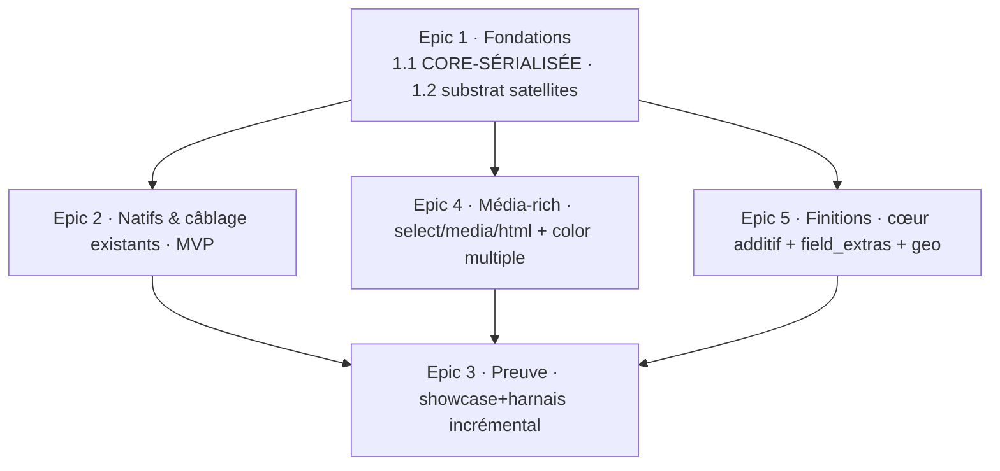

# zcrud — « Formulaire : parité DODLP totale » — Epic Breakdown (consolidé)

## Overview

Ce document décompose le PRD `prd-zcrud-form-parity-2026-07-18` (40 FR, 9 NFR) et le spine
`ARCHITECTURE-SPINE.md` (AD-47..56 + hérités AD-1..46) en **5 epics** et **13 stories**, organisés
**par phase** (`[MVP]` → `[Média-rich]` → `[Finitions]`) puis **par (package × capacité)**.

> **Note de consolidation.** Cette version **remplace** la précédente à 10 epics / 37 stories, sans rien
> re-dériver de zéro : elle **regroupe** les petites stories apparentées en **livrables plus gros et
> cohérents** (patron : *une story = un livrable cohérent par (package × phase)*), à la demande de
> l'owner. Le regroupement se fait **DANS chaque satellite**, jamais en fusionnant deux satellites
> disjoints (sinon on perd la parallélisation). La couverture des 40 FR est **intégralement préservée**
> (table de traçabilité mise à jour, 40/40). Justification : « la couverture de revue vient du **nombre
> de lentilles** du code-review multi-agent, pas de la finesse du découpage » (CLAUDE.md) — des stories
> volumineuses par livrable sont donc souhaitables.

**Nature de l'itération** : présentationnelle et d'assemblage, pas une réécriture. L'étude a prouvé que
le gros des familles de champ est **déjà natif** dans `zcrud_core` ; le travail restant est
**confirmation + câblage + une poignée de vrais gaps + preuve** (harnais + showcase + banc SM-1).

**Règle de séquencement structurante (verrouillée, PRD §Constraints + AD-47/52/53)** : toute story
qui **écrit `zcrud_core`** de façon structurelle (nouvelle valeur d'enum, nouveau type de valeur,
seam, tokens) est **sérialisée** — une seule à la fois touche le cœur. Ces stories sont marquées
**`CORE-SÉRIALISÉE`**. Les satellites disjoints (`zcrud_select`, `zcrud_html`, `zcrud_media`,
`zcrud_field_extras`, `zcrud_geo`) sont **parallélisables** entre eux (fichiers disjoints, ≤ 3 en vol).
Le regroupement n'a **pas** noyé une écriture cœur dans une story satellite : les écritures cœur
restent des stories cœur identifiables (1.1, 4.4, 5.1).

## Requirements Inventory

### Functional Requirements

- **FR-1** `[MVP]` — text / multiline / password (natif, polir). *[Matrice #1,#2,#37]*
- **FR-2** `[MVP]` — number (mode %) / integer / float (devise) (natif, polir). *[#3,#4,#5]*
- **FR-3** `[MVP]` — boolean (switch/toggle accessible). *[#6]*
- **FR-4** `[MVP]` — dateTime / time (pickers Material natifs, ISO-8601). *[#7,#8]*
- **FR-5** `[MVP]` — **`dateRange`** net-new (`ZDateRange{start,end}`, `showDateRangePicker`). *[§2 P1]*
- **FR-6** `[Média-rich]` — select (modal S2 responsive + recherche). *[#9]*
- **FR-7** `[Média-rich]` — radio en modal (`radioAsModal`). *[#10]*
- **FR-8** `[Média-rich]` — checkbox / multiselect. *[#11]*
- **FR-9** `[Média-rich]` — relation + CRUD inline (`crudDataSelect`). *[#12]*
- **FR-10** `[MVP]` — rowChips (ChoiceChip mono-choix). *[#13]*
- **FR-11** `[MVP]` — tags (saisie libre, bouton `+` ≥ 48 dp). *[#14]*
- **FR-12** `[MVP]` — subItems mini-CRUD + **réordonnancement** (supérieur DODLP). *[#15]*
- **FR-13** `[Finitions]` — subItems variante `itemsAreTags` (`ZSubListDisplayMode.tags`). *[#15b]*
- **FR-14** `[MVP]` — dynamicItem (sous-formulaire `DeepAttribute`). *[#16]*
- **FR-15** `[Média-rich]` — file (bottom-sheet multi-sources + zone de dépôt + open). *[#17]*
- **FR-16** `[Média-rich]` — image (galerie / caméra + recadrage). *[#18]*
- **FR-17** `[Média-rich]` — document (scan → PDF). *[#19]*
- **FR-18** `[Média-rich]` — vignette vidéo. *[§média]*
- **FR-19** `[MVP]` — color simple (+ roue HSV/opacité via seam binding). *[#28]*
- **FR-20** `[Média-rich]` — color multiple (`ZColorConfig.multiple`, `List<int>` ARGB). *[#28b]*
- **FR-21** `[MVP]` — markdown / inlineMarkdown / richText (câblage `zcrud_markdown`). *[#30,#31,#35]*
- **FR-22** `[Média-rich]` — html / inlineHtml WYSIWYG (édition, `zcrud_html`). *[#32,#34]*
- **FR-23** `[Média-rich]` — rendu HTML natif en lecture (`flutter_html`). *[#32b]*
- **FR-24** `[MVP]` — phoneNumber (câblage `zcrud_intl`). *[#22]*
- **FR-25** `[MVP]` — country (câblage `zcrud_intl`). *[#23]*
- **FR-26** `[MVP]` — address (câblage `zcrud_intl`, présent). *[#24]*
- **FR-27** `[MVP]` — location (`zcrud_geo`). *[#20]*
- **FR-28** `[Finitions]` — geoArea + UI style-picker fill/stroke. *[#21]*
- **FR-29** `[MVP]` — rating (étoiles, max configurable, toggle-clear). *[#25]*
- **FR-30** `[MVP]` — slider (min/max/divisions). *[#26]*
- **FR-31** `[MVP]` — signature (strokes vectoriels, 0 dép). *[#27]*
- **FR-32** `[MVP]` — stepper / sections (`ZStepperConfig`). *[#36]*
- **FR-33** `[MVP]` — seams hidden / widget / custom (`ZWidgetRegistry`/`ZTypeRegistry`). *[#38,#39,#40]*
- **FR-34** `[Finitions]` — PIN (`pinput`). *[§hors-enum]*
- **FR-35** `[Finitions]` — autocomplétion. *[§hors-enum]*
- **FR-36** `[Finitions]` — table éditable virtualisée. *[§hors-enum]*
- **FR-37** `[Finitions]` — icon picker (registre d'icônes). *[#29]*
- **FR-38** `[MVP]` — tokens d'aération `ZcrudTheme` + 3 écarts tranchés. *[§aération]*
- **FR-39** `[MVP]`(incrémental) — harnais ≥ 6 formulaires DODLP dans `example/`. *[§5.2]*
- **FR-40** `[MVP]`(incrémental) — showcase exhaustive tous types × variantes × états. *[§5.1]*

### NonFunctional Requirements

- **NFR-1** — SM-1 / AD-2 / AD-15 : rebuild granulaire par tranche ; seam ne livre que
  `ctx.value`/`ctx.onChanged` ; WebView WYSIWYG isolée sans casser les voisins ; jamais de `setState`
  d'écran ni de `TextEditingController` recréé.
- **NFR-2** — AD-1 : **CORE OUT=0** ; tout adaptateur tiers hors `zcrud_core` (satellite/binding),
  vérifié par grep sur `zcrud_core/pubspec.yaml`.
- **NFR-3** — AD-13 : RTL directionnel, `Semantics`, ≥ 48 dp, `ListView.builder`, Reduce Motion.
- **NFR-4** — FR-26 : thème/l10n injectés ; aucune couleur/libellé codé en dur ; aération = tokens dp.
- **NFR-5** — AD-10 : désérialisation défensive de tout nouveau type de valeur ; schéma additif seulement.
- **NFR-6** — AD-3 : codegen source-unique ; `*.g.dart` de `packages/*/lib/` régénérés/commités ;
  test rétro-compat de sérialisation vert (gate `codegen-distribution`).
- **NFR-7** — non-régression visuelle prouvée par le harnais ; 3 écarts d'aération tranchés.
- **NFR-8** — migrations ETL app-side (`signature` PNG→strokes non réversible ; `phoneNumber`
  String→E.164) : **hors packages zcrud**, à planifier côté app (pas d'epic zcrud).
- **NFR-9** — poids des deps confiné en satellite ; chaque satellite neuf justifié en architecture.

### Additional Requirements *(dérivées du spine AD-47..56)*

- **AR-1 (AD-49)** — vendoring `awesome_select` comme **membre de workspace melos privé**
  (`packages/awesome_select/`, `publish_to: none`), résolu offline, sous nos gates, MIT conservée.
- **AR-2 (AD-48)** — abstraction Material-free **`ZSelectPresenter`** dans `zcrud_core`, résolue via
  `ZcrudScope` ; défaut = modal natif ; familles natives délèguent au présentateur injecté.
- **AR-3 (AD-51/50/53)** — **squelettes** des nouveaux satellites `zcrud_select`, `zcrud_html`,
  `zcrud_media`, `zcrud_field_extras` (membres workspace, barrels `lib/<pkg>.dart`, pubspecs, gates).
- **AR-4 (AD-55)** — le **binding `zcrud_get`** est le point de composition unique : détient LE
  `ZWidgetRegistry`, appelle une seule fois chaque `registerZ<Pkg>Fields`, injecte les seams (registre
  injecté via `ZcrudScope`, jamais un singleton statique).
- **AR-5 (AD-50)** — `zcrud_html` et `zcrud_markdown` enregistrent `html`/`inlineHtml` de façon
  **mutuellement exclusive** (collision `register` = `throw`) ; l'app choisit une voie au bootstrap.
- **AR-6 (AD-56)** — harnais + showcase dans `example/` uniquement, données fictives, zéro secret,
  aucune dépendance backend DODLP ; `example/` est un puits (rien ne dépend de lui).
- **AR-7 (AD-52)** — la roue HSV (`flex_color_picker`) reste **côté binding** via `ZcrudScope.colorPicker`.

### UX Design Requirements

Aucun contrat UX bmad-ux (`DESIGN.md`/`EXPERIENCE.md`) dans `{planning_artifacts}` pour cette
itération. Les exigences visuelles/UX pertinentes sont portées par le PRD (FR-38 aération, 3 écarts ;
états transverses read-only/désactivé/erreur/RTL/thème du showcase FR-40) et par les invariants a11y/RTL
(NFR-3). Pas de section UX-DR distincte requise.

### FR Coverage Map (consolidée)

| FR | Epic.Story | FR | Epic.Story |
|---|---|---|---|
| FR-1 | 2.1 | FR-21 | 2.2 |
| FR-2 | 2.1 | FR-22 | 4.3 |
| FR-3 | 2.1 | FR-23 | 4.3 |
| FR-4 | 2.1 | FR-24 | 2.2 |
| FR-5 | 1.1 | FR-25 | 2.2 |
| FR-6 | 4.1 | FR-26 | 2.2 |
| FR-7 | 4.1 | FR-27 | 2.2 |
| FR-8 | 4.1 | FR-28 | 5.3 |
| FR-9 | 4.1 | FR-29 | 2.1 |
| FR-10 | 2.1 | FR-30 | 2.1 |
| FR-11 | 2.1 | FR-31 | 2.1 |
| FR-12 | 2.1 | FR-32 | 2.1 |
| FR-13 | 5.1 | FR-33 | 2.1 |
| FR-14 | 2.1 | FR-34 | 5.2 (+5.1) |
| FR-15 | 4.2 | FR-35 | 5.2 (+5.1) |
| FR-16 | 4.2 | FR-36 | 5.2 (+5.1) |
| FR-17 | 4.2 | FR-37 | 5.2 |
| FR-18 | 4.2 | FR-38 | 1.1 |
| FR-19 | 2.1 | FR-39 | 3.1 · 4.1 · 4.2 · 4.3 · 3.2 |
| FR-20 | 4.4 | FR-40 | 3.1 · 4.1 · 4.2 · 4.3 · 4.4 · 5.2 · 3.2 |

**Couverture : 40/40 FR.** Aucun FR non couvert. Seul non-goal assumé : LaTeX fallback SVG
`flutter_tex` (Matrice #33), hors périmètre par conception (placeholder thémé, cf. PRD §5).

## Epic List

### Epic 1: Fondations transverses (cœur sérialisé + substrat satellites) `[MVP-substrate]`
Pose le substrat commun dont dépendent tous les adaptateurs : les seams et types cœur MVP (type
`dateRange`, tokens d'aération, seam `ZSelectPresenter`) en **une story cœur sérialisée**, puis le
substrat des satellites (squelettes des 4 packages neufs + vendoring `awesome_select`) en **une story
parallélisable**. **Enables** tous les epics suivants.
**FRs covered:** FR-5, FR-38 (+ AR-1, AR-2, AR-3).

### Epic 2: Champs natifs & câblage des satellites existants `[MVP]`
Livre toute la surface MVP native/câblée : **une story** confirme+polit **toutes** les familles déjà
natives de `zcrud_core` (texte/num/bool/date, chips/tags/subItems/dynamicItem, rating/slider/signature/
stepper, color simple, seams) ; **une story** établit le binding `zcrud_get` comme point de composition
unique et y câble markdown + intl + geo (satellites déjà présents).
**FRs covered:** FR-1..4, FR-10..12, FR-14, FR-19, FR-21, FR-24..27, FR-29..33 (+ AR-4).

### Epic 3: Preuve — showcase exhaustive & harnais 6 axes `[proof · MVP→Finitions]`
Epic transverse de preuve, **incrémental** : **une story** livre le socle MVP (showcase champs livrés +
états transverses + banc SM-1, harnais axes MVP) ; **une story** finale consolide la preuve totale
(40 types × variantes × états + 6 formulaires + benchs SM-1..4). Les axes lourds sont exercés par leur
propre satellite (voir Epic 4/5), la consolidation les assemble.
**FRs covered:** FR-39 (incrémental → complet), FR-40 (incrémental → complet).

### Epic 4: Satellites riches Média-rich (sélections · média · HTML · color multiple) `[Média-rich]`
Regroupe la phase Média-rich en **livrables gros par satellite**, chacun **parallélisable** (fichiers
disjoints) : `zcrud_select` (sélections riches complètes), `zcrud_media` (média & fichiers complets),
`zcrud_html` (HTML WYSIWYG complet). Chaque satellite embarque son câblage binding + son axe de
showcase/harnais. **Une story cœur sérialisée** ajoute `ZColorConfig.multiple` (isolée, jamais noyée
dans un satellite).
**FRs covered:** FR-6..9, FR-15..18, FR-20, FR-22, FR-23 (+ contribue FR-39/40).

### Epic 5: Finitions (cœur additif · field_extras · geo) `[Finitions]`
Comble les gaps net-new de Finitions : **une story cœur sérialisée** (additions d'enum
pin/autocomplete/editableTable + `ZSubListDisplayMode.tags`), **une story satellite parallélisable**
`zcrud_field_extras` (PIN + autocomplete + table éditable + icon + câblage + showcase), **une story
satellite parallélisable** `zcrud_geo` (style-picker `geoArea`).
**FRs covered:** FR-13, FR-28, FR-34..37 (+ contribue FR-40).

---

## Epic 1: Fondations transverses (cœur sérialisé + substrat satellites)

Pose le substrat commun. **Story 1.1 écrit `zcrud_core`** (3 écritures cœur regroupées en **une seule
story sérialisée** — le cœur n'est touché que par cette story à la fois). **Story 1.2** est sur des
packages neufs disjoints, parallélisable une fois le cœur au repos.

### Story 1.1: Seams & types cœur MVP — `dateRange`, tokens d'aération, `ZSelectPresenter`

As a mainteneur zcrud,
I want ajouter au cœur le type `dateRange`, les tokens d'aération `ZcrudTheme` et le seam
`ZSelectPresenter`, en une seule écriture sérialisée,
So that tous les adaptateurs MVP et Média-rich disposent du substrat cœur sans se marcher dessus.

**Marquage :** `[MVP]` · **CORE-SÉRIALISÉE** (regroupe 3 écritures cœur — une seule story touche le
cœur à la fois) · Binds **AD-47/48/54**, FR-5, FR-38, NFR-1/2/3/4/5/6, AD-13.

**Acceptance Criteria:**

**Given** l'enum `EditionFieldType` du cœur *(bloc dateRange — FR-5)*
**When** on ajoute la valeur `dateRange` (camelCase, près de `dateTime`/`time`)
**Then** `zcrud_generator` émet le `ZFieldSpec`, les `*.g.dart` de `packages/*/lib/` sont
régénérés/commités, le test de rétro-compat de sérialisation est vert, et une valeur `ZDateRange{start,
end}` (domaine pur, ISO-8601) valide l'invariant `end >= start`, `fromJsonSafe → null` sur entrée
corrompue (AD-10), un parent ne throw jamais sur une plage absente/corrompue.

**Given** un champ `dateRange` monté *(bloc dateRange — FR-5)*
**When** l'utilisateur ouvre le picker
**Then** `ZDateRangeFieldWidget` (sous `ZFieldListenableBuilder`) utilise `showDateRangePicker` natif
(aucune dep `table_calendar`/`date_time_picker`), est directionnel (AD-13), **CORE OUT=0** vérifié par
grep sur `zcrud_core/pubspec.yaml`.

**Given** le `ThemeExtension` `ZcrudTheme` *(bloc aération — FR-38)*
**When** un binding pose les valeurs d'aération et les 3 écarts sont tranchés
**Then** les mesures sont des tokens dp directionnels (`EdgeInsetsDirectional`), les couleurs dérivent
du `ColorScheme` (aucune `Color(0xFF…)` littérale portée de DODLP) ; (1) `ZResponsiveGrid.runGutter`
additif (replié sur `gutter` si `null`) ; (2) le spacer inter-champ reste `zFieldGapAfter`, binding
pose `interFieldGap: 12` ; (3) `ZcrudTheme.formPadding` (défaut `EdgeInsetsDirectional.all(12)`)
consommé par `DynamicEdition` quand `padding == null` ; header sobre thémé par défaut (parité visuelle
stricte des sections = OQ-1, non implémentée).

**Given** `zcrud_core` sans dépendance lourde *(bloc seam — AR-2/AD-48)*
**When** on déclare `ZSelectPresenter` (patron `ZListRenderer`/`ZcrudScope.colorPicker`)
**Then** l'abstraction vit dans le cœur, le défaut est le **modal natif zcrud actuel**, **CORE OUT=0**
préservé ; les familles natives `ZSelectFieldWidget`/`ZRelationFieldWidget` **délèguent** au
présentateur injecté via `ZcrudScope` s'il existe, sinon conservent le rendu natif ; le
`ZWidgetRegistry` n'est jamais détourné pour ces familles de base.

### Story 1.2: Substrat satellites — squelettes des 4 packages neufs + vendoring `awesome_select`

As a mainteneur zcrud,
I want les squelettes de `zcrud_select`/`zcrud_html`/`zcrud_media`/`zcrud_field_extras` et le vendoring
de `awesome_select` comme membre de workspace privé,
So that les adaptateurs de parité ont un emplacement conforme sous nos gates avant d'être écrits.

**Marquage :** `[MVP-substrate]` · parallélisable (packages disjoints, cœur au repos) · Binds
**AD-49/50/51/53**, NFR-2/9.

**Acceptance Criteria:**

**Given** le workspace melos *(bloc squelettes — AR-3)*
**When** on crée les 4 packages
**Then** chacun est membre du workspace, expose un barrel `lib/<pkg>.dart`, un `pubspec.yaml` dépendant
**uniquement** de `zcrud_core` (aucune dep lourde encore, ou confinée à l'impl), passe `melos
analyze`/`verify` repo-wide, secrets, `codegen-distribution` ; chaque arête va vers `zcrud_core`, le
graphe reste acyclique, **CORE OUT=0** inchangé.

**Given** le source du fork `awesome_select` *(bloc vendor — AR-1/AD-49)*
**When** il entre sous `packages/awesome_select/` avec `publish_to: none`
**Then** il résout **offline** sous notre tag, passe les mêmes gates repo (analyze, CORE OUT=0,
secrets, `codegen-distribution`), conserve la licence **MIT** (fichier `LICENSE` + attribution), est
dépendu **uniquement** par `zcrud_select` (à venir), et aucun type `awesome_select` ne fuit en
signature publique (AD-40).

---

## Epic 2: Champs natifs & câblage des satellites existants

Toute la surface MVP native/câblée en 2 livrables. **Story 2.1** touche la **présentation de
`zcrud_core`** (polish, **aucun** ajout structurel d'enum) — à séquencer après la story cœur 1.1, hors
de toute écriture cœur concurrente. **Story 2.2** est côté binding/satellites existants.

### Story 2.1: Champs natifs de base & spécialisés (confirmés & polis)

As a développeur consommateur,
I want toutes les familles déjà natives — saisie (text/num/bool/date), collections
(chips/tags/subItems/dynamicItem), spécialisés (rating/slider/signature/stepper), color simple et les
seams hidden/widget/custom,
So that mes formulaires MVP rendent à parité DODLP sans jank ni perte de focus.

**Marquage :** `[MVP]` · présentation cœur (pas d'ajout d'enum) · Binds FR-1, FR-2, FR-3, FR-4, FR-10,
FR-11, FR-12, FR-14, FR-19, FR-29, FR-30, FR-31, FR-32, FR-33 ; NFR-1/2/3/4, AD-2, AD-4, AD-13.

**Acceptance Criteria:**

**Given** un champ à saisie (text/multiline/password/number/integer/float) *(FR-1, FR-2)*
**When** l'utilisateur tape 100 caractères
**Then** seul le champ courant se reconstruit (banc **SM-1**), zéro perte de focus, le
`TextEditingController` n'est pas recréé au rebuild, les validateurs `form_builder_validators`
s'appliquent en `AutovalidateMode.onUserInteraction` par champ ; le suffixe `%` (number) / la devise
(float) dérivent de la locale/thème injecté (jamais codés), sans altérer la valeur persistée.

**Given** `boolean`, `dateTime`/`time` *(FR-3, FR-4)*
**When** ils sont rendus
**Then** le switch a une cible ≥ 48 dp et un `Semantics` on/off (delta pill DODLP absorbé par
`SwitchThemeData`) ; les dates utilisent les pickers Material natifs en ISO-8601 (aucune dep
`date_time_picker`/`table_calendar`).

**Given** `rowChips`, `tags`, `subItems`, `dynamicItem` *(FR-10, FR-11, FR-12, FR-14)*
**When** ils sont rendus / manipulés
**Then** `rowChips` est mono-choix (`ChoiceChip`), `tags` offre un bouton `+` ≥ 48 dp (aucune dep
`flutter_tags`), `subItems` supporte le réordonnancement monter/descendre (`_move()`, **supérieur**
DODLP, aucune dep `drag_and_drop_lists`), `dynamicItem` édite un sous-formulaire `DeepAttribute` dans la
granularité de rebuild du parent (AD-2) ; l'écart de style est ajustable via `ZcrudTheme`.

**Given** `rating`, `slider`, `signature`, `stepper` *(FR-29..32)*
**When** ils sont rendus
**Then** `rating` a un max configurable + toggle-clear + `Semantics` (supérieur à l'ad-hoc DODLP) ;
`slider` respecte min/max/divisions ; `signature` capture en **strokes vectoriels** (0 dép, pas de
`package:signature` ; migration PNG→strokes = ETL app-side NFR-8, hors story) ; `ZStepperConfig` répare
le bug DODLP `indicatorSize` et rend les sections directionnellement ; aucune couleur codée en dur.

**Given** `color` simple + seams `hidden`/`widget`/`custom` *(FR-19, FR-33)*
**When** ils sont déclarés
**Then** le picker natif `ZColorFieldWidget` (sliders HSV + hex + récents) fonctionne, la roue
HSV/opacité (`flex_color_picker`) reste accessible **via `ZcrudScope.colorPicker` côté binding**
(jamais dans le cœur, NFR-2) ; `hidden` n'est pas rendu, `widget` monte un builder libre, `custom` est
résolu via `ZWidgetRegistry`/`ZTypeRegistry`, et le builder ne reçoit que `ctx.value`/`ctx.onChanged`,
jamais le `ZFormController` (AD-2).

### Story 2.2: Point de composition binding + câblage markdown / intl / geo

As a intégrateur d'app (DODLP/GetX),
I want que le binding `zcrud_get` détienne LE `ZWidgetRegistry` et y câble markdown, intl et geo,
So that j'ai un point unique d'enrôlement et les satellites existants rendus sans réécriture.

**Marquage :** `[MVP]` · Binds FR-21, FR-24, FR-25, FR-26, FR-27 ; **AR-4 (AD-55)**, AD-7, NFR-2/3/4,
OQ-3/OQ-4 (défauts).

**Acceptance Criteria:**

**Given** le binding `zcrud_get` *(AR-4/AD-55)*
**When** l'app bootstrap
**Then** le binding **construit et détient** le `ZWidgetRegistry`, l'injecte via `ZcrudScope` (jamais un
singleton statique, AD-4), appelle **une seule fois** chaque `registerZ<Pkg>Fields` ; une double
registration d'un même `kind` **throw**.

**Given** `zcrud_markdown` *(FR-21)*
**When** `registerZMarkdownFields` est appelé
**Then** `markdown`/`inlineMarkdown`/`richText` sont rendus (toolbar, LaTeX, table, dialog plein
écran), chaque éditeur rich-text a un **controller isolé** (AD-7/AD-2), et une formule LaTeX hors
sous-ensemble `flutter_math_fork` rend un **placeholder thémé** (pas de crash, pas de `flutter_tex`).

**Given** `zcrud_intl` — phoneNumber, country, address *(FR-24, FR-25, FR-26)*
**When** le binding câble
**Then** `registry.register('phoneNumber', …)` (manquant aujourd'hui) est ajouté ; sélecteur pays =
panneau inline par défaut (OQ-3), validateur national Togo chiffres nus `length:8` par défaut (OQ-4) ;
`country` (`ZCountryFieldWidget`, zéro dep tierce) a sa couverture l10n JSON vérifiée (aucune dep
`country_picker`) ; `address` (`ZAddressFieldWidget`, auto-enregistré) confirmé présent ; *(migration
String→`ZPhoneNumber` E.164 = ETL app-side NFR-8, hors story)*.

**Given** `zcrud_geo` — location *(FR-27)*
**When** le binding câble `location`
**Then** un point géographique est saisissable, le satellite reste isolé (**CORE OUT=0**), aucun secret
(clé Maps) embarqué dans un package (AD-12) — config plateforme de l'app.

---

## Epic 3: Preuve — showcase exhaustive & harnais 6 axes

Epic de **preuve** dans `example/` (AR-6/AD-56), **incrémental**. La story 3.1 (socle) n'exerce **que**
des champs déjà livrés (Epics 1-2) — aucune dépendance vers un epic futur. La story 3.2 assemble la
preuve totale après tous les epics de champs.

### Story 3.1: Preuve MVP — showcase socle + états transverses + banc SM-1 + harnais axes MVP

As a owner (Zakarius) et dev DODLP (Bilal),
I want une showcase des champs MVP dans tous leurs états, un banc SM-1, et ≥ 3 formulaires DODLP
répliqués sur les axes MVP,
So that j'audite la complétude MVP et je prouve l'absence de régression sur les familles natives/câblées.

**Marquage :** `[MVP]` · Binds FR-40 (socle), FR-39 (axes 1/5/6) ; SM-1/SM-3/SM-4, NFR-1/3/7 ; OQ-7.

**Acceptance Criteria:**

**Given** la showcase dans `example/` *(FR-40 socle)*
**When** on l'ouvre
**Then** chaque champ MVP livré (Epics 1-2) est démontré avec ses états transverses (read-only,
désactivé, erreur, valeur initiale, conditionnel, **RTL**, **thème clair/sombre**), et les gaps non
encore livrés (`select` modal, média, WYSIWYG, color multiple, icon, `itemsAreTags`) sont **étiquetés
« ABSENT / à combler »**, jamais masqués.

**Given** un formulaire de frappe intensive *(SM-1)*
**When** l'utilisateur tape 100 caractères
**Then** seul le champ courant se reconstruit, zéro perte de focus (banc **SM-1** prouvé, test widget +
profiling).

**Given** le harnais dans `example/` *(FR-39 axes 1/5/6)*
**When** on ouvre les formulaires MVP
**Then** l'axe 1 (texte/nombre/date dense + SM-1), l'axe 5 (intl/géo : phone/country/location) et
l'axe 6 (spécialisés/imbriqués : rating/slider/signature/color/subItems+réordo) sont couverts avec des
**données fictives**, zéro secret, aucune dépendance backend DODLP ; côte à côte vs DODLP, aucun écart
visuel **bloquant** hors les 3 écarts d'aération tranchés (FR-38) ; shortlist figée sur « couverture max
types × axes » (OQ-7).

### Story 3.2: Parité totale — consolidation showcase 40 types & harnais 6 formulaires

As a owner (Zakarius) et dev DODLP (Bilal),
I want une showcase couvrant les 40 `EditionFieldType` et les 6 formulaires DODLP répliqués, avec benchs
SM-1..4,
So that je valide SM-2 (parité traçable), SM-3 (non-régression), SM-4 (complétude) et SM-1 (y compris
WYSIWYG isolé).

**Marquage :** `[Finitions/proof]` · Binds FR-39 (complet), FR-40 (complet) ; SM-1/SM-2/SM-3/SM-4,
NFR-1/3/7 ; OQ-6/OQ-7.

**Acceptance Criteria:**

**Given** la showcase assemblée *(FR-40 complet, SM-2/SM-4)*
**When** on l'ouvre
**Then** les **40** `EditionFieldType` + variantes sont démontrés, les décisions natif-vs-package
montrées côte à côte quand possible (`color` sliders vs roue ; `select`/`radio` natif vs modal ; phone
inline vs dialog), chaque champ dans ses états read-only/désactivé/erreur/valeur-initiale/conditionnel/
**RTL**/**thème** ; **100 % des items** ont un statut connu (livré / câblé / gap reporté justifié) —
aucun « on ne sait pas » (SM-2) ; les gaps consciemment reportés (OQ-6 : `itemsAreTags`, `icon` si non
déclenchés) sont **étiquetés ABSENT / à combler** avec justification, jamais masqués.

**Given** le harnais complet — 6 formulaires *(FR-39 complet, SM-3)*
**When** on ouvre les 6 formulaires
**Then** les 6 axes sont couverts — (1) dense+SM-1 ; (2) sélections
`select`/`radio`/`relation`+`crudDataSelect` ; (3) média ; (4) rich-text md/LaTeX/html ; (5) intl/géo ;
(6) spécialisés/imbriqués — données fictives, zéro secret, aucune dépendance backend DODLP ; aucun écart
visuel **bloquant** hors les 3 écarts d'aération tranchés (SM-3).

**Given** le formulaire de frappe intensive incluant le champ WYSIWYG isolé *(SM-1)*
**When** l'utilisateur tape 100 caractères
**Then** seul le champ courant se reconstruit, zéro perte de focus (**SM-1**), y compris quand le champ
courant est la WebView WYSIWYG d'AD-50.

---

## Epic 4: Satellites riches Média-rich (sélections · média · HTML · color multiple)

Phase Média-rich. Dépend d'Epic 1 (seam `ZSelectPresenter` + vendor + squelettes). **Stories 4.1/4.2/4.3
sont des satellites disjoints parallélisables** (≤ 3 en vol, fichiers disjoints ; le regroupement s'est
fait DANS chaque satellite). **Story 4.4 écrit `zcrud_core`** — isolée, **CORE-SÉRIALISÉE**, jamais
noyée dans un satellite ; exécutée quand le cœur est au repos.

### Story 4.1: Sélections riches complètes (`zcrud_select` + fork `awesome_select`)

As a développeur consommateur,
I want un présentateur adossé au fork fournissant select (modal S2 + recherche), radio en modal,
checkbox/multiselect et relation + CRUD inline, câblé par le binding et démontré,
So that j'atteins la parité de sélection riche DODLP (`crudDataSelect` inclus).

**Marquage :** `[Média-rich]` · parallélisable (satellite `zcrud_select`) · Binds FR-6, FR-7, FR-8,
FR-9 ; AD-48/49, AD-4, NFR-1/2 ; contribue FR-39 (axe 2), FR-40 ; AR-4.

**Acceptance Criteria:**

**Given** `zcrud_select` dépendant du vendor `awesome_select` *(FR-6)*
**When** il fournit le `ZSelectPresenter`
**Then** `select` rend un modal S2 responsive + recherche à parité DODLP, le builder ne reçoit que
`ctx.value`/`ctx.onChanged`, aucun type `awesome_select` ne fuit en signature publique (AD-40), **CORE
OUT=0** vérifié ; sans présentateur injecté, la famille native retombe sur le modal natif (défaut
AD-48).

**Given** `radio` (`radioAsModal: true`), `checkbox`/`multiselect` *(FR-7, FR-8)*
**When** ils sont rendus via `SmartSelect`
**Then** la parité UX modal (vs `RadioListTile` inline DODLP) est démontrée dans le harnais et le choix
multiple fonctionne, exposé en showcase et dans un formulaire du harnais.

**Given** une source `crudDataSelect` — relation *(FR-9)*
**When** elle est câblée
**Then** source et CRUD sont enregistrés au **runtime** via
`ZRelationSourceRegistry`/`ZRelationCrudRegistry` (jamais dans l'annotation `const`), et l'entité créée
inline est retournée et **sélectionnée sans quitter** le formulaire parent.

**Given** le binding `zcrud_get` *(intégration + preuve, AR-4)*
**When** il compose le `ZSelectPresenter` de `zcrud_select`
**Then** l'enrôlement est explicite au bootstrap (jamais un side-effect d'import), la showcase montre
`select`/`radio`/`relation` **natif vs modal côte à côte**, l'axe 2 du harnais est couvert, et les
entrées correspondantes passent de « ABSENT » à « livré ».

### Story 4.2: Média & fichiers complets (`zcrud_media`)

As a utilisateur DODLP,
I want file (bottom-sheet multi-sources + zone de dépôt + open), image (galerie/caméra + recadrage),
document (scan → PDF) et vignette vidéo, câblés par le binding et démontrés,
So that je couvre toute la famille média de DODLP.

**Marquage :** `[Média-rich]` · parallélisable (satellite `zcrud_media`) · Binds FR-15, FR-16, FR-17,
FR-18 ; AD-51, NFR-2/9 ; contribue FR-39 (axe 3), FR-40 ; AR-4.

**Acceptance Criteria:**

**Given** `zcrud_media` implémentant `ZFilePicker`/`ZFileSource` *(FR-15)*
**When** l'utilisateur ouvre le sélecteur de fichier
**Then** un bottom-sheet multi-sources s'affiche, le fichier s'ouvre (`open_file`), une zone de dépôt
(`dotted_border`) est disponible, l'API publique reste en types neutres (`Uint8List`, chemins — aucun
type de plateforme public) ; le satellite dépend **uniquement** de `zcrud_core`, deps plateforme
confinées, **CORE OUT=0**.

**Given** `image`, `document`, vidéo *(FR-16, FR-17, FR-18)*
**When** l'utilisateur les manipule
**Then** galerie (multi-sélection) + caméra + recadrage (`image_cropper`) fonctionnent via l'adaptateur
(jamais dans le cœur) ; `ZFileSource.scan` produit un PDF (service dans le satellite/binding) ; une
vignette vidéo est générée (`video_thumbnail`) en type neutre.

**Given** le binding `zcrud_get` *(intégration + preuve, AR-4)*
**When** il injecte l'implémentation média dans le seam
**Then** file/image/document/vidéo fonctionnent dans le harnais (axe 3) avec données fictives, et les
entrées de la showcase passent de « ABSENT » à « livré ».

### Story 4.3: HTML WYSIWYG complet (`zcrud_html`)

As a utilisateur DODLP,
I want éditer du HTML en WYSIWYG (WebView isolée), le lire en rendu natif, avec exclusivité md/html au
bootstrap, câblé et démontré,
So that j'atteins la parité rich-text HTML de DODLP sans casser SM-1 ni créer deux propriétaires.

**Marquage :** `[Média-rich]` · parallélisable (satellite `zcrud_html`) · Binds FR-22, FR-23 ;
AD-50, NFR-1/2 ; contribue FR-39 (axe 4), FR-40 ; AR-5.

**Acceptance Criteria:**

**Given** `zcrud_html` enregistrant `html`/`inlineHtml` sur `ZWidgetRegistry` *(FR-22)*
**When** l'adaptateur monte
**Then** son `State` possède le `HtmlEditorController`/WebView **créé une seule fois** en `initState`
(jamais recréé au rebuild), `key: ValueKey('z-html-<field.name>')` (patron controller isolé AD-7).

**Given** l'utilisateur qui tape 100 caractères dans le WYSIWYG *(FR-22, SM-1)*
**When** les champs voisins se reconstruisent
**Then** le `State` de la WebView **survit** aux rebuilds voisins, `ctx.onChanged` n'est poussé qu'au
`onChange`/blur **débouncé** (jamais synchrone), la re-synchro depuis `ctx.value` ne se fait que **hors
focus**, **SM-1 tenu** ; un HTML corrompu en entrée rend un éditeur vide (AD-10), jamais un throw ; le
paquet concret (`html_editor_enhanced`/`_plus`) est abstrait par le satellite.

**Given** du HTML arbitraire en lecture *(FR-23)*
**When** il est rendu (`flutter_html`) dans `zcrud_html`
**Then** le format persisté est **HTML `String`**, les pertes de round-trip (code inline, CSS exotiques)
sont **documentées et bornées**.

**Given** `zcrud_html` et `zcrud_markdown` *(exclusivité + preuve, AR-5)*
**When** les deux tentent d'enregistrer `html`/`inlineHtml`
**Then** la seconde registration **throw** (mutuellement exclusif), l'app choisit **une seule** voie au
bootstrap, l'axe 4 du harnais (`markdown`/LaTeX/table + `html`) est couvert, et l'entrée showcase passe
de « ABSENT » à « livré ».

### Story 4.4: `ZColorConfig.multiple` natif au cœur

As a développeur consommateur,
I want sélectionner plusieurs couleurs via une variante native `ZColorConfig.multiple`,
So that je couvre la variante `color` multiple de DODLP sans forker `color_picker_field`.

**Marquage :** `[Média-rich]` · **CORE-SÉRIALISÉE** (écriture cœur isolée, jamais dans un satellite) ·
Binds FR-20 ; AD-52, NFR-5/6 ; contribue FR-40.

**Acceptance Criteria:**

**Given** `ZColorConfig`
**When** on ajoute la variante `multiple`
**Then** elle est **native** dans `zcrud_core` (picker built-in en boucle + case à cocher), la valeur
est `List<int>` ARGB, **sans** dépendance `color_picker_field` ; **CORE OUT=0** préservé.

**Given** une liste ARGB corrompue en entrée
**When** elle est désérialisée
**Then** l'entrée corrompue est ignorée (parse défensif AD-10), jamais un throw ; la valeur est additive
(camelCase, `@JsonKey(unknownEnumValue:)` le cas échéant), le `ZFieldSpec` est émis, les `*.g.dart`
régénérés/commités, le test rétro-compat vert ; la showcase démontre la variante et son entrée passe de
« ABSENT » à « livré ».

---

## Epic 5: Finitions (cœur additif · field_extras · geo)

Phase Finitions. **Story 5.1 écrit `zcrud_core`** (2 écritures cœur regroupées, **CORE-SÉRIALISÉE**,
une seule à la fois). **Stories 5.2/5.3 sont des satellites disjoints parallélisables**. FR-13/FR-37
restent en repli `ZUnsupportedFieldWidget` **étiqueté ABSENT** tant que non déclenchés (OQ-6).

### Story 5.1: Additions cœur Finitions — enum pin/autocomplete/editableTable + `itemsAreTags`

As a mainteneur zcrud,
I want ajouter additivement les valeurs d'enum `pin`/`autocomplete`/`editableTable` et le mode
`ZSubListDisplayMode.tags`, en une seule écriture cœur sérialisée,
So that le satellite `zcrud_field_extras` peut les servir et la variante `itemsAreTags` est native.

**Marquage :** `[Finitions]` · **CORE-SÉRIALISÉE** (regroupe 2 écritures cœur — une seule story touche
le cœur à la fois) · Binds FR-13, FR-34/35/36 (prérequis enum) ; AD-52/53, NFR-5/6 ; OQ-6.

**Acceptance Criteria:**

**Given** `EditionFieldType` *(bloc enum — prérequis FR-34/35/36)*
**When** on ajoute `pin`/`autocomplete`/`editableTable` (camelCase)
**Then** l'ajout est **additif**, le générateur émet les `ZFieldSpec`, les `*.g.dart` de
`packages/*/lib/` régénérés/commités, le test rétro-compat vert ; valeurs neutres (PIN/autocomplete =
`String`, table = `List<Map>` défensif AD-10) ; **CORE OUT=0** préservé.

**Given** `subItems` *(bloc itemsAreTags — FR-13)*
**When** on ajoute `ZSubListDisplayMode.tags`
**Then** le rendu tag (`InputChip`) + icône + toggle est natif, **zéro dépendance** tierce, additif et
défensif ; tant que non déclenché (OQ-6), l'entrée reste **étiquetée ABSENT** dans la showcase.

### Story 5.2: Champs extras complets (`zcrud_field_extras`)

As a développeur consommateur,
I want PIN, autocomplétion, table éditable virtualisée et icon picker, câblés par le binding et
démontrés,
So that je couvre les gaps net-new hors-enum et le champ icon de DODLP.

**Marquage :** `[Finitions]` · parallélisable (satellite `zcrud_field_extras`) · Binds FR-34, FR-35,
FR-36, FR-37 ; AD-53, NFR-3 ; contribue FR-40 ; AR-4 ; OQ-6 (icon).

**Acceptance Criteria:**

**Given** `zcrud_field_extras` enregistrant `pin`/`autocomplete`/`editableTable`/`icon` *(FR-34..37)*
**When** ils sont rendus
**Then** `pin` (`pinput`) a des cellules ≥ 48 dp + `Semantics` de progression ; `autocomplete` affiche
des suggestions filtrées avec **SM-1 tenu** (seul le champ courant se reconstruit) ; `editableTable` est
**virtualisée** (`ListView.builder`, jamais `ListView(children:[...])`), cellules éditables en place,
valeur `List<Map>` à parse défensif ; `icon` présente un registre d'icônes ou, tant que non déclenché
(OQ-6), le repli `ZUnsupportedFieldWidget` **étiqueté ABSENT** ; toutes les deps (`pinput`…) confinées
au satellite (**CORE OUT=0**).

**Given** le binding `zcrud_get` *(intégration + preuve, AR-4)*
**When** il appelle `registerZFieldExtrasFields`
**Then** PIN/autocomplete/table/icon sont enrôlés une seule fois ; la showcase montre chaque champ de
Finitions livré et étiquette **ABSENT** ceux laissés en repli (OQ-6).

### Story 5.3: `geoArea` — UI style-picker fill/stroke (`zcrud_geo`)

As a développeur consommateur,
I want styliser une zone géographique (polygone/cercle) avec toolbar fill/stroke,
So that je couvre le style geofence de DODLP.

**Marquage :** `[Finitions]` · parallélisable (satellite `zcrud_geo`) · Binds FR-28 ; AD-8/AD-52,
NFR-2 ; contribue FR-40.

**Acceptance Criteria:**

**Given** le modèle `ZGeoShapeStyle` (déjà prêt)
**When** l'UI de stylisation est ajoutée à `zcrud_geo`
**Then** la toolbar fill/stroke **réutilise** le seam `ZColorPicker`/`ZColorPickerDialog` (pas de 2ᵉ
picker), reste directionnelle (AD-13), le satellite ne tire aucune dep lourde nouvelle dans le cœur
(**CORE OUT=0**), et l'entrée showcase passe de « ABSENT » à « livré ».

---

## Graphe de dépendances & séquencement

**Stories écrivant `zcrud_core` (CORE-SÉRIALISÉES — une seule à la fois) :** **1.1** (`dateRange` +
tokens d'aération + seam `ZSelectPresenter`), **4.4** (`ZColorConfig.multiple`), **5.1** (enum
pin/autocomplete/editableTable + `ZSubListDisplayMode.tags`). *(Story 2.1 touche la **présentation**
cœur — polish, pas d'ajout structurel d'enum — donc à séquencer hors des écritures ci-dessus, jamais en
parallèle d'une écriture cœur.)* Aucune écriture cœur n'est noyée dans une story satellite.

**Satellites disjoints parallélisables (≤ 3 en vol) :** en Média-rich → **4.1** (`zcrud_select`),
**4.2** (`zcrud_media`), **4.3** (`zcrud_html`) ; en Finitions → **5.2** (`zcrud_field_extras`),
**5.3** (`zcrud_geo`). Le seul point de contact possible reste `zcrud_core` (touché uniquement par les
stories CORE-SÉRIALISÉES, hors vol satellite).

**Phasage préservé :** Epic 1 `[MVP-substrate]` + Epic 2 `[MVP]` → Epic 3 story 3.1 `[MVP-proof]` →
Epic 4 `[Média-rich]` → Epic 5 `[Finitions]` → Epic 3 story 3.2 `[Finitions/proof]` (consolidation
finale). La fondation (seams + squelettes + vendor) précède tout adaptateur dépendant.

**Décisions laissées ouvertes (défauts conservateurs, non bloquants) :** OQ-1 (parité visuelle stricte
des sections → header sobre par défaut, AD-54) ; OQ-3 (sélecteur pays inline) ; OQ-4 (validateur Togo
`length:8`) ; OQ-6 (déclenchement FR-13/FR-37 → repli ABSENT tant que non activé) ; OQ-7 (shortlist
harnais figée à l'ouverture d'Epic 3). **NFR-8** (ETL app-side signature/phone) reste hors epics zcrud.

## Traçabilité FR → Epic.Story (complète, consolidée)

| FR | Phase | Epic.Story | Package cible | Note |
|---|---|---|---|---|
| FR-1 | MVP | 2.1 | zcrud_core (natif) | polish |
| FR-2 | MVP | 2.1 | zcrud_core | polish |
| FR-3 | MVP | 2.1 | zcrud_core | polish |
| FR-4 | MVP | 2.1 | zcrud_core | polish |
| FR-5 | MVP | **1.1** | zcrud_core | **CORE-SÉRIALISÉE** |
| FR-6 | Média-rich | 4.1 | zcrud_select + vendor | |
| FR-7 | Média-rich | 4.1 | zcrud_select | |
| FR-8 | Média-rich | 4.1 | zcrud_select | |
| FR-9 | Média-rich | 4.1 | zcrud_select | crudDataSelect |
| FR-10 | MVP | 2.1 | zcrud_core | |
| FR-11 | MVP | 2.1 | zcrud_core | |
| FR-12 | MVP | 2.1 | zcrud_core | supérieur DODLP |
| FR-13 | Finitions | **5.1** | zcrud_core | **CORE-SÉRIALISÉE** (OQ-6) |
| FR-14 | MVP | 2.1 | zcrud_core | |
| FR-15 | Média-rich | 4.2 | zcrud_media | |
| FR-16 | Média-rich | 4.2 | zcrud_media | |
| FR-17 | Média-rich | 4.2 | zcrud_media | |
| FR-18 | Média-rich | 4.2 | zcrud_media | |
| FR-19 | MVP | 2.1 | zcrud_core + seam | roue via binding |
| FR-20 | Média-rich | **4.4** | zcrud_core | **CORE-SÉRIALISÉE** |
| FR-21 | MVP | 2.2 | zcrud_markdown (câblage) | |
| FR-22 | Média-rich | 4.3 | zcrud_html | WebView isolée |
| FR-23 | Média-rich | 4.3 | zcrud_html | |
| FR-24 | MVP | 2.2 | zcrud_intl (câblage) | OQ-3/OQ-4 |
| FR-25 | MVP | 2.2 | zcrud_intl | |
| FR-26 | MVP | 2.2 | zcrud_intl (présent) | |
| FR-27 | MVP | 2.2 | zcrud_geo | |
| FR-28 | Finitions | 5.3 | zcrud_geo | réutilise seam couleur |
| FR-29 | MVP | 2.1 | zcrud_core | supérieur DODLP |
| FR-30 | MVP | 2.1 | zcrud_core | |
| FR-31 | MVP | 2.1 | zcrud_core | ETL PNG→strokes NFR-8 |
| FR-32 | MVP | 2.1 | zcrud_core | |
| FR-33 | MVP | 2.1 | zcrud_core (seams) | |
| FR-34 | Finitions | 5.2 (+5.1 enum) | zcrud_field_extras | |
| FR-35 | Finitions | 5.2 (+5.1 enum) | zcrud_field_extras | |
| FR-36 | Finitions | 5.2 (+5.1 enum) | zcrud_field_extras | |
| FR-37 | Finitions | 5.2 | zcrud_field_extras | OQ-6 |
| FR-38 | MVP | **1.1** | zcrud_core (ZcrudTheme) | **CORE-SÉRIALISÉE** |
| FR-39 | MVP(incr.) | 3.1 · 4.1 · 4.2 · 4.3 · **3.2** | example/ | 6 axes |
| FR-40 | MVP(incr.) | 3.1 · 4.1 · 4.2 · 4.3 · 4.4 · 5.2 · **3.2** | example/ | 40 types |

**Résultat : 40/40 FR couverts.** Aucun FR orphelin, aucun FR perdu au regroupement. Non-goal assumé
(LaTeX SVG `flutter_tex`, Matrice #33) hors périmètre par conception.

## Annexe — Mapping de consolidation (ancien → nouveau)

| Nouvelle story | Anciennes stories regroupées | Type |
|---|---|---|
| **1.1** Seams & types cœur MVP | 1.1 (dateRange) + 1.2 (tokens aération) + 1.3 (ZSelectPresenter) | CORE-SÉRIALISÉE |
| **1.2** Substrat satellites | 1.4 (squelettes ×4) + 1.5 (vendoring awesome_select) | parallélisable |
| **2.1** Champs natifs base & spécialisés | 2.1 + 2.2 + 2.3 + 2.4 | présentation cœur |
| **2.2** Binding + câblage md/intl/geo | 3.1 + 3.2 + 3.3 | câblage |
| **3.1** Preuve MVP | 4.1 (showcase socle) + 4.2 (harnais MVP) | proof (example/) |
| **3.2** Parité totale | 10.1 (showcase 40) + 10.2 (harnais 6 + benchs) | proof (example/) |
| **4.1** Sélections riches | 5.1 + 5.2 + 5.3 + 5.4 | satellite zcrud_select |
| **4.2** Média & fichiers | 6.1 + 6.2 + 6.3 + 6.4 + 6.5 | satellite zcrud_media |
| **4.3** HTML WYSIWYG | 7.1 + 7.2 + 7.3 | satellite zcrud_html |
| **4.4** Color multiple | 8.1 | CORE-SÉRIALISÉE |
| **5.1** Additions cœur Finitions | 9.1 (enum) + 9.6 (itemsAreTags) | CORE-SÉRIALISÉE |
| **5.2** Champs extras | 9.2 + 9.3 + 9.4 + 9.5 + 9.8 | satellite zcrud_field_extras |
| **5.3** geoArea style-picker | 9.7 | satellite zcrud_geo |

**Total : 10 epics / 37 stories → 5 epics / 13 stories.** Les intégrations binding + showcase/harnais
par axe (anciennes 5.4/6.5/7.3/9.8) ont été **repliées dans le livrable de leur satellite** (patron
« un livrable cohérent par (package × phase) ») ; la preuve transverse reste portée par Epic 3.
