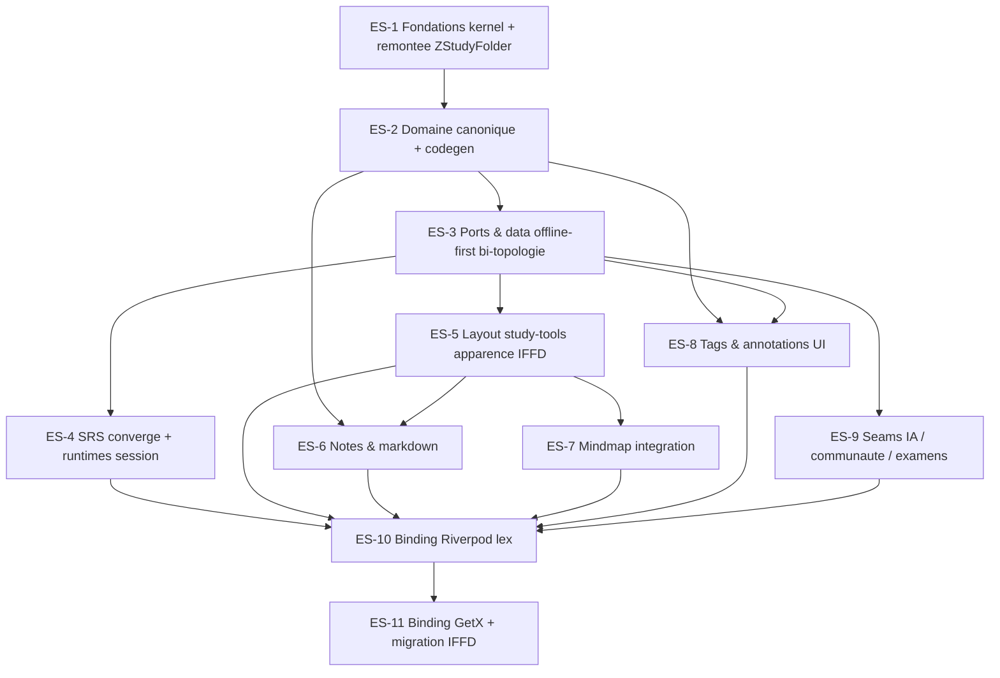

# Épics & Stories — zcrud_study (extension éducative)

Backlog séquencé transformant les **34 FR-S** du PRD et les **12 décisions d'extension AD-17..AD-28** de l'architecture (héritant des 16 AD produit, NON-NÉGOCIABLES) en unités implémentables. Chaque story porte des critères d'acceptation testables et référence FR-S / AD / SM-S, les **packages/fichiers touchés** (pour l'évaluation de parallélisation à fichiers disjoints), une **taille estimée** (S/M/L/XL) et son **statut initial `backlog`**. Détails exhaustifs : voir les documents de grounding.

Le découpage suit l'inventaire §9 (ES-1..ES-11) et la matrice FR-S→ES du PRD (Annexe A). Le séquencement respecte le **graphe de dépendances** (pas la numérotation).

## Overview

Ce document fournit la décomposition complète en épics et stories pour l'extension éducative `zcrud_study`, dérivant les exigences du PRD, de l'architecture (spine d'extension AD-17..AD-28) et de l'inventaire d'intégration en stories implémentables. Objectif d'extension n°1 (SM-S1) : à la migration d'IFFD et de lex_douane, **rien ne devient structurellement différent** — apparence préservée, planification SRS inchangée, deux managers distincts (GetX / Riverpod) servis par le même cœur agnostique.

## Requirements Inventory

### Functional Requirements

- **FR-S1** : Remontée de `ZStudyFolder` vers `zcrud_study_kernel` (option A), acyclicité prouvée repo-wide + non-régression E9.
- **FR-S2** : Utilitaires domaine purs partagés (`ZColorPalette`, `applyOrder<T>`, `normalizeTagTitle`).
- **FR-S3** : Réconciliation des métadonnées de sync `ZSyncMeta` hors-entité (open question canonique #3 / OQ-S2).
- **FR-S4** : Document d'étude `ZStudyDocument` + état de lecture personnel (`ZDocumentReadingState`/`ZDocumentLearningInfo`).
- **FR-S5** : Note intelligente `ZSmartNote` à contenu typé via `ZCodec` (Delta JSON).
- **FR-S6** : Tags de flashcard first-class (`ZFlashcardTag`/`ZSuggestedTag`), palette injectable + remap déterministe.
- **FR-S7** : Ordre de contenu de dossier personnel (`ZFolderContentsOrder`).
- **FR-S8** : Annotation de document partageable (`ZDocumentAnnotation`/`ZAnnotationBounds`), `is_deleted` hors-entité.
- **FR-S9** : Examen daté + rappels (`ZExam`/`ZReminderTime`), méthodes pures horloge injectée.
- **FR-S10** : Résultat de session (`ZStudySessionResult`) + agrégation quotidienne (`ZDailyStudyTask`/`aggregateDailyStudyTasks`).
- **FR-S11** : Podcast content-addressed (`ZStudyPodcast`), invalidation par `sourceHash`.
- **FR-S12** : Dépôt d'étude générique `ZStudyRepository<T>` (hook validation métier par override).
- **FR-S13** : Helper offline-first (`ZOfflineFirstBoxRepository<T>`) + résolveur de chemins bi-topologie (`ZFirestorePathResolver`).
- **FR-S14** : Cascade de suppression déclarative bornée (≤ 450 écritures/lot).
- **FR-S15** : Orchestrateur de sync paramétré par liste injectée de dépôts.
- **FR-S16** : Compatibilité de sérialisation camelCase↔snake_case + `ZSyncMeta` additif rétro-compatible.
- **FR-S17** : Convergence SM-2 vers une source unique (`ZSm2Scheduler`), tests de contrat de planification.
- **FR-S18** : Runtime de session SRS en cycle pur (`ZStudySessionEngine`).
- **FR-S19** : Runtimes cramming/liste (`ZLinearSessionState`), zéro écriture SM-2 par construction.
- **FR-S20** : Examen blanc (`ZWhiteExamSessionEngine`, setup/running/submitted).
- **FR-S21** : Widgets qualité & progression (thème injecté).
- **FR-S22** : Page « study tools » à apparence IFFD, rebuilds granulaires (SM-1).
- **FR-S23** : Sections réordonnables, hub d'ajout, menu d'actions.
- **FR-S24** : Disponibilité progressive des éditeurs injectable (`ZFeatureAvailability`).
- **FR-S25** : Édition/lecture de notes via `zcrud_markdown` + migration des tables.
- **FR-S26** : Intégration mindmap dans study-tools (réutilisation `zcrud_mindmap`).
- **FR-S27** : UI de tags + intégrité référentielle.
- **FR-S28** : UI d'annotations accessible (WCAG).
- **FR-S29** : Seams IA neutres (génération, explication, résumé, quota).
- **FR-S30** : Examens & rappels (UI).
- **FR-S31** : Podcasts (seam de génération).
- **FR-S32** : Communauté / partage optionnelle + modération.
- **FR-S33** : Binding Riverpod (lex_douane).
- **FR-S34** : Binding GetX + migration IFFD (données flat→canonique).

### NonFunctional Requirements

- **NFR-S1** : Rebuilds granulaires (SM-1, objectif produit n°1) — 100 caractères tapés ⇒ seul le champ courant se reconstruit, zéro perte de focus.
- **NFR-S2** : Acyclicité repo-wide (AD-1) — `melos run analyze` **ET** `melos run verify` verts repo-wide à chaque gate de commit d'epic.
- **NFR-S3** : Domaine backend-agnostique (AD-5/AD-11/AD-16) — aucun `Timestamp`/`Filter`/`Box`/`WriteBatch`/`Color`/`IconData` dans un package `zcrud_study*`.
- **NFR-S4** : Désérialisation défensive & compat de sérialisation (AD-10) — gate CI corpus IFFD legacy (camelCase, sans `ZSyncMeta`) sur défauts sûrs.
- **NFR-S5** : Réactivité Flutter-native, agnostique du manager (AD-2/AD-15) — aucun `flutter_riverpod`/`get`/`provider` dans `zcrud_study*`.
- **NFR-S6** : a11y & RTL (AD-13) — directionnel, ≥ 48 dp, `Semantics`, `ListView.builder`, couleur jamais seul canal (WCAG).
- **NFR-S7** : Thème & l10n injectés (FR-26 produit, AD-13) — aucune couleur/label/l10n en dur.
- **NFR-S8** : Codegen sans réflexion (AD-3) — `@ZcrudModel`, `reflectable` banni, résolution de collection statique.
- **NFR-S9** : Offline-first (AD-9) — store local source de vérité, LWW sur `updated_at`, soft-delete hors-entité, cascade ≤ 450/lot, débounce ~400 ms.
- **NFR-S10** : Modularité prouvée — importer `zcrud_note` (ou `zcrud_flashcard`) seul n'ajoute ni examens, ni communauté, ni Firebase.
- **NFR-S11** : Sécurité — aucun secret dans un package ; jamais `badCertificateCallback => true` ; dette de sécurité partage lex corrigée/documentée.

### Additional Requirements

*Issues de l'architecture d'extension (AD-17..AD-28) et de l'inventaire — contraintes techniques structurantes.*

- **Squelette étagé (AD-17)** : créer `zcrud_study_kernel` (dépend de `zcrud_core` seul) + satellites `zcrud_note`/`zcrud_document`/`zcrud_session`/`zcrud_exam` + orchestrateur `zcrud_study` ; granularité justifiée par réutilisation indépendante réelle (contre SM-SC1).
- **Story de tête bloquante (AD-18)** : la remontée de `ZStudyFolder` est la **première story d'ES-1** ; elle bloque tout le reste et exige la preuve d'acyclicité repo-wide + non-régression E9.
- **Aucun nouveau paquet lourd** : réutilisation de la stack produit (Dart ^3.12.2, melos ^7, json_serializable ^6.11, dartz ^0.10.1, flutter_quill ^11.5 via `zcrud_markdown`, graphite ^1.2.1 via `zcrud_mindmap`, cloud_firestore/hive via `zcrud_firestore`). Interdits : `flutter_flow_chart`/`graphview`, `syncfusion` pour les tables, `reflectable`.
- **Adapters bi-topologie (AD-20/AD-27)** : `ZFirestorePathResolver` configurable réconcilie « flat top-level by type » (IFFD) et « nested under folder » (lex) ; mapping camelCase↔snake_case **uniquement** dans le codec `zcrud_firestore`.
- **Bindings (AD-15/AD-24)** : code manager-spécifique confiné à `zcrud_riverpod` (lex) / `zcrud_get` (IFFD) ; l'égalité profonde de `ZStudySessionConfig` vit dans le binding Riverpod.
- **Résolutions de tête déférées** : comparaison numérique SM-2 chiffrée + tests de contrat (ES-4, AD-22) ; golden de décomposabilité de `folder_study_tools_page.dart` ~1750 lignes (ES-5, AD-25).
- **Gates CI (E1-3/E2-10 étendus)** : lint anti-`reflectable` étendu aux packages study, scan de secrets, contrôle codegen, tests de rétro-compatibilité de sérialisation défensive — verts avant tout `done`.

### UX Design Requirements

*Aucun document UX bmad-ux dédié n'existe pour cette phase. L'apparence de référence est fournie par l'inventaire §5 (surfaces IFFD/lex) et l'architecture (AD-25). Les exigences visuelles/interaction sont donc portées directement par les FR-S UI (FR-S21..FR-S28) et les NFR d'accessibilité (NFR-S6/NFR-S7). Elles sont couvertes par les stories des épics ES-4, ES-5, ES-7, ES-8.*

### FR Coverage Map

*Une FR-S peut toucher plusieurs épics (entité en domaine vs UI/binding en présentation). La colonne « Story » indique la (les) story(ies) principale(s).*

| FR-S | Intitulé court | Epic(s) | Story(ies) |
|---|---|---|---|
| FR-S1 | Remontée `ZStudyFolder` (option A) + acyclicité | ES-1 | ES-1.1 |
| FR-S2 | Utilitaires purs (`ZColorPalette`/`applyOrder`/`normalizeTagTitle`) | ES-1 | ES-1.2 |
| FR-S3 | Réconciliation `ZSyncMeta` hors-entité (OQ #3) | ES-1 | ES-1.3 |
| FR-S4 | `ZStudyDocument` + état de lecture | ES-2 | ES-2.1 |
| FR-S5 | `ZSmartNote` (content via `ZCodec`) | ES-2 | ES-2.2 |
| FR-S6 | `ZFlashcardTag`/`ZSuggestedTag` | ES-2 | ES-2.3 |
| FR-S7 | `ZFolderContentsOrder` | ES-2 | ES-2.4 |
| FR-S8 | `ZDocumentAnnotation`/`ZAnnotationBounds` | ES-2 | ES-2.5 |
| FR-S9 | `ZExam`/`ZReminderTime` | ES-2 | ES-2.6 |
| FR-S10 | `ZStudySessionResult`/`ZDailyStudyTask` + agrégation | ES-2 | ES-2.7 |
| FR-S11 | `ZStudyPodcast` (content-addressed) | ES-2 | ES-2.8 |
| FR-S12 | `ZStudyRepository<T>` générique | ES-3 | ES-3.1 |
| FR-S13 | `ZOfflineFirstBoxRepository`+`ZFirestorePathResolver` | ES-3 | ES-3.2 |
| FR-S14 | Cascade déclarative bornée ≤ 450 | ES-3 | ES-3.3 |
| FR-S15 | `ZSyncOrchestrator` paramétré | ES-3 | ES-3.4 |
| FR-S16 | Compat sérialisation camelCase↔snake + `ZSyncMeta` additif | ES-3 | ES-3.5 |
| FR-S17 | Convergence SM-2 source unique | ES-4 | ES-4.1 |
| FR-S18 | `ZStudySessionEngine` (cycle SRS pur) | ES-4 | ES-4.2 |
| FR-S19 | `ZLinearSessionState` (zéro-SM2) | ES-4 | ES-4.3 |
| FR-S20 | `ZWhiteExamSessionEngine` (examen blanc) | ES-4 | ES-4.4 |
| FR-S21 | Widgets qualité/progression (thème injecté) | ES-4 | ES-4.5 |
| FR-S22 | `ZStudyToolsPage` apparence IFFD + rebuilds granulaires | ES-5 | ES-5.1, ES-5.2 |
| FR-S23 | Sections réordonnables + hub + menu d'actions | ES-5 | ES-5.3 |
| FR-S24 | `ZFeatureAvailability` injectable | ES-5 | ES-5.4 |
| FR-S25 | Notes UI via `zcrud_markdown` + migration tables | ES-6 | ES-6.1, ES-6.2 |
| FR-S26 | Intégration mindmap (`zcrud_mindmap`) | ES-7 | ES-7.1, ES-7.2 |
| FR-S27 | UI tags + intégrité référentielle | ES-8 | ES-8.1 |
| FR-S28 | UI annotations accessible (WCAG) | ES-8 | ES-8.2 |
| FR-S29 | Seams IA neutres (génération/explication/résumé/quota) | ES-9 | ES-9.1 |
| FR-S30 | Examens & rappels (UI) | ES-9 | ES-9.2 |
| FR-S31 | Podcasts (seam de génération) | ES-9 | ES-9.3 |
| FR-S32 | Communauté/partage optionnelle + modération | ES-9 | ES-9.4 |
| FR-S33 | Binding Riverpod (lex_douane) | ES-10 | ES-10.1, ES-10.2 |
| FR-S34 | Binding GetX + migration IFFD (flat→canonique) | ES-11 | ES-11.1, ES-11.2, ES-11.3 |

**Couverture : FR-S1..FR-S34 — 34/34 FR couvertes. Aucun trou.** Les 12 NFR-S sont portées transversalement (AC par story) ; NFR-S1/SM-1 est incarnée par ES-5.2, NFR-S4 par ES-3.5 (gate) et ES-1.4 (CI), NFR-S10 par ES-1.1 (test de résolution).

## Séquencement & dépendances

**Fenêtres de parallélisation** (≤ 3 stories en vol, packages de code disjoints, seul point de contact autorisé = `zcrud_study_kernel` **sérialisé** par l'orchestrateur) :

- **Après ES-3** : `ES-4` (package `zcrud_session`) ∥ `ES-5` (package `zcrud_study/presentation`) — packages disjoints, aucun n'écrit le kernel.
- **Vague UI/domaine** : `ES-6` (`zcrud_note`) ∥ `ES-7.2` (`zcrud_mindmap`) ∥ `ES-8.2` (`zcrud_document/presentation`) — trois packages disjoints. ⚠️ `ES-7.1`, `ES-8.1`, `ES-9.*` écrivent tous `zcrud_study` → **ne jamais** les mettre en vol ensemble (re-séquencer sur `zcrud_study`).
- **À l'intérieur d'ES-2** : `ES-2.1` (`zcrud_document`) ∥ `ES-2.2`/`ES-6` amont (`zcrud_note`) ∥ `ES-2.6` (`zcrud_exam`) sont disjoints ; `ES-2.3/2.4/2.7/2.8` touchent le kernel → **sérialisées** entre elles.
- **Toujours séquentiel** : `ES-1.1` (tête bloquante), toute écriture du kernel, `ES-10`→`ES-11` (migration finale).

À **chaque** gate de commit d'epic (workstreams au repos) : rejouer `melos run analyze` **ET** `melos run verify` **REPO-WIDE** (NFR-S2). Rétrospective (`bmad-retrospective`) après la dernière story de chaque epic ; commit unique en fin d'epic (code source uniquement, exclure `*.g.dart`/`*.freezed.dart`/`pubspec.lock`).

## Epic List

### ES-1 : Fondations `zcrud_study_kernel` + remontée `ZStudyFolder`
Un développeur dispose du socle bas-niveau study (`zcrud_study_kernel`) portant `ZStudyFolder` remonté depuis `zcrud_flashcard`, les utilitaires purs partagés et la convention `ZSyncMeta` réconciliée ; l'acyclicité est prouvée repo-wide et l'epic E9 ne régresse pas.
**FRs covered :** FR-S1, FR-S2, FR-S3 · **AD :** AD-17, AD-18, AD-19 · **Dépend de :** — (racine).

### ES-2 : Domaine canonique éducatif + codegen
Un développeur peut modéliser tout le domaine éducatif manquant (document, note, tags, ordre, annotation, examen, résultat/tâche, podcast) en entités `@ZcrudModel` à désérialisation défensive et round-trip testé, réutilisant `ZFlashcard`/`ZRepetitionInfo`/`ZStudyFolder`/`ZMindmap`.
**FRs covered :** FR-S4, FR-S5, FR-S6, FR-S7, FR-S8, FR-S9, FR-S10, FR-S11 · **AD :** AD-3, AD-4, AD-10, AD-19, AD-28 · **Dépend de :** ES-1.

### ES-3 : Ports & couche data offline-first bi-topologie
Un développeur peut brancher le même domaine study sur la topologie plate (IFFD) ou imbriquée (lex) via des adapters `zcrud_firestore`, sans qu'aucun chemin de collection ni type backend ne fuie dans le domaine, avec cascade bornée et compat de sérialisation prouvée.
**FRs covered :** FR-S12, FR-S13, FR-S14, FR-S15, FR-S16 · **AD :** AD-20, AD-21, AD-27, AD-5, AD-9 · **Dépend de :** ES-2.

### ES-4 : SRS convergé + runtimes de session
Un utilisateur existant ne subit aucune régression de planification après convergence des trois SM-2 vers `ZSm2Scheduler` ; les runtimes de session (cycle SRS, cramming/liste, examen blanc) sont des classes pures agnostiques du manager, avec widgets qualité/progression à thème injecté.
**FRs covered :** FR-S17, FR-S18, FR-S19, FR-S20, FR-S21 · **AD :** AD-22, AD-23, AD-13 · **Dépend de :** ES-3.

### ES-5 : Layout « study tools » apparence IFFD
Un utilisateur retrouve l'apparence de référence IFFD ; chaque section est un scoping `ValueListenable` isolé — taper dans un champ ne reconstruit que le champ courant (SM-1) ; sections réordonnables, hub d'ajout, menu d'actions, disponibilité des éditeurs injectable.
**FRs covered :** FR-S22, FR-S23, FR-S24 · **AD :** AD-25, AD-2, AD-13 · **Dépend de :** ES-3.

### ES-6 : Notes & markdown (réutilisation `zcrud_markdown`)
Un utilisateur peut éditer/lire une note riche via `zcrud_markdown` réutilisé tel quel (aucun nouveau codec) ; les tables markdown IFFD et sticky-notes legacy sont migrées vers le format structuré / `ZCodec`.
**FRs covered :** FR-S25 · **AD :** AD-28, AD-7 · **Dépend de :** ES-2, ES-5.

### ES-7 : Intégration mindmap (réutilisation `zcrud_mindmap`)
Un utilisateur peut visualiser/éditer une carte mentale de dossier composée dans la page study-tools ; les écarts sont comblés dans `zcrud_mindmap`, jamais dupliqués ; la décision rich-text du `content` de nœud (slot opt-in) est tranchée et documentée.
**FRs covered :** FR-S26 · **AD :** AD-28, AD-4 · **Dépend de :** ES-5.

### ES-8 : Tags & annotations (UI)
Un utilisateur peut créer/appliquer des tags (palette injectable, intégrité référentielle) et annoter des documents avec une UI accessible (WCAG, couleur jamais seul canal).
**FRs covered :** FR-S27, FR-S28 · **AD :** AD-13, AD-19 · **Dépend de :** ES-2.

### ES-9 : Seams IA / communauté / examens (UI + ports)
Un développeur peut brancher tout l'app-specific (IA, podcasts, partage, examens) derrière des ports neutres ; le partage est une extension optionnelle activable et l'état personnel n'est jamais partagé.
**FRs covered :** FR-S29, FR-S30, FR-S31, FR-S32 · **AD :** AD-26, AD-4, AD-12 · **Dépend de :** ES-3.

### ES-10 : Binding Riverpod (lex_douane)
Un développeur lex peut consommer `zcrud_study` sous Riverpod (égalité profonde de `ZStudySessionConfig` au binding) et remplacer ses repos « education » un par un, sans big-bang ni régression.
**FRs covered :** FR-S33 · **AD :** AD-24, AD-15 · **Dépend de :** ES-4, ES-5, ES-6, ES-7, ES-8, ES-9.

### ES-11 : Binding GetX + migration IFFD (données flat→canonique)
Un développeur IFFD peut consommer `zcrud_study` sous GetX, migrer ses données top-level plates vers le canonique (ajout additif de `ZSyncMeta`) sans perte, et supprimer le `data_crud` legacy + le god-controller — apparence préservée.
**FRs covered :** FR-S34 · **AD :** AD-27, AD-15 · **Dépend de :** ES-10.

---

## Epic ES-1 : Fondations `zcrud_study_kernel` + remontée `ZStudyFolder`

**Objectif :** créer le socle bas-niveau `zcrud_study_kernel` (dépend de `zcrud_core` seul), y remonter `ZStudyFolder` + hiérarchie depuis `zcrud_flashcard` (option A, AD-18), extraire les utilitaires purs partagés (AD-17) et réconcilier la convention de métadonnées de sync (AD-19). **Packages :** `zcrud_study_kernel` (nouveau), `zcrud_flashcard` (refactor). **Couvre :** FR-S1, FR-S2, FR-S3 · AD-17, AD-18, AD-19 · SM-S2, SM-S4, SM-S6, SM-S7. **Dépend de :** — .

### Story ES-1.1 : [TÊTE BLOQUANTE] Remontée de `ZStudyFolder` vers `zcrud_study_kernel` + refactor non-régressif de `zcrud_flashcard`

As a **développeur-mainteneur (Zakarius)**,
I want **remonter `ZStudyFolder` + `validatePlacement` + la hiérarchie 2 niveaux + `ZStudySessionConfig`/`ZStudySessionSelector` de `zcrud_flashcard` vers un nouveau `zcrud_study_kernel` dépendant du seul `zcrud_core`, en refactorant `zcrud_flashcard` pour en dépendre**,
So that **`zcrud_study`, `zcrud_document` et les futurs satellites puissent accéder au dossier d'étude sans tirer tout `zcrud_flashcard`, sans introduire de cycle ni régresser l'epic E9 déjà livré**.

> **Métadonnées** — Taille : **L** · Statut : `backlog` · Parallélisation : **SÉQUENTIELLE — story de tête bloquante (bloque ES-1.2/1.3 et tout ES-2..ES-11)** · Packages/fichiers : nouveau `packages/zcrud_study_kernel/` (`pubspec.yaml`, barrel `lib/zcrud_study_kernel.dart`, `lib/src/domain/{z_study_folder.dart, z_study_folder_hierarchy.dart, z_study_session_config.dart, z_study_session_selector.dart}`) ; déplacés/refactorés depuis `packages/zcrud_flashcard/lib/src/domain/{z_study_folder.dart, z_study_folder_hierarchy.dart, z_study_session_config.dart, z_study_session_selector.dart}` ; barrel `packages/zcrud_flashcard/lib/zcrud_flashcard.dart` (réexport transitoire toléré) ; `melos.yaml` / `pubspec.yaml` racine (déclaration du package).

**Acceptance Criteria :**

**Given** le monorepo avec `ZStudyFolder` défini dans `zcrud_flashcard`
**When** on crée `zcrud_study_kernel` et on y déplace `ZStudyFolder`, `validatePlacement` (hiérarchie 2 niveaux), `ZStudySessionConfig` et `ZStudySessionSelector`
**Then** `zcrud_study_kernel` porte ces types et ne dépend **que** de `zcrud_core` (aucune dépendance vers `zcrud_flashcard` ni paquet lourd)
**And** `zcrud_flashcard` est refactoré pour dépendre de `zcrud_study_kernel` et **ne définit plus** `ZStudyFolder` (un réexport transitoire depuis son barrel est toléré pour ne pas casser les imports existants, mais le kernel est l'unique source).

**Given** le refactor appliqué
**When** on rejoue `melos run generate` puis `melos run analyze` **ET** `melos run verify` **repo-wide**
**Then** les deux commandes sont vertes (RC=0) sur l'ensemble des packages (pas seulement par package)
**And** le graphe de dépendances reste **acyclique** (`zcrud_flashcard`→`zcrud_study_kernel`→`zcrud_core`) — preuve d'acyclicité archivée (AD-1/NFR-S2/SM-S2).

**Given** la suite de tests E9 (`zcrud_flashcard`) avant refactor
**When** on rejoue `flutter test` sur `zcrud_flashcard` après refactor
**Then** RC=0 et le **nombre de tests est ≥ à celui d'avant refactor** (non-régression, aucun test supprimé pour faire passer).

**Given** un package consommateur qui importait un symbole public de `zcrud_flashcard`
**When** on vérifie les références cross-package
**Then** **aucun symbole public supprimé n'est référencé sans réexport/migration** (contrôle cross-package explicite, esprit régression `ZExportApi` E11a-3).

**Given** `zcrud_mindmap` qui référence les dossiers
**When** on inspecte ses dépendances
**Then** il référence les dossiers par `folderId` (clé neutre `String`) et **ne dépend pas** de `ZStudyFolder`/`zcrud_study_kernel` (aucun cycle).

**Given** une app qui n'importe que `zcrud_flashcard`
**When** on résout le graphe de dépendances (test de résolution, NFR-S10/SM-S7)
**Then** l'import n'ajoute **ni** examens, **ni** communauté, **ni** Firebase au graphe.

### Story ES-1.2 : Utilitaires domaine purs partagés (`ZColorPalette`, `applyOrder<T>`, `normalizeTagTitle`)

As a **développeur intégrateur**,
I want **réutiliser une palette de couleurs, un tri d'ordre stable et une normalisation de titre partagés dans `zcrud_study_kernel`**,
So that **je ne reduplique pas les 3+ palettes lex/IFFD ni la logique de tri/normalisation, avec des couleurs injectées (jamais codées en dur)**.

> **Métadonnées** — Taille : **M** · Statut : `backlog` · Parallélisation : **SÉQUENTIELLE vis-à-vis d'ES-1.1** (écrit le kernel) · Packages/fichiers : `packages/zcrud_study_kernel/lib/src/domain/{z_color_palette.dart, apply_order.dart, normalize_tag_title.dart}`. **Décision (F2)** : `applyOrder<T>` **reste dans `zcrud_study_kernel` par défaut** ; une promotion vers `zcrud_core` (réutilisation produit avérée) devient une écriture du kernel **produit** → **sérialisée** par l'orchestrateur, jamais concurrente d'une autre story.

**Acceptance Criteria :**

**Given** les palettes dupliquées lex (`AnnotationHighlightPalette`, `FlashcardTagPalette`, `FolderColorPalette`) et IFFD
**When** on implémente `ZColorPalette` (registre `colorKey→Color` figé + fallback + remap déterministe SHA-256)
**Then** les couleurs concrètes sont **injectées** via `ZcrudScope`/`ThemeExtension` (jamais codées en dur, AD-13/NFR-S7)
**And** une `colorKey` inconnue est remappée de façon **déterministe**, jamais un crash.

**Given** une liste d'items et un ordre personnel partiel
**When** on applique `applyOrder<T>`
**Then** le tri est **stable** et sans dépendance métier
**And** un id absent de l'ordre garde une **position déterministe**.

**Given** un titre de tag avec espaces multiples et casse mixte
**When** on appelle `normalizeTagTitle()` (trim + collapse d'espaces + lowercase)
**Then** le résultat est normalisé de façon pure et le **dédoublonnage par titre normalisé** est testé.

### Story ES-1.3 : Réconciliation des métadonnées de sync — `ZSyncMeta` hors-entité (OQ #3)

As a **développeur intégrateur**,
I want **une convention unique de métadonnées de sync (`ZSyncMeta` hors-entité) pour toutes les entités study, et l'alignement documenté de `ZStudyFolder`**,
So that **le moteur de merge LWW soit unique (jamais deux conventions in-entité vs hors-entité incompatibles) avant de figer le canonique**.

> **Métadonnées** — Taille : **M** · Statut : `backlog` · Parallélisation : **SÉQUENTIELLE vis-à-vis d'ES-1.1** (écrit le kernel + doc archi) · Packages/fichiers : `packages/zcrud_study_kernel/lib/src/domain/z_sync_meta.dart` (réexport/alignement depuis `zcrud_core` si déjà présent), `packages/zcrud_study_kernel/lib/src/domain/z_study_folder.dart` (miroir de compat déprécié), section d'architecture `architecture-zcrud-study-2026-07-12/architecture.md` (AD-19) + memlog.

**Acceptance Criteria :**

**Given** les entités study nouvelles à venir
**When** on fixe la convention de sync
**Then** la règle « toute **nouvelle** entité study porte `updated_at`+`is_deleted` **hors-entité** via `ZSyncMeta`, alignée sur `ZMindmap` » est consignée (AD-9/AD-16/AD-19)
**And** le merge LWW se fait **toujours** sur `ZSyncMeta.updated_at`, jamais sur un `T.updatedAt` interne.

**Given** `ZStudyFolder` qui portait historiquement `updatedAt` dans l'entité
**When** on l'aligne
**Then** le champ interne devient un **miroir de compatibilité déprécié** (maintenu par l'adapter pour les lectures legacy) et **n'est plus l'autorité de merge**
**And** la divergence résiduelle est **documentée explicitement** dans l'architecture (jamais laissée implicite).

**Given** la décision de convention
**When** on clôt la story
**Then** elle est consignée (memlog + doc architecture) **avant** de figer une seule entité canonique d'ES-2.

### Story ES-1.4 : Gates CI d'extension (anti-`reflectable`, secrets, codegen, compat de sérialisation)

As a **mainteneur**,
I want **étendre les gates CI existants (E1-3/E2-10) aux nouveaux packages `zcrud_study*`**,
So that **l'hygiène (pas de `reflectable` dans le moteur, pas de secret, codegen à jour, désérialisation défensive) soit vérifiée à chaque push sur toute l'extension**.

> **Métadonnées** — Taille : **M** · Statut : `backlog` · Parallélisation : **SÉQUENTIELLE légère** (config CI + `melos.yaml`) ; peut chevaucher ES-1.2/1.3 (fichiers CI disjoints du kernel) · Packages/fichiers : `.github/workflows/*`, scripts melos (`analyze`/`verify`/`generate`), `analysis_options` partagé, éventuel lint custom anti-`reflectable`.

**Acceptance Criteria :**

**Given** les nouveaux packages `zcrud_study_kernel`/`zcrud_note`/`zcrud_document`/`zcrud_session`/`zcrud_exam`/`zcrud_study`
**When** la CI s'exécute
**Then** le **lint anti-`reflectable`** échoue si `reflectable` est importé dans un package study (sauf adaptateur autorisé), le **scan de secrets** échoue si une clé/token est committé, et le **contrôle codegen** échoue si un modèle `@ZcrudModel` n'a pas son `.g.dart`.

**Given** le pipeline
**When** on ajoute les packages study à `melos run analyze` / `verify` / `generate`
**Then** le codegen est exécuté **avant** analyze/test, et les gates tournent **repo-wide** (NFR-S2/NFR-S8).

**Given** l'emplacement de la gate de compat de sérialisation
**When** on la référence
**Then** elle pointe vers la suite de rétro-compatibilité (implémentée en ES-3.5) et est **rattachée au gate de merge** (NFR-S4).

---

## Epic ES-2 : Domaine canonique éducatif + codegen

**Objectif :** porter les entités éducatives manquantes vers le canonique lex, chacune `@ZcrudModel`, désérialisation défensive, round-trip testé, `ZSyncMeta` hors-entité (AD-19). **Packages :** `zcrud_study_kernel`, `zcrud_note`, `zcrud_document`, `zcrud_exam`. **Couvre :** FR-S4..FR-S11 · AD-3, AD-4, AD-10, AD-19, AD-28 · SM-S5, SM-S6. **Dépend de :** ES-1.

> *Parallélisation intra-epic : `ES-2.1` (zcrud_document) ∥ `ES-2.2` (zcrud_note) ∥ `ES-2.6` (zcrud_exam) — packages disjoints. `ES-2.3/2.4/2.7/2.8` écrivent le kernel → **sérialisées** entre elles.*

### Story ES-2.1 : Document d'étude + état de lecture personnel

As a **développeur**,
I want **modéliser un document (PDF) rattaché à un dossier (`ZStudyDocument`) et son état de lecture personnel (`ZDocumentReadingState`/`ZDocumentLearningInfo`)**,
So that **une app puisse persister des documents et leur progression de lecture sans colocaliser l'état personnel avec le contenu partageable**.

> **Métadonnées** — Taille : **M** · Statut : `backlog` · Parallélisation : **PARALLÉLISABLE** (package `zcrud_document`, disjoint) · Packages/fichiers : nouveau `packages/zcrud_document/` (`pubspec.yaml`, barrel, `lib/src/domain/{z_study_document.dart, z_document_reading_state.dart, z_document_learning_info.dart}`).

**Acceptance Criteria :**

**Given** la source lex `study_document.dart`
**When** on modélise `ZStudyDocument` (`documentId`/`folderId`/`fileName`/`status`/`storagePath`/`pageCount?`/`sizeBytes`)
**Then** le round-trip `toMap`/`fromMap` est **stable** et testé
**And** l'entité est `@ZcrudModel` (aucun `Timestamp`/`Color`, NFR-S3/NFR-S8) avec `ZSyncMeta` hors-entité (AD-19).

**Given** un document lu partiellement
**When** on modélise `ZDocumentReadingState` (page courante, préférences) + `ZDocumentLearningInfo` (`qualityByPage`)
**Then** ces états sont **personnels** (hors sous-arbre partageable, séparés)
**And** la désérialisation défensive imbriquée fonctionne (champ absent → défaut sûr, jamais throw, AD-10/NFR-S4).

### Story ES-2.2 : Note intelligente à contenu typé (`ZSmartNote`)

As a **développeur**,
I want **modéliser une note riche (`ZSmartNote`) dont le contenu est typé via `ZCodec` (Delta JSON)**,
So that **l'ambiguïté markdown/Delta ne soit jamais résolue par heuristique regex dans l'UI, et que l'audio soit un slot additif optionnel**.

> **Métadonnées** — Taille : **M** · Statut : `backlog` · Parallélisation : **PARALLÉLISABLE** (package `zcrud_note`, disjoint) · Packages/fichiers : nouveau `packages/zcrud_note/` (`pubspec.yaml`, barrel, `lib/src/domain/z_smart_note.dart`) ; dépend de `zcrud_markdown` (`ZCodec`).

**Acceptance Criteria :**

**Given** la source lex/IFFD (`smart_note`)
**When** on modélise `ZSmartNote`
**Then** `content` est **typé via `ZCodec`** (Delta JSON), jamais `String?` ambiguë (AD-28)
**And** l'entité est `@ZcrudModel` + `ZSyncMeta` hors-entité, round-trip testé.

**Given** une note sans audio
**When** on la désérialise
**Then** les champs audio (`audioUrl`/`audioPath`/`audioTextHash`) vivent en `ZExtension`/`extra` et se désérialisent **sur le défaut** (jamais throw, AD-4/AD-10).

### Story ES-2.3 : Tags de flashcard first-class (`ZFlashcardTag`/`ZSuggestedTag`)

As a **développeur**,
I want **des tags de flashcard typés (`ZFlashcardTag`, `ZSuggestedTag`) avec `colorKey` bornée et remap déterministe, palette injectable**,
So that **remplacer le `tagIds: List<String>` nu par des entités first-class sans verrouiller la palette aux N clés lex**.

> **Métadonnées** — Taille : **M** · Statut : `backlog` · Parallélisation : **SÉQUENTIELLE** (écrit `zcrud_study_kernel`) · Packages/fichiers : `packages/zcrud_study_kernel/lib/src/domain/{z_flashcard_tag.dart, z_suggested_tag.dart, remap_color_key.dart}` (réutilise `ZColorPalette` d'ES-1.2).

**Acceptance Criteria :**

**Given** les sources lex/IFFD de tags
**When** on modélise `ZFlashcardTag` (id/title/colorKey) et `ZSuggestedTag` (title/colorKey)
**Then** ce sont des entités `@ZcrudModel` et `remapColorKey` est une **fonction domaine pure déterministe**.

**Given** une `colorKey` inconnue
**When** on la remappe
**Then** la palette est **injectée** (AD-13, pas verrouillée à 8 clés lex) et le remap est déterministe, jamais un crash.

**Given** un tag supprimé encore référencé par `tagIds`
**When** on inspecte l'intégrité
**Then** la référence orpheline est **détectable** (base de l'intégrité référentielle traitée en UI, FR-S27/ES-8.1).

### Story ES-2.4 : Ordre de contenu de dossier (`ZFolderContentsOrder`)

As a **développeur**,
I want **persister et appliquer un ordre personnel du contenu d'un dossier par section (`ZFolderContentsOrder`)**,
So that **l'ordre choisi par l'utilisateur dans study-tools soit stable et reproductible, en état personnel**.

> **Métadonnées** — Taille : **S** · Statut : `backlog` · Parallélisation : **SÉQUENTIELLE** (écrit le kernel) · Packages/fichiers : `packages/zcrud_study_kernel/lib/src/domain/z_folder_contents_order.dart` (utilise `applyOrder<T>` d'ES-1.2).

**Acceptance Criteria :**

**Given** un dossier avec plusieurs sections
**When** on modélise `ZFolderContentsOrder` (`folderId` + `Map<sectionKey, List<id>>`)
**Then** `applyOrder<T>` l'applique de façon **stable** (FR-S2)
**And** l'entité est un état **personnel** (`@ZcrudModel`, `ZSyncMeta` hors-entité, jamais partagé).

### Story ES-2.5 : Annotation de document (`ZDocumentAnnotation`/`ZAnnotationBounds`)

As a **développeur**,
I want **modéliser des annotations partageables de document (`ZDocumentAnnotation`, `ZAnnotationBounds` bornées [0,1]) avec `is_deleted` extrait hors-entité**,
So that **le contenu d'annotation soit partageable et conforme à la convention de sync `ZSyncMeta`, jamais `isDeleted` inline comme dans la source lex**.

> **Métadonnées** — Taille : **M** · Statut : `backlog` · Parallélisation : **PARALLÉLISABLE avec ES-2.2/2.6** (package `zcrud_document`, disjoint ; peut suivre ES-2.1 dans le même workstream document) · Packages/fichiers : `packages/zcrud_document/lib/src/domain/{z_document_annotation.dart, z_annotation_bounds.dart}`.

**Acceptance Criteria :**

**Given** la source lex `document_annotation.dart` (avec `isDeleted` inline)
**When** on modélise `ZDocumentAnnotation` (id/docId/page/kind/colorKey/bounds/rects?/text?)
**Then** `ZAnnotationBounds` est bornée **[0,1]** et le contenu est **partageable**
**And** `is_deleted` est extrait **hors-entité** vers `ZSyncMeta` (AD-9/AD-19), jamais inline.

### Story ES-2.6 : Examen daté + rappels (`ZExam`/`ZReminderTime`)

As a **développeur**,
I want **modéliser un examen rattaché à un dossier avec rappels (`ZExam`, `ZReminderTime`), méthodes temporelles à horloge injectée**,
So that **la logique de proximité d'examen soit pure et testable de façon déterministe, sans `DateTime.now()` en dur**.

> **Métadonnées** — Taille : **M** · Statut : `backlog` · Parallélisation : **PARALLÉLISABLE** (package `zcrud_exam`, disjoint) · Packages/fichiers : nouveau `packages/zcrud_exam/` (`pubspec.yaml`, barrel, `lib/src/domain/{z_exam.dart, z_reminder_time.dart}`).

**Acceptance Criteria :**

**Given** les sources lex/IFFD (`exam`)
**When** on modélise `ZExam` (id/folderId/title/date/reminderEnabled/reminderDaysBefore[]/reminderTime) + `ZReminderTime` (value-object + JsonConverter `HH:mm`)
**Then** l'entité est `@ZcrudModel` + `ZSyncMeta` hors-entité, round-trip testé.

**Given** une date d'examen et une horloge `now` injectée
**When** on appelle `daysUntil`/`isPast`/`isApproaching(now)`
**Then** les méthodes sont **pures** et **déterministes** (aucun `DateTime.now()` en dur, testables).

### Story ES-2.7 : Résultat de session + agrégation quotidienne

As a **développeur**,
I want **un value-object de résultat de session (`ZStudySessionResult`) et une agrégation quotidienne pure (`ZDailyStudyTask` + `aggregateDailyStudyTasks`)**,
So that **produire les cartes dues et examens approchants du jour sans switch exhaustif figé (registre extensible, AD-4)**.

> **Métadonnées** — Taille : **M** · Statut : `backlog` · Parallélisation : **SÉQUENTIELLE** (écrit le kernel) · Packages/fichiers : `packages/zcrud_study_kernel/lib/src/domain/{z_study_session_result.dart, z_daily_study_task.dart, aggregate_daily_study_tasks.dart}` (indirection par registre pour éviter toute dépendance montante vers `zcrud_exam`/`zcrud_flashcard`).

**Acceptance Criteria :**

**Given** une session terminée
**When** on modélise `ZStudySessionResult` (mode/total/correct/byQuality)
**Then** c'est un **value-object** testé (round-trip si persisté).

**Given** un ensemble de cartes dues et d'examens approchants
**When** on appelle `aggregateDailyStudyTasks` (fonction pure)
**Then** elle produit les `ZDailyStudyTask` correspondants
**And** le variant (anciennement sealed) est **généralisé via registre** s'il doit être extensible (AD-4), sans switch exhaustif.

### Story ES-2.8 : Podcast content-addressed (`ZStudyPodcast`)

As a **développeur**,
I want **modéliser un podcast dérivé d'une source (`ZStudyPodcast`), identifié par `{sourceId}_{mode}` et invalidé par `sourceHash`**,
So that **le cache de podcast soit content-addressed et invalidable, le port de génération restant un seam (FR-S31)**.

> **Métadonnées** — Taille : **S** · Statut : `backlog` · Parallélisation : **SÉQUENTIELLE** (écrit le kernel) · Packages/fichiers : `packages/zcrud_study_kernel/lib/src/domain/z_study_podcast.dart`.

**Acceptance Criteria :**

**Given** la source lex `study_podcast.dart`
**When** on modélise `ZStudyPodcast` (id `{sourceId}_{mode}`, sourceKind/sourceId/folderId/mode/sourceHash/resultRef/status)
**Then** l'entité est `@ZcrudModel` + `ZSyncMeta` hors-entité
**And** un changement de `sourceHash` **invalide** le cache (le port de génération vit en seam, FR-S31/ES-9.3).

---

## Epic ES-3 : Ports & couche data offline-first bi-topologie

**Objectif :** factoriser le contrat de dépôt répété ~15× dans lex, réconcilier les deux topologies (flat IFFD / nested lex) par adapters, sans qu'aucun chemin/type backend ne fuie dans le domaine (AD-5/AD-11/AD-16). **Packages :** `zcrud_study_kernel` (ports/registre), `zcrud_firestore` (adapters). **Couvre :** FR-S12..FR-S16 · AD-20, AD-21, AD-27, AD-5, AD-9 · SM-S5, SM-S6. **Dépend de :** ES-2.

### Story ES-3.1 : Dépôt d'étude générique (`ZStudyRepository<T>`)

As a **développeur intégrateur**,
I want **un contrat de dépôt d'étude générique `ZStudyRepository<T>` (flux nu, opérations `Either`, hook de validation métier par override)**,
So that **consommer/fournir le même CRUD offline-first sans le dupliquer, avec les invariants métier (2 niveaux dossiers, matérialisation éphémère flashcards) branchables**.

> **Métadonnées** — Taille : **M** · Statut : `backlog` · Parallélisation : **SÉQUENTIELLE** (écrit `zcrud_study_kernel`, port) · Packages/fichiers : `packages/zcrud_study_kernel/lib/src/domain/z_study_repository.dart`.

**Acceptance Criteria :**

**Given** les ~15 repos lex quasi identiques
**When** on définit `ZStudyRepository<T>`
**Then** il expose `dataChanges: Stream<List<T>>` **nu**, `get`/`save`/`delete`/`sync` en `Either<ZFailure,T>`/`Unit` (AD-5/AD-11)
**And** un **hook de validation métier par override** est prévu (invariant 2 niveaux, matérialisation éphémère).

**Given** le contrat dans le domaine
**When** on l'inspecte
**Then** il ne contient **aucun** `Timestamp`/`Filter`/`Box`/`WriteBatch`/`Color`/`IconData` (NFR-S3/SM-S5).

### Story ES-3.2 : Helper offline-first + résolveur de chemins bi-topologie

As a **développeur intégrateur**,
I want **`ZOfflineFirstBoxRepository<T>` (stockage local, merge LWW, filtrage `hasPendingWrites`) et `ZFirestorePathResolver` configurable (flat IFFD / nested lex + collections globales)**,
So that **brancher le même domaine sur les deux topologies sans dupliquer les repos ni coder un chemin de collection en dur dans le domaine**.

> **Métadonnées** — Taille : **L** · Statut : `backlog` · Parallélisation : **SÉQUENTIELLE dans ES-3** (écrit `zcrud_firestore`) ; disjoint des packages study amont · Packages/fichiers : `packages/zcrud_firestore/lib/src/data/{z_offline_first_box_repository.dart, z_firestore_path_resolver.dart}`.

**Acceptance Criteria :**

**Given** le patron offline-first dupliqué ~15× dans lex
**When** on implémente `ZOfflineFirstBoxRepository<T>`
**Then** il factorise `_StoredEntry`/`_readEntry` (+ `is_deleted`), `_softDeleteInBox`, la boucle `_mergeSnapshotWithLocal` (paramétrée par comparateur LWW + fromJson/toJson), le filtrage `hasPendingWrites` (échos locaux ignorés) et l'upload de rattrapage local-only.

**Given** les deux topologies IFFD et lex
**When** on configure `ZFirestorePathResolver`
**Then** il résout « flat top-level by type » (IFFD) **et** « nested under folder » (lex) + collections globales (`study_share_links` hors `users/{uid}`) ; **aucun chemin en dur dans le domaine** (AD-20).

**Given** la résolution de collection IFFD
**When** on l'inspecte
**Then** elle est **explicite et statique** (le CRUD quasi-réflexif `collection = nom de classe` est banni, esprit AD-3/NFR-S8).

**Given** `ZMindmap` sans `updatedAt` propre
**When** on merge
**Then** le merge supporte un **merge-key hors-entité** (`ZSyncMeta.updated_at`), pas seulement `T.updatedAt`.

### Story ES-3.3 : Cascade de suppression déclarative bornée

As a **développeur intégrateur**,
I want **un registre déclaratif des relations parent/enfant (kernel, neutre) + un batcher `ZFirestoreCascadeBatcher` borné à ≤ 450 écritures/lot (adapter)**,
So that **supprimer un dossier nettoie sa descendance en lots sûrs, portable entre topologies, chaque arête déclarée par le package enfant qui la porte (anti two-owners)**.

> **Métadonnées** — Taille : **L** · Statut : `backlog` · Parallélisation : **SÉQUENTIELLE** (écrit `zcrud_study_kernel` + `zcrud_firestore`) · Packages/fichiers : `packages/zcrud_study_kernel/lib/src/domain/z_cascade_registry.dart` ; `packages/zcrud_firestore/lib/src/data/z_firestore_cascade_batcher.dart` ; déclarations d'arêtes dans `zcrud_document`/`zcrud_exam` (par le package enfant), composition unique dans `zcrud_study`.

**Acceptance Criteria :**

**Given** la cascade (dossier→sous-dossiers→cartes→répétitions→notes→mindmaps→documents→annotations)
**When** on l'exprime
**Then** elle passe par un **registre déclaratif de relations parent/enfant** (pas codée en dur), la topologie IFFD pouvant différer de lex (AD-21).

**Given** les arêtes entrantes vers le dossier
**When** on les déclare
**Then** chaque arête est déclarée par le **package enfant qui la porte** (`zcrud_document` déclare `folder→document→annotation`, `zcrud_exam` déclare `folder→exam`…) ; **aucun package ne déclare l'arête d'un autre** ; la composition en registre unique est faite **une seule fois** par `zcrud_study`.

**Given** une suppression de dossier volumineux
**When** le `ZFirestoreCascadeBatcher` s'exécute
**Then** il **borne à ≤ 450 écritures/lot** avec flush automatique (AD-9/NFR-S9).

### Story ES-3.4 : Orchestrateur de sync paramétré

As a **développeur intégrateur**,
I want **un `ZSyncOrchestrator` paramétré par une liste injectée de dépôts synchronisables (best-effort, débounce ~400 ms)**,
So that **déclencher la sync d'un ensemble de dépôts, générique entre IFFD et lex, sans imports en dur ni blocage du thread UI**.

> **Métadonnées** — Taille : **M** · Statut : `backlog` · Parallélisation : **SÉQUENTIELLE** (adapte l'orchestrateur E5 existant) · Packages/fichiers : `packages/zcrud_firestore/lib/src/data/z_sync_orchestrator.dart` (ou `zcrud_core` si l'orchestrateur E5 y vit ; paramétrage par liste injectée).

**Acceptance Criteria :**

**Given** l'orchestrateur E5 existant
**When** on le paramètre
**Then** il prend une **liste injectée** de dépôts synchronisables (login + reconnexion débouncée ~400 ms), **jamais** des imports en dur (AD-20/FR-S15).

**Given** un dépôt qui échoue pendant la sync
**When** l'orchestrateur poursuit
**Then** l'échec **n'arrête pas les autres** (best-effort), l'erreur est tracée, et le thread UI n'est jamais bloqué (NFR-S9).

### Story ES-3.5 : Compat de sérialisation camelCase↔snake_case + `ZSyncMeta` additif + gate CI

As a **développeur intégrateur IFFD**,
I want **un codec `zcrud_firestore` faisant le mapping bidirectionnel camelCase↔snake_case et l'ajout additif de `ZSyncMeta`, validé par une gate CI sur corpus IFFD legacy**,
So that **migrer des documents legacy (camelCase, sans `ZSyncMeta`) sans perte ni throw, le mapping ne fuyant jamais dans le domaine**.

> **Métadonnées** — Taille : **L** · Statut : `backlog` · Parallélisation : **SÉQUENTIELLE** (écrit `zcrud_firestore` codec + fixtures/CI) · Packages/fichiers : `packages/zcrud_firestore/lib/src/data/z_study_codec.dart` ; fixtures corpus legacy `packages/zcrud_firestore/test/fixtures/iffd_legacy/*` ; gate rattachée à ES-1.4.

**Acceptance Criteria :**

**Given** des clés historiques IFFD en camelCase
**When** le codec `zcrud_firestore` lit/écrit
**Then** il fait le **mapping bidirectionnel** snake_case (canonique) ↔ camelCase — **jamais dans le domaine** (AD-27/NFR-S3).

**Given** un document IFFD legacy sans `ZSyncMeta`
**When** on l'ajoute
**Then** l'ajout de `updated_at`+`is_deleted` est **rétro-compatible additif** : le document se lit sur des **défauts sûrs** (jamais throw, AD-10/NFR-S4).

**Given** l'asymétrie d'horloge (soft-delete `DateTime.now()` local vs `serverTimestamp()` distant)
**When** on lit/écrit
**Then** elle est **normalisée dans l'adapter** (AD-27).

**Given** un enum inconnu (ex. `FlashcardSource`)
**When** on le désérialise
**Then** `FlashcardSource.fromJson` **diverge volontairement** de la source lex (qui lève `FormatException`) vers un variant « unknown »/défaut sûr (AD-10).

**Given** un corpus de documents IFFD legacy (camelCase, sans `ZSyncMeta`)
**When** la **gate CI de rétro-compatibilité** s'exécute
**Then** 100 % du corpus se désérialise défensivement (jamais throw, SM-S6/NFR-S4).

---

## Epic ES-4 : SRS convergé + runtimes de session

**Objectif :** converger les trois SM-2 vers `ZSm2Scheduler` (source unique, tests de contrat), extraire les state machines de session en classes pures (aucun gestionnaire d'état), fournir les widgets qualité/progression thème injecté. **Packages :** `zcrud_flashcard` (SM-2 canonique), `zcrud_session` (nouveau). **Couvre :** FR-S17..FR-S21 · AD-22, AD-23, AD-13 · SM-S1. **Dépend de :** ES-3.

> *Parallélisable avec ES-5 (package `zcrud_session` disjoint de `zcrud_study`). `ES-4.1` est la story de tête (résolution différée SM-2).*

### Story ES-4.1 : [TÊTE — résolution différée] Convergence SM-2 chiffrée + tests de contrat de planification

As a **utilisateur existant (planification SRS active)**,
I want **que les trois implémentations SM-2 (`Sm2` lex, `Sm` IFFD, `ZSm2Scheduler`) soient comparées numériquement et convergées vers `ZSm2Scheduler` canonique, avec des tests de contrat figeant les intervalles**,
So that **ma planification de révision ne subisse aucune régression, et que la divergence overdue + le gel de l'échelle qualité soient documentés avant tout merge**.

> **Métadonnées** — Taille : **L** · Statut : `backlog` · Parallélisation : **SÉQUENTIELLE — story de tête d'ES-4 (bloque ES-4.2/4.3/4.4)** · Packages/fichiers : `packages/zcrud_flashcard/lib/src/domain/{z_sm2_scheduler.dart, z_srs_scheduler.dart, z_srs_config.dart}` (vérif/ajustement) ; tests de contrat `packages/zcrud_flashcard/test/z_sm2_contract_test.dart` ; note de divergence dans l'architecture (AD-22) + memlog.

**Acceptance Criteria :**

**Given** les trois implémentations SM-2 (dont `Sm2` lex et `Sm` IFFD **hors monorepo**, non rejouables en CI ici)
**When** on les compare précisément et par écrit (plafond EF 2.5, bonus overdue 0.5, paliers 1 j / 6 j, échelle qualité)
**Then** `ZSm2Scheduler` **existant** est confirmé canonique (il unifie déjà lex `Sm2` — plafond EF 2.5 — et la variante IFFD — clamp des deux bornes), constantes lues depuis `ZSrsConfig` injecté, horloge injectée (AD-22).
> **Portée de la comparaison (F3)** : la comparaison aux impls **externes** (`Sm2` lex, `Sm` IFFD) est **documentaire** (note écrite dans l'architecture AD-22 + memlog), **pas** un test CI. Le **critère de résolution exécutable in-repo** = les **tests de contrat de planification** ci-dessous (`z_sm2_contract_test.dart`). La non-régression comportementale sur données réelles est validée en aval (ES-10.2 / ES-11.2).

**Given** un même jeu d'entrées (qualité, `ZRepetitionInfo`, `now`)
**When** on exécute `ZSm2Scheduler.apply`
**Then** des **tests de contrat de planification** figent la sortie (mêmes entrées → mêmes intervalles) ; l'échelle qualité est **clamp `0..5`** (absorbe l'échelle IFFD 1-5 sans throw) et **documentée**.

**Given** le bonus overdue de lex
**When** on décide de sa portée
**Then** il **n'est pas** porté dans le scheduler par défaut (SM-2 pur) ; la divergence est **documentée explicitement** par écrit (une app qui l'exige fournit une autre impl `ZSrsScheduler`, jamais `sealed`).

**Given** la voie d'écriture SRS
**When** on l'inspecte
**Then** elle reste **unique** : `reviewCard() → ZSrsScheduler.apply` (AD-9).

### Story ES-4.2 : Runtime de session SRS en cycle (pur)

As a **utilisateur**,
I want **réviser en cycle (réinsertion sur lapse) via `ZStudySessionEngine`, une classe pure agnostique du gestionnaire d'état**,
So that **la session planifie mes prochaines révisions sans coupler le runtime à Riverpod/GetX**.

> **Métadonnées** — Taille : **M** · Statut : `backlog` · Parallélisation : **SÉQUENTIELLE vis-à-vis d'ES-4.1** ; package `zcrud_session` (nouveau) · Packages/fichiers : nouveau `packages/zcrud_session/` (`pubspec.yaml`, barrel, `lib/src/domain/z_study_session_engine.dart`).

**Acceptance Criteria :**

**Given** une file de cartes à réviser
**When** on implémente `ZStudySessionEngine` (`ChangeNotifier`/reducer)
**Then** il porte la queue et la réinsertion (**offset +2/+4 sur lapse**), **aucun** import Riverpod/GetX (AD-23/NFR-S5).

**Given** une carte notée
**When** l'écriture SRS a lieu
**Then** elle passe **uniquement** par `reviewCard()` → `ZSrsScheduler.apply`.

### Story ES-4.3 : Runtimes cramming/liste (zéro écriture SM-2 par construction)

As a **utilisateur**,
I want **réviser en mode cramming/liste via `ZLinearSessionState` sans altérer ma planification SRS**,
So that **une session d'entraînement ne modifie jamais mes intervalles, garanti par construction**.

> **Métadonnées** — Taille : **M** · Statut : `backlog` · Parallélisation : **SÉQUENTIELLE vis-à-vis d'ES-4.1** ; même package `zcrud_session` (sérialisé avec ES-4.2/4.4) · Packages/fichiers : `packages/zcrud_session/lib/src/domain/z_linear_session_state.dart`.

**Acceptance Criteria :**

**Given** une session linéaire
**When** on implémente `ZLinearSessionState` (générique)
**Then** il **ne référence pas** le `ZRepetitionStore` (ports séparés) ; l'invariant « zéro écriture SM-2 » est **garanti par construction** (AD-23).

**Given** une session linéaire complète
**When** on la teste
**Then** **aucun appel `apply`** n'a lieu durant la session (test explicite).

### Story ES-4.4 : Examen blanc (`ZWhiteExamSessionEngine`)

As a **utilisateur**,
I want **passer un examen blanc via `ZWhiteExamSessionEngine` (setup→running→submitted)**,
So that **m'entraîner en conditions d'examen sans écrire dans ma planification SRS**.

> **Métadonnées** — Taille : **M** · Statut : `backlog` · Parallélisation : **SÉQUENTIELLE vis-à-vis d'ES-4.1** ; même package `zcrud_session` · Packages/fichiers : `packages/zcrud_session/lib/src/domain/z_white_exam_session_engine.dart`.

**Acceptance Criteria :**

**Given** un examen blanc
**When** on implémente `ZWhiteExamSessionEngine`
**Then** il couvre les états **setup→running→submitted** (classe pure)
**And** le scoring est composable (seam `ZExamScoringPort` si besoin) ; **aucune écriture SM-2** (AD-23).

### Story ES-4.5 : Widgets qualité & progression (thème injecté)

As a **développeur**,
I want **des widgets `ZSrsQualityButtons`, `ZSessionQualityBreakdown`, `ZStudyProgressRings` à couleurs/labels injectés**,
So that **afficher boutons qualité + intervalle prévisionnel et anneaux de progression sans couleur codée en dur**.

> **Métadonnées** — Taille : **M** · Statut : `backlog` · Parallélisation : **PARALLÉLISABLE** (présentation `zcrud_session`, disjointe de `zcrud_study`) · Packages/fichiers : `packages/zcrud_session/lib/src/presentation/{z_srs_quality_buttons.dart, z_session_quality_breakdown.dart, z_study_progress_rings.dart}`.

**Acceptance Criteria :**

**Given** une carte en révision
**When** on affiche `ZSrsQualityButtons`
**Then** les intervalles prévisionnels viennent de `simulate`/`previewLabel` (jamais recalculés en dur).

**Given** l'affichage de progression
**When** on rend `ZStudyProgressRings`
**Then** c'est un `CustomPaint` **pur** consommant un DTO pré-calculé.

**Given** toutes les surfaces qualité/progression
**When** on les stylise
**Then** couleurs/labels viennent du **seam thème** (`ZcrudScope`/`ThemeExtension`), jamais `AppColors.srs*`/`Colors.blue` ; l10n de `zcrud_core` ; directionnel / ≥ 48 dp / `Semantics` (AD-13/NFR-S6/NFR-S7).

---

## Epic ES-5 : Layout « study tools » apparence IFFD

**Objectif :** reproduire l'apparence de référence IFFD (`folder_study_tools_page.dart`) comme défaut, chaque section à scoping `ValueListenable` isolé (AD-2, zéro rebuild global) ; porte l'invariant SM-1. **Packages :** `zcrud_study` (nouveau, présentation). **Couvre :** FR-S22..FR-S24 · AD-25, AD-2, AD-13 · SM-S1, SM-S3. **Dépend de :** ES-3.

> *Parallélisable avec ES-4 (package `zcrud_study` disjoint de `zcrud_session`). `ES-5.1` est la story de tête (golden de décomposabilité, résolution différée).*

### Story ES-5.1 : [TÊTE — golden] Décomposabilité de `folder_study_tools_page.dart` en sections paramétriques

As a **développeur intégrateur IFFD**,
I want **valider par golden/design-review que le layout `folder_study_tools_page.dart` (~1750 lignes) se décompose en une liste de sections paramétriques sans perte d'apparence**,
So that **la reproduction de l'apparence IFFD par `ZStudyToolsPage` soit prouvée fidèle avant d'engager l'implémentation complète**.

> **Métadonnées** — Taille : **M** · Statut : `backlog` · Parallélisation : **SÉQUENTIELLE — story de tête d'ES-5 (bloque ES-5.2/5.3)** · Packages/fichiers : nouveau `packages/zcrud_study/` (`pubspec.yaml`, barrel, `lib/src/presentation/`), golden de référence `packages/zcrud_study/test/golden/study_tools_page_golden_test.dart` + captures de référence.

**Acceptance Criteria :**

**Given** le layout IFFD `folder_study_tools_page.dart` (~1750 lignes)
**When** on identifie ses sections (rail horizontal flashcards, grilles réordonnables docs/notes/mindmaps, empty states)
**Then** la décomposition en **liste de sections paramétriques** (`title`/`itemBuilder`/`emptyState`/`addAction`) est spécifiée et validée par **golden/design-review**
**And** l'hypothèse « décomposable sans perte d'apparence » (§4.5 PRD, Deferred AD-25) est confirmée ou l'écart documenté.

### Story ES-5.2 : `ZStudyToolsPage` — sections à scoping isolé + non-régression SM-1

As a **utilisateur**,
I want **retrouver l'apparence IFFD dans `ZStudyToolsPage`, où taper dans un champ ne reconstruit que le champ courant**,
So that **le bug historique de rebuild global (perte de focus, jank — objectif produit n°1) ne réapparaisse jamais**.

> **Métadonnées** — Taille : **L** · Statut : `backlog` · Parallélisation : **SÉQUENTIELLE vis-à-vis d'ES-5.1** ; package `zcrud_study` (sérialisé avec ES-5.3) · Packages/fichiers : `packages/zcrud_study/lib/src/presentation/z_study_tools_page.dart` ; test de non-régression `packages/zcrud_study/test/z_study_tools_rebuild_test.dart`.

**Acceptance Criteria :**

**Given** un dossier avec plusieurs sections
**When** on rend `ZStudyToolsPage`
**Then** il est paramétré par une **liste de sections** (title/itemBuilder/emptyState/addAction) : rail horizontal flashcards + grilles réordonnables docs/notes/mindmaps + `ZEmptyContent` par section et global (AD-25).

**Given** l'éditeur de référence (cas `multi_flashcard_editor_page.dart`, `setState` ×18)
**When** on tape 100 caractères dans une section
**Then** **seul le champ courant se reconstruit**, aucune autre section ne se reconstruit, **zéro perte de focus** (SM-1/SM-S3/NFR-S1 — test widget + profiling)
**And** aucun `setState` à l'échelle page/section.

**Given** toutes les surfaces de la page
**When** on les stylise/dispose
**Then** couleurs/labels/l10n **injectés** ; RTL directionnel (`EdgeInsetsDirectional`/`AlignmentDirectional`/`TextAlign.start`), cibles ≥ 48 dp, `Semantics`, `ListView.builder` (AD-13/NFR-S6/NFR-S7).

### Story ES-5.3 : Sections réordonnables, hub d'ajout, menu d'actions

As a **utilisateur**,
I want **réordonner le contenu (persistant), ajouter du contenu via un hub et agir sur un item via un menu**,
So that **organiser mon dossier avec l'ergonomie IFFD, l'ordre étant conservé entre sessions**.

> **Métadonnées** — Taille : **L** · Statut : `backlog` · Parallélisation : **SÉQUENTIELLE vis-à-vis d'ES-5.2** ; package `zcrud_study` · Packages/fichiers : `packages/zcrud_study/lib/src/presentation/{z_study_tools_section.dart, z_content_hub_sheet.dart, z_item_actions_menu.dart}` (utilise `ZFolderContentsOrder` d'ES-2.4).

**Acceptance Criteria :**

**Given** une section de contenu
**When** on la rend `ZStudyToolsSection<T>` (id+child) réordonnable
**Then** l'ordre **persiste** via `ZFolderContentsOrder` (FR-S7) et `applyOrder<T>` (tri stable).

**Given** l'ajout de contenu
**When** on ouvre `ZContentHubSheet`
**Then** il est paramétré par entrées (icon/label/enabled/hint/onTap).

**Given** un item
**When** on ouvre `ZItemActionsMenu`
**Then** il est paramétré par enum kind + callbacks, **callback `null` = action absente** (AD-4).

### Story ES-5.4 : Disponibilité progressive des éditeurs injectable (`ZFeatureAvailability`)

As a **développeur intégrateur**,
I want **une interface injectable `ZFeatureAvailability` exprimant la disponibilité progressive des éditeurs**,
So that **deux apps aux roadmaps différentes fournissent leurs disponibilités sans modifier `zcrud_study`**.

> **Métadonnées** — Taille : **S** · Statut : `backlog` · Parallélisation : **SÉQUENTIELLE légère** (package `zcrud_study`) ; fichier isolé, peut suivre ES-5.3 · Packages/fichiers : `packages/zcrud_study/lib/src/presentation/z_feature_availability.dart`.

**Acceptance Criteria :**

**Given** deux apps aux roadmaps d'éditeurs différentes
**When** on définit `ZFeatureAvailability`
**Then** c'est une **interface injectable** (jamais une classe `const` compilée dans le package partagé)
**And** chaque app fournit ses disponibilités sans modifier `zcrud_study` (SM-SC2).

---

## Epic ES-6 : Notes & markdown (réutilisation `zcrud_markdown`)

**Objectif :** monter l'édition/lecture de `ZSmartNote` sur `zcrud_markdown` réutilisé tel quel (aucun nouveau codec), plus la migration des tables. **Packages :** `zcrud_note`, `zcrud_markdown` (comblement d'écarts éventuel). **Couvre :** FR-S25 · AD-28, AD-7 · SM-S4. **Dépend de :** ES-2, ES-5.

> *Parallélisable avec ES-7.2 / ES-8.2 (packages disjoints : `zcrud_note` vs `zcrud_mindmap` vs `zcrud_document`).*

### Story ES-6.1 : Édition/lecture de notes via `zcrud_markdown`

As a **utilisateur**,
I want **éditer et lire une note riche via `ZMarkdownField`/`ZMarkdownReader`**,
So that **bénéficier du pipeline rich-text éprouvé sans qu'un développeur réimplémente un codec**.

> **Métadonnées** — Taille : **M** · Statut : `backlog` · Parallélisation : **PARALLÉLISABLE** (package `zcrud_note`) · Packages/fichiers : `packages/zcrud_note/lib/src/presentation/{z_smart_note_editor.dart, z_smart_note_reader.dart}` (réutilise `zcrud_markdown`).

**Acceptance Criteria :**

**Given** une note `ZSmartNote` (content Delta via `ZCodec`)
**When** on l'édite
**Then** l'édition passe par `ZMarkdownField` (controller **isolé**, conforme FR-1/AD-2) et la lecture par `ZMarkdownReader` ; **aucun nouveau pipeline rich-text** (SM-S4).

### Story ES-6.2 : Migration des tables markdown + upgrade des sticky-notes

As a **développeur intégrateur IFFD**,
I want **un adaptateur migrant les tables markdown IFFD (string) vers la table structurée `{rows,columns,cells}` de `zcrud_markdown`, et les sticky-notes IFFD (texte plat) vers `ZCodec`**,
So that **le contenu legacy soit lisible/éditable dans le nouveau pipeline sans perte**.

> **Métadonnées** — Taille : **M** · Statut : `backlog` · Parallélisation : **PARALLÉLISABLE** (package `zcrud_note`, éventuel comblement dans `zcrud_markdown`) · Packages/fichiers : `packages/zcrud_note/lib/src/data/z_note_table_migration.dart` ; comblement d'écart éventuel dans `packages/zcrud_markdown/` (dans le package d'origine, jamais dupliqué).

**Acceptance Criteria :**

**Given** une table markdown IFFD (string)
**When** on la migre
**Then** elle devient la **table structurée** `{rows,columns,cells}` de `zcrud_markdown` sans perte de contenu.

**Given** une sticky-note IFFD (TextField texte plat)
**When** on la migre
**Then** elle est **upgradée vers `ZCodec`** (Delta JSON).

**Given** un écart de `zcrud_markdown` révélé par la migration
**When** on le comble
**Then** il est comblé **dans `zcrud_markdown`** (package d'origine), jamais dupliqué dans `zcrud_note` (SM-S4).

---

## Epic ES-7 : Intégration mindmap (réutilisation `zcrud_mindmap`)

**Objectif :** composer `ZMindmapView`/`ZMindmapOutlineController` dans la page study-tools ; les écarts sont comblés dans `zcrud_mindmap`, pas dupliqués ; pas de `graphview`/`flowchart`. **Packages :** `zcrud_study` (composition), `zcrud_mindmap` (comblement). **Couvre :** FR-S26 · AD-28, AD-4 · SM-S4. **Dépend de :** ES-5.

### Story ES-7.1 : Intégration mindmap dans study-tools

As a **utilisateur**,
I want **visualiser/éditer la carte mentale d'un dossier composée dans `ZStudyToolsPage` par `folderId`**,
So that **retrouver mes mindmaps dans le layout study-tools sans dupliquer le moteur graphite**.

> **Métadonnées** — Taille : **M** · Statut : `backlog` · Parallélisation : **SÉQUENTIELLE vis-à-vis d'ES-5** et **NON parallélisable avec ES-8.1/ES-9.*** (écrit `zcrud_study`) · Packages/fichiers : `packages/zcrud_study/lib/src/presentation/z_study_mindmap_section.dart` (compose `zcrud_mindmap`).

**Acceptance Criteria :**

**Given** un dossier avec une carte mentale
**When** on compose la section mindmap
**Then** `ZMindmapView`/`ZMindmapOutlineController` (existants, `graphite`) sont composés dans `ZStudyToolsPage` par `folderId` (clé neutre).

**Given** le mode flowchart legacy IFFD
**When** on décide de sa portée
**Then** il **n'est pas** porté (`flutter_flow_chart`/`graphview` interdits) ; `graphite` reste standard.

### Story ES-7.2 : Comblement des écarts mindmap + décision rich-text du `content` de nœud

As a **développeur intégrateur IFFD**,
I want **combler les écarts de l'éditeur outline (indent/outdent au clic, compact/plein-écran/super-racine/zoom) dans `zcrud_mindmap`, et trancher/documenter la décision rich-text du `content` de nœud**,
So that **IFFD puisse migrer avec rich-text sans forcer les autres apps ni modifier le modèle de nœud, les écarts vivant dans le package d'origine**.

> **Métadonnées** — Taille : **M** · Statut : `backlog` · Parallélisation : **PARALLÉLISABLE** (package `zcrud_mindmap`, disjoint de `zcrud_study`) · Packages/fichiers : `packages/zcrud_mindmap/lib/src/presentation/z_mindmap_outline_controller.dart` (comblement) ; note de décision rich-text dans l'architecture (AD-28) + memlog.

**Acceptance Criteria :**

**Given** les écarts d'édition outline IFFD (indent/outdent au clic, compact/plein-écran/super-racine multi-forêt/zoom)
**When** on les comble
**Then** ils sont comblés **dans `zcrud_mindmap`** (package d'origine), jamais dans `zcrud_study` (SM-S4).

**Given** la divergence du `content` de nœud (texte brut zcrud vs Markdown/LaTeX inline IFFD)
**When** on tranche
**Then** le `content` de nœud **reste texte brut** dans `zcrud_mindmap` ; le rich-text éventuel est un **slot `ZExtension`/`ZCodec` câblé côté app** (opt-in), **pas** un champ du modèle nœud (AD-28)
**And** la décision est **documentée** (OQ-S5 résolue).

---

## Epic ES-8 : Tags & annotations (UI)

**Objectif :** éditeur/chips/confirmation IA de tags (palette injectable, intégrité référentielle) et outils d'annotation (a11y WCAG stricte). **Packages :** `zcrud_study` (tags UI), `zcrud_document` (annotations UI). **Couvre :** FR-S27, FR-S28 · AD-13, AD-19 · SM-S6. **Dépend de :** ES-2 (et ES-3 pour la persistance des annotations).

### Story ES-8.1 : UI de tags + intégrité référentielle

As a **utilisateur**,
I want **créer/appliquer des tags via un éditeur/chips/confirmation-IA à palette injectable, avec purge des références orphelines**,
So that **organiser mes flashcards par tags sans doublons ni références cassées**.

> **Métadonnées** — Taille : **M** · Statut : `backlog` · Parallélisation : **NON parallélisable avec ES-7.1/ES-9.*** (écrit `zcrud_study`) · Packages/fichiers : `packages/zcrud_study/lib/src/presentation/{z_tag_editor.dart, z_tag_chips.dart}` (utilise `ZFlashcardTag`/`normalizeTagTitle`).

**Acceptance Criteria :**

**Given** un ensemble de tags
**When** on les édite/applique
**Then** l'éditeur/chips/confirmation-IA utilise la **palette injectable** (FR-S6) et `normalizeTagTitle` empêche les **doublons**.

**Given** un tag supprimé encore référencé par `tagIds`
**When** on le supprime
**Then** ses **références orphelines sont purgées** (intégrité référentielle) et `usageCount` reste cohérent.

### Story ES-8.2 : UI d'annotations accessible (WCAG)

As a **utilisateur**,
I want **annoter un document via toolbar/panel/palette d'annotations accessibles**,
So that **surligner/annoter en respectant l'accessibilité, la couleur n'étant jamais le seul canal d'information**.

> **Métadonnées** — Taille : **M** · Statut : `backlog` · Parallélisation : **PARALLÉLISABLE** (package `zcrud_document/presentation`, disjoint de `zcrud_study`) · Packages/fichiers : `packages/zcrud_document/lib/src/presentation/{z_annotation_toolbar.dart, z_annotation_panel.dart}` (utilise `ZDocumentAnnotation` d'ES-2.5).

**Acceptance Criteria :**

**Given** un document à annoter
**When** on affiche toolbar/panel/palette
**Then** **la couleur n'est jamais le seul canal d'information** (WCAG) — label/forme/texte a11y obligatoires (NFR-S6).

**Given** les cibles d'interaction
**When** on les mesure
**Then** cibles ≥ 48 dp, `Semantics` explicites, directionnel (AD-13).

---

## Epic ES-9 : Seams IA / communauté / examens (UI + ports)

**Objectif :** exposer tout l'app-specific derrière des ports neutres (`Either<ZFailure,T>`), jamais dans le cœur ; examens (UI+rappels), podcasts, communauté/partage en extension optionnelle activable. **Packages :** `zcrud_study` (ports + UI), `zcrud_exam` (UI). **Couvre :** FR-S29..FR-S32 · AD-26, AD-4, AD-12 · SM-SC2, NFR-S11. **Dépend de :** ES-3.

> *`ES-9.1`, `ES-9.3`, `ES-9.4` écrivent `zcrud_study` → **sérialisées** entre elles et avec ES-7.1/ES-8.1. `ES-9.2` (UI examens) peut suivre `zcrud_exam`/`zcrud_study`.*

### Story ES-9.1 : Seams IA neutres (génération, explication, résumé, quota)

As a **développeur intégrateur**,
I want **des ports neutres `ZFlashcardGenerationPort`/`ZAiExplanationPort`/`ZNoteSummaryPort` + `ZEducationQuotaInfo` fail-open, et la provenance de flashcard en registre pluggable**,
So that **brancher mon routeur IA sans que prompts/transport ne fuient dans le domaine, et enregistrer mes variants de provenance sans modifier `zcrud_study`**.

> **Métadonnées** — Taille : **M** · Statut : `backlog` · Parallélisation : **NON parallélisable avec ES-7.1/ES-8.1/ES-9.3/ES-9.4** (écrit `zcrud_study`) · Packages/fichiers : `packages/zcrud_study/lib/src/domain/{z_flashcard_generation_port.dart, z_ai_explanation_port.dart, z_note_summary_port.dart, z_education_quota_info.dart}`.

**Acceptance Criteria :**

**Given** un routeur IA app-specific
**When** on définit les ports
**Then** `ZFlashcardGenerationPort` (`Either<ZFailure, List<ZFlashcard>>`), `ZAiExplanationPort`, `ZNoteSummaryPort` sont **neutres** ; `ZFlashcardGenerationRequest` est un value-object ; `toWireJson`/prompts/streaming SSE restent **côté app** (AD-12).

**Given** un quota IA indisponible
**When** on construit `ZEducationQuotaInfo` (limit?/remaining?/resetSeconds?)
**Then** il est construit côté datasource depuis les **headers HTTP** (pas JSON entité) et est **fail-open** (indisponible ⇒ ne bloque pas).

**Given** une provenance de flashcard (article/note/conversation/document/subject + variants IFFD/lex)
**When** on l'étend
**Then** elle passe par un **registre pluggable** (`ZSourceRegistry`/`ZTypeRegistry`, AD-4), pas un switch exhaustif — IFFD/lex enregistrent leurs variants (hsSection/chatConversationId) sans modifier `zcrud_study`.

### Story ES-9.2 : Examens & rappels (UI)

As a **utilisateur**,
I want **créer/consulter des examens et voir les rappels approchants**,
So that **préparer mes examens, les rappels approchants alimentant ma vue quotidienne**.

> **Métadonnées** — Taille : **M** · Statut : `backlog` · Parallélisation : **SÉQUENTIELLE** (UI adossée à `ZExam`, écrit `zcrud_study`/`zcrud_exam`) · **Dépendance entité (F4)** : consomme `ZExam`/`ZReminderTime` d'**ES-2.6** (satisfaite transitivement via ES-3, explicitée ici pour le séquencement) · Packages/fichiers : `packages/zcrud_exam/lib/src/presentation/z_exam_editor.dart` ; composition dans `packages/zcrud_study/lib/src/presentation/`.

**Acceptance Criteria :**

**Given** `ZExam`/`ZReminderTime` (FR-S9)
**When** on affiche l'UI de création/liste d'examens
**Then** elle est adossée aux entités ; les **rappels approchants alimentent** `aggregateDailyStudyTasks` (FR-S10).

**Given** la planification de notification concrète (canal OS)
**When** on la traite
**Then** elle est un **seam app** ; le domaine ne calcule que `isApproaching(now)` déterministe.

### Story ES-9.3 : Podcasts (seam de génération)

As a **développeur intégrateur**,
I want **générer des podcasts content-addressed via `ZPodcastGenerationPort`**,
So that **brancher mon pipeline TTS sans qu'il fuie dans le domaine, le cache étant invalidé par `sourceHash`**.

> **Métadonnées** — Taille : **S** · Statut : `backlog` · Parallélisation : **NON parallélisable avec ES-9.1/9.4** (écrit `zcrud_study`) · Packages/fichiers : `packages/zcrud_study/lib/src/domain/z_podcast_generation_port.dart` (utilise `ZStudyPodcast` d'ES-2.8).

**Acceptance Criteria :**

**Given** une source à convertir en podcast
**When** on définit `ZPodcastGenerationPort`
**Then** le port est **neutre** (`Either<ZFailure,_>`) ; l'implémentation TTS/pipeline audio reste **app-specific** ; le cache est invalidé par `sourceHash` (AD-12).

### Story ES-9.4 : Communauté / partage optionnelle + modération

As a **enseignant**,
I want **activer le partage d'un dossier (lien révocable, galerie publique, adhésion, signalement) sans qu'il devienne un invariant du domaine**,
So that **partager un dossier modéré tandis que l'état personnel (SRS, ordre, lecture) n'est jamais partagé, la dette de sécurité lex étant corrigée/documentée**.

> **Métadonnées** — Taille : **L** · Statut : `backlog` · Parallélisation : **NON parallélisable avec ES-9.1/9.3/ES-7.1/ES-8.1** (écrit `zcrud_study`) · Packages/fichiers : `packages/zcrud_study/lib/src/domain/{z_study_membership.dart, z_share_link.dart, z_public_study_folder.dart, z_study_folder_report.dart, z_study_sharing_port.dart, z_study_moderation_port.dart}` ; slot `ZExtension?` sur `ZStudyFolder` (kernel).

**Acceptance Criteria :**

**Given** une app qui veut le partage
**When** on l'active
**Then** le partage est une **extension optionnelle activable** : `ZExtension?` sur `ZStudyFolder` + `ZStudyMembership`/`ZShareLink`/`ZPublicStudyFolder`/`ZStudyFolderReport` + ports `ZStudySharingPort`/`ZStudyModerationPort` (AD-26).

**Given** une app qui **n'active pas** le partage
**When** on résout son graphe
**Then** elle n'en tire **ni entités ni backend** (extension optionnelle, SM-SC2).

**Given** l'état personnel (`ZRepetitionInfo`, `ZFolderContentsOrder`, `ZDocumentReadingState`)
**When** un dossier est partagé
**Then** l'état personnel n'est **jamais** emporté par le partage (séparé du sous-arbre partageable, AD-9/AD-26).

**Given** un `ZShareLink`
**When** on le révoque
**Then** il est **révocable** ; `study_share_links` est résolu en **collection globale** (AD-20) ; l'`ownerUid` et les champs de contrôle sont **protégés** côté règles/adaptateur.

**Given** la dette de sécurité héritée de lex (contributeur pouvant modifier des champs de contrôle ; limite LWW / révocation à la prochaine sync)
**When** on porte le partage
**Then** elle est **corrigée ou documentée explicitement** — jamais héritée en silence (NFR-S11).

---

## Epic ES-10 : Binding Riverpod (lex_douane)

**Objectif :** relier `zcrud_study` à Riverpod par un binding mince (AD-15), l'égalité profonde de `ZStudySessionConfig` vivant au binding (AD-24), puis remplacer les repos « education » lex un par un. **Packages :** `zcrud_riverpod`. **Couvre :** FR-S33 · AD-24, AD-15 · SM-S1. **Dépend de :** ES-4, ES-5, ES-6, ES-7, ES-8, ES-9.

### Story ES-10.1 : Providers Riverpod + égalité profonde de `ZStudySessionConfig` au binding

As a **développeur lex**,
I want **des providers `zcrud_riverpod` pour les repos/streams `zcrud_study`, l'égalité profonde de `ZStudySessionConfig` étant fournie côté binding**,
So that **consommer `zcrud_study` sous Riverpod sans que le cœur ne connaisse Riverpod**.

> **Métadonnées** — Taille : **L** · Statut : `backlog` · Parallélisation : **SÉQUENTIELLE** (agrège tous les packages study) · Packages/fichiers : `packages/zcrud_riverpod/lib/src/study/*` (providers + wrapper d'égalité pour la family).

**Acceptance Criteria :**

**Given** les repos/streams `zcrud_study`
**When** on fournit les providers Riverpod
**Then** `zcrud_riverpod` expose les providers correspondants ; **aucun** `WidgetRef`/`ConsumerWidget` dans `zcrud_study*` (NFR-S5).

**Given** une family Riverpod clée par `ZStudySessionConfig`
**When** on la définit
**Then** l'**égalité profonde** requise vit **dans le binding `zcrud_riverpod`**, jamais dans le kernel/cœur (AD-24) ; le kernel garde **une seule** forme `ZStudySessionConfig` persistable.

### Story ES-10.2 : Intégration lex_douane — remplacement progressif repo par repo

As a **intégrateur lex_douane**,
I want **remplacer les repos « education » lex un par un par des providers adossés à `ZStudyRepository<T>` + adapters `zcrud_firestore` nested**,
So that **migrer sans big-bang ni régression fonctionnelle du module**.

> **Métadonnées** — Taille : **M** · Statut : `backlog` · Parallélisation : **SÉQUENTIELLE** (dépend d'ES-10.1) · Packages/fichiers : intégration côté app lex_douane + `packages/zcrud_riverpod/lib/src/study/*` ; adapters `zcrud_firestore` (nested under folder).

**Acceptance Criteria :**

**Given** un repo lex (ex. `smart_notes_repository`)
**When** on le remplace par un provider `zcrud_riverpod` adossé à `ZStudyRepository<ZSmartNote>` + adapter nested
**Then** l'écran fonctionne à l'identique et la planification SRS reste **inchangée** (source SM-2 unique, SM-S1).

**Given** l'ensemble des repos lex « education »
**When** on migre
**Then** ils sont remplacés **un par un** (pas de big-bang) ; **aucune régression fonctionnelle** du module.

---

## Epic ES-11 : Binding GetX + migration IFFD (données flat→canonique)

**Objectif :** relier `zcrud_study` à GetX (AD-15), migrer les données IFFD top-level plates vers le canonique (ajout additif de `ZSyncMeta`) sans perte, et supprimer le `data_crud` legacy + le god-controller — apparence préservée. **Packages :** `zcrud_get`, `zcrud_firestore` (migration), app IFFD. **Couvre :** FR-S34 · AD-27, AD-15 · SM-S1. **Dépend de :** ES-10.

### Story ES-11.1 : Binding GetX (`zcrud_get`) pour `zcrud_study`

As a **développeur IFFD**,
I want **`zcrud_get` fournissant injection/lifecycle pour `zcrud_study`**,
So that **consommer `zcrud_study` sous GetX sans que `Get.find`/`Get.put` n'entrent dans `zcrud_study*`**.

> **Métadonnées** — Taille : **M** · Statut : `backlog` · Parallélisation : **SÉQUENTIELLE** (dépend d'ES-10) · Packages/fichiers : `packages/zcrud_get/lib/src/study/*`.

**Acceptance Criteria :**

**Given** `zcrud_study`
**When** on fournit le binding GetX
**Then** `zcrud_get` fournit injection/lifecycle ; **aucun** `Get.find`/`Get.put` dans `zcrud_study*` (NFR-S5).

### Story ES-11.2 : Migration des données IFFD flat→canonique + `ZSyncMeta` additif

As a **intégrateur IFFD**,
I want **restructurer les données IFFD top-level plates vers le canonique (nested ou flat via `ZFirestorePathResolver`) avec ajout additif de `ZSyncMeta`, prouvé sans perte sur corpus réel**,
So that **basculer IFFD sans perdre aucune donnée utilisateur**.

> **Métadonnées** — Taille : **L** · Statut : `backlog` · Parallélisation : **SÉQUENTIELLE** (chantier de migration) · Packages/fichiers : script/outil de migration côté app IFFD + `zcrud_firestore` (`ZFirestorePathResolver`, codec camelCase↔snake) ; corpus de validation.

**Acceptance Criteria :**

**Given** des données IFFD top-level plates (camelCase, sans `ZSyncMeta`)
**When** on les restructure
**Then** elles sont migrées vers le canonique (nested ou flat via `ZFirestorePathResolver`) avec ajout **rétro-compatible** de `ZSyncMeta` (AD-27) — **chantier explicite**, pas un renommage.

**Given** un corpus de migration réel
**When** on vérifie la bascule
**Then** **aucune donnée utilisateur n'est perdue** (vérifié sur corpus, SM-S1) ; un document legacy sans `ZSyncMeta` / à enum inconnu se lit sur défaut sûr (AD-10/NFR-S4).

### Story ES-11.3 : Suppression du `data_crud` legacy + god-controller (apparence préservée)

As a **intégrateur IFFD**,
I want **remplacer les écrans par `ZStudyToolsPage`, supprimer le `data_crud` legacy et le god-controller GetX**,
So that **IFFD tourne à parité, l'apparence study-tools préservée et l'éditeur de flashcards ne perdant plus le focus**.

> **Métadonnées** — Taille : **M** · Statut : `backlog` · Parallélisation : **SÉQUENTIELLE** (dépend d'ES-11.1/11.2) · Packages/fichiers : app IFFD (`lib/data_crud/**` supprimé, `lib/src/presentation/features/folders/**` remplacé par `ZStudyToolsPage`).

**Acceptance Criteria :**

**Given** l'app IFFD sur `zcrud_study`
**When** on remplace les écrans par `ZStudyToolsPage`
**Then** l'**apparence study-tools est préservée** (UJ-S1) et l'éditeur de flashcards **ne perd plus le focus** (SM-1/SM-S3).

**Given** le `data_crud` legacy + le god-controller GetX
**When** on les retire
**Then** ils sont **supprimés** ; les corrections profitent désormais aussi à lex_douane (SM-S1).

---

## Validation finale (Step 4)

- **Couverture FR-S :** FR-S1..FR-S34 = **34/34** couvertes (cf. FR Coverage Map) ; aucun trou. Les NFR-S1..NFR-S11 sont portées transversalement en AC.
- **Résolutions de tête déférées** portées comme stories explicites : ES-4.1 (comparaison SM-2 chiffrée + tests de contrat + doc divergence), ES-5.1 (golden de décomposabilité du layout IFFD).
- **Story de tête bloquante** : ES-1.1 (remontée `ZStudyFolder`, preuve d'acyclicité repo-wide + non-régression E9) en tête d'ES-1, bloque tout le reste.
- **SM-1 / gates CI** : non-régression rebuilds granulaires en ES-5.2 ; gates (anti-`reflectable`, secrets, codegen) en ES-1.4 ; compat de sérialisation défensive en ES-3.5.
- **Indépendance des épics :** chaque epic délivre une valeur complète pour son domaine ; les dépendances suivent le graphe (pas la numérotation). Pas de dépendance avant (forward) intra-epic.
- **Churn de fichiers :** les épics ciblent des packages distincts ; le seul point de contact partagé (`zcrud_study_kernel`) est écrit de façon **sérialisée** ; `zcrud_study` (présentation/ports) est écrit par ES-5/ES-7.1/ES-8.1/ES-9 en séquence (jamais deux en vol simultané).
- **Hypothèses** (index PRD §10) reportées : besoin IFFD des examens confirmé par « v1 = TOUT » (sinon `zcrud_exam` importable indépendamment, NFR-S10) ; entités lex « education » restent la référence canonique ; décomposabilité du layout IFFD à prouver (ES-5.1) ; migration IFFD sans perte à prouver sur corpus réel (ES-11.2).
