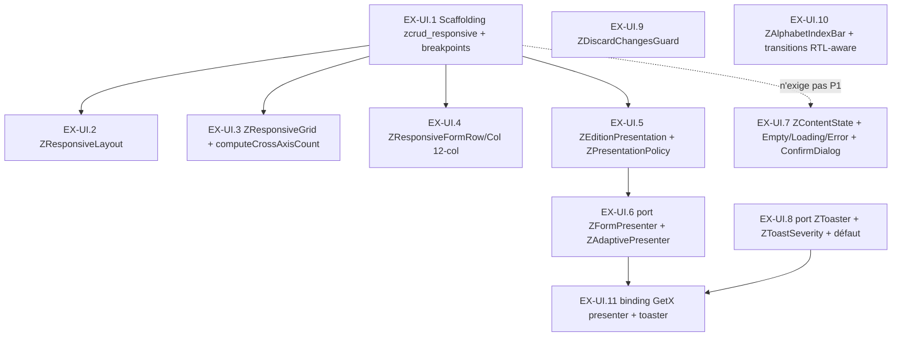

# Épic & Stories — zcrud EX-UI (infrastructure UI transverse)

Backlog séquencé transformant les **4 décisions d'extension AD-29..AD-32** du spine EX-UI (héritant des 16 AD produit + 12 AD study, NON-NÉGOCIABLES) en unités implémentables. Un **seul epic** — **EX-UI** — découpé en **11 stories** livrables une par une, réparties sur **trois nouveaux packages** (`zcrud_responsive`, `zcrud_navigation`, `zcrud_ui_kit`) + un livrable de binding (`zcrud_get`). Chaque story porte des ACs testables et référence les capacités EX-UI 1/2/3, les AD (delta + hérités), les **packages/fichiers touchés** (évaluation de parallélisation à fichiers disjoints), une **taille estimée** (S/M/L) et son **statut initial `backlog`**.

**Portée non-négociable :** EX-UI ne livre que des **packages génériques** dans `/home/zakarius/DEV/zcrud`. **Aucun** fichier d'app (`dodlp-otr`/`iffd`/`lex_douane`/`dlcfti-otr`) n'est touché — le câblage réel in-place est **déféré** (DW-EXUI-1). Détails de grounding : voir l'architecture EX-UI + `SYNTHESE.md` et les rapports par app.

## Overview

Les quatre apps redupliquent trois capacités UI sans jamais les câbler : présentation adaptative CRUD (`showPushedDialog` — **29 sites dodlp + ~50 iffd**, couplé GetX fort, mode figé par `isWebOrDesktop` au call-site ; **absent** de lex_douane), breakpoints (**4 impls concurrentes**, seuils incohérents 600/800/840/900), grille dynamique (**~24+ sites** dupliqués ; **bug latent iffd** `W ~/ minW` sans clamp → 0 colonne). L'objectif d'EX-UI n'est pas que d'extraire best-of-breed — c'est de **poser la politique manquante** : le mode de présentation **dérivé automatiquement du breakpoint** (`ZPresentationPolicy`), le maillon qui n'existe dans aucune app.

Objectif d'extension EX-UI : trois packages UI **purs** (aucun gestionnaire d'état, AD-2/AD-15), étagés sur `zcrud_core` sans jamais l'alourdir (CORE OUT=0, AD-1), RTL/a11y/thème injectés partout (AD-13), et la **consigne transverse ENUMS > BOOLÉENS** appliquée à toute API publique multi-état.

## Requirements Inventory

### Capacités fonctionnelles (source `SYNTHESE.md` §Tableau croisé)

- **CAP-1 — Présentation adaptative CRUD** (page / bottom-sheet / dialog) : concevoir la politique manquante `ZPresentationPolicy` (breakpoint → mode) + port `ZFormPresenter` + présentateur par défaut pur-Flutter `ZAdaptivePresenter`. Best-of-breed : *cœur* de `showPushedDialog` (dodlp `forms_utils.dart` ~331-394 ; iffd `forms_utils.dart:631-739`), neutralisé de GetX. → Stories EX-UI.5, EX-UI.6, EX-UI.11.
- **CAP-2 — Breakpoints responsive** : `ZBreakpoint` (seuils M3 600/840 centralisés) + `ZWindowSizeClass` + `ZBreakpointValue<T>` + `ZResponsiveLayout`. Best-of-breed : lex `breakpoints.dart` (27 LOC, zéro-dép, `MediaQuery.sizeOf`) + pattern M3 `AdaptiveShell` (iffd) + `BreakpointValue<T>`/grille 12-col (dodlp `responsive_utils.dart`). → Stories EX-UI.1, EX-UI.2, EX-UI.4.
- **CAP-3 — Grille dynamique** : `ZResponsiveGrid` + `computeCrossAxisCount` pur (clamp ≥ 1, largeur locale via `LayoutBuilder`, garde vide). Best-of-breed : lex_ui `responsive_grid.dart` (74 LOC, `floor()+clamp`+garde vide) ; **corrige le bug iffd**. → Story EX-UI.3.
- **CAP-transverse — Patterns génériques UI** : états Empty/Loading/Error (`ZContentState`), `ZConfirmDialog`, port `ZToaster` (`ZToastSeverity`), `ZDiscardChangesGuard` (dirty du `ZFormController`), `ZAlphabetIndexBar`, transitions RTL-aware. Sources : dodlp `state_widgets.dart`/`buildConfirmDialog`/`ToastService`, lex `DiscardChangesGuard`/`AlphabetIndexBar`/`transitions.dart`. → Stories EX-UI.7, EX-UI.8, EX-UI.9, EX-UI.10.

### Exigences non-fonctionnelles (portées transversalement en AC)

- **NFR-U1 — Acyclicité repo-wide, CORE OUT=0 (AD-1)** : `zcrud_core` ne dépend d'**aucun** des 3 packages ; `melos run analyze` **ET** `melos run verify` verts **repo-wide** à chaque gate de commit d'epic.
- **NFR-U2 — Réactivité Flutter-native, agnostique du manager (AD-2/AD-15)** : aucun `get`/`flutter_riverpod`/`provider`/`go_router` dans `zcrud_responsive`/`zcrud_navigation`/`zcrud_ui_kit` ; code manager/routeur confiné aux bindings.
- **NFR-U3 — SM-1 / rebuild ciblé (objectif produit n°1, AD-2/AD-25)** : aucune surface EX-UI n'introduit de `setState` à l'échelle page ; le guard consomme le `Listenable` du controller par tranche.
- **NFR-U4 — RTL / a11y / WCAG (AD-13)** : `EdgeInsetsDirectional`/`AlignmentDirectional`/`TextAlign.start,end`/`PositionedDirectional`, `Semantics`, cibles ≥ 48 dp, `ListView.builder`, couleur jamais seul canal.
- **NFR-U5 — Thème & l10n injectés (AD-13/FR-26)** : aucune couleur/label en dur ; thème via `ZcrudScope`/`ThemeExtension`, repli `Theme.of(context)`.
- **NFR-U6 — Pureté domaine testable sans `BuildContext` (AD-5/AD-14)** : `computeCrossAxisCount`, dérivation `ZWindowSizeClass`, `ZPresentationPolicy.resolve()` sont des fonctions/objets purs.
- **NFR-U7 — ENUMS > BOOLÉENS (consigne user, transverse)** : aucune API publique n'expose un `bool` multi-état ni un flag positionnel ; utiliser les enums nommés (`ZEditionPresentation`, `ZWindowSizeClass`, `ZContentState`, `ZToastSeverity`). Un `bool` ne subsiste que pour un prédicat strictement binaire non extensible (ex. `isDirty`).
- **NFR-U8 — Zéro secret (AD-12)** : aucune clé/endpoint ; jamais `badCertificateCallback => true`.
- **NFR-U9 — Port pluggable, jamais `sealed` (AD-4)** : `ZFormPresenter` et `ZToaster` extensibles par les bindings/apps sans modifier le package.
- **NFR-U10 — Défauts sûrs (AD-10)** : la politique dérive **toujours** un mode valide (jamais de throw sur largeur aberrante) ; grille vide → `SizedBox.shrink()` ; enums sérialisés portent `@JsonKey(unknownEnumValue:)`.
- **NFR-U11 — Pas de codegen (à confirmer)** : a priori aucun `@ZcrudModel` dans les 3 packages → `melos run generate` no-op, gate `codegen-distribution` non concernée (à confirmer au 1er build).

### Capability → Story Map

| Capacité / source best-of-breed | Package | Story | AD |
|---|---|---|---|
| `ZBreakpoint`/`ZWindowSizeClass`/`ZBreakpointValue<T>` (lex `breakpoints.dart` + dodlp `responsive_utils`) | `zcrud_responsive/domain` | EX-UI.1 | AD-29, AD-31 |
| `ZResponsiveLayout` 3 builders (lex `responsive_layout.dart`) | `zcrud_responsive/presentation` | EX-UI.2 | AD-29, AD-13 |
| `ZResponsiveGrid` + `computeCrossAxisCount` (lex_ui `responsive_grid.dart`) | `zcrud_responsive` | EX-UI.3 | AD-31, AD-14, AD-10 |
| `ZResponsiveFormRow/Col` 12-col (dodlp `responsive_utils`) | `zcrud_responsive/presentation` | EX-UI.4 | AD-29, AD-2 |
| `ZEditionPresentation` + `ZPresentationPolicy` (gap — à concevoir) | `zcrud_navigation/domain` | EX-UI.5 | AD-30, AD-6 |
| Port `ZFormPresenter` + `ZAdaptivePresenter` (réécriture GetX→Flutter de `showPushedDialog`) | `zcrud_navigation` | EX-UI.6 | AD-30, AD-2, AD-13 |
| `ZContentState` + Empty/Loading/Error + `ZConfirmDialog` (dodlp `state_widgets`/`buildConfirmDialog`) | `zcrud_ui_kit/presentation` | EX-UI.7 | AD-32, AD-13 |
| Port `ZToaster` + `ZToastSeverity` + défaut ScaffoldMessenger (dodlp `ToastService`) | `zcrud_ui_kit` | EX-UI.8 | AD-32, AD-6, AD-15 |
| `ZDiscardChangesGuard` lié au dirty `ZFormController` (lex `DiscardChangesGuard`) | `zcrud_ui_kit` + `zcrud_core` | EX-UI.9 | AD-32, AD-2 |
| `ZAlphabetIndexBar` + transitions RTL-aware (lex `alphabet_index_bar.dart`/`transitions.dart`) | `zcrud_ui_kit/presentation` | EX-UI.10 | AD-32, AD-13 |
| Présentateur GetX + toaster GetX (impls de port) | `zcrud_get` | EX-UI.11 | AD-30, AD-15 |

**Couverture : CAP-1, CAP-2, CAP-3 + patterns transverses = 100 %.** AD-29..AD-32 tous couverts (AD-29 par EX-UI.1..4 création des 3 packages ; AD-30 par EX-UI.5/6/11 ; AD-31 par EX-UI.3 ; AD-32 par EX-UI.7/8/9/10). Aucun trou.

## Séquencement & dépendances

> `zcrud_ui_kit` (EX-UI.7..10) ne dépend **que** de `zcrud_core` + flutter → **indépendant de P1** et **parallélisable avec P2** (fichiers/packages disjoints). Seul point de contact possible = `zcrud_core`, en **lecture seule** (API publique du `ZFormController` pour EX-UI.9) : **aucune** story n'**écrit** `zcrud_core` → aucune contention de contact, parallélisation sûre.

### Fenêtres de parallélisation (≤ 3 stories en vol, packages de code disjoints)

- **P1 d'abord, toujours** : **EX-UI.1 est la story de tête bloquante** (breakpoints = socle de tout P1 et de la politique P2). Après EX-UI.1, les trois stories **EX-UI.2 ∥ EX-UI.3 ∥ EX-UI.4** touchent des fichiers disjoints du **même** package `zcrud_responsive` → parallélisables (3 max), aucune n'écrit `zcrud_core`.
- **P2 (nav) ∥ P3 (ui_kit)** : dès qu'EX-UI.1 est `done`, le workstream **P2** (EX-UI.5 → EX-UI.6, package `zcrud_navigation`) tourne en parallèle du workstream **P3** (EX-UI.7 / EX-UI.8 / EX-UI.9 / EX-UI.10, package `zcrud_ui_kit`). Packages disjoints ; EX-UI.7..10 sont eux-mêmes file-disjoints entre eux (≤ 3 en vol). **EX-UI.5 précède EX-UI.6** (le présentateur consomme la politique + l'enum). **EX-UI.8 précède EX-UI.11** (le binding implémente le port toaster).
- **EX-UI.11 (binding GetX)** : **séquentielle**, en aval d'EX-UI.6 **et** EX-UI.8 (implémente `ZFormPresenter` + `ZToaster`).
- **Toujours séquentiel** : EX-UI.1 (tête) ; EX-UI.5→6 ; EX-UI.11 en fin. **Aucune** story n'écrit `zcrud_core` → la règle « une seule story touche le cœur à la fois » est trivialement satisfaite (aucune ne le touche en écriture).

À **chaque** gate de commit (workstreams au repos) : rejouer `melos run analyze` **ET** `melos run verify` **REPO-WIDE** (NFR-U1) — une vérif ciblée par-package ne détecte pas une régression cross-package. Rétrospective (`bmad-retrospective`) après la dernière story de l'epic ; commit unique en fin d'epic (code source uniquement ; exclure `pubspec.lock` racine + `example/`).

---

## Epic EX-UI : Infrastructure UI transverse (responsive / navigation / ui-kit)

**Objectif :** externaliser best-of-breed les trois capacités UI dupliquées des 4 apps en **trois packages purs** (`zcrud_responsive`, `zcrud_navigation`, `zcrud_ui_kit`, `publish_to: none`), **poser la politique manquante** de dérivation présentation↔breakpoint, et fournir un présentateur GetX de référence en binding — sans toucher aucune app (câblage in-place déféré, DW-EXUI-1). **Packages :** `zcrud_responsive` (nouveau), `zcrud_navigation` (nouveau), `zcrud_ui_kit` (nouveau), `zcrud_get` (extension). **Couvre :** CAP-1, CAP-2, CAP-3 + patterns transverses · AD-29, AD-30, AD-31, AD-32 (+ hérités AD-1/2/4/5/6/10/12/13/14/15/25) · SM-1. **Dépend de :** — (extension autonome ; consomme `zcrud_core` existant).

---

### Story EX-UI.1 : [TÊTE BLOQUANTE] Scaffolding `zcrud_responsive` + breakpoints purs (`ZBreakpoint`/`ZWindowSizeClass`/`ZBreakpointValue<T>`)

As a **développeur-mainteneur (Zakarius)**,
I want **créer le package feuille `zcrud_responsive` (flutter seul) et y poser les primitives de mesure pures — seuils Material 3 centralisés, classe d'écran en enum, valeur-par-breakpoint multi-paliers — dérivables sans `BuildContext`**,
So that **toute la responsivité (layout, grille, politique de présentation P2) repose sur une source de seuils unique, testable purement, sans jamais recoder un seuil ad hoc ni dépendre d'une largeur globale type `Get.width`**.

> **Métadonnées** — Taille : **M** · Statut : `backlog` · Parallélisation : **SÉQUENTIELLE — story de tête bloquante (bloque EX-UI.2/3/4 et EX-UI.5)** · Packages/fichiers : nouveau `packages/zcrud_responsive/` (`pubspec.yaml` `flutter` seul + `publish_to: none`, barrel `lib/zcrud_responsive.dart`, `lib/src/domain/{z_breakpoint.dart, z_window_size_class.dart, z_breakpoint_value.dart}`) ; déclaration dans `pubspec.yaml` racine / workspace melos. **OQ à trancher en create-story** : réconciliation échelle 5-paliers Bootstrap (dodlp `xs/sm/md/lg/xl` pour `ZBreakpointValue`) vs 3 window-size-classes M3 — proposition retenue : `ZBreakpointValue<T>` générique multi-paliers **découplé** de `ZWindowSizeClass` (3 paliers), les deux coexistent sans fusion.

**Acceptance Criteria :**

1. **Given** les 4 impls concurrentes de breakpoints (seuils 600/800/840/900) réparties dans les apps
   **When** on implémente `ZBreakpoint`
   **Then** les seuils **Material 3** sont centralisés (`compact < 600 ≤ medium < 840 ≤ expanded`) et **aucun** seuil numérique n'est redéclaré ailleurs dans le package (AD-31/Consistency).

2. **Given** une largeur en pixels logiques
   **When** on appelle la dérivation `ZBreakpoint.windowSizeClassFor(double width)` (ou équivalent pur)
   **Then** elle retourne un `enum ZWindowSizeClass { compact, medium, expanded }` (valeurs camelCase, **jamais** `isMobile/isTablet/isDesktop` en bools — NFR-U7)
   **And** la fonction est **pure**, testable **sans `BuildContext`** (NFR-U6), et **ne throw jamais** sur une largeur nulle/négative/aberrante → défaut sûr `compact` (AD-10/NFR-U10).

3. **Given** un besoin de valeur dépendante du palier (ex. nb de colonnes, padding)
   **When** on définit `ZBreakpointValue<T>` (échelle multi-paliers avec **repli en cascade** vers le palier inférieur renseigné)
   **Then** `resolve(width)` retourne la valeur du palier courant ou, à défaut, celle du palier inférieur le plus proche, de façon **déterministe et pure**
   **And** l'échelle multi-paliers reste **découplée** de `ZWindowSizeClass` (3 paliers) — les deux types coexistent (OQ tranchée).

4. **Given** un helper contextuel (`ZBreakpoint.of(context)` / extension)
   **When** il lit la largeur
   **Then** il passe **toujours** par `MediaQuery.sizeOf(context)` — **jamais** `Get.width`/`MediaQueryData` figée au démarrage (NFR-U2/AD-31).

5. **Given** le package `zcrud_responsive`
   **When** on inspecte son `pubspec.yaml` et le graphe
   **Then** il ne dépend que de `flutter` (feuille basse, **aucune** arête `zcrud_*` entrante ni sortante), `zcrud_core` **n'a aucune arête vers lui** (CORE OUT=0 intact, AD-1/NFR-U1)
   **And** `melos run analyze` **ET** `melos run verify` sont verts **repo-wide** ; `melos run generate` est un **no-op** pour ce package (aucun `@ZcrudModel`, NFR-U11 confirmée).

**Tests :** unit domaine pur (dérivation de classe aux frontières 599/600/839/840, largeur 0/négative → `compact`, cascade `ZBreakpointValue`) **sans `BuildContext`** ; widget test du helper `of(context)` sous `MediaQuery` simulée + sous `Directionality.rtl`.

---

### Story EX-UI.2 : `ZResponsiveLayout` — trois builders (mobile / tablette / desktop) avec repli en cascade

As a **développeur intégrateur**,
I want **un widget `ZResponsiveLayout` exposant trois builders (compact/medium/expanded) avec repli en cascade, piloté par `ZWindowSizeClass`**,
So that **je choisisse une disposition selon la classe d'écran sans recoder de seuils ni de ternaires largeur, avec le `ConsumerWidget` mort de lex retiré**.

> **Métadonnées** — Taille : **S** · Statut : `backlog` · Parallélisation : **PARALLÉLISABLE intra-P1 après EX-UI.1** (fichier disjoint) · Packages/fichiers : `packages/zcrud_responsive/lib/src/presentation/z_responsive_layout.dart`. Base : lex `responsive_layout.dart` (39 LOC) neutralisé (`ConsumerWidget → StatelessWidget`, `ref` mort supprimé).

**Acceptance Criteria :**

1. **Given** trois builders `compactBuilder` (requis) + `mediumBuilder?` + `expandedBuilder?`
   **When** la largeur locale correspond à un palier sans builder dédié
   **Then** le repli est **en cascade descendante** (expanded→medium→compact), déterministe.

2. **Given** la sélection de builder
   **When** `ZResponsiveLayout` build
   **Then** la classe d'écran provient de `ZWindowSizeClass` (via `LayoutBuilder` local ou `MediaQuery.sizeOf`), **jamais** d'un flag `bool` ni d'une largeur globale (NFR-U7/NFR-U2).

3. **Given** le widget porté de lex
   **When** on l'inspecte
   **Then** il est `StatelessWidget` (aucun `ConsumerWidget`/`ref`), sans dépendance manager (NFR-U2), directionnel et compatible RTL (AD-13/NFR-U4).

**Tests :** widget test des 3 paliers + repli en cascade (medium absent → compact) ; vérif absence d'import gestionnaire d'état.

---

### Story EX-UI.3 : `ZResponsiveGrid` + `computeCrossAxisCount` (best-of-breed, clamp ≥ 1, largeur locale, garde vide)

As a **utilisateur sur écran étroit / panneau réduit / dialog**,
I want **une grille dynamique dont le nombre de colonnes est calculé par une fonction pure garantissant au moins 1 colonne, à partir de la largeur locale mesurée par `LayoutBuilder`**,
So that **je ne tombe jamais sur une grille vide ou une division par zéro (bug iffd `W ~/ minW` sans clamp), y compris en split-view ou en bottom-sheet partiel où la largeur ≠ largeur écran**.

> **Métadonnées** — Taille : **M** · Statut : `backlog` · Parallélisation : **PARALLÉLISABLE intra-P1 après EX-UI.1** (fichier disjoint) · Packages/fichiers : `packages/zcrud_responsive/lib/src/domain/compute_cross_axis_count.dart` (pur) ; `packages/zcrud_responsive/lib/src/presentation/z_responsive_grid.dart`. Base : lex_ui `responsive_grid.dart` (74 LOC) neutralisé (`ConsumerWidget → StatelessWidget`) ; tests lex `responsive_grid_test.dart` portables quasi tels quels. Corrige le bug iffd (`tec_cedeao_screen.dart` `min(3, Get.width ~/ itemMinWidth)` sans clamp bas).

**Acceptance Criteria :**

1. **Given** `computeCrossAxisCount({required double availableWidth, required double minItemWidth, int minColumns = 1, int maxColumns})`
   **When** on l'évalue
   **Then** il retourne `(availableWidth / minItemWidth).floor().clamp(minColumns, maxColumns)` avec **`minColumns ≥ 1` garanti** — **jamais 0** même pour `availableWidth < minItemWidth` (corrige le bug iffd), et **jamais** de division par zéro (`minItemWidth ≤ 0` → défaut sûr, AD-10/NFR-U10).

2. **Given** la fonction de calcul
   **When** on la teste
   **Then** elle est **pure**, testable **sans `BuildContext`** (NFR-U6), aux frontières (largeur = minItemWidth, ½ minItemWidth, très large → clamp `maxColumns`).

3. **Given** `ZResponsiveGrid`
   **When** il détermine la largeur disponible
   **Then** il l'obtient **toujours** d'un `LayoutBuilder` local (`constraints.maxWidth`) ou `MediaQuery.sizeOf` — **jamais** `Get.width` (NFR-U2/AD-31) ; `minItemWidth`/`spacing`/`itemHeight`/`aspectRatio`/`maxColumns` sont des **paramètres nommés** (fin des ternaires `300/350` dupliqués).

4. **Given** une liste `children` **vide**
   **When** `ZResponsiveGrid` build
   **Then** il retourne **`SizedBox.shrink()`** (garde vide, AD-10/NFR-U10) et n'instancie pas de `GridView` fantôme.

5. **Given** `childAspectRatio` avec `itemHeight` fourni
   **When** la grille se compose
   **Then** l'aspect est recalculé sur la largeur d'item déduite (`availableWidth − spacing·(n−1)`) ; le widget est `StatelessWidget` sans couplage manager (le `ConsumerWidget` mort de lex **retiré**) et utilise `ListView.builder`/`GridView.builder` (jamais `children:[...]` matérialisés, AD-13/NFR-U4).

**Tests :** unit pur `computeCrossAxisCount` (floor, clamp bas ≥ 1, clamp haut, minItemWidth ≤ 0) **sans `BuildContext`** ; widget test `children` vide → `SizedBox.shrink`, calcul de colonnes sous `LayoutBuilder` contraint (dialog étroit), rendu RTL.

---

### Story EX-UI.4 : `ZResponsiveFormRow` / `ZResponsiveFormCol` — grille 12 colonnes de formulaire

As a **développeur de formulaires adaptatifs**,
I want **une grille 12 colonnes (`ZResponsiveFormRow` + `ZResponsiveFormCol`) dont l'empan de chaque champ varie par palier via `ZBreakpointValue<T>`**,
So that **je compose des formulaires responsive sans alourdir `zcrud_core` ni imposer une dépendance de layout au moteur d'édition, qui reste agnostique et câble la grille autour de ses champs**.

> **Métadonnées** — Taille : **M** · Statut : `backlog` · Parallélisation : **PARALLÉLISABLE intra-P1 après EX-UI.1** (fichier disjoint) · Packages/fichiers : `packages/zcrud_responsive/lib/src/presentation/{z_responsive_form_row.dart, z_responsive_form_col.dart}`. Base : dodlp `responsive_utils.dart` (`ResponsiveFormRow/Col`, 12-col, couplage ~nul). **OQ à valider** : emplacement dans `zcrud_responsive` (et non `zcrud_core`) confirmé vs besoin réel du moteur d'édition (E3).

**Acceptance Criteria :**

1. **Given** une rangée de champs avec empans (`span`) par palier
   **When** on compose `ZResponsiveFormRow(children: [ZResponsiveFormCol(span: ..., child: ...)])`
   **Then** la somme des empans est répartie sur **12 colonnes**, l'empan effectif de chaque `Col` étant résolu par `ZBreakpointValue<T>` (échelle multi-paliers) selon la largeur locale.

2. **Given** un empan qui déborderait la ligne
   **When** la rangée se compose
   **Then** le retour à la ligne (wrap) est **déterministe** et le rendu **directionnel** (RTL-aware, `EdgeInsetsDirectional`/`AlignmentDirectional`, AD-13/NFR-U4) ; aucun `setState` à l'échelle formulaire (AD-2/NFR-U3).

3. **Given** l'empan piloté par palier
   **When** on inspecte l'API publique
   **Then** l'empan est un **entier borné [1..12]** et le palier un `ZWindowSizeClass`/`ZBreakpointValue` — **aucun** `bool` multi-état (NFR-U7) ; le widget ne dépend que de `flutter`, `zcrud_core` reste agnostique (AD-1/NFR-U1).

**Tests :** widget test répartition 12-col aux 3 paliers, wrap au débordement, rendu RTL ; pureté de la résolution d'empan via `ZBreakpointValue`.

---

### Story EX-UI.5 : `ZEditionPresentation` + `ZPresentationPolicy` — le maillon manquant (breakpoint → mode)

As a **développeur intégrateur**,
I want **un enum de mode de présentation (`ZEditionPresentation { page, sheet, dialog }`) et une politique pure injectable (`ZPresentationPolicy`) qui dérive le mode d'un `ZWindowSizeClass`**,
So that **le mode d'édition soit calculé automatiquement à partir du breakpoint (le câblage qu'aucune app ne fait), au lieu d'être figé au call-site par un `dialog: isWebOrDesktop` en dur**.

> **Métadonnées** — Taille : **M** · Statut : `backlog` · Parallélisation : **SÉQUENTIELLE — première story de P2, dépend d'EX-UI.1 ; précède EX-UI.6** · Packages/fichiers : nouveau `packages/zcrud_navigation/` (`pubspec.yaml` → `zcrud_core` + `zcrud_responsive` + `publish_to: none`, barrel `lib/zcrud_navigation.dart`, `lib/src/domain/{z_edition_presentation.dart, z_presentation_policy.dart}`). Concevoir de zéro (aucune app ne dérive le mode du breakpoint ; sources = *cœur* de `showPushedDialog` dodlp/iffd pour les tailles/branches).

**Acceptance Criteria :**

1. **Given** le besoin de modéliser le mode d'édition
   **When** on définit `enum ZEditionPresentation { page, sheet, dialog }` (valeurs camelCase)
   **Then** il **remplace** les 2/3 bools ad hoc des apps (`fullscreenDialog`/`dialog`/`isWebOrDesktop`) — **aucun** `bool` multi-état exposé (NFR-U7) ; s'il est jamais sérialisé, il porte `@JsonKey(unknownEnumValue:)` (AD-10/NFR-U10).

2. **Given** un `ZWindowSizeClass` (fourni par `zcrud_responsive`)
   **When** on appelle `ZPresentationPolicy.resolve(sizeClass, {formWeight})`
   **Then** il retourne un `ZEditionPresentation` selon le défaut documenté (`compact → sheet`, `medium → dialog`, `expanded → dialog|page` selon le poids du formulaire) — **jamais** dérivé d'un flag `isWebOrDesktop` en dur (AD-30).

3. **Given** la politique par défaut
   **When** une app veut une autre règle
   **Then** `ZPresentationPolicy` est **injectable/surchargeable** (jamais une constante figée, AD-30/AD-6), résolvable via seam (`ZcrudScope`/binding).

4. **Given** `resolve()`
   **When** on la teste
   **Then** elle est **pure**, testable **sans `BuildContext`** (NFR-U6), déterministe pour chaque `ZWindowSizeClass`, et **ne throw jamais** (défaut sûr, AD-10/NFR-U10).

5. **Given** le package `zcrud_navigation`
   **When** on inspecte ses dépendances
   **Then** il dépend de `zcrud_core` + `zcrud_responsive` uniquement, **n'importe ni `get` ni `go_router` ni `flutter_riverpod`** (NFR-U2/AD-15) ; graphe acyclique, CORE OUT=0 (AD-1/NFR-U1).

**Tests :** table de vérité `resolve()` (3 classes × poids formulaire) **sans `BuildContext`** ; test d'injection d'une politique custom via seam ; vérif absence d'import manager/routeur.

---

### Story EX-UI.6 : Port `ZFormPresenter` (non-`sealed`) + `ZAdaptivePresenter` par défaut pur-Flutter

As a **développeur intégrateur**,
I want **un port pluggable `ZFormPresenter` et un présentateur par défaut pur-Flutter `ZAdaptivePresenter` exécutant le mode via `Navigator.push(MaterialPageRoute(fullscreenDialog:))` / `showModalBottomSheet` / `showDialog`**,
So that **une app présente un formulaire (page/sheet/dialog) sans dépendre d'un gestionnaire d'état ni d'un routeur, le mode venant de `ZPresentationPolicy`, avec les variantes manager reléguées aux bindings**.

> **Métadonnées** — Taille : **L** · Statut : `backlog` · Parallélisation : **SÉQUENTIELLE dans P2 — dépend d'EX-UI.5 ; précède EX-UI.11** · Packages/fichiers : `packages/zcrud_navigation/lib/src/domain/z_form_presenter.dart` (port) ; `packages/zcrud_navigation/lib/src/presentation/z_adaptive_presenter.dart`. Réécriture GetX→Flutter du *cœur* de `showPushedDialog` (dodlp `forms_utils.dart` ~331-394 ; iffd `forms_utils.dart:631-739`, qui contient déjà un essai commenté vers `showModalBottomSheet` natif).

**Acceptance Criteria :**

1. **Given** le besoin d'abstraire la présentation
   **When** on définit `ZFormPresenter` (méthode `Future<T?> present<T>({required WidgetBuilder builder, required ZEditionPresentation mode, ...tailles/hauteurs max explicites})`)
   **Then** c'est un **port pluggable, jamais `sealed`** (AD-4/NFR-U9), form-agnostique (prend un `WidgetBuilder`, ne fait **aucune** détection interne du type de formulaire).

2. **Given** `ZAdaptivePresenter` (impl par défaut)
   **When** il exécute `mode == page` / `sheet` / `dialog`
   **Then** il appelle respectivement `Navigator.push(MaterialPageRoute(fullscreenDialog: true))` / `showModalBottomSheet` / `showDialog` — **Flutter vanilla, aucun gestionnaire d'état** (NFR-U2/AD-30), aucun `Get.to`/`Get.bottomSheet`/`Get.dialog`.

3. **Given** les tailles max (fractions d'écran des apps)
   **When** on les fournit
   **Then** elles sont des **paramètres explicites** (largeur/hauteur max), mesurées via `MediaQuery.sizeOf` — jamais `Get.width`/`Get.height` (NFR-U2).

4. **Given** la résolution du présentateur effectif
   **When** l'app en fournit un
   **Then** elle passe par un **seam** (`ZcrudScope`/binding), **défaut = `ZAdaptivePresenter`** (AD-6/AD-30).

5. **Given** une présentation en `sheet`/`dialog`
   **When** elle s'affiche
   **Then** elle est **RTL-aware** (directionnel, AD-13/NFR-U4), les cibles ≥ 48 dp, `Semantics` posés, et `zcrud_navigation` n'importe toujours **ni `get` ni `go_router`** (NFR-U2/AD-15).

**Tests :** widget test des 3 modes (page/sheet/dialog) via `ZAdaptivePresenter` sous `MaterialApp` (route poussée, sheet ouvert, dialog affiché) ; test seam (présentateur custom substitué) ; test RTL ; vérif que le port n'est pas `sealed` (une impl externe compile).

---

### Story EX-UI.7 : États de contenu (`ZContentState`) + `ZEmptyState`/`ZLoadingState`/`ZErrorState` + `ZConfirmDialog`

As a **développeur d'écrans**,
I want **des widgets d'état génériques pilotés par `enum ZContentState` (idle/loading/empty/error/success) et un `ZConfirmDialog` à thème injecté**,
So that **je cesse de redupliquer les états Empty/Loading/Error (dodlp+iffd) et le dialog de confirmation, en modélisant l'état par un enum plutôt que par des combinaisons de bools**.

> **Métadonnées** — Taille : **M** · Statut : `backlog` · Parallélisation : **PARALLÉLISABLE (P3 ∥ P2, ≤ 3 avec EX-UI.8/9/10)** — package `zcrud_ui_kit`, fichiers disjoints ; **indépendant de P1** · Packages/fichiers : nouveau `packages/zcrud_ui_kit/` (`pubspec.yaml` → `zcrud_core` + flutter + `publish_to: none`, barrel `lib/zcrud_ui_kit.dart`, `lib/src/domain/z_content_state.dart`, `lib/src/presentation/{z_state_widgets.dart, z_confirm_dialog.dart}`). Base : dodlp `state_widgets.dart` + `buildConfirmDialog` (couplage ~nul, `Theme.of`).

**Acceptance Criteria :**

1. **Given** le besoin de représenter l'état d'un contenu
   **When** on définit `enum ZContentState { idle, loading, empty, error, success }` (camelCase)
   **Then** il **remplace** les combinaisons de bools (`isLoading`/`hasError`/`isEmpty`) des apps — **aucun** `bool` multi-état (NFR-U7).

2. **Given** `ZEmptyState`/`ZLoadingState`/`ZErrorState`
   **When** on les affiche
   **Then** couleurs/labels/l10n sont **injectés** (thème via `ZcrudScope`/`ThemeExtension`, repli `Theme.of` — aucun en dur, AD-13/NFR-U5), l'icône/état n'est **jamais** le seul canal d'info (texte + `Semantics`, WCAG/NFR-U4), cibles ≥ 48 dp.

3. **Given** `ZConfirmDialog`
   **When** il s'affiche (dark-mode/thème injecté)
   **Then** il expose titre/message/actions paramétrables, est **directionnel** (RTL, AD-13), et ne dépend d'aucun gestionnaire d'état (NFR-U2).

**Tests :** widget test rendu de chaque état (light/dark), `ZConfirmDialog` confirm/cancel, rendu RTL, vérif `Semantics` + absence de couleur seul canal.

---

### Story EX-UI.8 : Port `ZToaster` + `ZToastSeverity` + implémentation par défaut ScaffoldMessenger

As a **développeur intégrateur**,
I want **un port de notification `ZToaster` typé par `enum ZToastSeverity { info, success, warning, error }`, avec une implémentation par défaut pure-Flutter basée sur `ScaffoldMessenger`**,
So that **afficher un toast sans coupler un package pur à GetX/`toastification`, la sévérité étant un enum nommé et les impls manager vivant dans les bindings**.

> **Métadonnées** — Taille : **M** · Statut : `backlog` · Parallélisation : **PARALLÉLISABLE (P3 ∥ P2, ≤ 3)** — package `zcrud_ui_kit`, fichiers disjoints ; **précède EX-UI.11** (le binding implémente le port) · Packages/fichiers : `packages/zcrud_ui_kit/lib/src/domain/{z_toaster.dart, z_toast_severity.dart}` ; impl défaut `packages/zcrud_ui_kit/lib/src/presentation/z_scaffold_messenger_toaster.dart`. Base : dodlp `ToastService` (GetX) → port + impl neutre.

**Acceptance Criteria :**

1. **Given** le besoin d'abstraire la notification
   **When** on définit le port `ZToaster` (`void show({required String message, ZToastSeverity severity = ZToastSeverity.info, ...})`)
   **Then** c'est un **port pluggable, jamais `sealed`** (AD-4/NFR-U9) ; la sévérité est l'`enum ZToastSeverity` (camelCase) — **aucun** `bool`/`isError` ad hoc (NFR-U7).

2. **Given** l'implémentation par défaut
   **When** l'app n'en fournit pas
   **Then** `ZScaffoldMessengerToaster` (pur Flutter, `ScaffoldMessenger`) sert de défaut — **aucun** gestionnaire d'état (NFR-U2/AD-15) ; couleurs par sévérité **injectées** (thème, jamais en dur, AD-13/NFR-U5), texte + icône (couleur jamais seul canal, WCAG/NFR-U4).

3. **Given** une app/binding avec un mécanisme propre (GetX snackbar, `toastification`)
   **When** elle l'enregistre
   **Then** l'impl concrète est résolue via **seam** (`ZcrudScope`/binding, AD-6/AD-15) sans modifier `zcrud_ui_kit`.

**Tests :** widget test impl ScaffoldMessenger (les 4 sévérités, couleur+texte), test seam (toaster custom substitué), rendu RTL.

---

### Story EX-UI.9 : `ZDiscardChangesGuard` — garde anti-perte de saisie liée au dirty du `ZFormController`

As a **utilisateur en cours d'édition**,
I want **un garde (`PopScope`) qui intercepte la sortie tant que le formulaire est « sale » (dirty), en lisant l'état dirty du `ZFormController` via son `Listenable`**,
So that **je ne perde jamais ma saisie par une sortie accidentelle, sans qu'aucun gestionnaire d'état ne soit réintroduit (contrairement au `ConsumerWidget` mort de lex)**.

> **Métadonnées** — Taille : **M** · Statut : `backlog` · Parallélisation : **PARALLÉLISABLE (P3 ∥ P2, ≤ 3)** — package `zcrud_ui_kit` ; **seul point de contact = `zcrud_core` en LECTURE** (API publique du `ZFormController`, aucune écriture du cœur) · Packages/fichiers : `packages/zcrud_ui_kit/lib/src/presentation/z_discard_changes_guard.dart`. Base : lex `DiscardChangesGuard` (85 LOC, `ConsumerWidget` mort → à lier au controller).

**Acceptance Criteria :**

1. **Given** un `ZFormController` de `zcrud_core` exposant son état dirty
   **When** `ZDiscardChangesGuard` s'abonne
   **Then** il consomme le **`Listenable`/`ValueListenable`** du controller (API publique) — **jamais** un manager (`WidgetRef`/`Get.find`/`Provider.of`, AD-2/NFR-U2), et **ne reconstruit que sa tranche** (pas de `setState` à l'échelle page, SM-1/NFR-U3/AD-25).

2. **Given** un formulaire dirty
   **When** l'utilisateur tente de sortir (pop)
   **Then** le garde (`PopScope`) intercepte et déclenche une confirmation (composable avec `ZConfirmDialog`) ; formulaire propre → sortie directe.

3. **Given** l'état dirty modélisé
   **When** on inspecte l'API
   **Then** `isDirty` reste un **prédicat strictement binaire** admis (NFR-U7 — exception documentée) ; le garde est directionnel/a11y (AD-13/NFR-U4) et `zcrud_ui_kit` ne dépend que de `zcrud_core` + flutter (AD-1/NFR-U1).

**Tests :** widget test dirty → pop intercepté + confirmation ; propre → pop direct ; test que seule la tranche se reconstruit à un changement dirty (SM-1) ; vérif consommation via `Listenable` (pas d'import manager).

---

### Story EX-UI.10 : `ZAlphabetIndexBar` + transitions de route RTL-aware

As a **utilisateur parcourant une longue liste alphabétique**,
I want **un index vertical A→Z cliquable (`ZAlphabetIndexBar`) et des builders de transition de route dont le sens du slide s'inverse en RTL**,
So that **je navigue rapidement dans une grande liste et que les transitions respectent la direction de lecture, sans dépendre de `go_router`**.

> **Métadonnées** — Taille : **S** · Statut : `backlog` · Parallélisation : **PARALLÉLISABLE (P3 ∥ P2, ≤ 3)** — package `zcrud_ui_kit`, fichiers disjoints · Packages/fichiers : `packages/zcrud_ui_kit/lib/src/presentation/{z_alphabet_index_bar.dart, z_transitions.dart}`. Bases : lex `alphabet_index_bar.dart` (56 LOC, zéro-dép, `ConsumerWidget` mort) + `transitions.dart` (37 LOC, RTL-aware, à découpler de `go_router`).

**Acceptance Criteria :**

1. **Given** un ensemble de lettres actives vs inertes
   **When** `ZAlphabetIndexBar` s'affiche
   **Then** les lettres actives sont cliquables (callback `onLetter`), les inertes visuellement distinctes **avec un canal non-couleur** (opacité + `Semantics`, WCAG/NFR-U4), cibles ≥ 48 dp ; `StatelessWidget` sans `ref` (le `ConsumerWidget` mort retiré, NFR-U2).

2. **Given** les builders de transition (slide/fade)
   **When** on construit une transition slide
   **Then** son sens **s'inverse** selon `Directionality.of(context) == TextDirection.rtl` (AD-13/NFR-U4), et les builders sont **découplés de `go_router`** (renvoient des `PageRouteBuilder`/`Widget` neutres, pas de `CustomTransitionPage`) — `zcrud_ui_kit` n'importe **aucun** routeur (NFR-U2).

3. **Given** le thème
   **When** l'index/les transitions s'affichent
   **Then** couleurs/durées sont **injectées** (thème, jamais en dur, AD-13/NFR-U5).

**Tests :** widget test index (tap lettre active → callback, lettre inerte non cliquable, `Semantics`) ; test transition slide sens inversé LTR vs RTL ; vérif absence d'import `go_router`.

---

### Story EX-UI.11 : [BINDING] Présentateur GetX + toaster GetX dans `zcrud_get` (impls de port)

As a **développeur DODLP/IFFD (GetX)**,
I want **une implémentation GetX du port `ZFormPresenter` (`Get.to`/`Get.bottomSheet`/`Get.dialog`) et du port `ZToaster` (snackbar GetX) dans `zcrud_get`**,
So that **valider que les ports sont réellement pluggables (AD-30/AD-4) et offrir aux apps GetX un présentateur/toaster de référence, tout le code manager restant confiné au binding**.

> **Métadonnées** — Taille : **M** · Statut : `backlog` · Parallélisation : **SÉQUENTIELLE — dépend d'EX-UI.6 (port présentateur) ET EX-UI.8 (port toaster)** · Packages/fichiers : `packages/zcrud_get/lib/src/ui/{z_get_form_presenter.dart, z_get_toaster.dart}` + barrel. `get` est **déjà** dépendance du binding (aucun nouveau paquet). **Décision de tranche (cf. digest)** : le présentateur **GetX est PLANIFIÉ** ici ; le présentateur **go_router (`zcrud_riverpod`) est DÉFÉRÉ** (DW-EXUI-2 — `go_router` pas encore dépendance du binding, à pinner/confirmer en session dédiée).

**Acceptance Criteria :**

1. **Given** le port `ZFormPresenter`
   **When** `ZGetFormPresenter` l'implémente
   **Then** il exécute `page`/`sheet`/`dialog` via `Get.to(fullscreenDialog:)` / `Get.bottomSheet` / `Get.dialog`, respecte la même signature/`ZEditionPresentation`, et **vit exclusivement dans `zcrud_get`** — `zcrud_navigation` reste sans `get` (AD-15/AD-30/NFR-U2).

2. **Given** le port `ZToaster`
   **When** `ZGetToaster` l'implémente
   **Then** il mappe `ZToastSeverity` sur les snackbars GetX (couleur **injectée** + texte, jamais couleur seul canal, AD-13/NFR-U4/NFR-U5).

3. **Given** les deux impls
   **When** on les enregistre via le seam du binding
   **Then** elles se substituent aux défauts pur-Flutter sans modifier les packages purs (AD-6) ; graphe : `zcrud_get → zcrud_navigation`/`zcrud_ui_kit`/`zcrud_responsive` (puits binding), acyclique, CORE OUT=0 (AD-1/NFR-U1).

4. **Given** le port non-`sealed`
   **When** ces impls externes compilent
   **Then** elles prouvent la pluggabilité (AD-4/NFR-U9) sans toucher `zcrud_navigation`/`zcrud_ui_kit`.

**Tests :** widget/integration test des 3 modes via `ZGetFormPresenter` sous `GetMaterialApp` ; test toaster GetX (4 sévérités) ; vérif que `zcrud_navigation`/`zcrud_ui_kit` ne référencent jamais `get`.

---

## Deferred

### App-side — câblage réel dans les apps (sessions dédiées ultérieures)

- 🟡 **DW-EXUI-1 — Adoption in-place dans dodlp/iffd/lex_douane/dlcfti = SESSIONS DÉDIÉES, hors de cette planification.** Conformément à la consigne utilisateur (aucune modification d'app depuis le monorepo), le remplacement réel — réécrire les **~24 grilles** dupliquées via `ZResponsiveGrid`, remplacer les **~79 call-sites** `showPushedDialog` par `ZFormPresenter` + `ZPresentationPolicy`, consolider les **4 impls** de breakpoints (imports à réécrire dans ~15 fichiers pour la seule grille lex_ui) — se fera **app par app dans sa session dédiée**. EX-UI ne livre que les packages génériques.

### Présentateur/toaster manager restants

- 🟡 **DW-EXUI-2 — Présentateur go_router (`zcrud_riverpod`).** L'impl go_router du port `ZFormPresenter` et un `ZToaster` `ScaffoldMessenger`/riverpod-side sont **DÉFÉRÉS** hors d'EX-UI : `go_router` n'est **pas encore** dépendance de `zcrud_riverpod` et doit être **pinné/confirmé** (Stack, archi §Deferred) ; à planifier en session d'intégration lex_douane. Le présentateur **GetX** est, lui, planifié dans EX-UI.11 (get déjà présent, risque nul, valide la pluggabilité du port).

### Assumptions à confirmer à l'implémentation

- 🟢 **Pas de codegen dans les 3 packages purs** : widgets + politique/valeurs pures, **aucun `@ZcrudModel`** → `melos run generate` no-op, gate `codegen-distribution` non concernée, anti-`reflectable` sans objet. **À confirmer** au premier build (AC EX-UI.1.5).
- 🟢 **Seuils M3 600/840** comme convention unique (résout 600/800/840/900).
- ❓ **Échelle de breakpoints** : `ZBreakpointValue<T>` multi-paliers (Bootstrap dodlp) **découplé** de `ZWindowSizeClass` (3 paliers M3) — tranché en create-story EX-UI.1/EX-UI.4.
- ❓ **Emplacement de la grille 12-col** : `zcrud_responsive` (pas `zcrud_core`) — à valider vs besoin du moteur d'édition E3 (EX-UI.4).

## Validation finale (Step 4)

- **Couverture :** CAP-1/2/3 + patterns transverses = 100 % ; AD-29 (EX-UI.1..4), AD-30 (EX-UI.5/6/11), AD-31 (EX-UI.3), AD-32 (EX-UI.7/8/9/10) — 4/4 AD delta couverts. Aucun trou.
- **Story de tête bloquante :** EX-UI.1 (breakpoints, socle de P1 + politique P2) — bloque EX-UI.2/3/4 et EX-UI.5.
- **Maillon manquant posé :** `ZPresentationPolicy` (EX-UI.5) dérive le mode du breakpoint — la vraie valeur ajoutée au-delà de l'extraction.
- **Bug corrigé :** clamp `≥ 1` + largeur locale `LayoutBuilder` (EX-UI.3) neutralise le bug iffd `W ~/ minW`.
- **ENUMS > BOOLÉENS :** appliqué à chaque API multi-état (`ZEditionPresentation`, `ZWindowSizeClass`, `ZContentState`, `ZToastSeverity`) ; `isDirty` seul `bool` toléré (prédicat binaire, exception documentée EX-UI.9).
- **Parallélisation :** P1 séquentiel en tête (EX-UI.1) puis EX-UI.2∥3∥4 (même package, fichiers disjoints) ; P2 (nav) ∥ P3 (ui_kit) — packages disjoints, **aucune** story n'**écrit** `zcrud_core` (seul contact = lecture de l'API `ZFormController` en EX-UI.9) → aucune contention de cœur. EX-UI.11 séquentielle en aval de 6+8.
- **Churn de fichiers / risque de contact :** trois packages neufs disjoints + `zcrud_get` (puits binding) ; **zéro écriture de `zcrud_core`** sur tout l'epic → la règle « une seule story touche le cœur » est trivialement satisfaite.
- **Décision présentateurs manager :** GetX **planifié** (EX-UI.11) ; go_router **déféré** (DW-EXUI-2).
- **Gate d'epic :** `melos run analyze` **ET** `melos run verify` **repo-wide** verts (NFR-U1) avant commit unique de fin d'epic (exclure `pubspec.lock`).
